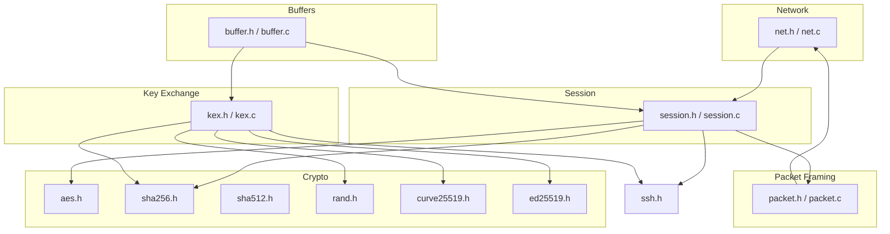
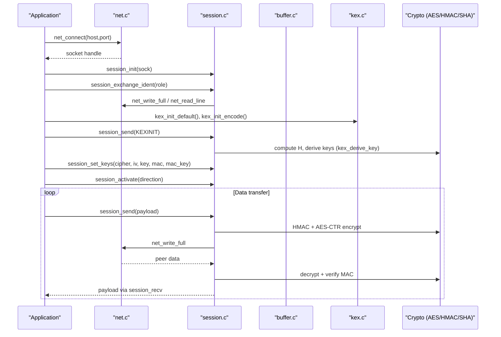
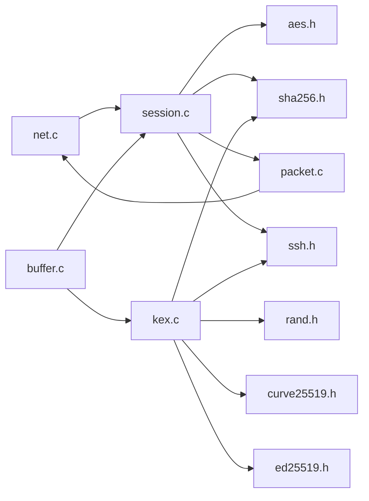

# API Reference

<cite>
**Referenced Files in This Document**
- [net.h](file://src/net.h)
- [net.c](file://src/net.c)
- [buffer.h](file://src/buffer.h)
- [buffer.c](file://src/buffer.c)
- [session.h](file://src/session.h)
- [session.c](file://src/session.c)
- [kex.h](file://src/kex.h)
- [kex.c](file://src/kex.c)
- [packet.h](file://src/packet.h)
- [packet.c](file://src/packet.c)
- [aes.h](file://src/aes.h)
- [sha256.h](file://src/sha256.h)
- [sha512.h](file://src/sha512.h)
- [rand.h](file://src/rand.h)
- [curve25519.h](file://src/curve25519.h)
- [ed25519.h](file://src/ed25519.h)
- [ssh.h](file://src/ssh.h)
</cite>

## Table of Contents
1. Introduction
2. Project Structure
3. Core Components
4. Architecture Overview
5. Detailed Component Analysis
6. Dependency Analysis
7. Performance Considerations
8. Troubleshooting Guide
9. Conclusion

## Introduction
This document provides a comprehensive API reference for the Coalesce SSH implementation. It covers:
- Network layer APIs for cross-platform TCP socket operations
- Buffer management APIs for dynamic memory and SSH wire-format serialization
- Session management APIs for SSH transport lifecycle, identification exchange, key installation, and packet I/O
- Cryptographic APIs for key exchange (ECDH), encryption (AES-CTR), signatures (Ed25519), hashing (SHA-256/SHA-512), and HMAC-SHA256
- Packet framing helpers for low-level RFC 4253 packet handling

Each API section includes function signatures, parameter descriptions, return values, error conditions, usage examples, and integration patterns with cross-references to related APIs.

## Project Structure
The codebase is organized by functional area:
- Networking: net.h/net.c
- Buffers and serialization: buffer.h/buffer.c
- Transport session and packet protection: session.h/session.c
- Key exchange and algorithm negotiation: kex.h/kex.c
- Low-level packet framing: packet.h/packet.c
- Cryptography primitives: aes.h, sha256.h, sha512.h, rand.h, curve25519.h, ed25519.h
- Protocol constants and message numbers: ssh.h

**Diagram sources**
- [net.h:1-58](file://src/net.h#L1-L58)
- [buffer.h:1-50](file://src/buffer.h#L1-L50)
- [session.h:1-89](file://src/session.h#L1-L89)
- [kex.h:1-52](file://src/kex.h#L1-L52)
- [packet.h:1-28](file://src/packet.h#L1-L28)
- [aes.h:1-38](file://src/aes.h#L1-L38)
- [sha256.h:1-39](file://src/sha256.h#L1-L39)
- [sha512.h:1-26](file://src/sha512.h#L1-L26)
- [rand.h:1-13](file://src/rand.h#L1-L13)
- [curve25519.h:1-22](file://src/curve25519.h#L1-L22)
- [ed25519.h:1-32](file://src/ed25519.h#L1-L32)
- [ssh.h:1-147](file://src/ssh.h#L1-L147)

**Section sources**
- [net.h:1-58](file://src/net.h#L1-L58)
- [buffer.h:1-50](file://src/buffer.h#L1-L50)
- [session.h:1-89](file://src/session.h#L1-L89)
- [kex.h:1-52](file://src/kex.h#L1-L52)
- [packet.h:1-28](file://src/packet.h#L1-L28)
- [ssh.h:1-147](file://src/ssh.h#L1-L147)

## Core Components
- Network layer: Cross-platform TCP sockets, blocking full read/write, line reading, nonblocking mode, and error reporting.
- Buffer layer: Dynamic buffers with append/read primitives for SSH wire types (u8/u32/u64, bool, raw, string, mpint).
- Session layer: SSH transport session state, identification exchange, key installation, activation, and encrypted/plain packet send/recv.
- Key exchange: KEXINIT encode/decode, proposal negotiation, and key derivation per RFC 4253 §7.2.
- Packet framing: Low-level RFC 4253 packet length/padding handling and sequence number tracking.
- Crypto: AES-CTR streaming, SHA-256/HMAC-SHA256, SHA-512, Ed25519 signing/verification, Curve25519 ECDH.

**Section sources**
- [net.c:23-177](file://src/net.c#L23-L177)
- [buffer.c:7-272](file://src/buffer.c#L7-L272)
- [session.c:14-363](file://src/session.c#L14-L363)
- [kex.c:25-230](file://src/kex.c#L25-L230)
- [packet.c:7-167](file://src/packet.c#L7-L167)
- [aes.h:12-35](file://src/aes.h#L12-L35)
- [sha256.h:12-36](file://src/sha256.h#L12-L36)
- [sha512.h:12-23](file://src/sha512.h#L12-L23)
- [curve25519.h:7-19](file://src/curve25519.h#L7-L19)
- [ed25519.h:9-29](file://src/ed25519.h#L9-L29)

## Architecture Overview
The SSH transport stack composes network I/O, buffering, packet framing, session state, and cryptographic primitives to implement RFC 4253 behavior.

**Diagram sources**
- [net.c:75-98](file://src/net.c#L75-L98)
- [session.c:83-126](file://src/session.c#L83-L126)
- [kex.c:25-68](file://src/kex.c#L25-L68)
- [session.c:130-169](file://src/session.c#L130-L169)
- [session.c:196-363](file://src/session.c#L196-L363)

## Detailed Component Analysis

### Network Layer API (Cross-Platform Sockets)
Provides portable TCP operations on Windows and POSIX systems.

- Initialization and shutdown
  - int net_init(void)
    - Purpose: Initialize networking subsystem (e.g., Winsock startup).
    - Returns: 0 on success; non-zero on failure.
    - Errors: Platform-specific initialization failure.
    - Usage: Call once before any socket operations.
  - void net_shutdown(void)
    - Purpose: Release networking resources (e.g., WSACleanup).
    - Usage: Call at process exit or when done.

- Server
  - net_socket_t net_listen(const char *host, int port)
    - Purpose: Create a listening TCP socket bound to host:port.
    - Parameters: host (optional, NULL binds all interfaces), port (network byte order not required).
    - Returns: Valid socket or NET_INVALID on error.
    - Errors: bind/listen failure; returns invalid socket.
  - net_socket_t net_accept(net_socket_t srv, struct net_addr *out_addr)
    - Purpose: Accept an incoming connection and optionally fill peer address.
    - Returns: Valid socket or NET_INVALID on error.

- Client
  - net_socket_t net_connect(const char *host, int port)
    - Purpose: Connect to remote host:port; supports hostname resolution and numeric IP fallback.
    - Returns: Valid socket or NET_INVALID on error.

- I/O control
  - int net_set_nonblocking(net_socket_t s)
    - Purpose: Set socket to non-blocking mode.
    - Returns: 0 on success; non-zero on error.
  - int net_shutdown_write(net_socket_t s)
    - Purpose: Shut down write side of the socket.
    - Returns: 0 on success; non-zero on error.
  - void net_close(net_socket_t s)
    - Purpose: Close a socket safely.

- Blocking I/O
  - ssize_t net_read_full(net_socket_t s, void *buf, size_t n)
    - Purpose: Read exactly n bytes; loops until complete or error.
    - Returns: Number of bytes read (n on success); <=0 on error or EOF.
  - ssize_t net_write_full(net_socket_t s, const void *buf, size_t n)
    - Purpose: Write exactly n bytes; loops until complete or error.
    - Returns: Number of bytes written (n on success); <=0 on error.
  - ssize_t net_read_line(net_socket_t s, char *buf, size_t max)
    - Purpose: Read one line up to newline, null-terminated.
    - Returns: Number of bytes read including newline; <=0 on error.

- Error reporting
  - const char *net_get_error(void)
    - Purpose: Retrieve a human-readable error string for the last error.
    - Returns: Platform-specific error message.

Usage example pattern:
- Initialize with net_init, create server with net_listen, accept connections, set nonblocking if needed, use net_read_full/net_write_full for reliable I/O, and close with net_close. On errors, consult net_get_error.

Error conditions:
- All functions that return sockets may return NET_INVALID on failure.
- I/O functions return negative or zero on error/EOF; check return values and call net_get_error for details.

Integration notes:
- Used by session layer for banner exchange and packet I/O.
- Nonblocking mode enables event-driven designs; ensure callers handle partial reads/writes.

**Section sources**
- [net.h:26-57](file://src/net.h#L26-L57)
- [net.c:23-177](file://src/net.c#L23-L177)

### Buffer Management API (Dynamic Memory and Serialization)
Provides a resizable buffer with SSH wire-format readers and writers.

- Lifecycle
  - ssh_buf_t *buf_new(size_t initial_cap)
    - Allocates and initializes a buffer; returns NULL on allocation failure.
  - int buf_init(ssh_buf_t *buf, size_t initial_cap)
    - Initializes an existing buffer structure; returns -1 on failure.
  - void buf_free(ssh_buf_t *buf)
    - Frees internal data and resets fields.
  - void buf_reset(ssh_buf_t *buf)
    - Resets read position and length without freeing memory.
  - int buf_reserve(ssh_buf_t *buf, size_t additional)
    - Ensures capacity for additional bytes; returns -1 on allocation failure.

- Status and access
  - size_t buf_readable(const ssh_buf_t *buf)
    - Returns number of readable bytes from current read position.
  - const uint8_t *buf_read_ptr(const ssh_buf_t *buf)
    - Returns pointer to current read position.
  - uint8_t *buf_data(ssh_buf_t *buf)
    - Returns underlying data pointer.
  - size_t buf_len(const ssh_buf_t *buf)
    - Returns total written length.
  - int buf_consume(ssh_buf_t *buf, size_t n)
    - Advances read position by n; returns -1 on underflow.

- Writers (appenders)
  - int buf_put_u8(...), buf_put_u32(...), buf_put_u64(...)
    - Append integers in big-endian format; returns -1 on allocation failure.
  - int buf_put_bool(ssh_buf_t *buf, bool val)
    - Append boolean as u8; returns -1 on failure.
  - int buf_put_raw(ssh_buf_t *buf, const void *src, size_t n)
    - Append raw bytes; returns -1 on failure.
  - int buf_put_string(ssh_buf_t *buf, const void *str, size_t len)
    - Append length-prefixed string; returns -1 on failure.
  - int buf_put_cstring(ssh_buf_t *buf, const char *str)
    - Append null-terminated string; returns -1 on failure.
  - int buf_put_mpint(ssh_buf_t *buf, const uint8_t *bignum, size_t len)
    - Append SSH mpint (big-endian, minimal, sign bit padding if needed); returns -1 on failure.

- Readers (extractors)
  - int buf_get_u8(...), buf_get_u32(...), buf_get_u64(...)
    - Extract integers; returns -1 on underflow.
  - int buf_get_bool(ssh_buf_t *buf, bool *val)
    - Extract boolean; returns -1 on underflow.
  - int buf_get_raw(ssh_buf_t *buf, void *dst, size_t n)
    - Copy n bytes; returns -1 on underflow.
  - int buf_get_string(ssh_buf_t *buf, uint8_t **out_data, size_t *out_len)
    - Extract length-prefixed string into newly allocated buffer; returns -1 on failure. Caller must free out_data.
  - char *buf_get_cstring(ssh_buf_t *buf)
    - Extract null-terminated string; returns NULL on failure. Caller must free result.
  - int buf_get_mpint(ssh_buf_t *buf, uint8_t **out_data, size_t *out_len)
    - Extract mpint into newly allocated buffer; returns -1 on failure. Caller must free out_data.

Usage example pattern:
- Build messages using buf_*_put_* functions, then pass to session_send or packet helpers.
- Parse incoming payloads using buf_*_get_* functions; always check return codes for underflow.

Error conditions:
- Allocation failures return -1; callers should handle gracefully and propagate errors upward.
- Underflow during reads returns -1; validate available bytes with buf_readable before extraction.

Integration notes:
- Used extensively by session and key exchange layers for encoding/decoding SSH messages.
- For strings extracted via get_string/get_cstring, remember to free returned allocations.

**Section sources**
- [buffer.h:8-49](file://src/buffer.h#L8-L49)
- [buffer.c:7-272](file://src/buffer.c#L7-L272)

### Session Management API (SSH Transport Lifecycle)
Implements SSH transport session state, identification exchange, key installation, and binary packet protocol.

- Types and structures
  - ssh_role_t: CLIENT or SERVER role.
  - ssh_direction_t: Per-direction cipher/MAC state, sequence counter, and encryption flag.
  - ssh_session_t: Holds socket, identification strings, KEXINIT payloads, session_id, and directions.

- Lifecycle
  - void session_init(ssh_session_t *s, net_socket_t sock)
    - Initializes session with socket; no-op if NULL.
  - void session_free(ssh_session_t *s)
    - Releases stored KEXINIT payloads; safe if NULL.

- Identification exchange
  - int session_ident_check(const char *line, size_t len)
    - Validates an identification line per RFC 4253 §4.2; returns 0 if valid.
  - int session_exchange_ident(ssh_session_t *s, ssh_role_t role)
    - Sends our identification string, reads peer’s, enforces limits, rejects unsupported versions; stores V_C/V_S.
    - Returns 0 on success; -1 on I/O or validation errors.

- Key installation and activation
  - int session_set_keys(ssh_direction_t *dir, const char *cipher_name, const uint8_t *iv, size_t iv_len, const uint8_t *key, size_t key_len, const char *mac_name, const uint8_t *mac_key, size_t mac_key_len)
    - Installs cipher (aes128-ctr or aes256-ctr), IV, key, MAC (hmac-sha2-256 or none), and validates sizes.
    - Returns 0 on success; -1 on unsupported cipher/MAC or invalid parameters.
  - void session_activate(ssh_direction_t *dir)
    - Marks direction as encrypted; subsequent sends/recv apply protection.

- Binary packet I/O
  - int session_send(ssh_session_t *s, const uint8_t *payload, size_t len)
    - Encodes packet length/padding, computes MAC (if active), encrypts with AES-CTR, writes to socket; increments sequence.
    - Returns 0 on success; -1 on invalid input, allocation, or I/O error.
  - int session_send_buf(ssh_session_t *s, const ssh_buf_t *payload)
    - Convenience wrapper over session_send using buffer contents.
  - int session_recv(ssh_session_t *s, ssh_buf_t *out_payload)
    - Reads and decodes packets; handles plaintext and encrypted modes, verifies MAC, extracts payload into out_payload; increments sequence.
    - Returns 0 on success; -1 on I/O, malformed packet, or MAC failure.

Usage example pattern:
- After net_connect/net_listen, initialize session, exchange ident, perform KEX, negotiate algorithms, install keys with session_set_keys, activate both directions, then use session_send/session_recv for application messages.

Error conditions:
- Invalid lengths, unsupported algorithms, I/O errors, and MAC verification failures return -1.
- On MAC failure, disconnect immediately (per SSH security guidance).

Integration notes:
- Depends on net layer for I/O, buffer layer for payload assembly, crypto layer for AES-CTR and HMAC-SHA256, and ssh.h for constants.

**Section sources**
- [session.h:19-88](file://src/session.h#L19-L88)
- [session.c:14-363](file://src/session.c#L14-L363)
- [ssh.h:12-15](file://src/ssh.h#L12-L15)

### Key Exchange API (Negotiation and Derivation)
Handles KEXINIT encoding/decoding, algorithm negotiation, and key derivation per RFC 4253 §7.2.

- Structures
  - ssh_kex_init_t: Holds cookie, algorithm lists, flags for KEXINIT.
  - ssh_kex_proposal_t: Chosen algorithms after negotiation.

- KEXINIT lifecycle
  - void kex_init_default(ssh_kex_init_t *kex, bool is_server)
    - Populates defaults for algorithms and generates random cookie.
  - int kex_init_encode(const ssh_kex_init_t *kex, ssh_buf_t *buf)
    - Encodes KEXINIT message into buffer; returns -1 on failure.
  - int kex_init_decode(ssh_kex_init_t *kex, ssh_buf_t *buf)
    - Decodes KEXINIT from buffer; returns -1 on failure.
  - void kex_init_free(ssh_kex_init_t *kex)
    - Frees algorithm list strings and zeroes structure.

- Proposal negotiation
  - int kex_negotiate(const ssh_kex_init_t *client_kex, const ssh_kex_init_t *server_kex, ssh_kex_proposal_t *chosen)
    - Matches algorithm lists; returns 0 if all categories match; -1 otherwise.
  - void kex_proposal_free(ssh_kex_proposal_t *proposal)
    - Frees chosen algorithm strings.

- Key derivation
  - int kex_derive_key(char letter, const uint8_t *k_mpint, size_t k_len, const uint8_t *h, size_t h_len, const uint8_t *session_id, size_t session_id_len, uint8_t *out_key, size_t key_len)
    - Derives keys (session key, IV, MAC key) per RFC 4253 §7.2 using SHA-256; returns -1 on invalid inputs.

Usage example pattern:
- Generate KEXINIT with kex_init_default, encode and send via session_send, decode peer’s KEXINIT, negotiate with kex_negotiate, compute shared secret and hash H, derive keys with kex_derive_key, then install with session_set_keys.

Error conditions:
- Allocation failures, malformed messages, or lack of common algorithms result in -1.

Integration notes:
- Uses buffer layer for serialization, rand for cookies, sha256 for hashing, and ssh.h for message types.

**Section sources**
- [kex.h:9-49](file://src/kex.h#L9-L49)
- [kex.c:25-230](file://src/kex.c#L25-L230)
- [buffer.h:29-47](file://src/buffer.h#L29-L47)
- [ssh.h:24-31](file://src/ssh.h#L24-L31)

### Packet Framing API (Low-Level RFC 4253 Handling)
Provides basic packet length/padding handling and sequence tracking independent of encryption.

- Lifecycle
  - void pkt_init(ssh_pkt_t *pkt)
  - void pkt_free(ssh_pkt_t *pkt)
  - void pkt_reset(ssh_pkt_t *pkt)

- Send/Receive
  - int pkt_send(net_socket_t s, const uint8_t *payload, size_t payload_len, uint32_t *seq, size_t block_size)
    - Builds RFC 4253 packet with correct padding and length; writes to socket; increments seq if provided.
    - Returns 0 on success; -1 on invalid input, allocation, or I/O error.
  - int pkt_send_buf(net_socket_t s, const ssh_buf_t *payload, uint32_t *seq, size_t block_size)
    - Wrapper over pkt_send using buffer contents.
  - int pkt_recv(net_socket_t s, ssh_pkt_t *pkt, uint32_t *seq, size_t block_size)
    - Reads packet_length and body, validates padding, copies payload into pkt->payload; increments seq if provided.
    - Returns 0 on success; -1 on invalid packet or I/O error.

Usage example pattern:
- Useful for unencrypted phases or custom framing; typically superseded by session layer for encrypted transport.

Error conditions:
- Invalid packet_length or padding results in -1; I/O errors propagate as -1.

Integration notes:
- Relies on net layer for I/O, buffer layer for payload storage, and ssh.h for constants.

**Section sources**
- [packet.h:9-26](file://src/packet.h#L9-L26)
- [packet.c:7-167](file://src/packet.c#L7-L167)
- [ssh.h:12-15](file://src/ssh.h#L12-L15)

### Cryptographic APIs

#### AES-CTR Streaming
- Context and operations
  - typedef aes_ctx_t, aes_ctr_ctx_t
  - int aes_set_encrypt_key(aes_ctx_t *ctx, const uint8_t *key, int key_bits)
    - Sets AES encryption key; returns non-zero on error.
  - void aes_encrypt_block(const aes_ctx_t *ctx, const uint8_t in[16], uint8_t out[16])
    - Encrypts a single block.
  - int aes_ctr_init(aes_ctr_ctx_t *ctx, const uint8_t *key, int key_bits, const uint8_t iv[16])
    - Initializes AES-CTR context with key and IV; returns non-zero on error.
  - void aes_ctr_crypt(aes_ctr_ctx_t *ctx, const uint8_t *in, uint8_t *out, size_t len)
    - XORs keystream with data (encrypt/decrypt same operation).

Usage example pattern:
- Used by session layer to encrypt/decrypt packets after activation.

Error conditions:
- Invalid key sizes or initialization failures return non-zero.

Integration notes:
- Block size constant AES_BLOCK_SIZE used throughout; session layer expects 16-byte blocks.

**Section sources**
- [aes.h:12-35](file://src/aes.h#L12-L35)
- [session.c:130-169](file://src/session.c#L130-L169)

#### SHA-256 and HMAC-SHA256
- Hashing
  - sha256_init/update/final and sha256(data,len,digest)
- HMAC
  - hmac_sha256_init/update/final and hmac_sha256(key,key_len,data,data_len,digest)

Usage example pattern:
- Used by session layer to compute MACs and by key exchange for deriving keys and computing H.

Error conditions:
- Functions operate on contexts; ensure proper init/update/final sequences.

Integration notes:
- Digest size constant SHA256_DIGEST_SIZE used for MAC length.

**Section sources**
- [sha256.h:12-36](file://src/sha256.h#L12-L36)
- [session.c:225-237](file://src/session.c#L225-L237)
- [kex.c:192-229](file://src/kex.c#L192-L229)

#### SHA-512
- Operations
  - sha512_init/update/final and sha512(data,len,digest)

Usage example pattern:
- Used by Ed25519 implementation for hashing.

**Section sources**
- [sha512.h:12-23](file://src/sha512.h#L12-L23)

#### Randomness
- int rand_bytes(uint8_t *dst, size_t len)
  - Fills destination with cryptographically secure random bytes; returns 0 on success, -1 if no secure source.

Usage example pattern:
- Used to generate padding and KEXINIT cookies.

Error conditions:
- Returns -1 if entropy unavailable; callers must handle this case.

**Section sources**
- [rand.h:7-10](file://src/rand.h#L7-L10)
- [kex.c:30-33](file://src/kex.c#L30-L33)
- [session.c:220-223](file://src/session.c#L220-L223)

#### Curve25519 (X25519 ECDH)
- int curve25519_eval(out, scalar, point)
  - Computes scalar multiplication; returns non-zero on error.
- int curve25519_base(out, scalar)
  - Computes public key from private scalar; returns non-zero on error.
- void curve25519_generate_private(out)
  - Generates clamped private key.

Usage example pattern:
- Use for ECDH key exchange during KEX; combine with kex_derive_key to produce session keys.

**Section sources**
- [curve25519.h:7-19](file://src/curve25519.h#L7-L19)
- [kex.c:8-12](file://src/kex.c#L8-L12)

#### Ed25519 Signatures
- void ed25519_keypair(pub, seed)
- int ed25519_pubkey_from_seed(pub, seed)
- int ed25519_sign(sig, seed, msg, msg_len)
- int ed25519_verify(pub, sig, msg, msg_len)

Usage example pattern:
- Sign host keys or challenge responses; verify peer signatures during authentication flows.

Error conditions:
- Verification returns -1 for invalid signatures; signing returns non-zero on error.

**Section sources**
- [ed25519.h:9-29](file://src/ed25519.h#L9-L29)

### Protocol Constants and Message Numbers
- ssh.h defines protocol version identifiers, maximum packet sizes, and SSH message type constants for transport, KEX, userauth, and connection layers.

Usage example pattern:
- Refer to these constants when building or parsing SSH messages.

**Section sources**
- [ssh.h:7-15](file://src/ssh.h#L7-L15)
- [ssh.h:17-57](file://src/ssh.h#L17-L57)

## Dependency Analysis
High-level dependencies between modules:

**Diagram sources**
- [net.c:1-177](file://src/net.c#L1-L177)
- [buffer.c:1-272](file://src/buffer.c#L1-L272)
- [session.c:1-363](file://src/session.c#L1-L363)
- [kex.c:1-230](file://src/kex.c#L1-L230)
- [packet.c:1-167](file://src/packet.c#L1-L167)
- [aes.h:1-38](file://src/aes.h#L1-L38)
- [sha256.h:1-39](file://src/sha256.h#L1-L39)
- [rand.h:1-13](file://src/rand.h#L1-L13)
- [curve25519.h:1-22](file://src/curve25519.h#L1-L22)
- [ed25519.h:1-32](file://src/ed25519.h#L1-L32)
- [ssh.h:1-147](file://src/ssh.h#L1-L147)

**Section sources**
- [session.c:1-363](file://src/session.c#L1-L363)
- [kex.c:1-230](file://src/kex.c#L1-L230)

## Performance Considerations
- Prefer reusing buffers to minimize allocations; reset with buf_reset between messages.
- Use session_send_buf to avoid extra copying when payloads are already in buffers.
- Avoid frequent small writes; batch data where possible to reduce system calls.
- Nonblocking sockets can improve responsiveness but require careful handling of partial I/O.
- Ensure block sizes align with cipher requirements to minimize padding overhead.

## Troubleshooting Guide
Common issues and diagnostics:
- Identification exchange failures: Check net_read_line and session_ident_check; ensure peers send valid "SSH-" lines within limits.
- Algorithm mismatch: Verify negotiated algorithms via kex_negotiate; ensure both sides support selected cipher/MAC.
- MAC verification failures: Immediate disconnect recommended; inspect session_recv return and ensure matching MAC keys and sequence counters.
- Allocation errors: Handle -1 returns from buffer and packet functions; consider increasing initial capacities or reducing message sizes.
- Network errors: Use net_get_error to obtain platform-specific messages; confirm connectivity and firewall rules.

**Section sources**
- [session.c:83-126](file://src/session.c#L83-L126)
- [session.c:318-337](file://src/session.c#L318-L337)
- [buffer.c:49-65](file://src/buffer.c#L49-L65)
- [packet.c:120-165](file://src/packet.c#L120-L165)
- [net.c:162-177](file://src/net.c#L162-L177)

## Conclusion
The Coalesce SSH implementation provides a modular, RFC-compliant transport stack with clear separation of concerns across networking, buffering, session management, key exchange, and cryptography. By following the documented APIs and integration patterns, developers can build robust SSH clients and servers with strong security guarantees and efficient resource usage.