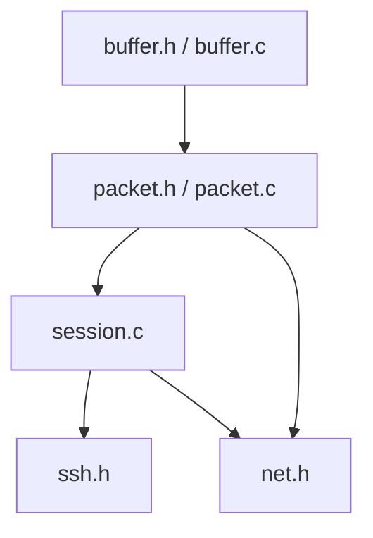
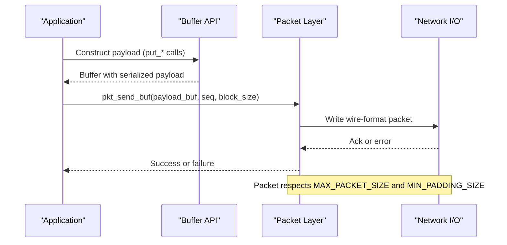
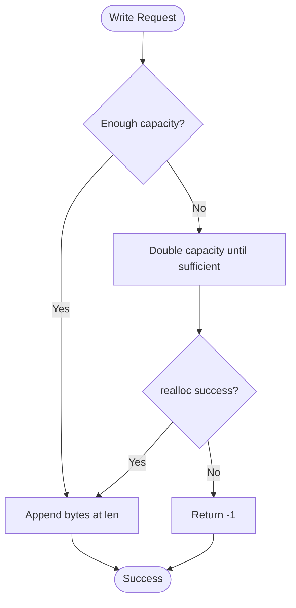
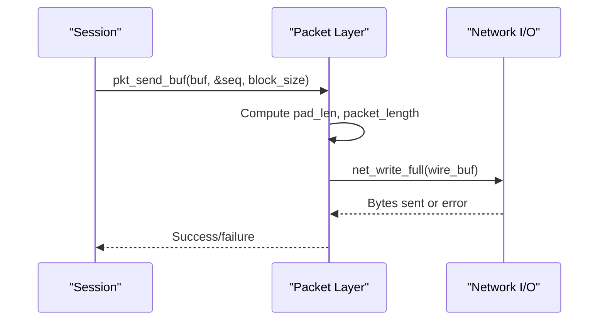
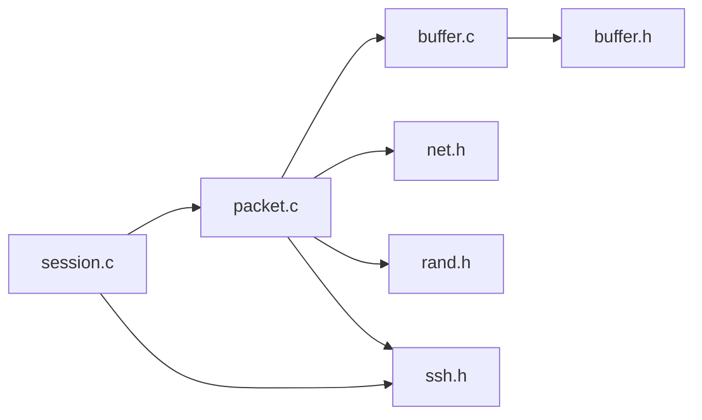

# Buffer Management API

<cite>
**Referenced Files in This Document**
- [buffer.h](file://src/buffer.h)
- [buffer.c](file://src/buffer.c)
- [packet.h](file://src/packet.h)
- [packet.c](file://src/packet.c)
- [session.c](file://src/session.c)
- [ssh.h](file://src/ssh.h)
- [net.h](file://src/net.h)
</cite>

## Table of Contents
1. [Introduction](#introduction)
2. [Project Structure](#project-structure)
3. [Core Components](#core-components)
4. [Architecture Overview](#architecture-overview)
5. [Detailed Component Analysis](#detailed-component-analysis)
6. [Dependency Analysis](#dependency-analysis)
7. [Performance Considerations](#performance-considerations)
8. [Troubleshooting Guide](#troubleshooting-guide)
9. [Conclusion](#conclusion)
10. [Appendices](#appendices)

## Introduction
This document provides detailed API documentation for the buffer management system used by the Coalesce SSH implementation. It covers dynamic buffer creation, resizing, and destruction; type-safe serialization/deserialization APIs for integers, booleans, raw binary data, strings, and SSH multi-precision integers (mpint); memory management patterns; overflow protection mechanisms; and performance considerations. It also includes common usage patterns for constructing and parsing SSH messages using the buffer API within the packet and session layers.

## Project Structure
The buffer subsystem is implemented in a small, focused set of files:
- buffer.h and buffer.c define the ssh_buf_t structure and all buffer operations.
- packet.h and packet.c build on buffers to send and receive SSH packets with padding and length fields.
- session.c uses buffers to assemble and parse payloads for encrypted or unencrypted transport sessions.
- ssh.h defines protocol constants such as maximum packet sizes and minimum padding.
- net.h provides low-level network I/O primitives used by packet/session layers.

**Diagram sources**
- [buffer.h:8-47](file://src/buffer.h#L8-L47)
- [buffer.c:7-271](file://src/buffer.c#L7-L271)
- [packet.h:9-26](file://src/packet.h#L9-L26)
- [packet.c:52-166](file://src/packet.c#L52-L166)
- [session.c:196-363](file://src/session.c#L196-L363)
- [ssh.h:12-15](file://src/ssh.h#L12-L15)
- [net.h:46-56](file://src/net.h#L46-L56)

**Section sources**
- [buffer.h:8-47](file://src/buffer.h#L8-L47)
- [buffer.c:7-271](file://src/buffer.c#L7-L271)
- [packet.h:9-26](file://src/packet.h#L9-L26)
- [packet.c:52-166](file://src/packet.c#L52-L166)
- [session.c:196-363](file://src/session.c#L196-L363)
- [ssh.h:12-15](file://src/ssh.h#L12-L15)
- [net.h:46-56](file://src/net.h#L46-L56)

## Core Components
- ssh_buf_t: A dynamic buffer with fields for data pointer, read position, written length, and capacity.
- Lifecycle functions: buf_new, buf_init, buf_free, buf_reset, buf_reserve.
- Writers: buf_put_u8, buf_put_u32, buf_put_u64, buf_put_bool, buf_put_raw, buf_put_string, buf_put_cstring, buf_put_mpint.
- Readers: buf_get_u8, buf_get_u32, buf_get_u64, buf_get_bool, buf_get_raw, buf_get_string, buf_get_cstring, buf_get_mpint.
- Status/accessors: buf_readable, buf_read_ptr, buf_data, buf_len, buf_consume.

Key behaviors:
- All writers ensure sufficient capacity via buf_reserve before writing.
- All readers check available bytes via buf_readable and advance rpos only on success.
- Strings are serialized with a 32-bit length prefix; mpint follows SSH’s big-endian encoding rules with optional leading zero byte for positive sign.

**Section sources**
- [buffer.h:8-47](file://src/buffer.h#L8-L47)
- [buffer.c:7-271](file://src/buffer.c#L7-L271)

## Architecture Overview
The buffer API is the foundation for higher-level SSH message handling:
- Packet layer wraps payload into wire format (length + padding_length + payload + padding), then sends over the network.
- Session layer handles encryption/MAC and uses buffers to construct/parse payloads for both encrypted and unencrypted modes.

**Diagram sources**
- [buffer.c:98-180](file://src/buffer.c#L98-L180)
- [packet.c:52-111](file://src/packet.c#L52-L111)
- [ssh.h:12-15](file://src/ssh.h#L12-L15)
- [net.h:51-56](file://src/net.h#L51-L56)

## Detailed Component Analysis

### Buffer Data Model and Lifecycle
- ssh_buf_t holds a dynamically allocated byte array with explicit tracking of written length and read position.
- buf_new allocates and initializes a buffer with an initial capacity that is clamped to a minimum.
- buf_init allows stack-allocated buffers to be initialized with a given capacity.
- buf_free releases the underlying data and resets state.
- buf_reset clears len and rpos without freeing memory, enabling reuse.
- buf_reserve grows capacity geometrically when needed, ensuring space for additional writes.

**Diagram sources**
- [buffer.c:49-65](file://src/buffer.c#L49-L65)
- [buffer.c:98-137](file://src/buffer.c#L98-L137)

**Section sources**
- [buffer.h:8-27](file://src/buffer.h#L8-L27)
- [buffer.c:7-65](file://src/buffer.c#L7-L65)

### Type-Safe Serialization (Writers)
- Integer types:
  - buf_put_u8: Writes one byte.
  - buf_put_u32: Writes a 32-bit integer in big-endian order.
  - buf_put_u64: Writes a 64-bit integer in big-endian order.
- Boolean:
  - buf_put_bool: Encodes true/false as 1/0 byte.
- Raw binary:
  - buf_put_raw: Copies n bytes from src into the buffer.
- Strings:
  - buf_put_string: Writes a 32-bit length followed by the bytes.
  - buf_put_cstring: Writes a null-terminated C string using buf_put_string.
- Multi-precision integers:
  - buf_put_mpint: Serializes SSH-style mpint with length prefix, skipping leading zeros, and adding a leading zero byte if necessary to keep the value positive.

All writers return 0 on success and -1 on allocation failure or invalid input.

**Section sources**
- [buffer.c:98-180](file://src/buffer.c#L98-L180)

### Type-Safe Deserialization (Readers)
- Integer types:
  - buf_get_u8: Reads one byte into provided pointer.
  - buf_get_u32: Reads a 32-bit big-endian integer.
  - buf_get_u64: Reads a 64-bit big-endian integer.
- Boolean:
  - buf_get_bool: Reads a boolean encoded as a single byte.
- Raw binary:
  - buf_get_raw: Copies n bytes into dst.
- Strings:
  - buf_get_string: Reads a 32-bit length, allocates a new buffer for the string content, copies bytes, appends a null terminator, and returns pointers to data and length.
  - buf_get_cstring: Convenience wrapper returning a newly allocated C string.
- Multi-precision integers:
  - buf_get_mpint: Reads an SSH mpint by delegating to string deserialization (length-prefixed).

All readers return 0 on success and -1 on underflow or invalid input.

**Section sources**
- [buffer.c:184-271](file://src/buffer.c#L184-L271)

### Buffer Status and Pointer Access
- buf_readable: Returns number of unread bytes based on rpos and len.
- buf_read_ptr: Returns a const pointer to the current read position.
- buf_data: Returns the underlying data pointer (non-const).
- buf_len: Returns the total written length.
- buf_consume: Advances rpos by n after validating bounds.

These helpers enable safe iteration and consumption of parsed data without copying.

**Section sources**
- [buffer.c:67-94](file://src/buffer.c#L67-L94)

### Packet Layer Integration
- pkt_send constructs a wire-format packet:
  - Computes padding to satisfy block size alignment and minimum padding constraints.
  - Builds packet_length and padding_length fields.
  - Writes payload and random padding.
  - Sends via net_write_full and increments sequence number.
- pkt_send_buf: Convenience function to send the contents of an ssh_buf_t directly.
- pkt_recv: Reads and validates a packet header, ensures padding_length is valid, extracts payload into pkt.payload buffer, and increments sequence number.

**Diagram sources**
- [packet.c:52-111](file://src/packet.c#L52-L111)
- [ssh.h:12-15](file://src/ssh.h#L12-L15)
- [net.h:51-56](file://src/net.h#L51-L56)

**Section sources**
- [packet.h:9-26](file://src/packet.h#L9-L26)
- [packet.c:52-166](file://src/packet.c#L52-L166)

### Session Layer Usage Patterns
- Unencrypted mode:
  - session_send builds wire-format frames with padding and sends them directly.
  - session_recv reads headers, validates lengths, and copies payload into an output buffer using buf_put_raw.
- Encrypted mode:
  - session_send computes MAC before encryption, encrypts in-place, and sends ciphertext plus MAC.
  - session_recv decrypts the first block to learn packet_length, decrypts the rest, verifies MAC, and extracts payload into an output buffer.

Common pattern:
- Build payload with buffer writers (e.g., message type, parameters).
- Pass the buffer to session_send_buf or pkt_send_buf to transmit.
- On receive, use session_recv to fill an output buffer, then parse with buffer readers.

**Section sources**
- [session.c:196-363](file://src/session.c#L196-L363)

## Dependency Analysis
- buffer.c depends only on standard library and buffer.h.
- packet.c depends on buffer.h, net.h, rand.h, and ssh.h.
- session.c depends on buffer.h indirectly via packet/session interfaces, and uses crypto utilities and ssh.h constants.

**Diagram sources**
- [buffer.c:1-4](file://src/buffer.c#L1-L4)
- [packet.c:1-5](file://src/packet.c#L1-L5)
- [session.c:1-7](file://src/session.c#L1-L7)

**Section sources**
- [buffer.c:1-4](file://src/buffer.c#L1-L4)
- [packet.c:1-5](file://src/packet.c#L1-L5)
- [session.c:1-7](file://src/session.c#L1-L7)

## Performance Considerations
- Geometric growth: buf_reserve doubles capacity when needed, minimizing reallocations during sequential writes.
- Minimal copies: Writers append directly to the buffer’s data region; readers consume via rpos without moving data.
- Efficient string handling: buf_put_string writes length once and then copies payload; buf_get_string allocates exactly len+1 bytes and copies once.
- Padding and alignment: Packet layer computes minimal padding to meet block-size requirements, avoiding excessive overhead.
- Memory limits: Enforces MAX_PACKET_SIZE to prevent unbounded allocations and potential denial-of-service conditions.

[No sources needed since this section provides general guidance]

## Troubleshooting Guide
Common issues and how to detect them:
- Allocation failures:
  - Writers return -1 when buf_reserve fails; callers should handle errors and avoid partial writes.
- Underflow on reads:
  - Readers return -1 if insufficient bytes are available; always check return values before consuming.
- Invalid packet sizes:
  - Packet receiver checks packet_length against MAX_PACKET_SIZE and rejects out-of-range values.
- Invalid padding:
  - Receiver validates padding_length is within allowed range; otherwise treats packet as corrupted.
- MAC verification failures:
  - In encrypted mode, session_recv compares computed MAC with received MAC; mismatch indicates tampering or key mismatch.

Recommended practices:
- Always check return codes for buffer operations.
- Use buf_readable to probe available data before reading.
- Reset buffers with buf_reset between messages to reuse memory safely.
- Validate all external inputs (lengths, offsets) before processing.

**Section sources**
- [buffer.c:49-94](file://src/buffer.c#L49-L94)
- [buffer.c:184-271](file://src/buffer.c#L184-L271)
- [packet.c:113-166](file://src/packet.c#L113-L166)
- [session.c:264-363](file://src/session.c#L264-L363)
- [ssh.h:12-15](file://src/ssh.h#L12-L15)

## Conclusion
The Coalesce SSH buffer API provides a robust, efficient, and type-safe mechanism for serializing and deserializing SSH messages. Its design emphasizes safety through explicit capacity management and bounds checking, while maintaining performance via geometric growth and minimal copying. The integration with packet and session layers ensures correct wire formatting, padding, and security checks consistent with SSH specifications.

[No sources needed since this section summarizes without analyzing specific files]

## Appendices

### Common SSH Message Construction Patterns
- Building a simple message:
  - Initialize or reset a buffer.
  - Write message type and parameters using put_* functions.
  - Send via pkt_send_buf or session_send_buf.
- Parsing a received message:
  - Receive into a buffer using session_recv or pkt_recv.
  - Read message type and fields using get_* functions.
  - Consume remaining bytes as needed.

Example references:
- Test cases demonstrate basic primitive usage and string handling.
- Session and packet layers show end-to-end construction and parsing flows.

**Section sources**
- [test_phase1.c:8-47](file://tests/test_phase1.c#L8-L47)
- [packet.c:52-166](file://src/packet.c#L52-L166)
- [session.c:196-363](file://src/session.c#L196-L363)