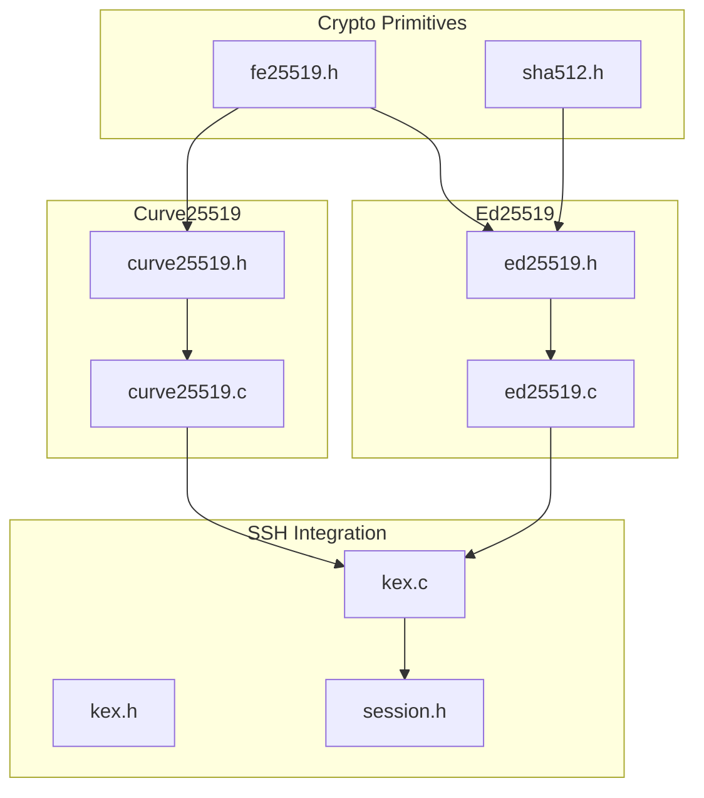
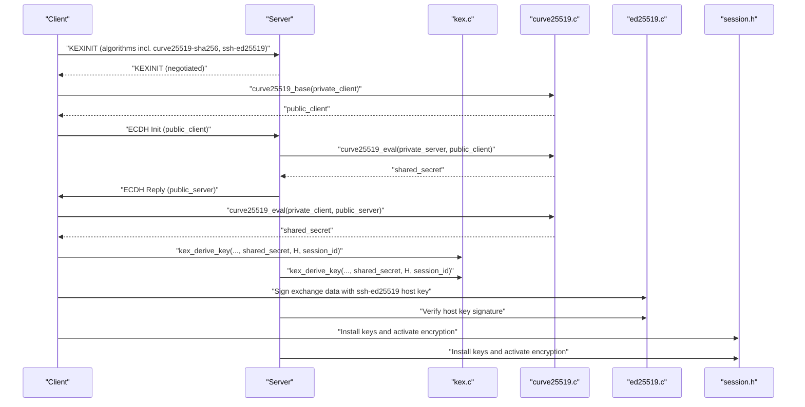
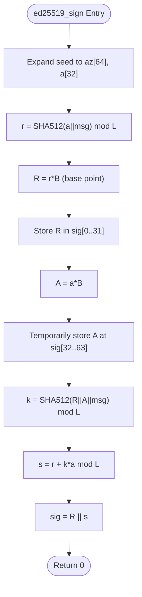
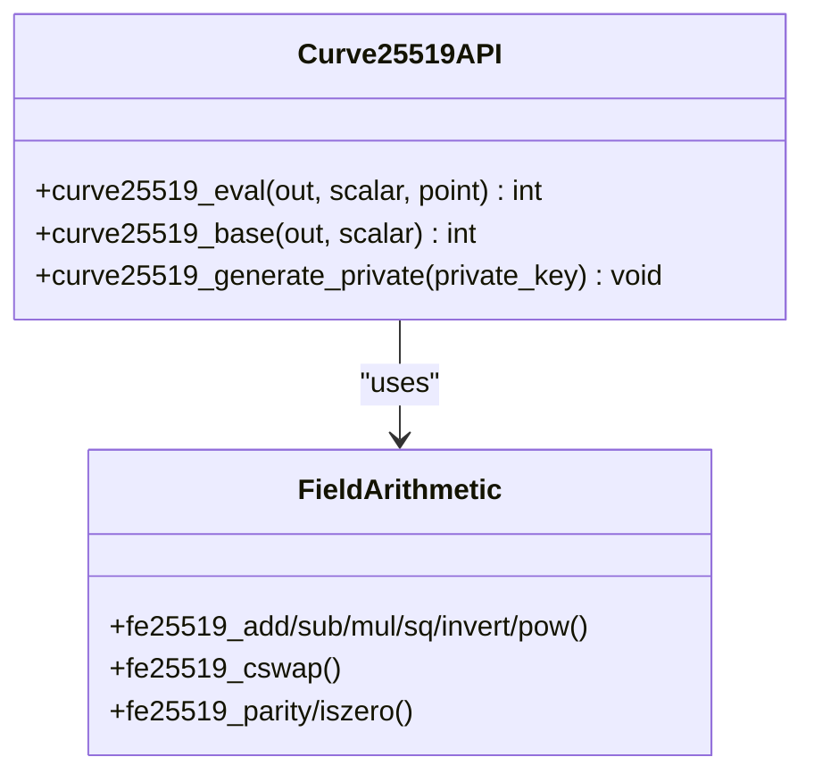
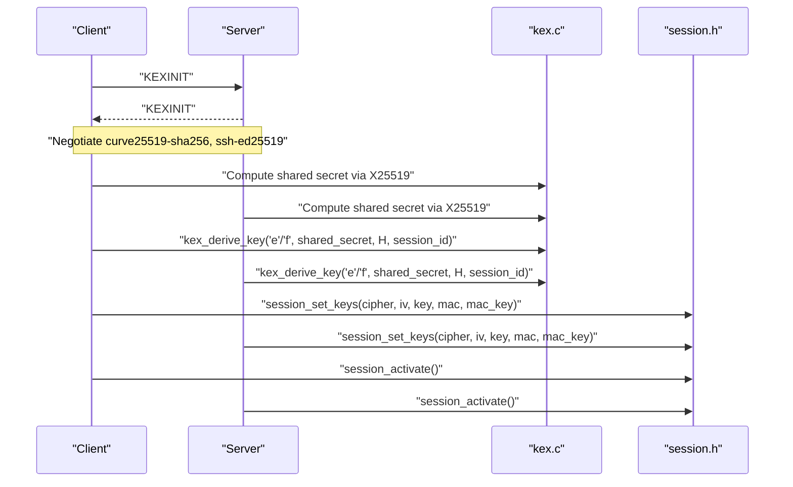
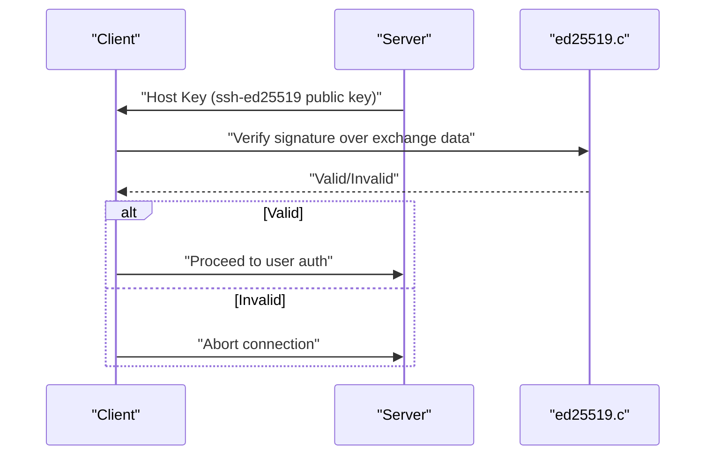
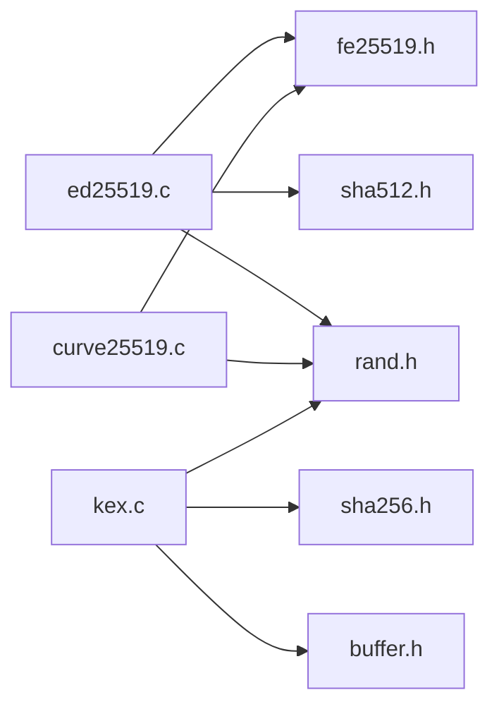

# Digital Signature API

<cite>
**Referenced Files in This Document**
- [ed25519.h](file://src/ed25519.h)
- [ed25519.c](file://src/ed25519.c)
- [curve25519.h](file://src/curve25519.h)
- [curve25519.c](file://src/curve25519.c)
- [fe25519.h](file://src/fe25519.h)
- [sha512.h](file://src/sha512.h)
- [kex.h](file://src/kex.h)
- [kex.c](file://src/kex.c)
- [session.h](file://src/session.h)
- [test_phase2.c](file://tests/test_phase2.c)
</cite>

## Table of Contents
1. [Introduction](#introduction)
2. [Project Structure](#project-structure)
3. [Core Components](#core-components)
4. [Architecture Overview](#architecture-overview)
5. [Detailed Component Analysis](#detailed-component-analysis)
6. [Dependency Analysis](#dependency-analysis)
7. [Performance Considerations](#performance-considerations)
8. [Troubleshooting Guide](#troubleshooting-guide)
9. [Conclusion](#conclusion)
10. [Appendices](#appendices)

## Introduction
This document provides detailed API documentation for digital signature functionality in the Coalesce SSH implementation, focusing on Ed25519 key generation, signing, and verification, as well as Curve25519 (X25519) elliptic curve operations used for key exchange and public-key cryptography. It covers key formats, signature algorithms, security parameters, host key authentication flows, and integration with SSH key exchange protocols.

## Project Structure
The cryptographic subsystem is organized into modular components:
- Ed25519 signatures: ed25519.h/c implement RFC 8032 over the twisted Edwards curve using fe25519 field arithmetic and SHA-512.
- Curve25519 (X25519): curve25519.h/c implement RFC 7748 ECDH key exchange over the Montgomery curve u-coordinate arithmetic.
- Field arithmetic: fe25519.h defines the 2^255−19 field primitives shared by both curves.
- Hashing: sha512.h provides SHA-512 used by Ed25519.
- Key exchange and session: kex.h/c negotiate algorithms and derive keys per RFC 4253; session.h manages transport framing and key installation.

**Diagram sources**
- [fe25519.h:1-35](file://src/fe25519.h#L1-L35)
- [sha512.h:1-26](file://src/sha512.h#L1-L26)
- [ed25519.h:1-32](file://src/ed25519.h#L1-L32)
- [curve25519.h:1-22](file://src/curve25519.h#L1-L22)
- [kex.h:1-52](file://src/kex.h#L1-L52)
- [session.h:1-89](file://src/session.h#L1-L89)

**Section sources**
- [ed25519.h:1-32](file://src/ed25519.h#L1-L32)
- [curve25519.h:1-22](file://src/curve25519.h#L1-L22)
- [kex.h:1-52](file://src/kex.h#L1-L52)
- [session.h:1-89](file://src/session.h#L1-L89)

## Core Components
- Ed25519 (RFC 8032): Provides deterministic signing and verification over the twisted Edwards curve with 32-byte public keys and 64-byte signatures. Uses SHA-512 and constant-time scalar multiplication.
- Curve25519/X25519 (RFC 7748): Provides ECDH key exchange using Montgomery ladder on u-coordinates with clamped 32-byte private keys.
- Field arithmetic (fe25519): Implements addition, subtraction, multiplication, squaring, inversion, exponentiation, parity checks, and conditional swap over GF(2^255−19).
- Key exchange (KEX): Negotiates algorithms (including curve25519-sha256 and ssh-ed25519), derives keys via HMAC-SHA256-based KDF per RFC 4253 §7.2, and integrates with session encryption/MAC setup.

Key sizes and formats:
- Ed25519 seed: 32 bytes (private key material)
- Ed25519 public key: 32 bytes (compressed Edwards point)
- Ed25519 signature: 64 bytes (R || S)
- Curve25519 private/public key: 32 bytes (clamped private, u-coordinate public)

Security parameters:
- Ed25519 uses L = 2^252 + 27742317777372353535851937790883648493 for scalar reduction.
- Curve25519 uses p = 2^255 − 19 field modulus and clamping rules per RFC 7748.

**Section sources**
- [ed25519.c:15-122](file://src/ed25519.c#L15-L122)
- [curve25519.c:6-92](file://src/curve25519.c#L6-L92)
- [fe25519.h:1-35](file://src/fe25519.h#L1-L35)
- [kex.c:8-12](file://src/kex.c#L8-L12)

## Architecture Overview
The SSH handshake integrates Ed25519 and Curve25519 as follows:
- Algorithm negotiation selects curve25519-sha256 for key exchange and ssh-ed25519 for host keys.
- Client and server perform X25519 to compute a shared secret (k_mpint).
- Host key authentication uses Ed25519 signatures to sign the exchange hash or challenge messages.
- Keys are derived using the KDF from kex.c to produce cipher and MAC keys for secure transport.

**Diagram sources**
- [kex.c:8-12](file://src/kex.c#L8-L12)
- [kex.c:192-229](file://src/kex.c#L192-L229)
- [curve25519.c:6-92](file://src/curve25519.c#L6-L92)
- [ed25519.c:314-429](file://src/ed25519.c#L314-L429)
- [session.h:71-86](file://src/session.h#L71-L86)

## Detailed Component Analysis

### Ed25519 API
- Key Generation:
  - ed25519_keypair generates a random 32-byte seed and derives the corresponding 32-byte public key.
  - ed25519_pubkey_from_seed derives the public key deterministically from a 32-byte seed.
- Signing:
  - ed25519_sign produces a 64-byte signature (R || S) over arbitrary-length messages using SHA-512 and constant-time scalar multiplication.
- Verification:
  - ed25519_verify validates a signature against a message and public key, enforcing canonical S < L and point decompression checks.

Data structures and constants:
- Seed size: 32 bytes
- Public key size: 32 bytes
- Signature size: 64 bytes
- Scalar order L: 2^252 + 27742317777372353535851937790883648493

Implementation highlights:
- Constant-time Montgomery ladder for scalar multiplication.
- Extended twisted Edwards coordinates with complete addition formulas.
- Point compression/decompression using sqrt via x^((p+3)/8) and sqrt(-1).
- SHA-512-based hashing for nonce derivation and challenge computation.

**Diagram sources**
- [ed25519.c:314-394](file://src/ed25519.c#L314-L394)

**Section sources**
- [ed25519.h:9-29](file://src/ed25519.h#L9-L29)
- [ed25519.c:314-429](file://src/ed25519.c#L314-L429)

### Curve25519 (X25519) API
- Operations:
  - curve25519_eval computes out = scalar * point (u-coordinate arithmetic).
  - curve25519_base computes public key = scalar * base_point (u=9).
  - curve25519_generate_private generates a cryptographically random 32-byte private key with RFC 7748 clamping.
- Security:
  - Private key clamping ensures safe subgroup usage and mitigates side-channel risks.
  - Montgomery ladder provides constant-time scalar multiplication.

**Diagram sources**
- [curve25519.h:7-19](file://src/curve25519.h#L7-L19)
- [curve25519.c:6-92](file://src/curve25519.c#L6-L92)
- [fe25519.h:11-32](file://src/fe25519.h#L11-L32)

**Section sources**
- [curve25519.h:1-22](file://src/curve25519.h#L1-L22)
- [curve25519.c:1-93](file://src/curve25519.c#L1-L93)
- [fe25519.h:1-35](file://src/fe25519.h#L1-L35)

### Key Exchange and Session Integration
- Algorithm negotiation:
  - Defaults include curve25519-sha256 for KEX and ssh-ed25519 for host keys.
  - kex_negotiate matches client/server proposals to select mutually acceptable algorithms.
- Key derivation:
  - kex_derive_key implements RFC 4253 §7.2 KDF using SHA-256 to derive symmetric keys from shared secret, exchange hash, and session ID.
- Session activation:
  - session_set_keys installs cipher and MAC keys per direction; session_activate enables encrypted transport.

**Diagram sources**
- [kex.c:25-174](file://src/kex.c#L25-L174)
- [kex.c:192-229](file://src/kex.c#L192-L229)
- [session.h:71-86](file://src/session.h#L71-L86)

**Section sources**
- [kex.c:8-12](file://src/kex.c#L8-L12)
- [kex.c:153-174](file://src/kex.c#L153-L174)
- [kex.c:192-229](file://src/kex.c#L192-L229)
- [session.h:71-86](file://src/session.h#L71-L86)

### Host Key Authentication Flow (Ed25519)
- The server presents its ssh-ed25519 host key during the handshake.
- The client verifies the host key signature over the exchange data using ed25519_verify.
- Successful verification establishes trust in the server’s identity before proceeding to user authentication.

**Diagram sources**
- [ed25519.c:396-429](file://src/ed25519.c#L396-L429)
- [kex.c:8-12](file://src/kex.c#L8-L12)

**Section sources**
- [ed25519.c:396-429](file://src/ed25519.c#L396-L429)
- [kex.c:8-12](file://src/kex.c#L8-L12)

## Dependency Analysis
- Ed25519 depends on:
  - fe25519 for field arithmetic
  - sha512 for hashing
  - rand for entropy in key generation
- Curve25519 depends on:
  - fe25519 for field arithmetic
  - rand for entropy in private key generation
- KEX depends on:
  - sha256 for KDF
  - rand for cookie generation
  - buffer utilities for encoding/decoding KEXINIT

**Diagram sources**
- [ed25519.c:9-13](file://src/ed25519.c#L9-L13)
- [curve25519.c:1-4](file://src/curve25519.c#L1-L4)
- [kex.c:1-6](file://src/kex.c#L1-L6)

**Section sources**
- [ed25519.c:9-13](file://src/ed25519.c#L9-L13)
- [curve25519.c:1-4](file://src/curve25519.c#L1-L4)
- [kex.c:1-6](file://src/kex.c#L1-L6)

## Performance Considerations
- Constant-time operations:
  - Ed25519 scalar multiplication uses a Montgomery ladder to avoid timing leaks.
  - Curve25519 uses a Montgomery ladder for ECDH.
- Memory efficiency:
  - Field operations use compact limb representations (5x64-bit limbs).
  - Streaming SHA-512 minimizes memory overhead for large messages.
- Throughput:
  - SHA-512 and AES-CTR are optimized for high-speed cryptographic operations in SSH sessions.
- Recommendations:
  - Ensure secure entropy source availability for rand_bytes to prevent weak keys.
  - Avoid reusing nonces or seeds across sessions.

[No sources needed since this section provides general guidance]

## Troubleshooting Guide
Common issues and diagnostics:
- Invalid signature:
  - Verify that S < L and that the public key decompresses correctly.
  - Check message length consistency between signing and verification.
- Key exchange failures:
  - Confirm algorithm negotiation includes curve25519-sha256 and ssh-ed25519.
  - Validate shared secret derivation and session ID handling.
- Session errors:
  - Ensure correct IV and key lengths for chosen ciphers.
  - Verify MAC key installation and activation sequence.

Validation examples:
- Ed25519 test vectors and negative cases demonstrate expected behavior for valid and invalid inputs.
- Curve25519 test vectors confirm ECDH shared secret correctness.

**Section sources**
- [ed25519.c:396-429](file://src/ed25519.c#L396-L429)
- [test_phase2.c:118-186](file://tests/test_phase2.c#L118-L186)
- [test_phase2.c:188-236](file://tests/test_phase2.c#L188-L236)
- [session.h:71-86](file://src/session.h#L71-L86)

## Conclusion
The Coalesce SSH implementation provides robust Ed25519 and Curve25519 cryptographic primitives with clear APIs for key generation, signing, verification, and key exchange. The integration with SSH key exchange protocols ensures secure host key authentication and session establishment. Adhering to RFC standards and employing constant-time implementations enhances security and performance.

[No sources needed since this section summarizes without analyzing specific files]

## Appendices

### API Reference Summary
- Ed25519:
  - ed25519_keypair(pub, seed)
  - ed25519_pubkey_from_seed(pub, seed)
  - ed25519_sign(sig, seed, msg, msg_len)
  - ed25519_verify(pub, sig, msg, msg_len)
- Curve25519:
  - curve25519_eval(out, scalar, point)
  - curve25519_base(out, scalar)
  - curve25519_generate_private(private_key)
- Key Exchange:
  - kex_init_default(kex, is_server)
  - kex_negotiate(client_kex, server_kex, chosen)
  - kex_derive_key(letter, k_mpint, k_len, h, h_len, session_id, session_id_len, out_key, key_len)

**Section sources**
- [ed25519.h:13-29](file://src/ed25519.h#L13-L29)
- [curve25519.h:9-19](file://src/curve25519.h#L9-L19)
- [kex.h:35-49](file://src/kex.h#L35-L49)