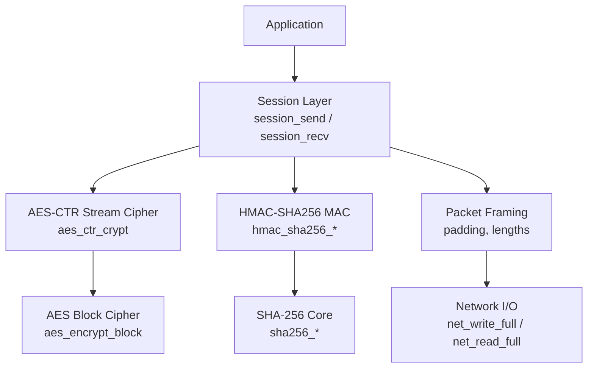
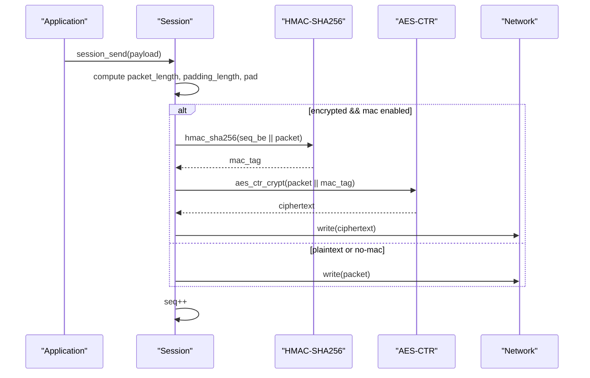
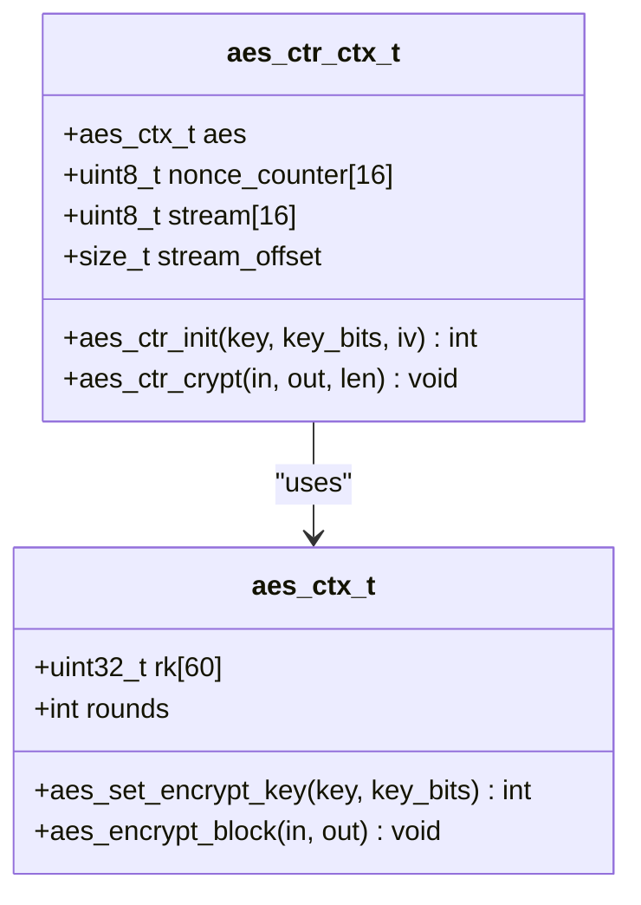
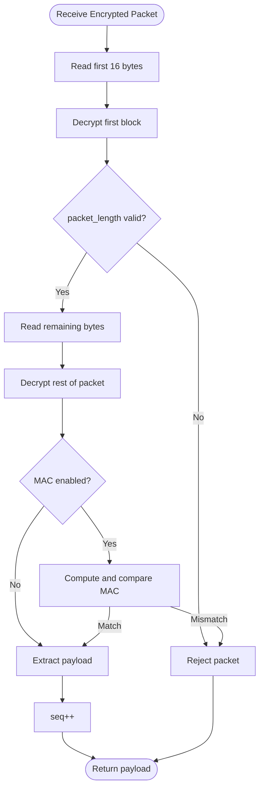
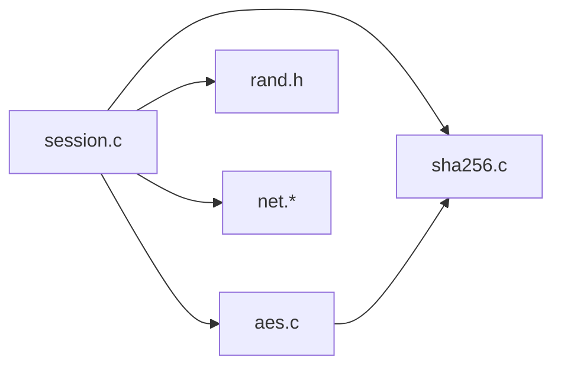
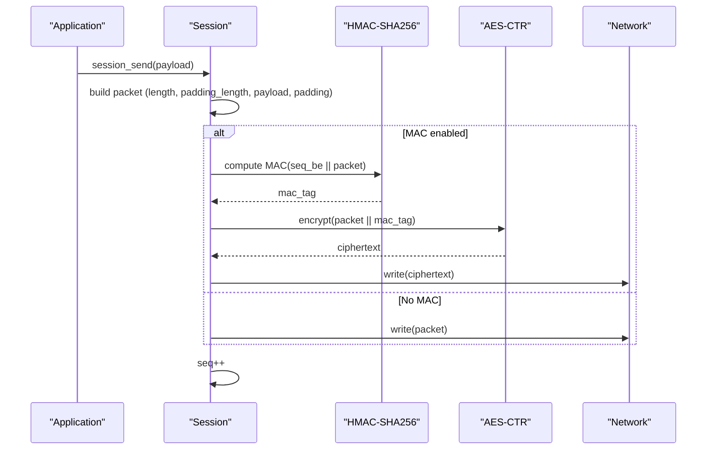
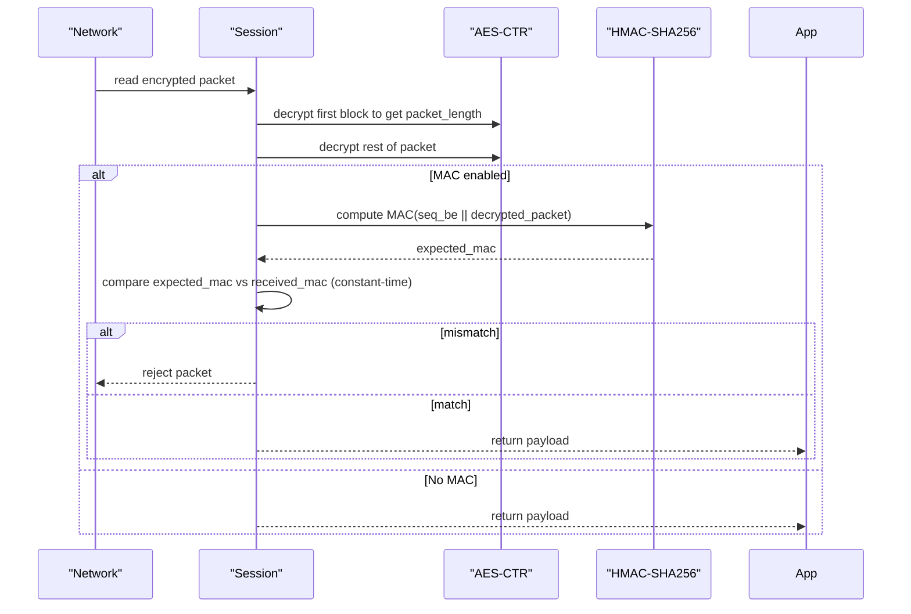

# Encryption API

<cite>
**Referenced Files in This Document**
- [aes.h](file://src/aes.h)
- [aes.c](file://src/aes.c)
- [sha256.h](file://src/sha256.h)
- [sha256.c](file://src/sha256.c)
- [session.h](file://src/session.h)
- [session.c](file://src/session.c)
- [packet.h](file://src/packet.h)
- [packet.c](file://src/packet.c)
- [ssh.h](file://src/ssh.h)
- [buffer.h](file://src/buffer.h)
- [rand.h](file://src/rand.h)
- [test_phase2.c](file://tests/test_phase2.c)
- [test_phase3.c](file://tests/test_phase3.c)
</cite>

## Table of Contents
1. [Introduction](#introduction)
2. [Project Structure](#project-structure)
3. [Core Components](#core-components)
4. [Architecture Overview](#architecture-overview)
5. [Detailed Component Analysis](#detailed-component-analysis)
6. [Dependency Analysis](#dependency-analysis)
7. [Performance Considerations](#performance-considerations)
8. [Troubleshooting Guide](#troubleshooting-guide)
9. [Conclusion](#conclusion)
10. [Appendices](#appendices)

## Introduction
This document provides comprehensive API documentation for symmetric encryption in the Coalesce SSH implementation. It focuses on AES-CTR mode (initialization, encryption, decryption), HMAC-SHA256 MAC verification, block cipher operations, and stream cipher functionality. It also covers integration with session management for encrypting SSH packets and verifying message integrity, along with performance considerations and security best practices.

## Project Structure
The encryption stack is implemented as a layered set of modules:
- Cryptographic primitives: AES block cipher and CTR streaming; SHA-256 and HMAC-SHA256
- Session layer: key installation, activation, and binary packet framing per RFC 4253
- Packet utilities: low-level packet framing helpers
- Utilities: buffers, random bytes, and SSH constants

**Diagram sources**
- [session.c:196-256](file://src/session.c#L196-L256)
- [session.c:264-362](file://src/session.c#L264-L362)
- [aes.c:151-178](file://src/aes.c#L151-L178)
- [aes.c:119-139](file://src/aes.c#L119-L139)
- [sha256.c:137-183](file://src/sha256.c#L137-L183)

**Section sources**
- [session.h:1-89](file://src/session.h#L1-L89)
- [session.c:1-363](file://src/session.c#L1-L363)
- [aes.h:1-38](file://src/aes.h#L1-L38)
- [aes.c:1-179](file://src/aes.c#L1-L179)
- [sha256.h:1-39](file://src/sha256.h#L1-L39)
- [sha256.c:1-184](file://src/sha256.c#L1-L184)
- [packet.h:1-28](file://src/packet.h#L1-L28)
- [packet.c:1-167](file://src/packet.c#L1-L167)
- [ssh.h:1-147](file://src/ssh.h#L1-L147)
- [buffer.h:1-50](file://src/buffer.h#L1-L50)
- [rand.h:1-13](file://src/rand.h#L1-L13)

## Core Components
- AES-CTR stream cipher:
  - Initialization via aes_ctr_init(key, key_bits, iv)
  - Symmetric encrypt/decrypt via aes_ctr_crypt(in, out, len)
  - Underlying AES block cipher via aes_set_encrypt_key and aes_encrypt_block
- HMAC-SHA256 MAC:
  - Initialize/update/finalize via hmac_sha256_*
  - Used to compute and verify per-packet MACs over sequence number + ciphertext
- Session transport:
  - Key installation via session_set_keys(cipher_name, iv, key, mac_name, mac_key)
  - Activation via session_activate(direction)
  - Encrypted send/recv via session_send/session_recv with automatic padding, MAC computation/verification, and sequence number handling

**Section sources**
- [aes.h:12-35](file://src/aes.h#L12-L35)
- [aes.c:38-178](file://src/aes.c#L38-L178)
- [sha256.h:12-36](file://src/sha256.h#L12-L36)
- [sha256.c:62-183](file://src/sha256.c#L62-L183)
- [session.h:27-86](file://src/session.h#L27-L86)
- [session.c:130-169](file://src/session.c#L130-L169)
- [session.c:196-362](file://src/session.c#L196-L362)

## Architecture Overview
The SSH transport layer builds packets according to RFC 4253:
- Plaintext path: length, padding_length, payload, random padding
- Encrypted path: optional MAC computed over big-endian sequence number + unencrypted packet, then AES-CTR encryption of the entire packet (including header), followed by MAC tag

**Diagram sources**
- [session.c:196-256](file://src/session.c#L196-L256)
- [sha256.c:137-183](file://src/sha256.c#L137-L183)
- [aes.c:151-178](file://src/aes.c#L151-L178)

**Section sources**
- [session.c:196-256](file://src/session.c#L196-L256)
- [session.c:264-362](file://src/session.c#L264-L362)

## Detailed Component Analysis

### AES-CTR Stream Cipher API
- Context types:
  - aes_ctx_t: raw AES context used for block encryption
  - aes_ctr_ctx_t: streaming context holding AES context, nonce counter, keystream buffer, and offset
- Functions:
  - aes_set_encrypt_key(ctx, key, key_bits): prepares AES round keys for 128/192/256-bit keys
  - aes_encrypt_block(ctx, in, out): encrypts one 16-byte block
  - aes_ctr_init(ctx, key, key_bits, iv): initializes CTR mode with key and 16-byte IV
  - aes_ctr_crypt(ctx, in, out, len): XORs input with keystream; identical for encrypt and decrypt

Complexity:
- Per-block cost: AES encryption of 16 bytes
- Streaming cost: amortized AES block per 16 bytes of data; minimal overhead for counter increment and XOR

Security notes:
- Never reuse a (key, IV) pair for multiple streams
- IV must be unique per key; implementation uses full 128-bit counter increment

Usage examples:
- Round-trip encryption/decryption verified in tests
  - [test_phase2.c:238-263](file://tests/test_phase2.c#L238-L263)
  - [test_phase2.c:265-312](file://tests/test_phase2.c#L265-L312)

**Section sources**
- [aes.h:12-35](file://src/aes.h#L12-L35)
- [aes.c:38-178](file://src/aes.c#L38-L178)
- [test_phase2.c:238-312](file://tests/test_phase2.c#L238-L312)

#### AES-CTR Class Diagram

**Diagram sources**
- [aes.h:12-35](file://src/aes.h#L12-L35)
- [aes.c:38-178](file://src/aes.c#L38-L178)

### HMAC-SHA256 MAC API
- Context type: hmac_sha256_ctx_t wrapping two sha256_ctx_t instances
- Functions:
  - hmac_sha256_init(ctx, key, key_len)
  - hmac_sha256_update(ctx, data, len)
  - hmac_sha256_final(ctx, digest)
  - hmac_sha256(key, key_len, data, data_len, digest)

Usage in SSH:
- Sender computes MAC over big-endian 32-bit sequence number concatenated with the unencrypted packet (length, padding_length, payload, padding)
- Receiver recomputes MAC and compares using constant-time equality check

Test vectors:
- HMAC-SHA256 vector validated in tests
  - [test_phase2.c:54-66](file://tests/test_phase2.c#L54-L66)

**Section sources**
- [sha256.h:12-36](file://src/sha256.h#L12-L36)
- [sha256.c:137-183](file://src/sha256.c#L137-L183)
- [session.c:225-238](file://src/session.c#L225-L238)
- [session.c:318-337](file://src/session.c#L318-L337)
- [test_phase2.c:54-66](file://tests/test_phase2.c#L54-L66)

### Session Transport Integration
Key installation and activation:
- session_set_keys(dir, cipher_name, iv, key, mac_name, mac_key, mac_key_len)
  - Supports aes128-ctr and aes256-ctr
  - Supports hmac-sha2-256 or none
  - Validates IV size (16 bytes) and key sizes
- session_activate(dir) marks direction as encrypted

Encrypted send flow:
- Computes packet_length and padding_length per RFC 4253
- If MAC enabled, computes HMAC-SHA256 over seq_be || packet before encryption
- Encrypts entire packet (including header and MAC) with AES-CTR
- Increments sequence number after successful send

Encrypted receive flow:
- Reads first block, decrypts to obtain packet_length
- Reads rest of packet, decrypts fully
- If MAC enabled, verifies MAC over seq_be || decrypted packet using constant-time comparison
- Extracts payload and increments sequence number

Examples:
- Full encrypted framing with MAC:
  - [test_phase3.c:258-324](file://tests/test_phase3.c#L258-L324)
- Encrypted framing without MAC:
  - [test_phase3.c:326-374](file://tests/test_phase3.c#L326-L374)
- MAC failure detection:
  - [test_phase3.c:378-420](file://tests/test_phase3.c#L378-L420)

**Diagram sources**
- [session.c:264-362](file://src/session.c#L264-L362)

**Section sources**
- [session.h:27-86](file://src/session.h#L27-L86)
- [session.c:130-169](file://src/session.c#L130-L169)
- [session.c:196-362](file://src/session.c#L196-L362)
- [test_phase3.c:258-420](file://tests/test_phase3.c#L258-L420)

### Low-Level Packet Framing Helpers
- packet.h/c provide basic packet construction and parsing:
  - pkt_send/pkt_recv handle length fields, padding, and payload extraction
  - Useful when building custom protocols or testing framing logic outside session encryption

Note: The session layer implements its own framing tailored to SSH’s encrypted mode and MAC requirements; packet helpers are general-purpose and do not include encryption/MAC.

**Section sources**
- [packet.h:1-28](file://src/packet.h#L1-L28)
- [packet.c:1-167](file://src/packet.c#L1-L167)

## Dependency Analysis
- Session depends on:
  - AES-CTR for encryption
  - HMAC-SHA256 for MAC
  - Random bytes for padding
  - Network I/O for sending/receiving
- AES depends on:
  - Fixed tables and arithmetic for block cipher
- SHA-256/HMAC depend on:
  - SHA-256 core functions

**Diagram sources**
- [session.c:1-363](file://src/session.c#L1-L363)
- [aes.c:1-179](file://src/aes.c#L1-L179)
- [sha256.c:1-184](file://src/sha256.c#L1-L184)
- [rand.h:1-13](file://src/rand.h#L1-L13)

**Section sources**
- [session.c:1-363](file://src/session.c#L1-L363)
- [aes.c:1-179](file://src/aes.c#L1-L179)
- [sha256.c:1-184](file://src/sha256.c#L1-L184)
- [rand.h:1-13](file://src/rand.h#L1-L13)

## Performance Considerations
- AES-CTR throughput:
  - Stream cipher avoids block chaining overhead; performance scales linearly with data size
  - Keystream caching reduces repeated AES calls; each 16-byte block triggers one AES encryption
- Padding strategy:
  - Ensures total packet size is a multiple of block size and minimum padding enforced
  - Minimizes extra bytes while maintaining security properties
- MAC computation:
  - HMAC-SHA256 operates over small fixed-size inputs per packet; negligible compared to network I/O for large payloads
- Memory usage:
  - In-place encryption possible due to CTR mode; session allocates temporary buffers for packet assembly
- Recommendations:
  - Prefer larger payloads to amortize per-packet overhead
  - Avoid frequent rekeys unless required; sequence numbers never reset across rekeys

[No sources needed since this section provides general guidance]

## Troubleshooting Guide
Common issues and how to diagnose them:
- Invalid cipher or MAC selection:
  - session_set_keys returns error for unsupported combinations (e.g., aes256-cbc, hmac-sha1)
  - Validate cipher_name and mac_name before installation
  - See validation tests:
    - [test_phase3.c:84-118](file://tests/test_phase3.c#L84-L118)
- Wrong IV or key length:
  - Ensure IV is 16 bytes and key matches cipher bit length
  - Tests cover wrong IV/key length scenarios:
    - [test_phase3.c:96-101](file://tests/test_phase3.c#L96-L101)
- MAC mismatch:
  - Receiver rejects packet if MAC does not match; indicates tampering or key mismatch
  - Test demonstrates MAC failure when receiver key is altered:
    - [test_phase3.c:378-420](file://tests/test_phase3.c#L378-L420)
- Malformed plaintext packets:
  - Rejects packet_length below minimum, invalid padding_length, or empty payload
  - Tests validate rejection paths:
    - [test_phase3.c:424-469](file://tests/test_phase3.c#L424-L469)
- Sequence number errors:
  - Sequence numbers increment per direction and never reset; ensure consistent ordering
  - Verified in send/recv flows:
    - [session.c:254-255](file://src/session.c#L254-L255)
    - [session.c:360-361](file://src/session.c#L360-L361)

**Section sources**
- [test_phase3.c:84-118](file://tests/test_phase3.c#L84-L118)
- [test_phase3.c:378-420](file://tests/test_phase3.c#L378-L420)
- [test_phase3.c:424-469](file://tests/test_phase3.c#L424-L469)
- [session.c:254-255](file://src/session.c#L254-L255)
- [session.c:360-361](file://src/session.c#L360-L361)

## Conclusion
The Coalesce SSH implementation provides a robust, standards-compliant symmetric encryption stack using AES-CTR and HMAC-SHA256. The session layer encapsulates packet framing, MAC computation/verification, and sequence number management per RFC 4253. The APIs are straightforward and well-tested, enabling secure transmission of SSH packets with strong confidentiality and integrity guarantees. For optimal performance and security, use supported ciphers and MACs, ensure unique IVs, and maintain proper key lifecycle management.

[No sources needed since this section summarizes without analyzing specific files]

## Appendices

### API Quick Reference
- AES-CTR
  - Initialize: aes_ctr_init(ctx, key, key_bits, iv)
  - Encrypt/Decrypt: aes_ctr_crypt(ctx, in, out, len)
  - Block cipher: aes_set_encrypt_key(ctx, key, key_bits), aes_encrypt_block(ctx, in, out)
- HMAC-SHA256
  - Initialize/Update/Final: hmac_sha256_init, hmac_sha256_update, hmac_sha256_final
  - One-shot: hmac_sha256(key, key_len, data, data_len, digest)
- Session
  - Install keys: session_set_keys(dir, cipher_name, iv, key, mac_name, mac_key, mac_key_len)
  - Activate: session_activate(dir)
  - Send/Recv: session_send(s, payload, len), session_recv(s, out_payload)

**Section sources**
- [aes.h:26-35](file://src/aes.h#L26-L35)
- [sha256.h:19-36](file://src/sha256.h#L19-L36)
- [session.h:71-86](file://src/session.h#L71-L86)

### Example Workflows

#### Encrypt an SSH Packet (Client -> Server)

**Diagram sources**
- [session.c:196-256](file://src/session.c#L196-L256)
- [sha256.c:137-183](file://src/sha256.c#L137-L183)
- [aes.c:151-178](file://src/aes.c#L151-L178)

#### Verify Message Integrity (Server receives)

**Diagram sources**
- [session.c:264-362](file://src/session.c#L264-L362)
- [sha256.c:137-183](file://src/sha256.c#L137-L183)
- [aes.c:151-178](file://src/aes.c#L151-L178)