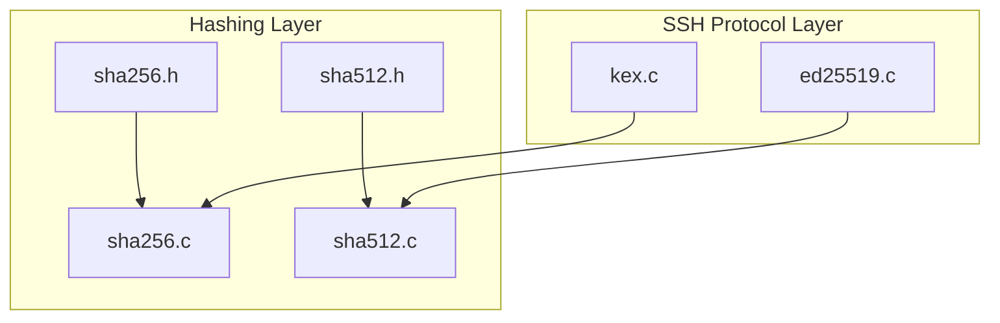
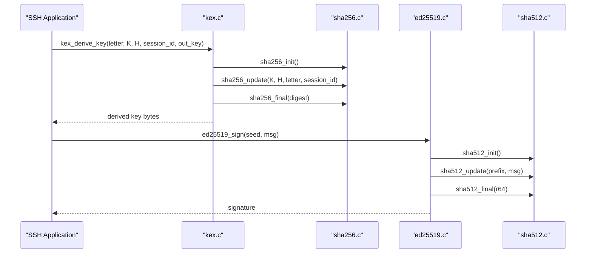
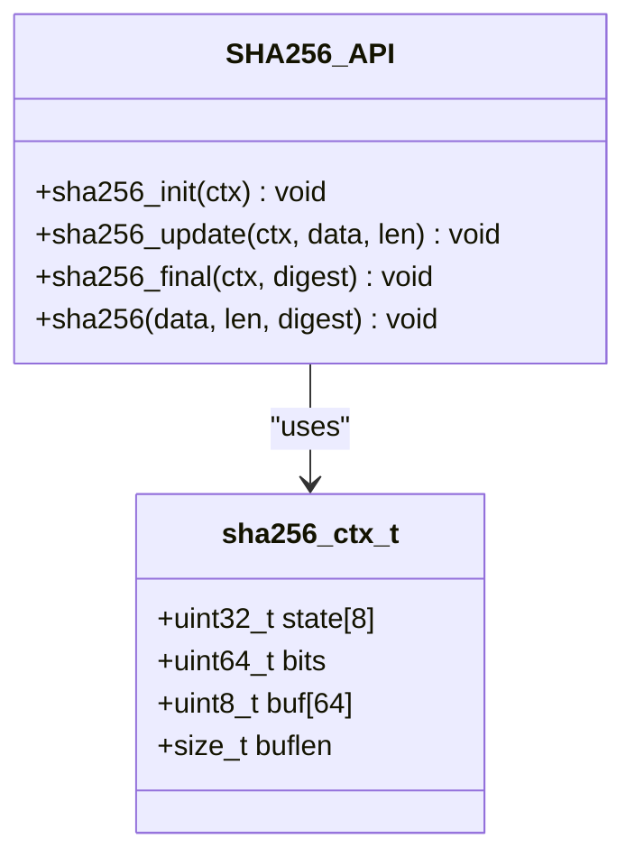
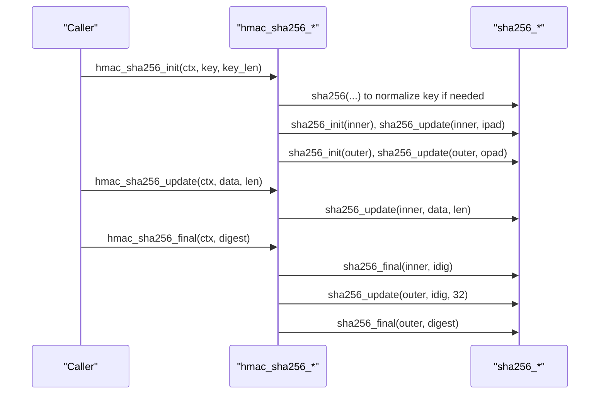
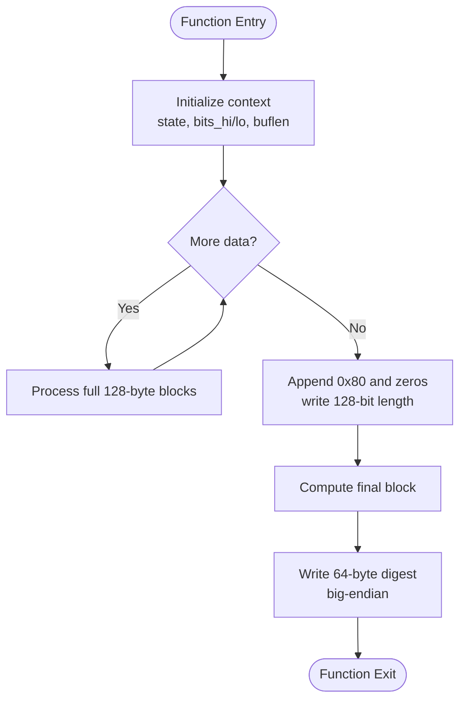
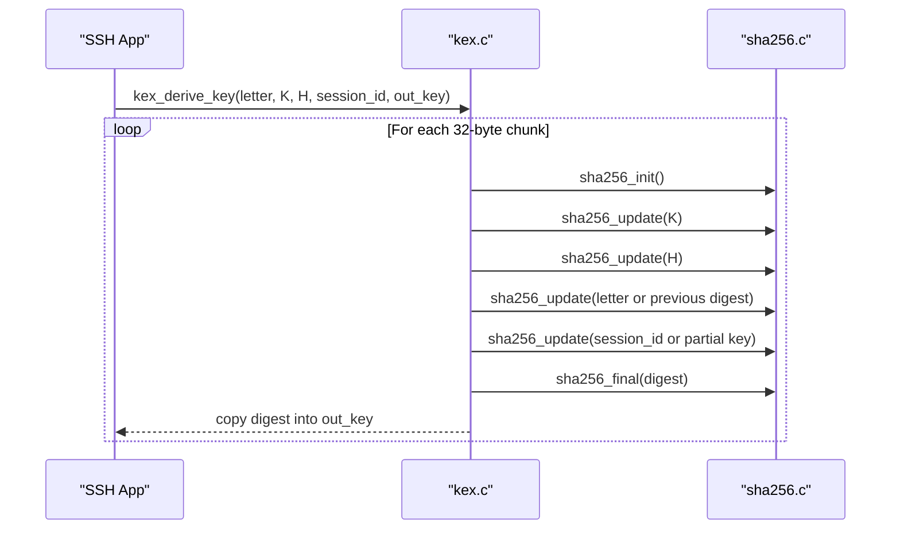
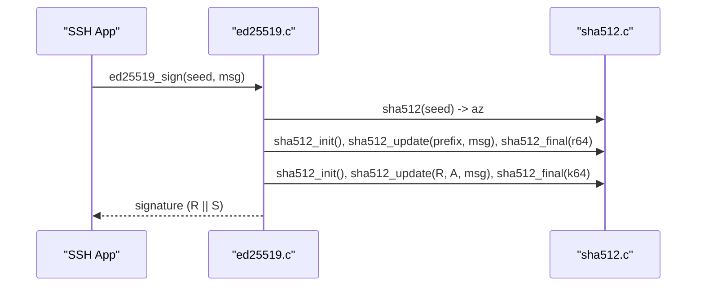
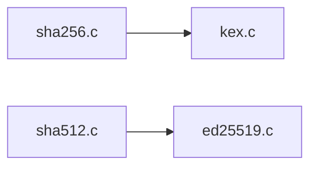

# Hash Function API

<cite>
**Referenced Files in This Document**
- [sha256.h](file://src/sha256.h)
- [sha256.c](file://src/sha256.c)
- [sha512.h](file://src/sha512.h)
- [sha512.c](file://src/sha512.c)
- [kex.c](file://src/kex.c)
- [ed25519.c](file://src/ed25519.c)
</cite>

## Table of Contents
1. [Introduction](#introduction)
2. [Project Structure](#project-structure)
3. [Core Components](#core-components)
4. [Architecture Overview](#architecture-overview)
5. [Detailed Component Analysis](#detailed-component-analysis)
6. [Dependency Analysis](#dependency-analysis)
7. [Performance Considerations](#performance-considerations)
8. [Troubleshooting Guide](#troubleshooting-guide)
9. [Conclusion](#conclusion)
10. [Appendices](#appendices)

## Introduction
This document provides comprehensive API documentation for the hash function implementations used in the Coalesce SSH implementation. It covers SHA-256 and SHA-512, including initialization, update, finalization, and convenience functions. It also documents HMAC-SHA256 usage and how these primitives are applied within the SSH protocol for key derivation and message authentication. Examples illustrate computing hashes for SSH messages and keys, with emphasis on incremental hashing and output formatting.

## Project Structure
The hash functionality is implemented in dedicated modules:
- SHA-256 and HMAC-SHA256: src/sha256.h, src/sha256.c
- SHA-512: src/sha512.h, src/sha512.c
- Usage in SSH key exchange (key derivation): src/kex.c
- Usage in Ed25519 signatures (SHA-512): src/ed25519.c

**Diagram sources**
- [sha256.h:1-39](file://src/sha256.h#L1-L39)
- [sha256.c:1-184](file://src/sha256.c#L1-L184)
- [sha512.h:1-26](file://src/sha512.h#L1-L26)
- [sha512.c:1-147](file://src/sha512.c#L1-L147)
- [kex.c:1-230](file://src/kex.c#L1-L230)
- [ed25519.c:1-430](file://src/ed25519.c#L1-L430)

**Section sources**
- [sha256.h:1-39](file://src/sha256.h#L1-L39)
- [sha256.c:1-184](file://src/sha256.c#L1-L184)
- [sha512.h:1-26](file://src/sha512.h#L1-L26)
- [sha512.c:1-147](file://src/sha512.c#L1-L147)
- [kex.c:1-230](file://src/kex.c#L1-L230)
- [ed25519.c:1-430](file://src/ed25519.c#L1-L430)

## Core Components
- SHA-256:
  - Context: sha256_ctx_t
  - Functions: sha256_init, sha256_update, sha256_final, sha256
  - Constants: SHA256_DIGEST_SIZE = 32, SHA256_BLOCK_SIZE = 64
- HMAC-SHA256:
  - Context: hmac_sha256_ctx_t
  - Functions: hmac_sha256_init, hmac_sha256_update, hmac_sha256_final, hmac_sha256
- SHA-512:
  - Context: sha512_ctx_t
  - Functions: sha512_init, sha512_update, sha512_final, sha512
  - Constants: SHA512_DIGEST_SIZE = 64, SHA512_BLOCK_SIZE = 128

Key properties:
- Incremental hashing via context-based update calls.
- Big-endian digest output.
- SHA-512 uses a 128-bit length accumulator to support very large inputs.

**Section sources**
- [sha256.h:7-22](file://src/sha256.h#L7-L22)
- [sha256.c:62-133](file://src/sha256.c#L62-L133)
- [sha256.c:137-183](file://src/sha256.c#L137-L183)
- [sha512.h:7-23](file://src/sha512.h#L7-L23)
- [sha512.c:65-146](file://src/sha512.c#L65-L146)

## Architecture Overview
The hash layer is consumed by higher-level SSH components:
- Key exchange derives session keys using SHA-256 as per RFC 4253 §7.2.
- Ed25519 signature generation and verification use SHA-512 as specified in RFC 8032.

**Diagram sources**
- [kex.c:192-229](file://src/kex.c#L192-L229)
- [sha256.c:62-133](file://src/sha256.c#L62-L133)
- [ed25519.c:350-393](file://src/ed25519.c#L350-L393)
- [sha512.c:65-146](file://src/sha512.c#L65-L146)

## Detailed Component Analysis

### SHA-256 API
- Initialization:
  - sha256_init(ctx): Sets initial state and resets internal buffer and bit counter.
- Update:
  - sha256_update(ctx, data, len): Processes input in 64-byte blocks; maintains total bits processed.
- Finalization:
  - sha256_final(ctx, digest): Pads message, appends length, computes final block, writes big-endian digest.
- Convenience:
  - sha256(data, len, digest): One-shot computation using an internal context.

Data structures:
- sha256_ctx_t contains state[8], bits, buf[64], buflen.

Output format:
- 32 bytes, big-endian order.

Complexity:
- Time: O(n) where n is input length.
- Space: Constant (context size).

Error handling:
- No explicit error returns; callers must ensure valid pointers and non-zero lengths where applicable.

Usage patterns:
- Incremental hashing for streaming data.
- One-shot hashing for small buffers.

**Section sources**
- [sha256.h:12-22](file://src/sha256.h#L12-L22)
- [sha256.c:62-133](file://src/sha256.c#L62-L133)

#### SHA-256 Class Diagram

**Diagram sources**
- [sha256.h:12-22](file://src/sha256.h#L12-L22)
- [sha256.c:62-133](file://src/sha256.c#L62-L133)

### HMAC-SHA256 API
- Initialization:
  - hmac_sha256_init(ctx, key, key_len): Normalizes key (hash if longer than block), prepares inner and outer contexts with padded keys.
- Update:
  - hmac_sha256_update(ctx, data, len): Updates inner hash incrementally.
- Finalization:
  - hmac_sha256_final(ctx, digest): Completes inner hash, updates outer hash, produces final MAC.
- Convenience:
  - hmac_sha256(key, key_len, data, data_len, digest): One-shot MAC computation.

Data structures:
- hmac_sha256_ctx_t contains two sha256_ctx_t instances (inner and outer).

Security properties:
- Follows RFC 2104 / FIPS 198-1.
- Suitable for SSH MAC algorithms like hmac-sha2-256.

**Section sources**
- [sha256.h:24-36](file://src/sha256.h#L24-L36)
- [sha256.c:137-183](file://src/sha256.c#L137-L183)

#### HMAC-SHA256 Sequence Diagram

**Diagram sources**
- [sha256.c:137-183](file://src/sha256.c#L137-L183)

### SHA-512 API
- Initialization:
  - sha512_init(ctx): Sets initial state and resets 128-bit length accumulator and buffer.
- Update:
  - sha512_update(ctx, data, len): Processes input in 128-byte blocks; maintains hi/lo bit counters.
- Finalization:
  - sha512_final(ctx, digest): Pads message, appends 128-bit length, computes final block, writes big-endian digest.
- Convenience:
  - sha512(data, len, digest): One-shot computation.

Data structures:
- sha512_ctx_t contains state[8], bits_hi, bits_lo, buf[128], buflen.

Output format:
- 64 bytes, big-endian order.

Complexity:
- Time: O(n).
- Space: Constant (context size).

**Section sources**
- [sha512.h:12-23](file://src/sha512.h#L12-L23)
- [sha512.c:65-146](file://src/sha512.c#L65-L146)

#### SHA-512 Flowchart

**Diagram sources**
- [sha512.c:65-146](file://src/sha512.c#L65-L146)

### SSH Integration Examples

#### Key Derivation Using SHA-256 (RFC 4253 §7.2)
- Purpose: Derive symmetric keys from shared secret K, handshake hash H, and session ID.
- Steps:
  - Compute K1 = SHA-256(K || H || X || session_id), where X is a single byte indicating direction.
  - If requested key length exceeds 32 bytes, compute additional blocks K2 = SHA-256(K || H || K1), etc., until enough bytes are produced.

**Diagram sources**
- [kex.c:192-229](file://src/kex.c#L192-L229)
- [sha256.c:62-133](file://src/sha256.c#L62-L133)

**Section sources**
- [kex.c:192-229](file://src/kex.c#L192-L229)

#### Ed25519 Signing Using SHA-512 (RFC 8032)
- Purpose: Generate deterministic signatures using SHA-512 for nonce and challenge computation.
- Steps:
  - Expand seed to az and a using SHA-512.
  - Compute r = SHA-512(prefix || M) mod L.
  - Compute R = r*B and include R in signature.
  - Compute k = SHA-512(R || A || M) mod L.
  - Compute S = r + k*a mod L; signature is R || S.

**Diagram sources**
- [ed25519.c:350-393](file://src/ed25519.c#L350-L393)
- [sha512.c:65-146](file://src/sha512.c#L65-L146)

**Section sources**
- [ed25519.c:350-393](file://src/ed25519.c#L350-L393)

## Dependency Analysis
- SHA-256 and HMAC-SHA256 are used by the key exchange module for deriving session keys.
- SHA-512 is used by the Ed25519 module for signing and verifying messages.
- There are no circular dependencies between hashing modules and consumers.

**Diagram sources**
- [kex.c:1-230](file://src/kex.c#L1-L230)
- [ed25519.c:1-430](file://src/ed25519.c#L1-L430)
- [sha256.c:1-184](file://src/sha256.c#L1-L184)
- [sha512.c:1-147](file://src/sha512.c#L1-L147)

**Section sources**
- [kex.c:1-230](file://src/kex.c#L1-L230)
- [ed25519.c:1-430](file://src/ed25519.c#L1-L430)

## Performance Considerations
- Incremental hashing minimizes memory copies by processing data in fixed-size blocks (64 bytes for SHA-256, 128 bytes for SHA-512).
- SHA-512’s 128-bit length accumulator supports arbitrarily large inputs without overflow concerns.
- One-shot APIs (sha256/sha512) allocate a temporary context internally; prefer incremental APIs for streaming data to avoid repeated allocations.
- HMAC-SHA256 performs two passes over the data (inner and outer); batch updates to minimize overhead when possible.

[No sources needed since this section provides general guidance]

## Troubleshooting Guide
Common issues and resolutions:
- Incorrect digest order: Ensure you read the digest in big-endian order as written by finalization routines.
- Partial updates: Always call sha256_final/sha512_final exactly once after all updates; calling it multiple times will produce incorrect results.
- Key normalization in HMAC: If the HMAC key is longer than the block size, it will be hashed automatically; verify your key length expectations.
- Session ID usage: In key derivation, ensure session_id is consistent across both sides; mismatched session IDs lead to different derived keys.

**Section sources**
- [sha256.c:100-133](file://src/sha256.c#L100-L133)
- [sha512.c:108-146](file://src/sha512.c#L108-L146)
- [kex.c:192-229](file://src/kex.c#L192-L229)

## Conclusion
The Coalesce SSH implementation provides robust, standards-compliant SHA-256 and SHA-512 hashing with incremental APIs suitable for streaming data. HMAC-SHA256 supports SSH MAC algorithms, while SHA-512 underpins Ed25519 signatures. These primitives are integrated into key derivation and cryptographic workflows essential to secure SSH sessions.

[No sources needed since this section summarizes without analyzing specific files]

## Appendices

### API Reference Summary

- SHA-256
  - sha256_init(ctx)
  - sha256_update(ctx, data, len)
  - sha256_final(ctx, digest)
  - sha256(data, len, digest)
  - Digest size: 32 bytes; Block size: 64 bytes

- HMAC-SHA256
  - hmac_sha256_init(ctx, key, key_len)
  - hmac_sha256_update(ctx, data, len)
  - hmac_sha256_final(ctx, digest)
  - hmac_sha256(key, key_len, data, data_len, digest)

- SHA-512
  - sha512_init(ctx)
  - sha512_update(ctx, data, len)
  - sha512_final(ctx, digest)
  - sha512(data, len, digest)
  - Digest size: 64 bytes; Block size: 128 bytes

**Section sources**
- [sha256.h:7-36](file://src/sha256.h#L7-L36)
- [sha512.h:7-23](file://src/sha512.h#L7-L23)