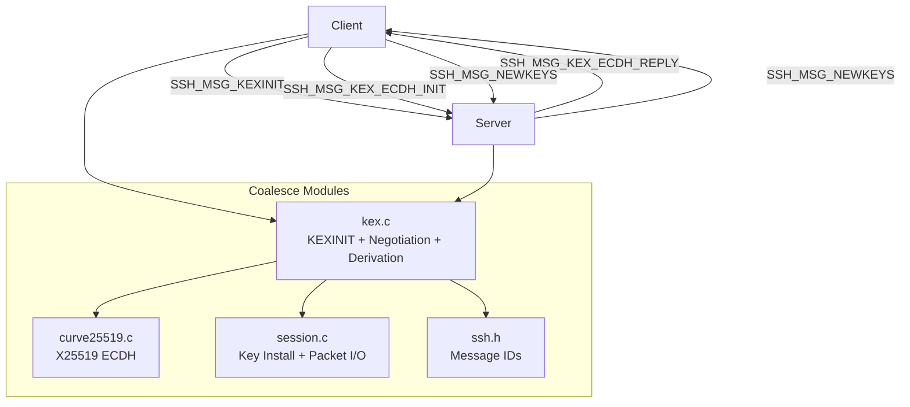
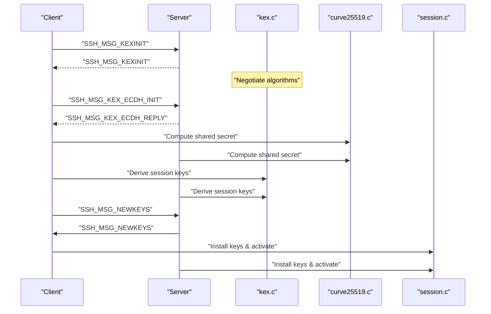
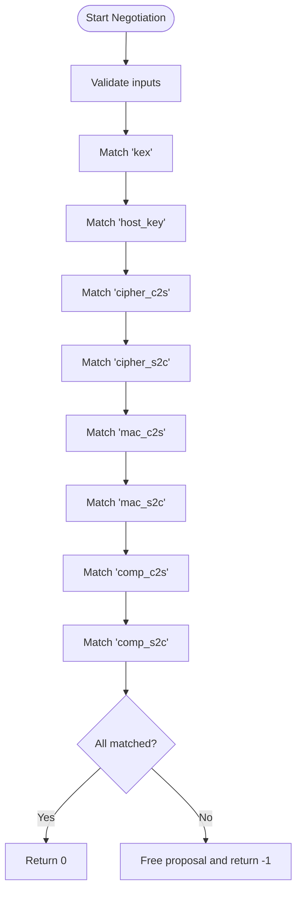
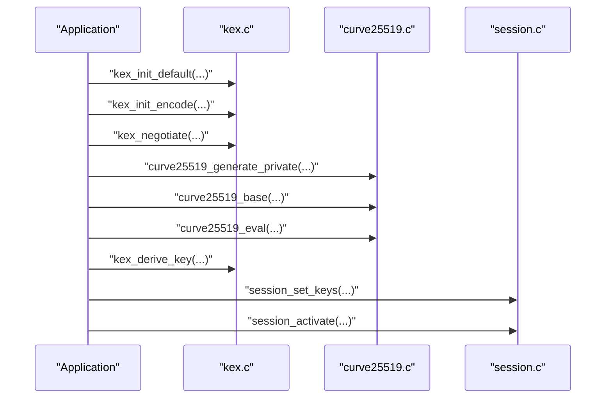
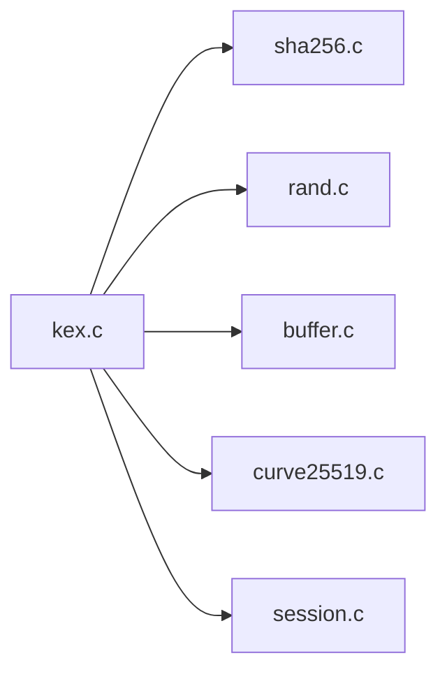

# Key Exchange API

<cite>
**Referenced Files in This Document**
- [kex.c](file://src/kex.c)
- [kex.h](file://src/kex.h)
- [curve25519.c](file://src/curve25519.c)
- [curve25519.h](file://src/curve25519.h)
- [session.c](file://src/session.c)
- [session.h](file://src/session.h)
- [ssh.h](file://src/ssh.h)
- [test_phase2.c](file://tests/test_phase2.c)
</cite>

## Table of Contents
1. [Introduction](#introduction)
2. [Project Structure](#project-structure)
3. [Core Components](#core-components)
4. [Architecture Overview](#architecture-overview)
5. [Detailed Component Analysis](#detailed-component-analysis)
6. [Dependency Analysis](#dependency-analysis)
7. [Performance Considerations](#performance-considerations)
8. [Troubleshooting Guide](#troubleshooting-guide)
9. [Conclusion](#conclusion)

## Introduction
This document describes the key exchange (KEX) functionality in the Coalesce SSH implementation. It focuses on:
- KEXINIT message handling and proposal negotiation
- Curve25519 ECDH APIs for shared secret computation
- Session key derivation per RFC 4253 §7.2
- Integration with the session management layer for installing and activating keys
- Algorithm selection logic, security considerations, and error handling patterns

The goal is to provide both a high-level understanding and code-level details for developers integrating or extending the key exchange flow.

## Project Structure
The key exchange subsystem spans several modules:
- kex.c / kex.h: KEXINIT encoding/decoding, algorithm negotiation, and key derivation
- curve25519.c / curve25519.h: X25519 scalar multiplication and private key generation
- session.c / session.h: Transport session state, key installation, and packet protection
- ssh.h: Message type constants used by the transport and key exchange
- tests/test_phase2.c: Unit tests validating KEX negotiation and cryptographic primitives

**Diagram sources**
- [kex.c:48-96](file://src/kex.c#L48-L96)
- [kex.c:153-174](file://src/kex.c#L153-L174)
- [kex.c:192-229](file://src/kex.c#L192-L229)
- [curve25519.c:8-68](file://src/curve25519.c#L8-L68)
- [session.c:130-163](file://src/session.c#L130-L163)
- [ssh.h:24-31](file://src/ssh.h#L24-L31)

**Section sources**
- [kex.c:1-230](file://src/kex.c#L1-L230)
- [kex.h:1-52](file://src/kex.h#L1-L52)
- [curve25519.c:1-93](file://src/curve25519.c#L1-L93)
- [curve25519.h:1-22](file://src/curve25519.h#L1-L22)
- [session.c:1-363](file://src/session.c#L1-L363)
- [session.h:1-89](file://src/session.h#L1-L89)
- [ssh.h:1-147](file://src/ssh.h#L1-L147)
- [test_phase2.c:378-395](file://tests/test_phase2.c#L378-L395)

## Core Components
- KEXINIT lifecycle:
  - Default initialization with safe defaults
  - Encode/decode of KEXINIT payloads
  - Freeing allocated strings
- Proposal negotiation:
  - Name-list matching across client/server lists
  - Selection of mutually acceptable algorithms
- Key derivation:
  - RFC 4253 §7.2 key derivation function
- Curve25519 ECDH:
  - Private key generation (clamped)
  - Public key from base point
  - Shared secret via scalar multiplication
- Session integration:
  - Installing cipher/MAC keys per direction
  - Activating encryption and MAC verification

**Section sources**
- [kex.c:25-46](file://src/kex.c#L25-L46)
- [kex.c:48-96](file://src/kex.c#L48-L96)
- [kex.c:153-174](file://src/kex.c#L153-L174)
- [kex.c:192-229](file://src/kex.c#L192-L229)
- [curve25519.c:8-92](file://src/curve25519.c#L8-L92)
- [session.c:130-169](file://src/session.c#L130-L169)

## Architecture Overview
The key exchange follows these phases:
1. Identification exchange (handled by session layer)
2. KEXINIT exchange and algorithm negotiation
3. Curve25519 ECDH exchange (client sends ephemeral public key; server responds with its public key and host key signature)
4. Compute shared secret and derive session keys
5. Send/receive SSH_MSG_NEWKEYS and activate encryption/MAC

**Diagram sources**
- [ssh.h:24-31](file://src/ssh.h#L24-L31)
- [kex.c:153-174](file://src/kex.c#L153-L174)
- [kex.c:192-229](file://src/kex.c#L192-L229)
- [curve25519.c:8-68](file://src/curve25519.c#L8-L68)
- [session.c:130-169](file://src/session.c#L130-L169)

## Detailed Component Analysis

### KEXINIT Handling and Encoding/Decoding
Responsibilities:
- Initialize default algorithm lists and cookie
- Encode KEXINIT into a buffer
- Decode incoming KEXINIT payloads
- Free all allocated strings

Key behaviors:
- Cookie is generated using the random source; fallback to zeros on failure
- All algorithm name-lists are stored as null-terminated strings
- first_kex_packet_follows flag is preserved

Error handling:
- Returns negative values on invalid inputs or buffer write/read failures
- Decoding resets fields and validates message type

API summary:
- kex_init_default(kex, is_server): initializes defaults
- kex_init_encode(kex, buf): serializes KEXINIT
- kex_init_decode(kex, buf): parses KEXINIT
- kex_init_free(kex): releases memory

**Section sources**
- [kex.c:25-46](file://src/kex.c#L25-L46)
- [kex.c:48-68](file://src/kex.c#L48-L68)
- [kex.c:70-96](file://src/kex.c#L70-L96)
- [kex.c:98-112](file://src/kex.c#L98-L112)

### Algorithm Negotiation
Responsibilities:
- Match client and server name-lists for each category
- Select the first mutually acceptable algorithm per list
- Return an ssh_kex_proposal_t with chosen algorithms

Algorithm categories negotiated:
- Key exchange method
- Host key algorithm
- Encryption algorithms (client-to-server, server-to-client)
- MAC algorithms (client-to-server, server-to-client)
- Compression algorithms (client-to-server, server-to-client)

Failure conditions:
- Any missing mutual match results in negotiation failure
- On failure, the proposal is freed before returning

API summary:
- kex_negotiate(client_kex, server_kex, chosen): returns 0 on success, -1 on failure
- kex_proposal_free(proposal): frees selected algorithm names

**Diagram sources**
- [kex.c:114-151](file://src/kex.c#L114-L151)
- [kex.c:153-174](file://src/kex.c#L153-L174)
- [kex.c:176-188](file://src/kex.c#L176-L188)

**Section sources**
- [kex.c:114-151](file://src/kex.c#L114-L151)
- [kex.c:153-188](file://src/kex.c#L153-L188)

### Curve25519 ECDH Implementation
Responsibilities:
- Generate cryptographically random private keys with clamping per RFC 7748
- Compute public keys from base point
- Compute shared secrets via scalar multiplication

API summary:
- curve25519_generate_private(out): generates clamped private key
- curve25519_base(out, scalar): computes public key from base point
- curve25519_eval(out, scalar, point): computes shared secret

Security notes:
- Private key clamping ensures safe scalar operations
- Point representation uses u-coordinate only (X25519)

Complexity:
- Scalar multiplication runs in constant time loops over 255 bits
- Field arithmetic operates on 5 limbs of 51-bit integers

**Section sources**
- [curve25519.c:8-68](file://src/curve25519.c#L8-L68)
- [curve25519.c:71-78](file://src/curve25519.c#L71-L78)
- [curve25519.c:80-92](file://src/curve25519.c#L80-L92)
- [curve25519.h:7-19](file://src/curve25519.h#L7-L19)

### Key Derivation Function (RFC 4253 §7.2)
Responsibilities:
- Derive session keys from shared secret K, exchange hash H, session ID, and a letter indicating key purpose (e.g., 'A', 'B', 'C', 'D')
- Use SHA-256 to compute K1, K2, ... until enough bytes are produced

Algorithm:
- K1 = HASH(K || H || letter || session_id)
- For additional bytes: Ki = HASH(K || H || Ki-1)
- Concatenate outputs to fill requested key length

API summary:
- kex_derive_key(letter, k_mpint, k_len, h, h_len, session_id, session_id_len, out_key, key_len): returns 0 on success, -1 on invalid input

Error handling:
- Validates all pointers and lengths
- Uses SHA-256 context for streaming digest computation

**Section sources**
- [kex.c:192-229](file://src/kex.c#L192-L229)

### Session Key Installation and Activation
Responsibilities:
- Install cipher and MAC keys for a specific direction
- Validate cipher and MAC parameters
- Activate encrypted mode after NEWKEYS exchange

Supported ciphers:
- aes128-ctr (128-bit key)
- aes256-ctr (256-bit key)

Supported MACs:
- hmac-sha2-256 (32-byte key)
- none (no MAC)

API summary:
- session_set_keys(dir, cipher_name, iv, iv_len, key, key_len, mac_name, mac_key, mac_key_len): installs keys
- session_activate(dir): enables encryption/MAC for the direction

Integration points:
- After deriving keys, call session_set_keys for both directions
- Then call session_activate to begin protected communication

**Section sources**
- [session.c:130-169](file://src/session.c#L130-L169)
- [session.h:24-33](file://src/session.h#L24-L33)

### End-to-End Key Exchange Flow Example
This example outlines how to use the APIs together:

1. Initialize KEXINIT structures for client and server with defaults
2. Encode and send KEXINIT messages
3. Decode peer’s KEXINIT and negotiate algorithms
4. Generate ephemeral Curve25519 private/public keys
5. Exchange public keys and compute shared secret
6. Derive session keys using kex_derive_key
7. Install keys via session_set_keys and activate with session_activate

**Diagram sources**
- [kex.c:25-46](file://src/kex.c#L25-L46)
- [kex.c:48-68](file://src/kex.c#L48-L68)
- [kex.c:153-174](file://src/kex.c#L153-L174)
- [curve25519.c:80-92](file://src/curve25519.c#L80-L92)
- [curve25519.c:8-68](file://src/curve25519.c#L8-L68)
- [kex.c:192-229](file://src/kex.c#L192-L229)
- [session.c:130-169](file://src/session.c#L130-L169)

## Dependency Analysis
The key exchange module depends on:
- sha256: for key derivation
- rand: for cookies and private key material
- buffer utilities: for KEXINIT serialization
- curve25519: for ECDH computations
- session: for installing and activating keys

**Diagram sources**
- [kex.c:1-6](file://src/kex.c#L1-L6)
- [kex.c:192-229](file://src/kex.c#L192-L229)
- [curve25519.c:1-4](file://src/curve25519.c#L1-L4)
- [session.c:1-7](file://src/session.c#L1-L7)

**Section sources**
- [kex.c:1-6](file://src/kex.c#L1-L6)
- [curve25519.c:1-4](file://src/curve25519.c#L1-L4)
- [session.c:1-7](file://src/session.c#L1-L7)

## Performance Considerations
- KEXINIT encode/decode: linear in the size of algorithm lists; minimal overhead
- Algorithm negotiation: O(n) scanning of comma-separated lists; efficient due to small list sizes
- Curve25519 scalar multiplication: constant-time loop over 255 bits; field operations optimized with limb arithmetic
- Key derivation: single SHA-256 pass plus optional additional passes for longer keys; negligible cost compared to network round-trips
- Session key installation: constant-time setup of AES-CTR and HMAC contexts

[No sources needed since this section provides general guidance]

## Troubleshooting Guide
Common issues and resolutions:
- Negotiation failure:
  - Ensure both sides include compatible algorithm lists
  - Verify that all required categories (kex, host_key, ciphers, MACs, compression) have matches
- Key derivation errors:
  - Validate inputs: non-null pointers, correct lengths, valid session ID
- Curve25519 errors:
  - Ensure private keys are properly clamped
  - Confirm public keys are 32 bytes and conform to X25519 format
- Session key installation:
  - Verify cipher name and key lengths match supported algorithms
  - Ensure IV length equals block size (16 bytes for AES)
  - MAC key length must be within allowed limits or zero for "none"

Error handling patterns:
- Functions return negative values on invalid inputs or internal failures
- Proposal negotiation frees partial allocations on failure
- Session functions validate parameters and reject unsupported configurations

**Section sources**
- [kex.c:153-174](file://src/kex.c#L153-L174)
- [kex.c:192-229](file://src/kex.c#L192-L229)
- [session.c:130-163](file://src/session.c#L130-L163)

## Conclusion
The Coalesce SSH key exchange implementation provides:
- Robust KEXINIT handling and algorithm negotiation
- Secure Curve25519 ECDH for shared secret computation
- RFC-compliant key derivation for session keys
- Clean integration with the session layer for key installation and activation

Developers should ensure algorithm compatibility, validate inputs, and follow the established flows to establish secure sessions. The provided unit tests demonstrate expected behavior for negotiation and cryptographic primitives.

[No sources needed since this section summarizes without analyzing specific files]