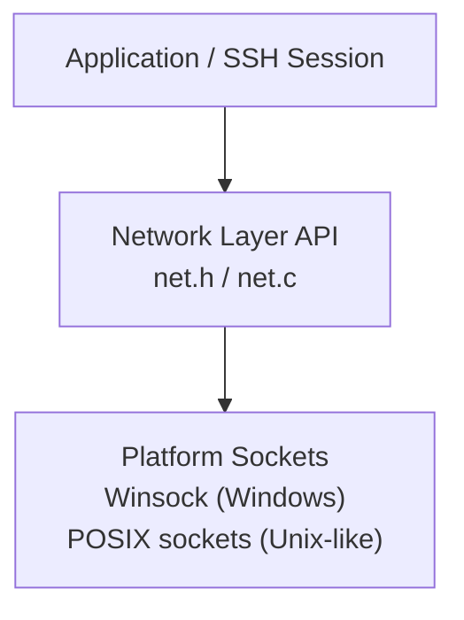
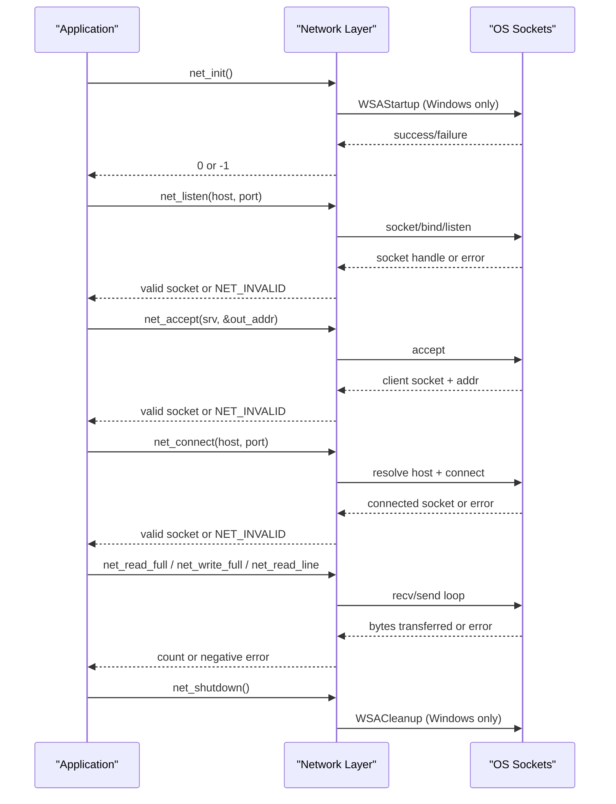
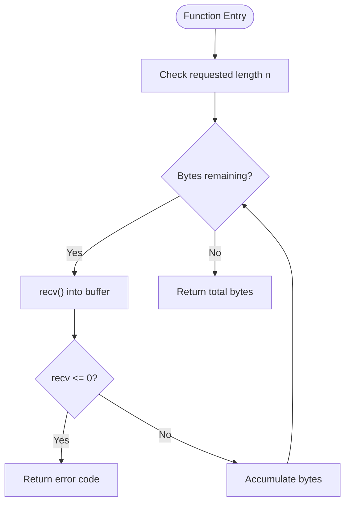
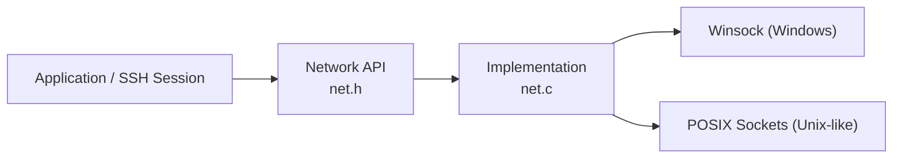

# Network Layer API

<cite>
**Referenced Files in This Document**
- [net.h](file://src/net.h)
- [net.c](file://src/net.c)
- [main.c](file://src/main.c)
</cite>

## Table of Contents
1. [Introduction](#introduction)
2. [Project Structure](#project-structure)
3. [Core Components](#core-components)
4. [Architecture Overview](#architecture-overview)
5. [Detailed Component Analysis](#detailed-component-analysis)
6. [Dependency Analysis](#dependency-analysis)
7. [Performance Considerations](#performance-considerations)
8. [Troubleshooting Guide](#troubleshooting-guide)
9. [Conclusion](#conclusion)

## Introduction
This document provides comprehensive API documentation for the network layer interface used by the Coalesce SSH implementation. The network layer is a minimal, cross-platform TCP transport abstraction with no protocol knowledge. It exposes functions for initialization, lifecycle management, server and client connection handling, I/O operations, and utilities.

The design focuses on:
- Cross-platform socket abstraction (Windows Winsock vs POSIX sockets)
- Simple, predictable error reporting via a global error string accessor
- Blocking I/O helpers that read/write exact byte counts or lines
- Minimal dependencies to keep the SSH stack lightweight

## Project Structure
The network layer consists of two primary files:
- Header file defining types, structures, and function prototypes
- Implementation file providing platform-specific logic and portable wrappers

**Diagram sources**
- [net.h:1-58](file://src/net.h#L1-L58)
- [net.c:1-177](file://src/net.c#L1-L177)

**Section sources**
- [net.h:1-58](file://src/net.h#L1-L58)
- [net.c:1-177](file://src/net.c#L1-L177)

## Core Components
The network layer exposes the following categories:
- Lifecycle: initialization and shutdown
- Server-side connection management: listen and accept
- Client-side connection management: connect
- I/O operations: full reads/writes and line reading
- Utilities: nonblocking mode, write-shutdown, close, error retrieval

Key data types:
- net_socket_t: platform-specific socket handle
- net_addr: peer address structure containing IP string and port

Error handling:
- Functions return NET_INVALID for failed sockets
- Error messages are accessible via net_get_error()

**Section sources**
- [net.h:9-30](file://src/net.h#L9-L30)
- [net.h:32-56](file://src/net.h#L32-L56)
- [net.c:23-37](file://src/net.c#L23-L37)
- [net.c:162-177](file://src/net.c#L162-L177)

## Architecture Overview
The network layer abstracts platform differences behind a uniform API. Internally, it uses:
- Windows: Winsock (WSAStartup/WSACleanup, SOCKET type, closesocket, ioctlsocket)
- POSIX: standard sockets (socket/bind/listen/accept/connect, int fd, close, fcntl)

**Diagram sources**
- [net.c:23-37](file://src/net.c#L23-L37)
- [net.c:39-98](file://src/net.c#L39-L98)
- [net.c:127-160](file://src/net.c#L127-L160)

## Detailed Component Analysis

### Initialization and Shutdown
- net_init
  - Purpose: Initialize networking subsystem; required before using other network functions.
  - Parameters: None.
  - Returns: 0 on success; -1 on failure.
  - Platform considerations: On Windows, initializes Winsock; on POSIX, no-op.
  - Error conditions: Winsock initialization failure returns -1.
  - Usage example path: See application startup sequence.

- net_shutdown
  - Purpose: Release resources acquired during initialization.
  - Parameters: None.
  - Returns: None.
  - Platform considerations: On Windows, calls WSACleanup; on POSIX, no-op.
  - Usage example path: See application cleanup sequence.

**Section sources**
- [net.c:23-37](file://src/net.c#L23-L37)
- [main.c:53-90](file://src/main.c#L53-L90)

### Server Connection Management
- net_listen
  - Purpose: Create a listening TCP socket bound to a host and port.
  - Parameters:
    - host: Hostname or IP string; NULL binds to all interfaces.
    - port: Port number.
  - Returns: Valid socket on success; NET_INVALID on failure.
  - Behavior: Sets SO_REUSEADDR; binds to IPv4 address; starts listening with backlog 16.
  - Error conditions: Socket creation, bind, or listen failures return NET_INVALID.
  - Platform considerations: Uses AF_INET and inet_addr for binding.

- net_accept
  - Purpose: Accept an incoming connection on a listening socket.
  - Parameters:
    - srv: Listening socket returned by net_listen.
    - out_addr: Pointer to net_addr to receive peer IP and port; optional.
  - Returns: Valid client socket on success; NET_INVALID on failure.
  - Behavior: Fills out_addr when provided with human-readable IP and numeric port.
  - Error conditions: Accept failure returns NET_INVALID.

Practical usage pattern:
- Start server: call net_listen, then net_accept in a loop.
- Validate returned sockets with NET_IS_VALID macro.
- Use net_get_error to log detailed errors.

**Section sources**
- [net.c:39-73](file://src/net.c#L39-L73)
- [main.c:93-121](file://src/main.c#L93-L121)

### Client Connection Management
- net_connect
  - Purpose: Establish a TCP connection to a remote host and port.
  - Parameters:
    - host: Hostname or numeric IP string.
    - port: Remote port number.
  - Returns: Valid socket on success; NET_INVALID on failure.
  - Behavior: Resolves hostname via gethostbyname; falls back to numeric IP parsing; connects to IPv4 address.
  - Error conditions: Socket creation, resolution, or connect failures return NET_INVALID.
  - Platform considerations: Uses legacy gethostbyname; ensure hostnames are resolvable.

Practical usage pattern:
- Call net_connect at application start or when connecting to a server.
- Check validity and use net_get_error for diagnostics.

**Section sources**
- [net.c:75-98](file://src/net.c#L75-L98)
- [main.c:159-172](file://src/main.c#L159-L172)

### I/O Operations
- net_set_nonblocking
  - Purpose: Set a socket to nonblocking mode.
  - Parameters:
    - s: Socket handle.
  - Returns: 0 on success; nonzero on failure.
  - Platform considerations: Uses ioctlsocket on Windows; fcntl on POSIX.

- net_shutdown_write
  - Purpose: Shut down the write side of a full-duplex socket.
  - Parameters:
    - s: Socket handle.
  - Returns: 0 on success; nonzero on failure.
  - Platform considerations: Uses NET_SHUT_WRITE which maps to SD_SEND on Windows and SHUT_WR on POSIX.

- net_close
  - Purpose: Close a socket handle.
  - Parameters:
    - s: Socket handle.
  - Returns: None.
  - Behavior: Safely closes if the handle is valid.
  - Platform considerations: Uses closesocket on Windows; close on POSIX.

- net_read_full
  - Purpose: Read exactly n bytes from a socket into a buffer.
  - Parameters:
    - s: Socket handle.
    - buf: Buffer to fill.
    - n: Number of bytes to read.
  - Returns: Number of bytes read on success; negative value on error.
  - Behavior: Loops until n bytes are read or an error occurs.

- net_write_full
  - Purpose: Write exactly n bytes from a buffer to a socket.
  - Parameters:
    - s: Socket handle.
    - buf: Data to send.
    - n: Number of bytes to write.
  - Returns: Number of bytes written on success; negative value on error.
  - Behavior: Loops until n bytes are sent or an error occurs.

- net_read_line
  - Purpose: Read one line up to and including '\n', null-terminated.
  - Parameters:
    - s: Socket handle.
    - buf: Buffer to store the line.
    - max: Maximum buffer size.
  - Returns: Number of bytes read (excluding NUL terminator); negative value on error.
  - Behavior: Reads byte-by-byte until newline or buffer limit; ensures null termination.

Practical usage patterns:
- For streaming protocols requiring exact framing, prefer net_read_full/net_write_full.
- For line-oriented protocols (e.g., SSH identification exchange), use net_read_line.
- Always check return values and use net_get_error for diagnostics.

**Diagram sources**
- [net.c:127-136](file://src/net.c#L127-L136)

**Section sources**
- [net.c:100-160](file://src/net.c#L100-L160)

### Utility Functions
- net_get_error
  - Purpose: Retrieve a human-readable error message describing the last network error.
  - Parameters: None.
  - Returns: Pointer to static error string.
  - Platform considerations: On Windows, uses FormatMessageA; on POSIX, uses strerror(errno).
  - Notes: The returned pointer remains valid until the next call to net_get_error.

Cross-platform socket abstraction details:
- net_socket_t: SOCKET on Windows; int on POSIX.
- NET_INVALID: INVALID_SOCKET on Windows; -1 on POSIX.
- NET_SHUT_WRITE: SD_SEND on Windows; SHUT_WR on POSIX.
- NET_IS_VALID(s): Checks against platform-specific invalid values.

Error handling patterns:
- Most functions return NET_INVALID for failed sockets.
- Use NET_IS_VALID macro to validate handles.
- Use net_get_error to obtain descriptive messages for logging.

**Section sources**
- [net.h:9-24](file://src/net.h#L9-L24)
- [net.c:162-177](file://src/net.c#L162-L177)

## Dependency Analysis
The network layer depends on platform-specific socket APIs but hides them behind a consistent interface.

**Diagram sources**
- [net.h:1-58](file://src/net.h#L1-L58)
- [net.c:1-177](file://src/net.c#L1-L177)

Coupling and cohesion:
- High cohesion within the network module; low coupling to higher layers.
- Clear separation between platform-specific code and portable API.

External dependencies:
- Windows: ws2_32 library linked via pragma comment.
- POSIX: Standard system headers for sockets and errno.

Potential circular dependencies:
- None observed; the network layer is a leaf dependency.

**Section sources**
- [net.c:1-17](file://src/net.c#L1-L17)
- [net.h:1-58](file://src/net.h#L1-L58)

## Performance Considerations
- Blocking I/O: net_read_full and net_write_full perform loops over recv/send until completion. This simplifies protocol framing but can block indefinitely on slow peers.
- Line reading: net_read_line reads byte-by-byte, which may be less efficient than buffered reads for large lines.
- Nonblocking mode: Use net_set_nonblocking to integrate with event-driven architectures; callers must handle EWOULDBLOCK/EAGAIN appropriately.
- Resource cleanup: Ensure net_close is called for all sockets to avoid leaks.
- Hostname resolution: net_connect uses gethostbyname; consider caching results or using asynchronous resolution in performance-sensitive applications.

[No sources needed since this section provides general guidance]

## Troubleshooting Guide
Common issues and resolutions:
- Initialization failures:
  - Ensure net_init is called before any network operations.
  - On Windows, verify Winsock version compatibility and permissions.

- Listen/Accept failures:
  - Check port availability and permissions.
  - Validate host parameter; NULL binds to all interfaces.
  - Use net_get_error to diagnose bind/listen/accept errors.

- Connect failures:
  - Verify hostname resolution and network reachability.
  - Confirm firewall rules allow outbound connections.
  - Use net_get_error to inspect resolution/connect errors.

- I/O errors:
  - Check return codes of net_read_full/net_write_full/net_read_line.
  - Negative return indicates error; use net_get_error for details.
  - For partial transfers, implement retry logic based on error semantics.

- Socket leaks:
  - Always call net_close for every valid socket obtained from net_listen/net_accept/net_connect.
  - Validate sockets with NET_IS_VALID before closing.

Usage examples in the repository:
- Server setup and acceptance flow: see main.c server function.
- Client connection and cleanup: see main.c client function.

**Section sources**
- [main.c:93-121](file://src/main.c#L93-L121)
- [main.c:159-172](file://src/main.c#L159-L172)
- [net.c:162-177](file://src/net.c#L162-L177)

## Conclusion
The Coalesce SSH network layer provides a concise, cross-platform TCP transport API tailored for simplicity and reliability. It abstracts platform differences, offers robust error reporting, and includes practical I/O helpers suitable for SSH’s framing requirements. By following the documented usage patterns and error handling strategies, developers can integrate secure SSH sessions with confidence across Windows and POSIX systems.

[No sources needed since this section summarizes without analyzing specific files]