# Session Management API

<cite>
**Referenced Files in This Document**
- [session.h](file://src/session.h)
- [session.c](file://src/session.c)
- [packet.h](file://src/packet.h)
- [packet.c](file://src/packet.c)
- [net.h](file://src/net.h)
- [net.c](file://src/net.c)
- [ssh.h](file://src/ssh.h)
- [buffer.h](file://src/buffer.h)
- [main.c](file://src/main.c)
</cite>

## Table of Contents
1. [Introduction](#introduction)
2. [Project Structure](#project-structure)
3. [Core Components](#core-components)
4. [Architecture Overview](#architecture-overview)
5. [Detailed Component Analysis](#detailed-component-analysis)
6. [Dependency Analysis](#dependency-analysis)
7. [Performance Considerations](#performance-considerations)
8. [Troubleshooting Guide](#troubleshooting-guide)
9. [Conclusion](#conclusion)

## Introduction
This document provides comprehensive API documentation for SSH session management in the Coalesce implementation. It focuses on the transport layer as defined by RFC 4253, covering:
- Session lifecycle functions (initialization, cleanup)
- Version banner exchange and identification validation
- Binary packet I/O with encryption and MAC support
- Sequence number handling per direction
- Key installation and activation
- Error handling strategies
- Integration patterns with network and cryptographic layers
- Typical client and server workflows

The session layer encapsulates the SSH transport protocol details so that higher-level protocols can send and receive messages without worrying about framing, padding, encryption, or integrity checks.

## Project Structure
Coalesce organizes its code into layered modules:
- Network abstraction: raw TCP I/O and platform-specific socket helpers
- Buffer utilities: dynamic buffers for building and parsing SSH payloads
- Cryptography primitives: AES-CTR, HMAC-SHA256, SHA-256, random bytes
- SSH constants and message numbers
- Packet framing helpers (lower-level)
- Transport session state machine and binary packet protocol

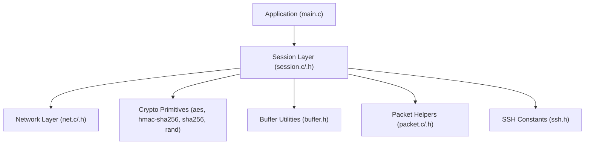

**Diagram sources**
- [main.c:1-214](file://src/main.c#L1-L214)
- [session.h:1-89](file://src/session.h#L1-L89)
- [session.c:1-363](file://src/session.c#L1-L363)
- [packet.h:1-28](file://src/packet.h#L1-L28)
- [packet.c:1-167](file://src/packet.c#L1-L167)
- [net.h:1-58](file://src/net.h#L1-L58)
- [net.c:1-177](file://src/net.c#L1-L177)
- [ssh.h:1-147](file://src/ssh.h#L1-L147)
- [buffer.h:1-50](file://src/buffer.h#L1-L50)

**Section sources**
- [main.c:1-214](file://src/main.c#L1-L214)
- [session.h:1-89](file://src/session.h#L1-L89)
- [session.c:1-363](file://src/session.c#L1-L363)
- [packet.h:1-28](file://src/packet.h#L1-L28)
- [packet.c:1-167](file://src/packet.c#L1-L167)
- [net.h:1-58](file://src/net.h#L1-L58)
- [net.c:1-177](file://src/net.c#L1-L177)
- [ssh.h:1-147](file://src/ssh.h#L1-L147)
- [buffer.h:1-50](file://src/buffer.h#L1-L50)

## Core Components
- ssh_session_t: Represents an SSH transport session, including sockets, version banners, KEXINIT payloads, session ID, and per-direction cipher/MAC state.
- ssh_direction_t: Per-direction state for encryption and MAC, including sequence numbers and key material.
- ssh_pkt_t: A parsed packet structure used by lower-level packet helpers.
- Network layer: Provides blocking read/write, line reading, listen/accept/connect, and error reporting.
- Buffer utilities: Provide typed serialization/deserialization for SSH payloads.
- SSH constants: Define message types, disconnect reasons, and limits like MAX_PACKET_SIZE.

Key responsibilities:
- Lifecycle: Initialize and free sessions; manage allocated resources.
- Identification: Validate and exchange SSH version banners.
- Key management: Install cipher and MAC keys per direction; activate encryption.
- Packet I/O: Send/receive framed packets with optional encryption and MAC verification.
- Sequence numbers: Maintain monotonic counters per direction across rekeys.

**Section sources**
- [session.h:19-56](file://src/session.h#L19-L56)
- [session.c:14-30](file://src/session.c#L14-L30)
- [packet.h:9-16](file://src/packet.h#L9-L16)
- [net.h:32-56](file://src/net.h#L32-L56)
- [buffer.h:8-47](file://src/buffer.h#L8-L47)
- [ssh.h:12-26](file://src/ssh.h#L12-L26)

## Architecture Overview
The session layer sits above the network layer and uses buffer utilities to build payloads. It integrates with cryptographic primitives to encrypt and authenticate packets. The packet helpers provide a lower-level interface for framing but are not required by the session layer’s public API.

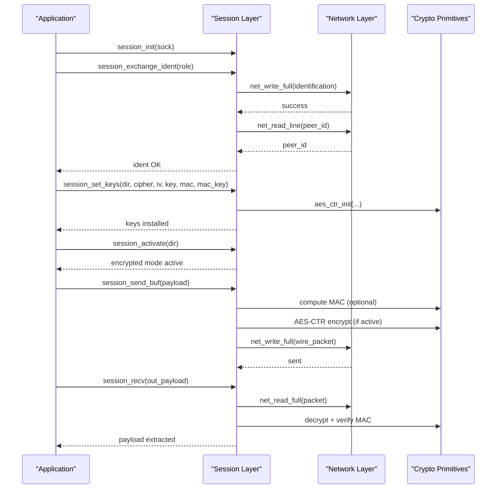

**Diagram sources**
- [session.c:83-126](file://src/session.c#L83-L126)
- [session.c:130-169](file://src/session.c#L130-L169)
- [session.c:196-256](file://src/session.c#L196-L256)
- [session.c:264-362](file://src/session.c#L264-L362)
- [net.c:127-160](file://src/net.c#L127-L160)

## Detailed Component Analysis

### Session Lifecycle and State Machine
- Initialization: session_init zeroes the session, stores the socket, and prepares both directions for plaintext.
- Cleanup: session_free releases stored KEXINIT payloads and resets lengths.
- Identification: session_ident_check validates an identification line per RFC 4253 §4.2; session_exchange_ident sends our identification, reads and validates the peer’s identification, and stores both V_C and V_S.
- Key installation: session_set_keys installs AES-CTR context and HMAC-SHA256 key material for a given direction; only supports aes128-ctr/aes256-ctr and hmac-sha2-256/none.
- Activation: session_activate flips the direction’s encrypted flag to true.
- Packet I/O: session_send and session_recv implement the binary packet protocol, handling padding, length fields, encryption, MAC computation/verification, and sequence numbers.

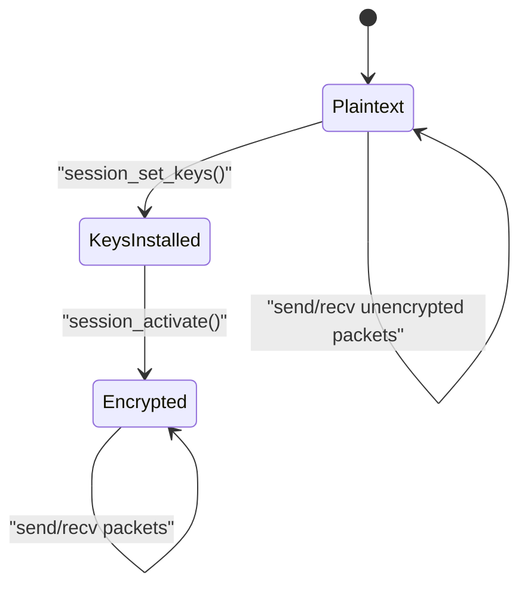

**Diagram sources**
- [session.c:14-30](file://src/session.c#L14-L30)
- [session.c:83-126](file://src/session.c#L83-L126)
- [session.c:130-169](file://src/session.c#L130-L169)
- [session.c:196-256](file://src/session.c#L196-L256)
- [session.c:264-362](file://src/session.c#L264-L362)

**Section sources**
- [session.h:19-87](file://src/session.h#L19-L87)
- [session.c:14-30](file://src/session.c#L14-L30)
- [session.c:83-126](file://src/session.c#L83-L126)
- [session.c:130-169](file://src/session.c#L130-L169)
- [session.c:196-256](file://src/session.c#L196-L256)
- [session.c:264-362](file://src/session.c#L264-L362)

### Version Banner Exchange and Identification Validation
- session_ident_check enforces:
  - Prefix “SSH-”
  - Protocol version “2.0” or “1.99”
  - Software version segment constraints
  - Optional comments section
  - Length limit including CR LF
- session_exchange_ident:
  - Sends IDENT_STRING (from ssh.h)
  - Reads lines until a valid SSH identification is found (with pre-banner skipping)
  - Stores v_c/v_s based on role (client/server)
  - Rejects invalid or too many junk lines

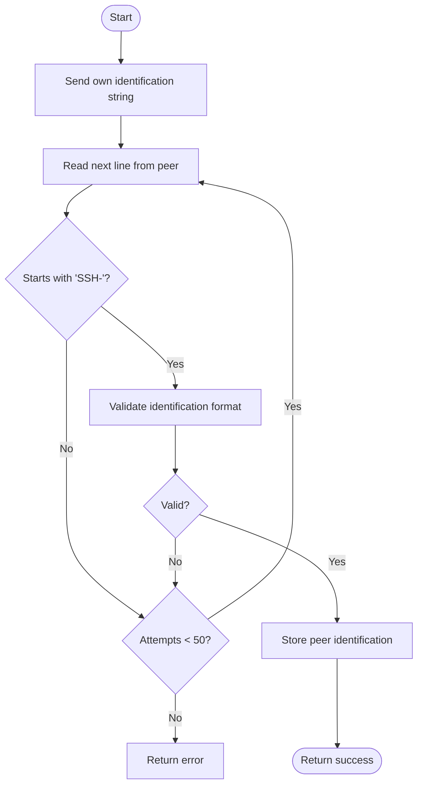

**Diagram sources**
- [session.c:34-81](file://src/session.c#L34-L81)
- [session.c:83-126](file://src/session.c#L83-L126)
- [ssh.h:7-10](file://src/ssh.h#L7-L10)

**Section sources**
- [session.c:34-81](file://src/session.c#L34-L81)
- [session.c:83-126](file://src/session.c#L83-L126)
- [ssh.h:7-10](file://src/ssh.h#L7-L10)

### Packet Encryption/Decryption APIs
- session_set_keys:
  - Validates cipher name (aes128-ctr, aes256-ctr)
  - Initializes AES-CTR context with IV and key
  - Accepts HMAC-SHA256 key or none
- session_activate:
  - Enables encryption for the direction
- session_send:
  - Builds wire frame: packet_length, padding_length, payload, padding
  - Computes MAC using HMAC-SHA256 over sequence number and unencrypted packet when MAC is enabled
  - Encrypts packet body with AES-CTR
  - Writes to socket and increments sequence number
- session_recv:
  - In plaintext mode: reads packet_length and body directly
  - In encrypted mode: reads first block, decrypts to learn packet_length, then reads rest and decrypts
  - Verifies MAC if enabled using sequence number and decrypted packet
  - Extracts payload and increments sequence number

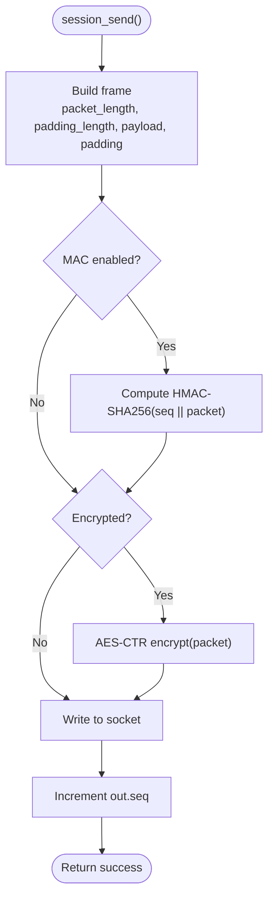

**Diagram sources**
- [session.c:130-169](file://src/session.c#L130-L169)
- [session.c:196-256](file://src/session.c#L196-L256)

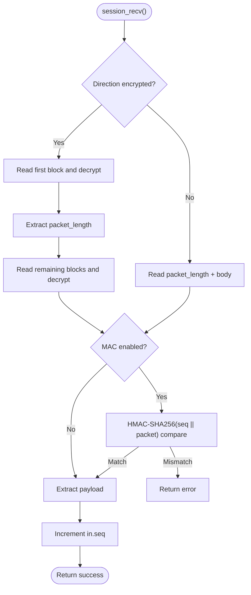

**Diagram sources**
- [session.c:264-362](file://src/session.c#L264-L362)

**Section sources**
- [session.c:130-169](file://src/session.c#L130-L169)
- [session.c:196-256](file://src/session.c#L196-L256)
- [session.c:264-362](file://src/session.c#L264-L362)

### Sequence Number Handling
- Each direction maintains a 32-bit sequence counter starting at zero.
- Sequence numbers are incremented after each successful send or receive operation.
- They are never reset across rekeys, per RFC 4253 §6.4.
- MAC computation includes the big-endian representation of the sequence number.

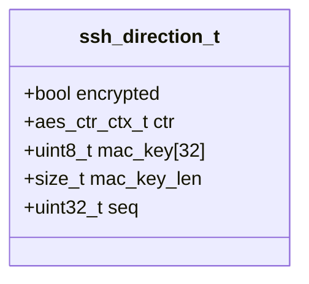

**Diagram sources**
- [session.h:27-33](file://src/session.h#L27-L33)
- [session.c:254-255](file://src/session.c#L254-L255)
- [session.c:360-361](file://src/session.c#L360-L361)

**Section sources**
- [session.h:27-33](file://src/session.h#L27-L33)
- [session.c:254-255](file://src/session.c#L254-L255)
- [session.c:360-361](file://src/session.c#L360-L361)

### Integration Patterns with Network and Cryptographic Layers
- Network layer:
  - Blocking I/O via net_read_full and net_write_full
  - Line-based reading via net_read_line for identification exchange
  - Platform abstraction for sockets and errors
- Cryptographic layer:
  - AES-CTR keystream initialization and encryption/decryption
  - HMAC-SHA256 for MAC computation and verification
  - Random padding generation via rand_bytes
- Buffer utilities:
  - Typed serialization/deserialization for SSH payloads
  - Used by application code to construct messages before sending through session_send_buf

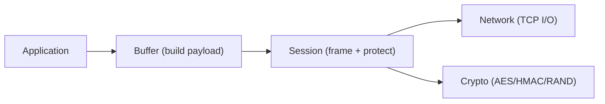

**Diagram sources**
- [net.h:32-56](file://src/net.h#L32-L56)
- [net.c:127-160](file://src/net.c#L127-L160)
- [buffer.h:29-47](file://src/buffer.h#L29-L47)
- [session.c:130-169](file://src/session.c#L130-L169)
- [session.c:196-256](file://src/session.c#L196-L256)
- [session.c:264-362](file://src/session.c#L264-L362)

**Section sources**
- [net.h:32-56](file://src/net.h#L32-L56)
- [net.c:127-160](file://src/net.c#L127-L160)
- [buffer.h:29-47](file://src/buffer.h#L29-L47)
- [session.c:130-169](file://src/session.c#L130-L169)
- [session.c:196-256](file://src/session.c#L196-L256)
- [session.c:264-362](file://src/session.c#L264-L362)

### Typical Session Workflows

#### Client Mode Workflow
1. Connect to server via net_connect.
2. Initialize session with session_init.
3. Perform version banner exchange via session_exchange_ident(SSH_ROLE_CLIENT).
4. Optionally install keys and activate encryption (not shown in main.c example).
5. Build a payload using buffer utilities and send via session_send_buf.
6. Receive response via session_recv and parse payload.
7. Clean up with session_free and close socket.

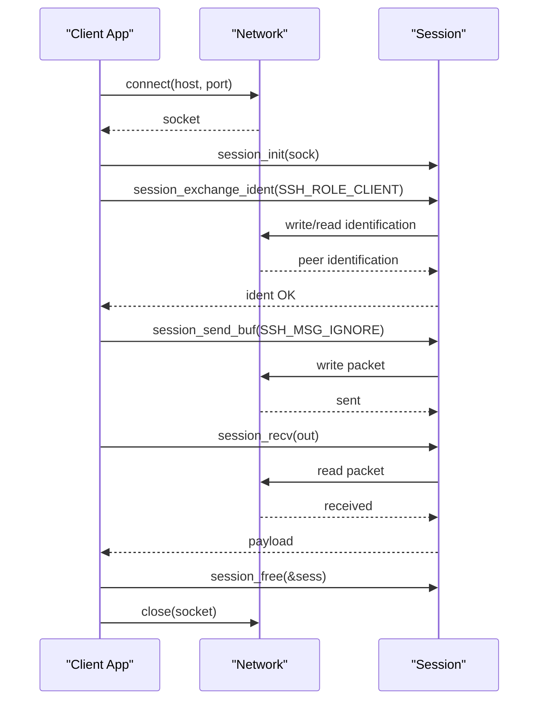

**Diagram sources**
- [main.c:156-213](file://src/main.c#L156-L213)
- [session.c:83-126](file://src/session.c#L83-L126)
- [session.c:196-256](file://src/session.c#L196-L256)
- [session.c:264-362](file://src/session.c#L264-L362)

#### Server Mode Workflow
1. Listen and accept connections via net_listen/net_accept.
2. Initialize session with session_init.
3. Perform version banner exchange via session_exchange_ident(SSH_ROLE_SERVER).
4. Receive first packet in plaintext phase.
5. Optionally respond with a debug message using session_send_buf.
6. Clean up with session_free and close sockets.

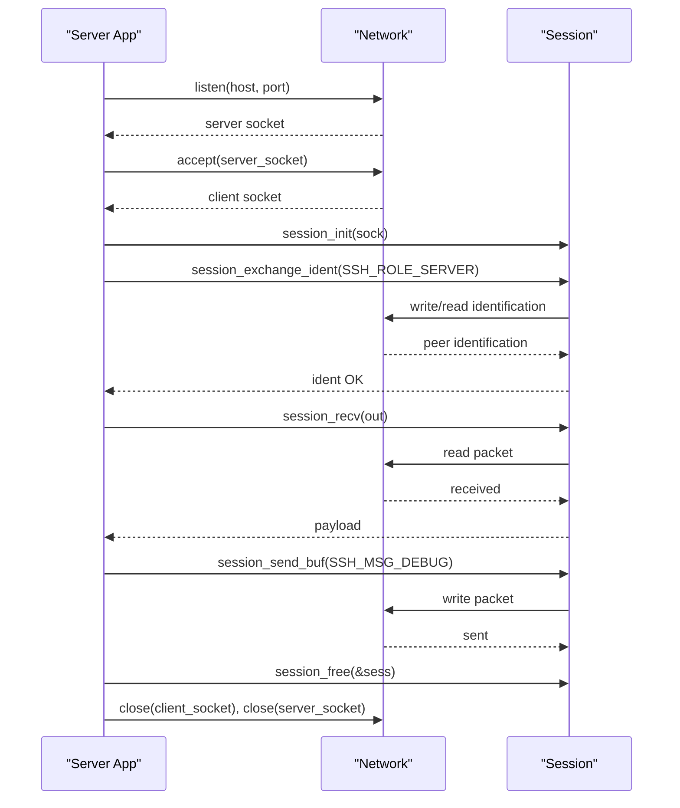

**Diagram sources**
- [main.c:93-153](file://src/main.c#L93-L153)
- [session.c:83-126](file://src/session.c#L83-L126)
- [session.c:196-256](file://src/session.c#L196-L256)
- [session.c:264-362](file://src/session.c#L264-L362)

**Section sources**
- [main.c:93-153](file://src/main.c#L93-L153)
- [main.c:156-213](file://src/main.c#L156-L213)

## Dependency Analysis
- session.c depends on:
  - sha256.h for HMAC-SHA256 and digest size
  - rand.h for random padding
  - ssh.h for message numbers and constants
  - net.h for socket I/O
  - buffer.h for payload buffers
- packet.c depends on:
  - buffer.h for payload storage
  - rand.h for random padding
  - ssh.h for packet size limits
- net.c provides platform-independent TCP I/O used by session and packet layers.

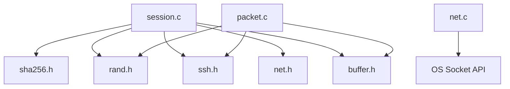

**Diagram sources**
- [session.c:1-6](file://src/session.c#L1-L6)
- [packet.c:1-5](file://src/packet.c#L1-L5)
- [net.c:1-17](file://src/net.c#L1-L17)

**Section sources**
- [session.c:1-6](file://src/session.c#L1-L6)
- [packet.c:1-5](file://src/packet.c#L1-L5)
- [net.c:1-17](file://src/net.c#L1-L17)

## Performance Considerations
- CTR mode encryption is stream-based and allows in-place encryption, minimizing memory copies.
- MAC computation occurs before encryption to avoid redundant operations.
- Padding calculation ensures minimal overhead while meeting RFC requirements.
- Sequence numbers are simple 32-bit counters; overflow behavior is not explicitly handled in this implementation.
- Buffer reuse via buf_reset reduces allocations during repeated packet processing.

[No sources needed since this section provides general guidance]

## Troubleshooting Guide
Common issues and strategies:
- Identification exchange failures:
  - Ensure peer sends a valid SSH identification line within the allowed attempts.
  - Validate local IDENT_STRING format and length.
- Packet receive errors:
  - Check packet_length bounds and alignment to block size.
  - Verify MAC if enabled; mismatch indicates tampering or key misconfiguration.
- Network I/O errors:
  - Use net_get_error to retrieve platform-specific error messages.
  - Handle partial reads/writes; session layer uses blocking full-read/full-write helpers.
- Resource leaks:
  - Always call session_free to release KEXINIT payloads.
  - Free buffer objects after use.

**Section sources**
- [session.c:83-126](file://src/session.c#L83-L126)
- [session.c:264-362](file://src/session.c#L264-L362)
- [net.c:162-177](file://src/net.c#L162-L177)
- [session.c:21-30](file://src/session.c#L21-L30)

## Conclusion
The Coalesce session management API provides a robust, RFC-compliant transport layer for SSH. It handles version banner exchange, key installation and activation, binary packet framing, encryption, MAC verification, and sequence numbering. The design cleanly separates concerns between networking, cryptography, and session state, enabling straightforward integration for both client and server modes. Proper error handling and resource management ensure reliable operation across platforms.

[No sources needed since this section summarizes without analyzing specific files]