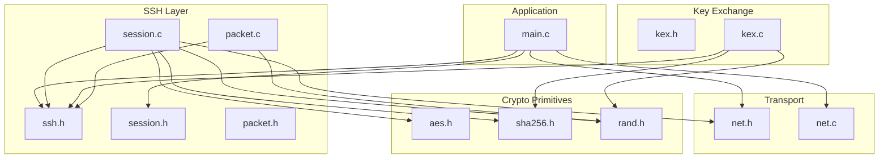
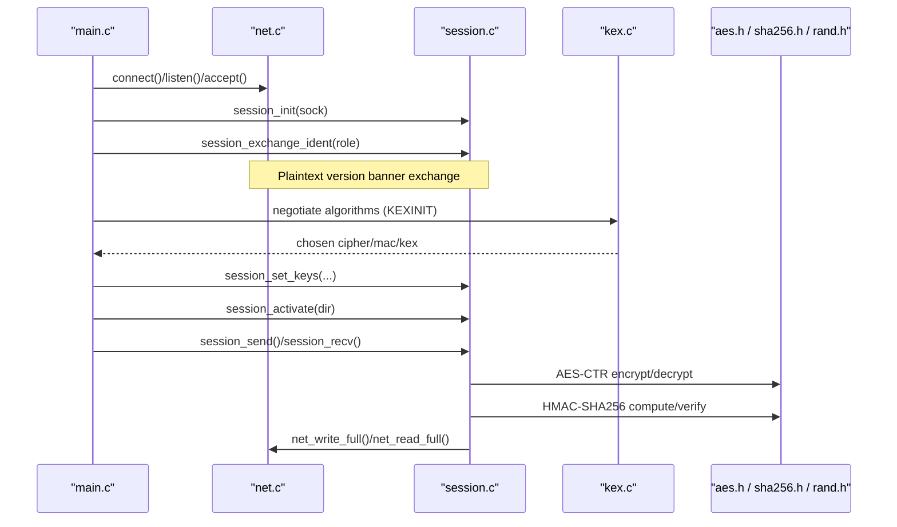
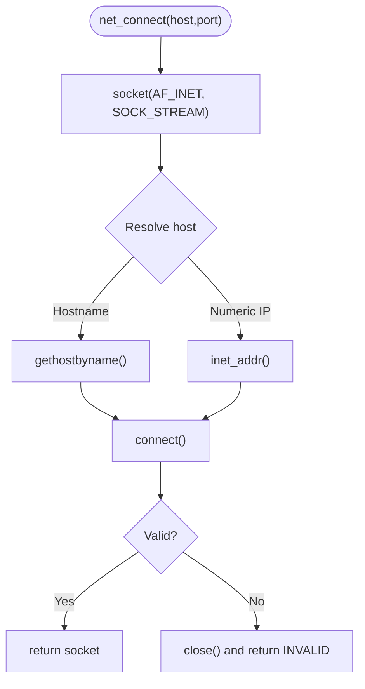
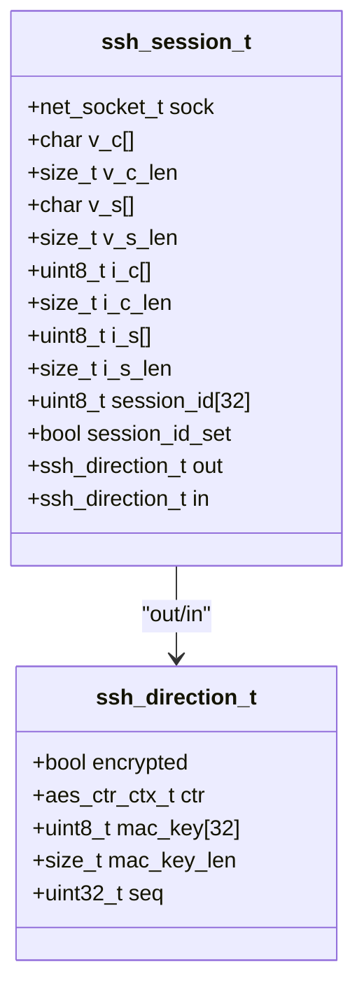
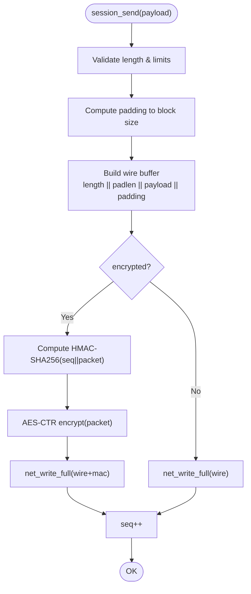
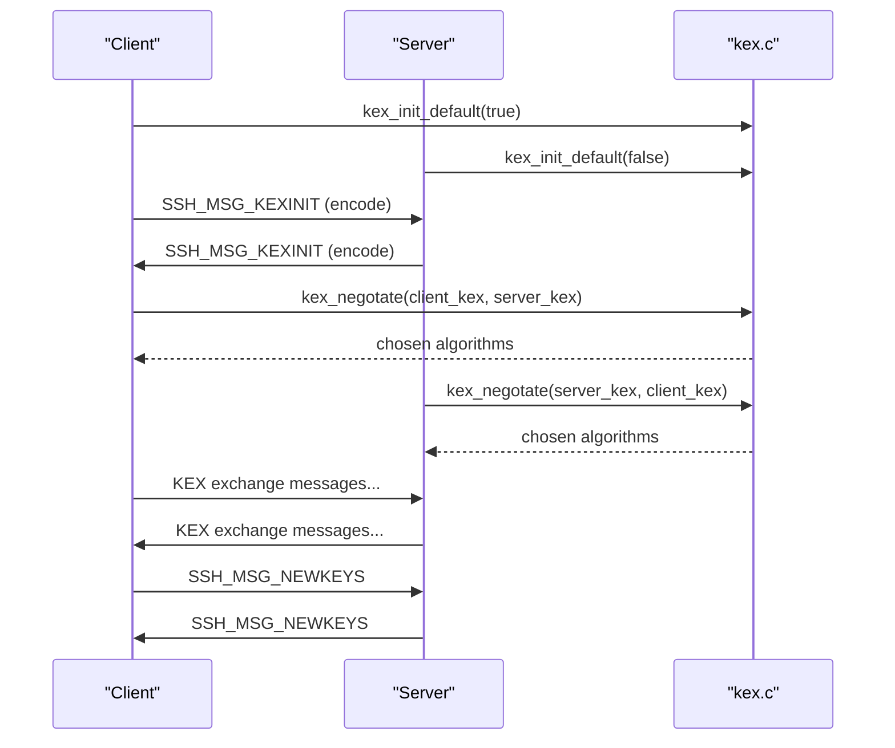
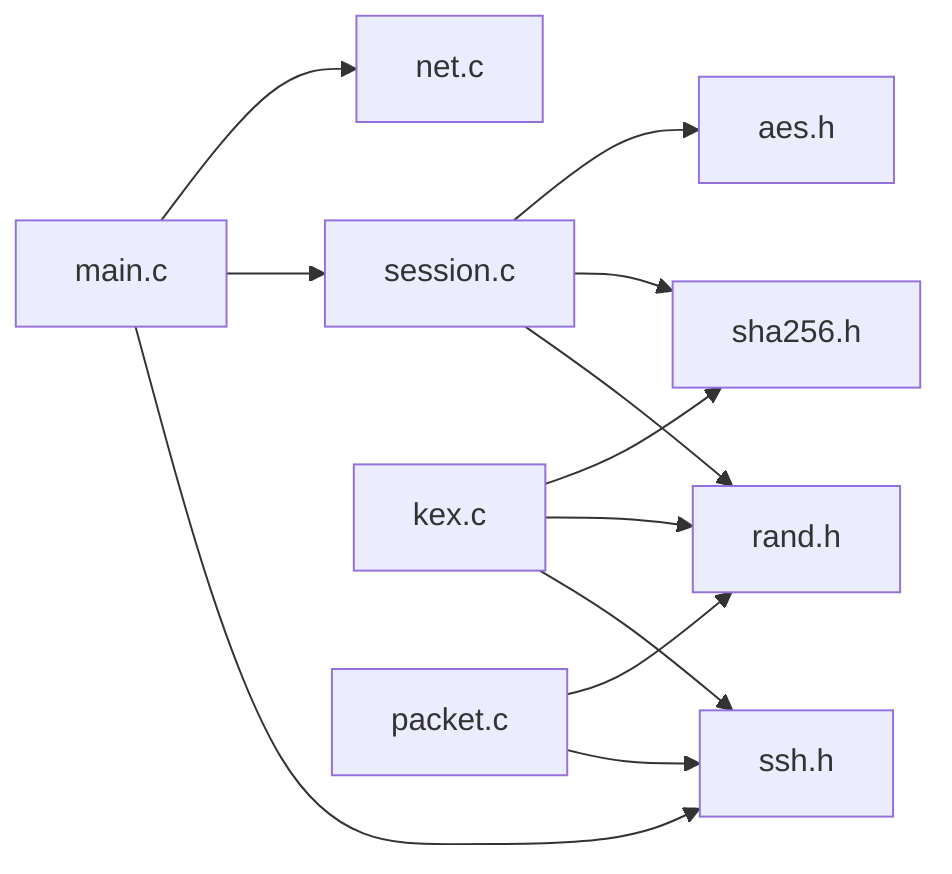

# Architecture Overview

<cite>
**Referenced Files in This Document**
- [main.c](file://src/main.c)
- [net.h](file://src/net.h)
- [net.c](file://src/net.c)
- [ssh.h](file://src/ssh.h)
- [session.h](file://src/session.h)
- [session.c](file://src/session.c)
- [packet.h](file://src/packet.h)
- [packet.c](file://src/packet.c)
- [kex.h](file://src/kex.h)
- [kex.c](file://src/kex.c)
- [buffer.h](file://src/buffer.h)
- [aes.h](file://src/aes.h)
- [sha256.h](file://src/sha256.h)
- [rand.h](file://src/rand.h)
</cite>

## Table of Contents
1. [Introduction](#introduction)
2. [Project Structure](#project-structure)
3. [Core Components](#core-components)
4. [Architecture Overview](#architecture-overview)
5. [Detailed Component Analysis](#detailed-component-analysis)
6. [Dependency Analysis](#dependency-analysis)
7. [Performance Considerations](#performance-considerations)
8. [Troubleshooting Guide](#troubleshooting-guide)
9. [Conclusion](#conclusion)

## Introduction
This document describes the architectural design of the Coalesce SSH implementation. It follows a layered architecture with clear separation between:
- Network I/O (TCP sockets and line/full reads/writes)
- Session management (SSH transport session, identification exchange, packet framing)
- Cryptographic primitives (AES-CTR, HMAC-SHA256, SHA-256, random bytes)
- Protocol handling (message numbers, KEX negotiation, key derivation)

The system uses:
- State machine pattern for session management (plaintext vs encrypted per direction, sequence counters)
- RAII-like pattern via explicit init/free pairs for sessions, buffers, and KEX structures
- Factory-like algorithm negotiation through KEXINIT encode/decode and proposal matching

## Project Structure
The codebase is organized by functional layers:
- Entry point and CLI: main.c
- Transport layer: net.h/net.c
- SSH protocol definitions: ssh.h
- Session and binary packet protocol: session.h/session.c
- Packet abstraction (optional): packet.h/packet.c
- Key exchange and negotiation: kex.h/kex.c
- Utilities: buffer.h, aes.h, sha256.h, rand.h

**Diagram sources**
- [main.c:1-214](file://src/main.c#L1-L214)
- [net.h:1-58](file://src/net.h#L1-L58)
- [net.c:1-177](file://src/net.c#L1-L177)
- [ssh.h:1-147](file://src/ssh.h#L1-L147)
- [session.h:1-89](file://src/session.h#L1-L89)
- [session.c:1-363](file://src/session.c#L1-L363)
- [packet.h:1-28](file://src/packet.h#L1-L28)
- [packet.c:1-167](file://src/packet.c#L1-L167)
- [kex.h:1-52](file://src/kex.h#L1-L52)
- [kex.c:1-230](file://src/kex.c#L1-L230)
- [buffer.h:1-50](file://src/buffer.h#L1-L50)
- [aes.h:1-38](file://src/aes.h#L1-L38)
- [sha256.h:1-39](file://src/sha256.h#L1-L39)
- [rand.h:1-13](file://src/rand.h#L1-L13)

**Section sources**
- [main.c:1-214](file://src/main.c#L1-L214)
- [net.h:1-58](file://src/net.h#L1-L58)
- [ssh.h:1-147](file://src/ssh.h#L1-L147)

## Core Components
- Network I/O: Provides socket lifecycle, connect/listen/accept, full read/write, and line reading.
- SSH Session: Implements RFC 4253 identification exchange, binary packet framing, encryption (AES-CTR), MAC (HMAC-SHA256), and per-direction state.
- Key Exchange: Encodes/decodes KEXINIT, negotiates algorithms, and derives keys per RFC 4253 §7.2.
- Crypto Primitives: AES-CTR streaming, HMAC-SHA256, SHA-256, and secure random generation.
- Buffer Utility: Dynamic buffer with typed readers/writers used across layers.

Key responsibilities and interactions:
- main.c orchestrates server/client flows using session APIs over net_* sockets.
- session.c handles plaintext and encrypted packet I/O, maintaining sequence numbers and activation flags.
- kex.c provides algorithm negotiation and key derivation; session.c installs derived keys into directions.
- packet.c offers an alternative packet framing API that does not apply crypto (used as a lower-level helper).

**Section sources**
- [net.h:1-58](file://src/net.h#L1-L58)
- [net.c:1-177](file://src/net.c#L1-L177)
- [session.h:1-89](file://src/session.h#L1-L89)
- [session.c:1-363](file://src/session.c#L1-L363)
- [kex.h:1-52](file://src/kex.h#L1-L52)
- [kex.c:1-230](file://src/kex.c#L1-L230)
- [buffer.h:1-50](file://src/buffer.h#L1-L50)
- [aes.h:1-38](file://src/aes.h#L1-L38)
- [sha256.h:1-39](file://src/sha256.h#L1-L39)
- [rand.h:1-13](file://src/rand.h#L1-L13)

## Architecture Overview
The system implements a layered design:
- Application layer (main.c) drives client/server workflows.
- Transport layer (net.*) abstracts TCP operations.
- SSH session layer (session.*) manages identification, packet framing, and cryptographic protection.
- Key exchange layer (kex.*) negotiates algorithms and derives keys.
- Crypto layer (aes.*, sha256.*, rand.*) provides building blocks.

**Diagram sources**
- [main.c:93-214](file://src/main.c#L93-L214)
- [net.c:39-177](file://src/net.c#L39-L177)
- [session.c:83-169](file://src/session.c#L83-L169)
- [session.c:196-363](file://src/session.c#L196-L363)
- [kex.c:25-174](file://src/kex.c#L25-L174)
- [aes.h:17-35](file://src/aes.h#L17-L35)
- [sha256.h:19-36](file://src/sha256.h#L19-L36)
- [rand.h:7-10](file://src/rand.h#L7-L10)

## Detailed Component Analysis

### Network I/O Layer
Responsibilities:
- Initialize and shutdown platform networking.
- Provide blocking full-read/full-write and line reading.
- Abstract socket creation, binding, listening, accepting, connecting, and closing.

Design notes:
- Cross-platform abstractions via macros and conditional includes.
- Error reporting via net_get_error().

**Diagram sources**
- [net.c:75-98](file://src/net.c#L75-L98)

**Section sources**
- [net.h:1-58](file://src/net.h#L1-L58)
- [net.c:1-177](file://src/net.c#L1-L177)

### SSH Session Layer
Responsibilities:
- Identification exchange with hardening (RFC 4253 §4.2).
- Binary packet framing (RFC 4253 §6).
- Per-direction encryption (AES-CTR) and MAC (HMAC-SHA256).
- Sequence number management and activation gating.

State model:
- Each direction has encrypted flag, keystream context, MAC key, and sequence counter.
- Activation occurs after NEWKEYS; until then, packets are plaintext.

**Diagram sources**
- [session.h:19-56](file://src/session.h#L19-L56)

Packet send/receive flow:

**Diagram sources**
- [session.c:196-256](file://src/session.c#L196-L256)
- [session.c:264-363](file://src/session.c#L264-L363)
- [aes.h:17-35](file://src/aes.h#L17-L35)
- [sha256.h:19-36](file://src/sha256.h#L19-L36)

**Section sources**
- [session.h:1-89](file://src/session.h#L1-L89)
- [session.c:1-363](file://src/session.c#L1-L363)

### Key Exchange and Negotiation
Responsibilities:
- Construct and parse KEXINIT messages.
- Match algorithm lists from both sides.
- Derive keys per RFC 4253 §7.2.

Negotiation flow:

**Diagram sources**
- [kex.c:25-174](file://src/kex.c#L25-L174)
- [kex.c:192-229](file://src/kex.c#L192-L229)
- [ssh.h:24-31](file://src/ssh.h#L24-L31)

**Section sources**
- [kex.h:1-52](file://src/kex.h#L1-L52)
- [kex.c:1-230](file://src/kex.c#L1-L230)

### Packet Abstraction Layer
Responsibilities:
- Provide a generic packet structure and helpers for length/padding calculations.
- Offer send/recv functions without built-in crypto (useful for testing or lower-layer framing).

Notes:
- The session layer implements its own optimized send/recv with crypto; packet.* can be used where raw framing is needed.

**Section sources**
- [packet.h:1-28](file://src/packet.h#L1-L28)
- [packet.c:1-167](file://src/packet.c#L1-L167)

### Application Entrypoint
Responsibilities:
- Parse CLI arguments and dispatch to server or client mode.
- Initialize network subsystem, run session flows, and clean up.

Flow highlights:
- Server: listen -> accept -> session_init -> identification exchange -> receive/send test packet -> free/close.
- Client: connect -> session_init -> identification exchange -> send IGNORE -> receive DEBUG -> free/close.

**Section sources**
- [main.c:1-214](file://src/main.c#L1-L214)

## Dependency Analysis
High-level dependencies:
- main.c depends on net.*, ssh.h, session.h.
- session.c depends on net.*, aes.*, sha256.*, rand.*, ssh.h.
- kex.c depends on ssh.h, sha256.*, rand.*.
- packet.c depends on ssh.h, rand.*.
- All modules use buffer utilities for serialization.

**Diagram sources**
- [main.c:1-214](file://src/main.c#L1-L214)
- [session.c:1-363](file://src/session.c#L1-L363)
- [kex.c:1-230](file://src/kex.c#L1-L230)
- [packet.c:1-167](file://src/packet.c#L1-L167)
- [ssh.h:1-147](file://src/ssh.h#L1-L147)

**Section sources**
- [main.c:1-214](file://src/main.c#L1-L214)
- [session.c:1-363](file://src/session.c#L1-L363)
- [kex.c:1-230](file://src/kex.c#L1-L230)
- [packet.c:1-167](file://src/packet.c#L1-L167)

## Performance Considerations
- Use AES-CTR for streaming encryption/decryption to avoid block alignment overhead.
- Compute MAC before encryption to minimize data copies during send path.
- Reuse buffers where possible to reduce allocations in hot paths.
- Avoid unnecessary string conversions; prefer direct byte operations for packet fields.
- Ensure non-blocking I/O is considered if scaling beyond single connection.

## Troubleshooting Guide
Common issues and diagnostics:
- Identification exchange failures: check version string validation and pre-banner skipping logic.
- Packet length or padding errors: validate packet_length bounds and padding constraints.
- MAC verification failure: indicates tampering or key mismatch; disconnect immediately.
- Network errors: use net_get_error() to log OS-specific error details.
- Resource leaks: ensure session_free(), buf_free(), and kex_init_free() are called on all paths.

Recommendations:
- Log message types and sequence numbers around send/recv boundaries.
- Add assertions for invariant checks (e.g., packet_length alignment, padding ranges).
- Centralize error propagation with consistent codes and cleanup helpers.

**Section sources**
- [session.c:42-126](file://src/session.c#L42-L126)
- [session.c:196-363](file://src/session.c#L196-L363)
- [net.c:162-177](file://src/net.c#L162-L177)

## Conclusion
Coalesce’s SSH implementation cleanly separates concerns across network I/O, session management, cryptography, and protocol handling. The stateful session model ensures correct sequencing and protection transitions, while KEX negotiation provides a factory-like mechanism for algorithm selection. RAII-style init/free patterns help manage resources deterministically. The design supports extension points for additional ciphers, MACs, and key exchange methods, while maintaining strict adherence to RFC 4253 framing and security requirements.