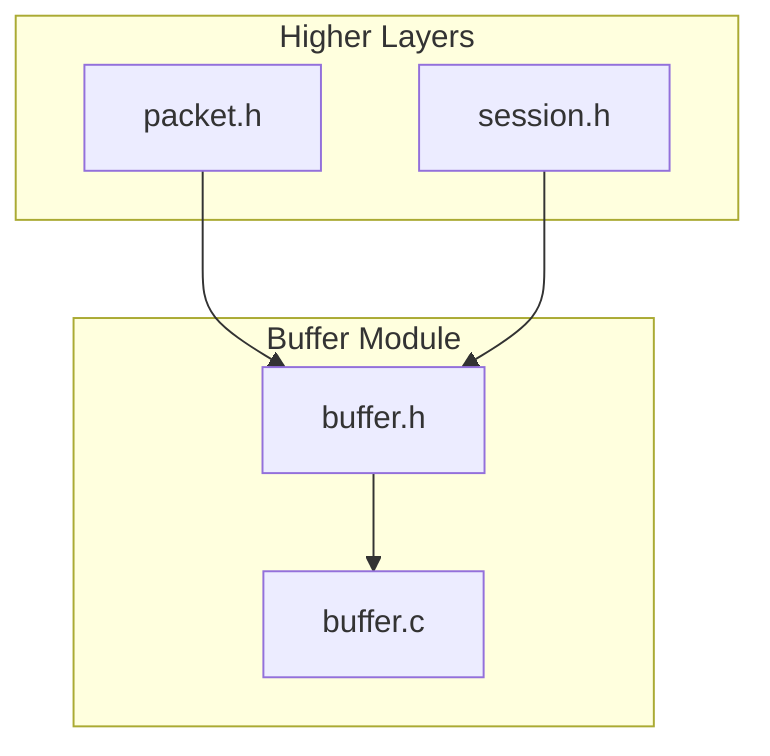
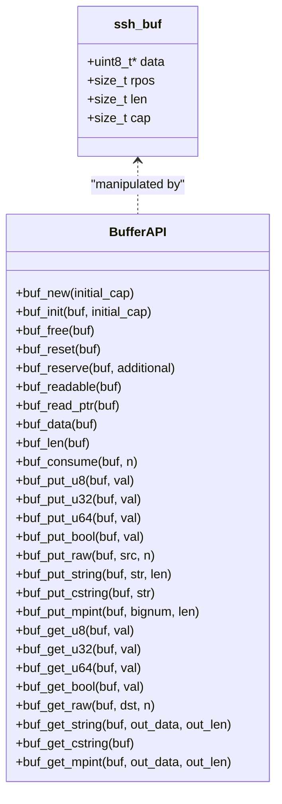
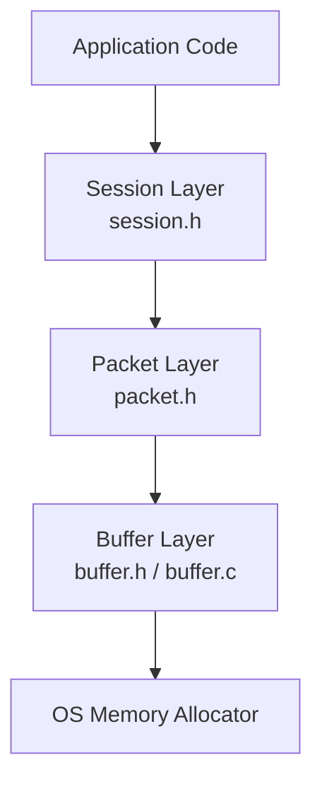
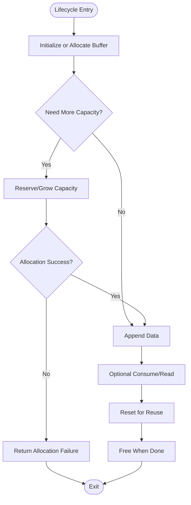
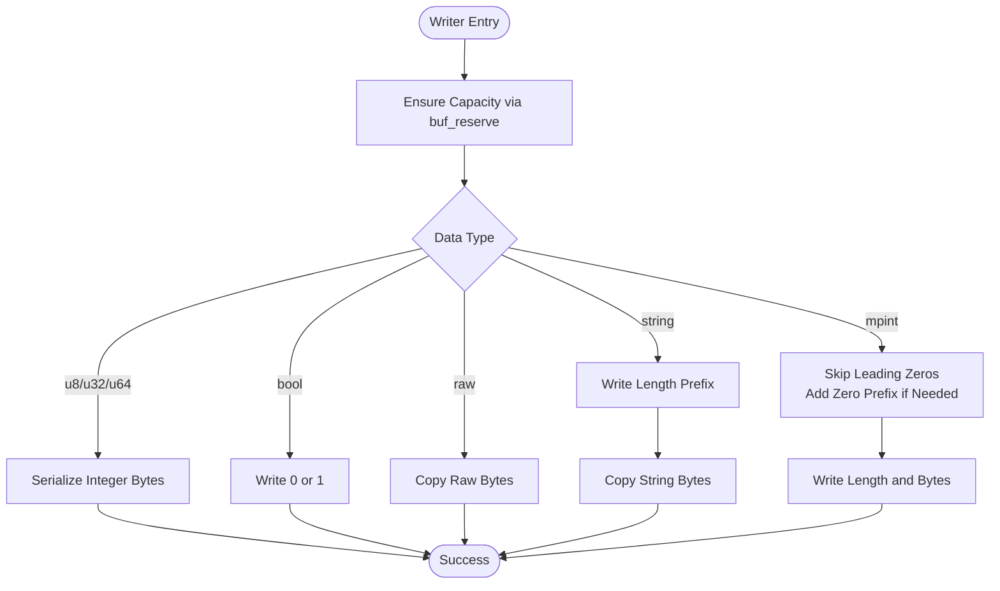
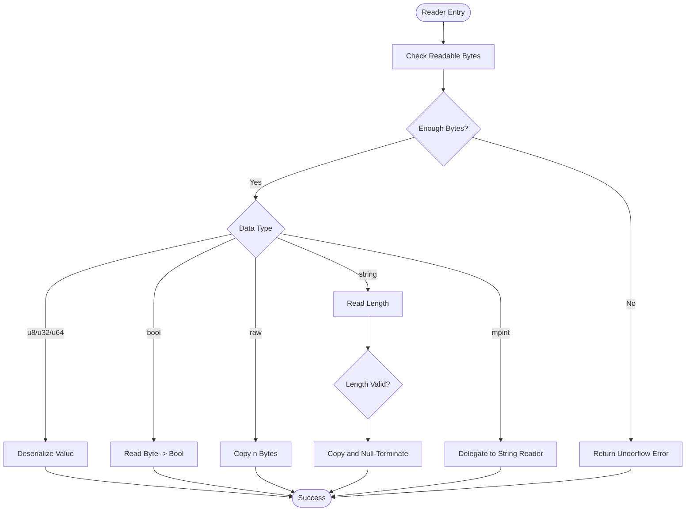
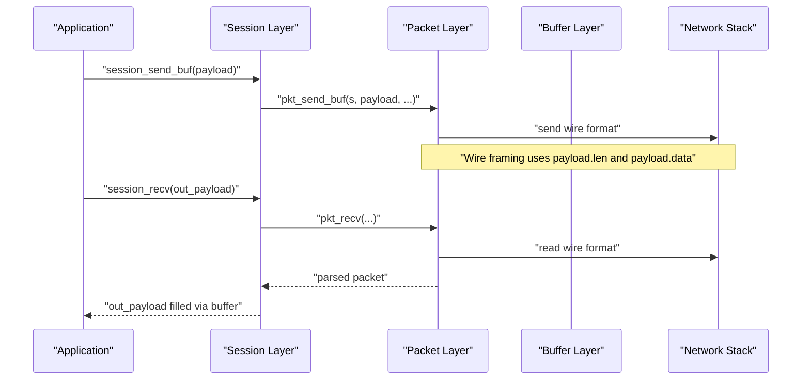
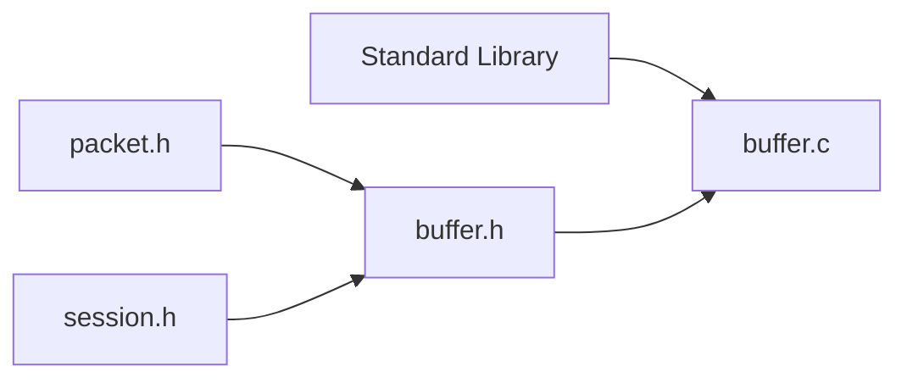

# Buffer Management System

<cite>
**Referenced Files in This Document**
- [buffer.h](file://src/buffer.h)
- [buffer.c](file://src/buffer.c)
- [packet.h](file://src/packet.h)
- [session.h](file://src/session.h)
- [test_phase1.c](file://tests/test_phase1.c)
</cite>

## Table of Contents
1. [Introduction](#introduction)
2. [Project Structure](#project-structure)
3. [Core Components](#core-components)
4. [Architecture Overview](#architecture-overview)
5. [Detailed Component Analysis](#detailed-component-analysis)
6. [Dependency Analysis](#dependency-analysis)
7. [Performance Considerations](#performance-considerations)
8. [Troubleshooting Guide](#troubleshooting-guide)
9. [Conclusion](#conclusion)

## Introduction
This document explains the buffer management system used to build and parse SSH protocol messages with dynamic memory allocation, type-safe serialization, and robust error handling. It focuses on the `ssh_buf_t` structure, its lifecycle (creation, initialization, resizing, reset, and cleanup), and the typed read/write APIs that provide overflow protection and automatic expansion. It also covers serialization for integers, booleans, strings, raw binary data, and SSH-style multi-precision integers, along with deserialization using bounds checking. Finally, it provides usage patterns, memory reuse strategies, and debugging techniques for buffer-related issues.

## Project Structure
The buffer subsystem is implemented in a small, focused module:
- Public API and data model are declared in `buffer.h`.
- Implementation details, including memory management and serialization logic, reside in `buffer.c`.
- Higher-level components such as packet framing and session I/O consume this buffer API.

**Diagram sources**
- [buffer.h:1-50](file://src/buffer.h#L1-L50)
- [buffer.c:1-272](file://src/buffer.c#L1-L272)
- [packet.h:1-28](file://src/packet.h#L1-L28)
- [session.h:1-89](file://src/session.h#L1-L89)

**Section sources**
- [buffer.h:1-50](file://src/buffer.h#L1-L50)
- [buffer.c:1-272](file://src/buffer.c#L1-L272)
- [packet.h:1-28](file://src/packet.h#L1-L28)
- [session.h:1-89](file://src/session.h#L1-L89)

## Core Components
At the center of the system is the `ssh_buf_t` structure, which encapsulates:
- A dynamically allocated byte array (`data`)
- The current write length (`len`)
- The total allocated capacity (`cap`)
- The current read position (`rpos`)

Key responsibilities:
- Lifecycle management: allocate, initialize, resize, reset, and free buffers safely.
- Type-safe writers: append integers, booleans, strings, raw bytes, and SSH mpints with automatic capacity growth.
- Type-safe readers: extract values with strict bounds checking and safe pointer accessors.

**Diagram sources**
- [buffer.h:8-47](file://src/buffer.h#L8-L47)
- [buffer.c:7-271](file://src/buffer.c#L7-L271)

**Section sources**
- [buffer.h:8-47](file://src/buffer.h#L8-L47)
- [buffer.c:7-271](file://src/buffer.c#L7-L271)

## Architecture Overview
The buffer layer sits below packet framing and session I/O. It provides a stable, type-safe interface for building payloads and parsing received data.

**Diagram sources**
- [session.h:82-86](file://src/session.h#L82-L86)
- [packet.h:9-26](file://src/packet.h#L9-L26)
- [buffer.h:8-47](file://src/buffer.h#L8-L47)

## Detailed Component Analysis

### Buffer Lifecycle and Memory Management
- Creation and initialization:
  - `buf_new` allocates an `ssh_buf_t` and initializes it with a minimum-capacity guarantee.
  - `buf_init` ensures a minimum capacity, allocates the underlying buffer, and sets initial state.
- Resizing:
  - `buf_reserve` grows capacity geometrically (doubling) when needed, ensuring sufficient space for writes.
- Resetting:
  - `buf_reset` clears logical length and read position without freeing memory, enabling efficient reuse.
- Cleanup:
  - `buf_free` releases the underlying memory and resets all fields to safe defaults.

**Diagram sources**
- [buffer.c:7-65](file://src/buffer.c#L7-L65)
- [buffer.c:42-47](file://src/buffer.c#L42-L47)
- [buffer.c:30-40](file://src/buffer.c#L30-L40)

**Section sources**
- [buffer.c:7-65](file://src/buffer.c#L7-L65)
- [buffer.c:30-47](file://src/buffer.c#L30-L47)

### Type-Safe Writers and Automatic Expansion
Writers ensure enough capacity before writing and serialize data in network byte order where applicable:
- Integers:
  - `buf_put_u8`, `buf_put_u32`, `buf_put_u64` serialize values with explicit big-endian ordering for multi-byte types.
- Boolean:
  - `buf_put_bool` serializes as a single byte (true/false).
- Raw binary:
  - `buf_put_raw` copies arbitrary bytes into the buffer after ensuring capacity.
- Strings:
  - `buf_put_string` writes a length-prefixed string per SSH conventions.
  - `buf_put_cstring` handles C-style null-terminated strings.
- Multi-precision integers:
  - `buf_put_mpint` follows SSH rules: skips leading zeros, adds a zero prefix if the most significant bit is set, and encodes the length.

**Diagram sources**
- [buffer.c:98-180](file://src/buffer.c#L98-L180)

**Section sources**
- [buffer.c:98-180](file://src/buffer.c#L98-L180)

### Type-Safe Readers and Bounds Checking
Readers validate available data before extracting values:
- Integers:
  - `buf_get_u8`, `buf_get_u32`, `buf_get_u64` check readable bytes and assemble values from big-endian wire format.
- Boolean:
  - `buf_get_bool` reads a byte and converts to boolean.
- Raw binary:
  - `buf_get_raw` copies exactly `n` bytes if available.
- Strings:
  - `buf_get_string` reads a length-prefixed string, allocates output memory, and returns a null-terminated copy.
- Multi-precision integers:
  - `buf_get_mpint` delegates to string extraction, returning the serialized mpint payload.

**Diagram sources**
- [buffer.c:184-271](file://src/buffer.c#L184-L271)

**Section sources**
- [buffer.c:184-271](file://src/buffer.c#L184-L271)

### Integration with Packet and Session Layers
- Packet layer:
  - Uses `ssh_buf_t` to represent payloads and forwards them to the network stack.
- Session layer:
  - Exposes high-level send/receive functions that operate over buffers, abstracting encryption/MAC concerns while relying on the buffer API for payload construction and consumption.

**Diagram sources**
- [session.h:82-86](file://src/session.h#L82-L86)
- [packet.h:23-26](file://src/packet.h#L23-L26)

**Section sources**
- [session.h:82-86](file://src/session.h#L82-L86)
- [packet.h:23-26](file://src/packet.h#L23-L26)

## Dependency Analysis
The buffer module has minimal external dependencies and is consumed by higher layers:
- Internal dependencies:
  - `buffer.c` depends only on standard library headers for memory and string operations.
- External consumers:
  - `packet.h` includes `buffer.h` and uses `ssh_buf_t` within `ssh_pkt_t`.
  - `session.h` includes `buffer.h` and exposes functions that accept or return `ssh_buf_t`.

**Diagram sources**
- [buffer.c:1-3](file://src/buffer.c#L1-L3)
- [packet.h:1-7](file://src/packet.h#L1-L7)
- [session.h:1-11](file://src/session.h#L1-L11)

**Section sources**
- [buffer.c:1-3](file://src/buffer.c#L1-L3)
- [packet.h:1-7](file://src/packet.h#L1-L7)
- [session.h:1-11](file://src/session.h#L1-L11)

## Performance Considerations
- Geometric growth:
  - Capacity doubles on demand, reducing reallocation frequency during large message builds.
- Minimum capacity:
  - A minimum initial capacity avoids excessive small allocations.
- Efficient reuse:
  - `buf_reset` allows reusing the same buffer across multiple messages without reallocating memory.
- Serialization efficiency:
  - Writers compute required capacity once and then perform contiguous writes, minimizing overhead.
- Large messages:
  - For very large payloads, pre-reserving capacity can reduce reallocations; however, the default doubling strategy typically performs well in practice.

[No sources needed since this section provides general guidance]

## Troubleshooting Guide
Common issues and how to diagnose them:
- Allocation failures:
  - Writers return failure codes when `buf_reserve` cannot grow the buffer. Check return values and handle errors gracefully.
- Underflows:
  - Readers return failure codes when insufficient bytes are available. Ensure you check readable counts or return codes before consuming data.
- Incorrect offsets:
  - Use `buf_len` and `buf_readable` to verify buffer state. Misaligned reads/writes often indicate incorrect offset management.
- Memory leaks:
  - Always pair `buf_init`/`buf_new` with `buf_free`. For string getters that allocate memory, ensure callers free returned pointers.
- Debugging tips:
  - Inspect `buf_len`, `buf_rpos`, and `buf_cap` to understand buffer state.
  - Compare expected vs actual lengths for strings and mpints.
  - Use unit tests to validate round-trip behavior for each data type.

**Section sources**
- [buffer.c:49-65](file://src/buffer.c#L49-L65)
- [buffer.c:67-94](file://src/buffer.c#L67-L94)
- [buffer.c:184-271](file://src/buffer.c#L184-L271)

## Conclusion
The buffer management system provides a robust foundation for SSH message serialization and deserialization. Its design emphasizes safety through bounds checking, automatic capacity growth, and clear lifecycle management. By leveraging the typed APIs and following the recommended usage patterns, developers can build and parse SSH protocol messages reliably while maintaining strong memory safety guarantees.

[No sources needed since this section summarizes without analyzing specific files]

## Appendices

### Usage Patterns and Examples
- Building a message:
  - Initialize a buffer, append message-type and fields using typed writers, then pass the buffer to the session or packet layer.
- Parsing a message:
  - Initialize a buffer, receive data into it, then use typed readers to extract fields in order, checking return codes at each step.
- Reusing buffers:
  - After processing, call `buf_reset` to reuse the same buffer for subsequent messages, avoiding repeated allocations.
- Unit test references:
  - See the test suite for examples of primitive types, strings, and mpints round-tripping.

**Section sources**
- [test_phase1.c:8-80](file://tests/test_phase1.c#L8-L80)