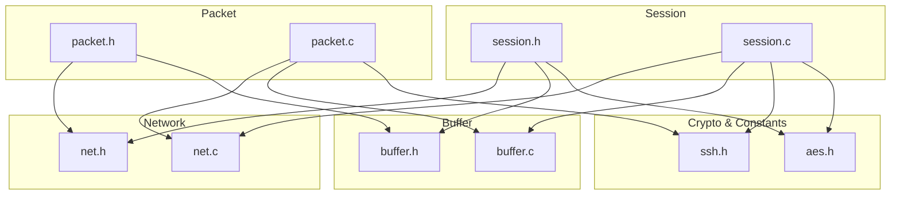
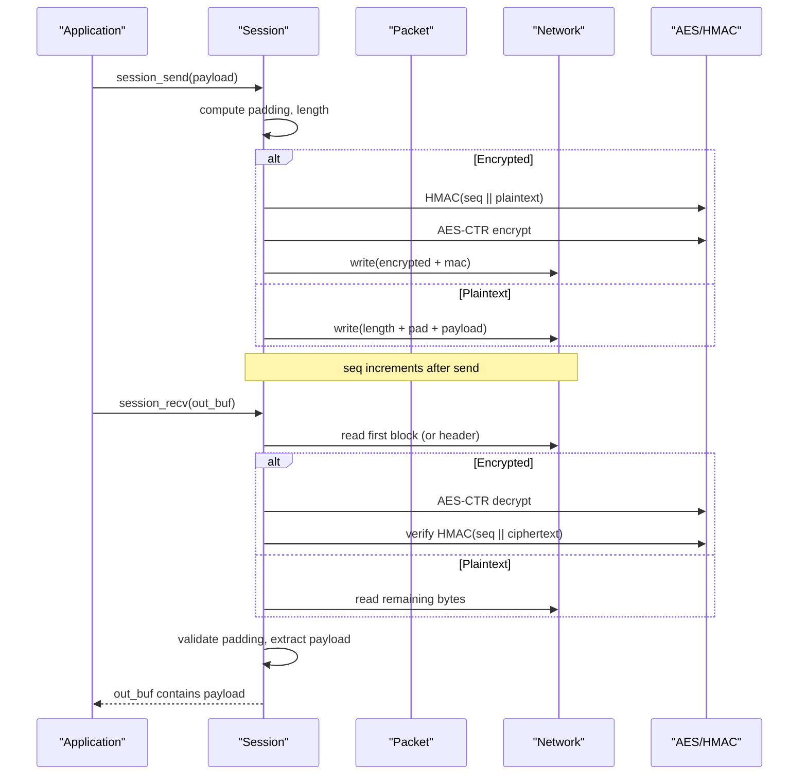
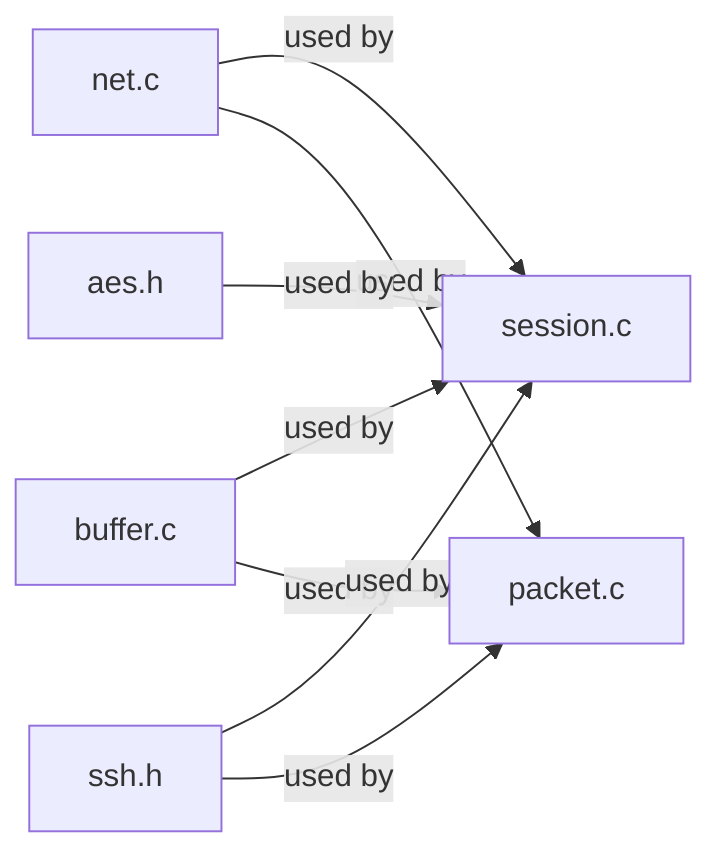

# Core Components

<cite>
**Referenced Files in This Document**
- [net.h](file://src/net.h)
- [net.c](file://src/net.c)
- [buffer.h](file://src/buffer.h)
- [buffer.c](file://src/buffer.c)
- [session.h](file://src/session.h)
- [session.c](file://src/session.c)
- [packet.h](file://src/packet.h)
- [packet.c](file://src/packet.c)
- [ssh.h](file://src/ssh.h)
- [aes.h](file://src/aes.h)
</cite>

## Table of Contents
1. [Introduction](#introduction)
2. [Project Structure](#project-structure)
3. [Core Components](#core-components)
4. [Architecture Overview](#architecture-overview)
5. [Detailed Component Analysis](#detailed-component-analysis)
6. [Dependency Analysis](#dependency-analysis)
7. [Performance Considerations](#performance-considerations)
8. [Troubleshooting Guide](#troubleshooting-guide)
9. [Conclusion](#conclusion)

## Introduction
This document explains the core components that form the foundation of the Coalesce SSH implementation. It focuses on:
- Network abstraction layer for cross-platform socket operations
- Buffer management system with dynamic memory allocation and type-safe serialization
- Session management implementing the SSH transport state machine (identification exchange, key installation, encrypted I/O)
- Packet processing handling SSH message framing and sequence numbers

It also provides API references, usage patterns, error handling strategies, and performance considerations to help you integrate and extend these components safely and efficiently.

## Project Structure
The relevant source files are organized into focused modules:
- Network I/O: net.h/net.c provide a portable TCP socket abstraction
- Buffer utilities: buffer.h/buffer.c implement a resizable byte buffer with typed read/write helpers
- Transport session: session.h/session.c manage identification exchange, key material, encryption/MAC, and packet I/O
- Packet framing: packet.h/packet.c handle low-level SSH packet framing and sequence counters
- Constants and crypto primitives: ssh.h defines protocol constants; aes.h exposes AES-CTR streaming used by the session

**Diagram sources**
- [net.h:1-58](file://src/net.h#L1-L58)
- [buffer.h:1-50](file://src/buffer.h#L1-L50)
- [session.h:1-89](file://src/session.h#L1-L89)
- [packet.h:1-28](file://src/packet.h#L1-L28)
- [ssh.h:1-147](file://src/ssh.h#L1-L147)
- [aes.h:1-38](file://src/aes.h#L1-L38)

**Section sources**
- [net.h:1-58](file://src/net.h#L1-L58)
- [buffer.h:1-50](file://src/buffer.h#L1-L50)
- [session.h:1-89](file://src/session.h#L1-L89)
- [packet.h:1-28](file://src/packet.h#L1-L28)
- [ssh.h:1-147](file://src/ssh.h#L1-L147)
- [aes.h:1-38](file://src/aes.h#L1-L38)

## Core Components
- Network abstraction: Provides platform-independent TCP sockets, non-blocking mode, full read/write helpers, and line reading for banner exchange.
- Buffer system: A dynamic, resizable buffer with safe typed serialization/deserialization for SSH wire formats (uint8/32/64, booleans, strings, mpint).
- Session management: Implements SSH transport lifecycle including identification exchange, key installation per direction, activation of encryption/MAC, and secure send/recv with sequence number handling.
- Packet processing: Low-level framing of SSH packets (length, padding), optional MAC, and sequence number updates.

These layers compose to implement RFC 4253-compliant transport behavior: version banner exchange, binary packet protocol, encryption, and integrity protection.

**Section sources**
- [net.c:23-177](file://src/net.c#L23-L177)
- [buffer.c:7-272](file://src/buffer.c#L7-L272)
- [session.c:14-363](file://src/session.c#L14-L363)
- [packet.c:7-167](file://src/packet.c#L7-L167)

## Architecture Overview
The SSH transport stack is layered:
- Application uses session APIs to send/receive payloads.
- Session handles encryption/MAC and sequence numbers, delegating to network I/O.
- Packet module can be used directly for unencrypted framing or as a building block for higher layers.
- Buffer module provides safe typed serialization for constructing payloads.
- Network module abstracts OS-specific socket calls.

**Diagram sources**
- [session.c:196-363](file://src/session.c#L196-L363)
- [packet.c:52-167](file://src/packet.c#L52-L167)
- [net.c:127-177](file://src/net.c#L127-L177)
- [aes.h:26-35](file://src/aes.h#L26-L35)

## Detailed Component Analysis

### Network Abstraction Layer (net.h/net.c)
Purpose:
- Provide a unified interface for TCP sockets across Windows and POSIX systems.
- Offer blocking full-read/full-write helpers and line reading for banner exchange.
- Support server listen/accept and client connect flows.

Key responsibilities:
- Initialization and shutdown of platform networking subsystems.
- Socket creation, binding, listening, accepting connections.
- Non-blocking mode configuration and graceful write shutdown.
- Exact-length I/O loops to handle partial reads/writes.
- Error reporting via a portable error string accessor.

API highlights:
- Lifecycle: net_init, net_shutdown
- Server: net_listen, net_accept
- Client: net_connect
- I/O: net_set_nonblocking, net_shutdown_write, net_close
- Helpers: net_read_full, net_write_full, net_read_line
- Errors: net_get_error

Usage pattern:
- Initialize once at process start; shut down before exit.
- Use net_listen/net_accept for servers; net_connect for clients.
- For banner exchange, use net_read_line to read one line at a time.
- Always check return values; propagate errors up to the caller.

Error handling:
- Functions return negative values or invalid socket descriptors on failure.
- Use net_get_error to obtain human-readable messages for diagnostics.

Performance notes:
- Blocking full-read/full-write functions minimize overhead by looping until complete.
- Non-blocking mode enables integration with event loops if needed.

**Section sources**
- [net.h:1-58](file://src/net.h#L1-L58)
- [net.c:23-177](file://src/net.c#L23-L177)

### Buffer Management System (buffer.h/buffer.c)
Purpose:
- Manage dynamic buffers with explicit capacity, length, and read position.
- Provide type-safe serialization/deserialization aligned with SSH wire formats.

Data structure:
- ssh_buf_t holds data pointer, read position, current length, and allocated capacity.

Key responsibilities:
- Allocation and resizing with exponential growth policy.
- Safe appenders for uint8/32/64, booleans, raw bytes, SSH strings, C strings, and mpint.
- Safe extractors returning -1 on underflow or invalid input.
- Utilities to query readable bytes, get pointers, and consume bytes.

API highlights:
- Lifecycle: buf_new, buf_init, buf_free, buf_reset, buf_reserve
- Access: buf_readable, buf_read_ptr, buf_data, buf_len, buf_consume
- Writers: buf_put_u8/u32/u64, buf_put_bool, buf_put_raw, buf_put_string, buf_put_cstring, buf_put_mpint
- Readers: buf_get_u8/u32/u64, buf_get_bool, buf_get_raw, buf_get_string, buf_get_cstring, buf_get_mpint

Usage pattern:
- Build payloads using writer functions; ensure capacity via reserve when necessary.
- Parse incoming data using reader functions; always check return codes for underflow.
- Reuse buffers with reset between messages to reduce allocations.

Error handling:
- Writers return -1 on allocation failure; readers return -1 on insufficient data.
- String extraction allocates memory; callers must free when not passing output pointers.

Performance notes:
- Exponential growth reduces reallocations.
- Minimal copying; direct memcpy for raw blocks.
- Efficient parsing with single-pass reads.

**Section sources**
- [buffer.h:1-50](file://src/buffer.h#L1-L50)
- [buffer.c:7-272](file://src/buffer.c#L7-L272)

### Session Management (session.h/session.c)
Purpose:
- Implement the SSH transport session state machine: identification exchange, key installation, encryption activation, and secure packet I/O.
- Maintain per-direction cipher and MAC state with continuous sequence numbers.

State model:
- ssh_session_t holds socket, identification strings, KEXINIT payloads, session ID, and two directions (in/out).
- Each direction tracks encryption status, AES-CTR context, MAC key, and sequence counter.

Key responsibilities:
- Validate and exchange identification banners per RFC 4253 §4.2.
- Install keys per direction with supported ciphers and MAC algorithms.
- Activate encryption/MAC after NEWKEYS exchange.
- Send/receive payloads with automatic padding, encryption, MAC computation/verification, and sequence increment.

API highlights:
- Lifecycle: session_init, session_free
- Identification: session_ident_check, session_exchange_ident
- Keys: session_set_keys, session_activate
- I/O: session_send, session_send_buf, session_recv

Usage pattern:
- Initialize session with a connected socket.
- Exchange identification strings before any other transport activity.
- After key exchange, install keys per direction and activate them.
- Use session_send/session_recv for all subsequent transport messages.

Error handling:
- All functions return negative values on failure; callers should disconnect on critical errors (e.g., MAC mismatch).
- Banner validation enforces strict format and rejects unsupported versions.

Security considerations:
- Sequence numbers never reset across rekeys; they increment monotonically per direction.
- MAC verification uses constant-time comparison to mitigate timing attacks.

**Section sources**
- [session.h:1-89](file://src/session.h#L1-L89)
- [session.c:14-363](file://src/session.c#L14-L363)
- [ssh.h:1-147](file://src/ssh.h#L1-L147)
- [aes.h:1-38](file://src/aes.h#L1-L38)

### Packet Processing (packet.h/packet.c)
Purpose:
- Provide low-level SSH packet framing: packet_length, padding_length, payload, and optional MAC.
- Update sequence numbers consistently with send/recv operations.

Key responsibilities:
- Compute correct padding to satisfy block size alignment and minimum padding constraints.
- Serialize packet headers and payloads into wire format.
- Deserialize incoming packets, validate lengths and padding, and extract payloads.
- Increment sequence counters after successful operations.

API highlights:
- Lifecycle: pkt_init, pkt_free, pkt_reset
- High-level I/O: pkt_send, pkt_send_buf, pkt_recv

Usage pattern:
- Use pkt_send/pkt_send_buf to frame and transmit payloads.
- Use pkt_recv to parse incoming frames into an ssh_pkt_t structure.
- Combine with session APIs when encryption/MAC is required.

Error handling:
- Returns -1 for malformed packets, allocation failures, or incomplete reads.
- Validates packet_length bounds and padding constraints.

Performance notes:
- Minimal temporary allocations; reusable buffers via ssh_pkt_t.
- Straightforward byte-wise operations for speed.

**Section sources**
- [packet.h:1-28](file://src/packet.h#L1-L28)
- [packet.c:7-167](file://src/packet.c#L7-L167)

## Dependency Analysis
Component relationships:
- session depends on net, buffer, aes, and ssh constants.
- packet depends on net, buffer, and ssh constants.
- buffer has no internal dependencies beyond standard library.
- net is self-contained with platform-specific includes.

**Diagram sources**
- [session.c:1-363](file://src/session.c#L1-L363)
- [packet.c:1-167](file://src/packet.c#L1-L167)
- [buffer.c:1-272](file://src/buffer.c#L1-L272)
- [net.c:1-177](file://src/net.c#L1-L177)
- [aes.h:1-38](file://src/aes.h#L1-L38)
- [ssh.h:1-147](file://src/ssh.h#L1-L147)

**Section sources**
- [session.c:1-363](file://src/session.c#L1-L363)
- [packet.c:1-167](file://src/packet.c#L1-L167)
- [buffer.c:1-272](file://src/buffer.c#L1-L272)
- [net.c:1-177](file://src/net.c#L1-L177)
- [aes.h:1-38](file://src/aes.h#L1-L38)
- [ssh.h:1-147](file://src/ssh.h#L1-L147)

## Performance Considerations
- Buffer growth strategy: Exponential capacity doubling minimizes reallocations during large writes.
- Zero-copy tendencies: Raw copy operations avoid unnecessary intermediate buffers where possible.
- Encryption path: AES-CTR allows in-place encryption/decryption; MAC computed over plaintext before encryption to reduce copies.
- Sequence handling: Monotonic sequence counters avoid resets and simplify integrity checks.
- I/O efficiency: Full read/write helpers reduce loop overhead; consider integrating with non-blocking I/O for high-concurrency scenarios.
- Memory management: Reuse buffers with reset to reduce churn; free allocated strings from string getters promptly.

[No sources needed since this section provides general guidance]

## Troubleshooting Guide
Common issues and strategies:
- Network errors: Check return codes from net_* functions; use net_get_error for detailed messages.
- Partial I/O: Ensure loops in full read/write helpers complete; verify socket validity and non-blocking behavior.
- Invalid banners: session_ident_check enforces strict formatting; reject malformed or unsupported versions early.
- Key installation failures: Verify cipher and MAC names match supported sets; ensure IV/key lengths conform to expectations.
- MAC verification failures: On recv, a MAC mismatch indicates tampering or misconfiguration; disconnect immediately.
- Buffer underflows: Reader functions return -1 when insufficient data; ensure proper sequencing and buffering.

Operational tips:
- Always initialize networking subsystems before use and shut them down cleanly.
- Free all allocated resources in session_free and pkt_free paths.
- Log protocol events around identification exchange and key setup for debugging.

**Section sources**
- [net.c:162-177](file://src/net.c#L162-L177)
- [session.c:42-126](file://src/session.c#L42-L126)
- [session.c:130-169](file://src/session.c#L130-L169)
- [session.c:318-337](file://src/session.c#L318-L337)
- [buffer.c:184-271](file://src/buffer.c#L184-L271)

## Conclusion
The Coalesce SSH core components provide a robust, modular foundation for implementing the SSH transport layer:
- The network abstraction offers cross-platform socket operations with reliable I/O helpers.
- The buffer system ensures safe, efficient serialization aligned with SSH wire formats.
- The session component manages the transport state machine, key installation, and secure packet I/O with strict adherence to sequence numbering and integrity checks.
- The packet module delivers precise framing and validation for SSH messages.

Together, these layers enable a clear separation of concerns, strong error handling, and performance-conscious design suitable for building a complete SSH implementation.

[No sources needed since this section summarizes without analyzing specific files]