# Network Layer

<cite>
**Referenced Files in This Document**
- [net.h](file://src/net.h)
- [net.c](file://src/net.c)
</cite>

## Table of Contents
1. [Introduction](#introduction)
2. [Project Structure](#project-structure)
3. [Core Components](#core-components)
4. [Architecture Overview](#architecture-overview)
5. [Detailed Component Analysis](#detailed-component-analysis)
6. [Dependency Analysis](#dependency-analysis)
7. [Performance Considerations](#performance-considerations)
8. [Troubleshooting Guide](#troubleshooting-guide)
9. [Conclusion](#conclusion)

## Introduction
This document describes the network abstraction layer used by Coalesce SSH. It provides a unified, cross-platform API over Windows (Winsock) and Unix-like systems (POSIX sockets). The layer exposes:
- A platform-agnostic socket type net_socket_t
- Lifecycle functions for initialization and shutdown
- Server-side operations to listen and accept connections
- Client-side connection establishment
- Blocking I/O utilities for reading/writing exact byte counts and reading lines
- Peer address representation and non-blocking mode configuration

The design intentionally keeps protocol knowledge out of this layer; it focuses on raw TCP transport.

## Project Structure
The network layer is implemented in two files:
- Header: src/net.h — public API, types, and macros
- Implementation: src/net.c — platform-specific logic and core functions

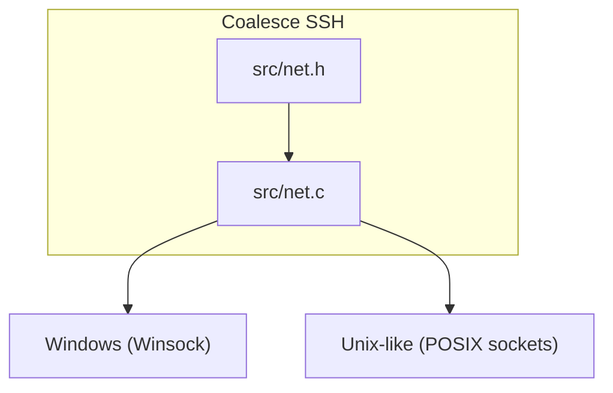

**Diagram sources**
- [net.h:1-58](file://src/net.h#L1-L58)
- [net.c:1-177](file://src/net.c#L1-L177)

**Section sources**
- [net.h:1-58](file://src/net.h#L1-L58)
- [net.c:1-177](file://src/net.c#L1-L177)

## Core Components
- Platform abstraction:
  - net_socket_t abstracts SOCKET on Windows and int on POSIX.
  - Macros NET_INVALID, NET_SHUT_WRITE, and NET_IS_VALID provide consistent checks and constants.
- Address structure:
  - net_addr holds an IPv4 address string and port for use with accept/connect workflows.
- Lifecycle:
  - net_init() initializes the networking stack (required on Windows).
  - net_shutdown() cleans up resources (required on Windows).
- Server API:
  - net_listen(host, port) creates and binds a listening socket.
  - net_accept(srv, out_addr) accepts a client connection and fills peer info.
- Client API:
  - net_connect(host, port) resolves hostnames or numeric IPs and connects.
- I/O utilities:
  - net_read_full(s, buf, n) reads exactly n bytes (blocking).
  - net_write_full(s, buf, n) writes exactly n bytes (blocking).
  - net_read_line(s, buf, max) reads one line terminated by newline.
- Utilities:
  - net_set_nonblocking(s) enables non-blocking I/O.
  - net_shutdown_write(s) performs a half-close (write side).
  - net_close(s) closes a socket safely.
  - net_get_error() returns a human-readable error message.

**Section sources**
- [net.h:9-30](file://src/net.h#L9-L30)
- [net.h:32-56](file://src/net.h#L32-L56)
- [net.c:23-37](file://src/net.c#L23-L37)
- [net.c:39-98](file://src/net.c#L39-L98)
- [net.c:100-125](file://src/net.c#L100-L125)
- [net.c:127-177](file://src/net.c#L127-L177)

## Architecture Overview
The network layer sits between higher-level SSH components and the OS networking stack. It hides platform differences behind a simple API.

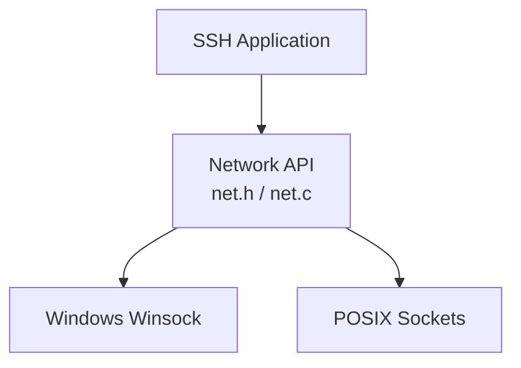

**Diagram sources**
- [net.h:1-58](file://src/net.h#L1-L58)
- [net.c:1-177](file://src/net.c#L1-L177)

## Detailed Component Analysis

### Type Abstraction and Platform Macros
- net_socket_t:
  - Windows: typedef SOCKET
  - POSIX: typedef int
- Validation and invalid values:
  - NET_IS_VALID(s), NET_INVALID, NET_SHUT_WRITE encapsulate platform differences.
- Address model:
  - net_addr contains ip[INET_ADDRSTRLEN] and port for IPv4 endpoints.

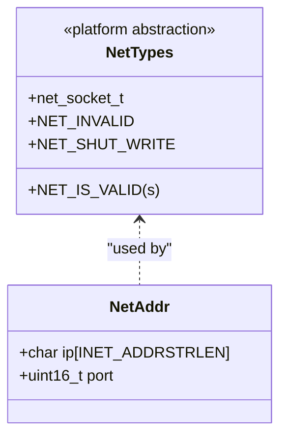

**Diagram sources**
- [net.h:9-30](file://src/net.h#L9-L30)

**Section sources**
- [net.h:9-30](file://src/net.h#L9-L30)

### Lifecycle Management: net_init() and net_shutdown()
- net_init():
  - On Windows, calls WSAStartup(2,2); returns 0 on success, -1 otherwise.
  - On POSIX, no-op; returns 0.
- net_shutdown():
  - On Windows, calls WSACleanup().
  - On POSIX, no-op.

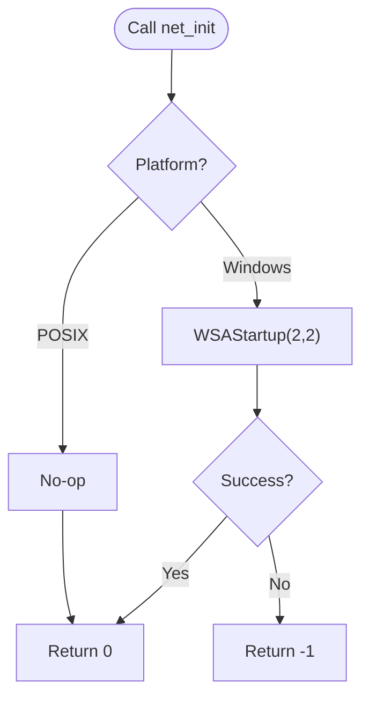

**Diagram sources**
- [net.c:23-30](file://src/net.c#L23-L30)
- [net.c:32-37](file://src/net.c#L32-L37)

**Section sources**
- [net.c:23-37](file://src/net.c#L23-L37)

### Server Operations: net_listen() and net_accept()
- net_listen(host, port):
  - Creates AF_INET, SOCK_STREAM socket.
  - Enables SO_REUSEADDR.
  - Binds to INADDR_ANY if host is NULL, else to provided host.
  - Listens with backlog 16.
  - Returns valid socket or NET_INVALID on failure.
- net_accept(srv, out_addr):
  - Accepts a connection and optionally fills net_addr with peer IP and port.
  - Returns accepted socket or NET_INVALID on failure.

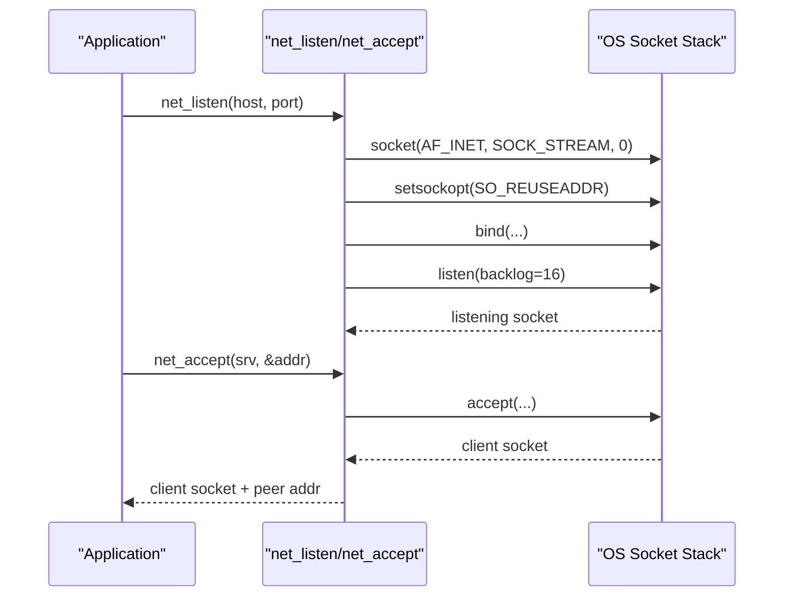

**Diagram sources**
- [net.c:39-73](file://src/net.c#L39-L73)

**Section sources**
- [net.c:39-73](file://src/net.c#L39-L73)

### Client Operation: net_connect()
- net_connect(host, port):
  - Creates AF_INET, SOCK_STREAM socket.
  - Resolves hostname via gethostbyname; falls back to inet_addr for numeric IPs.
  - Connects to server; returns connected socket or NET_INVALID on failure.

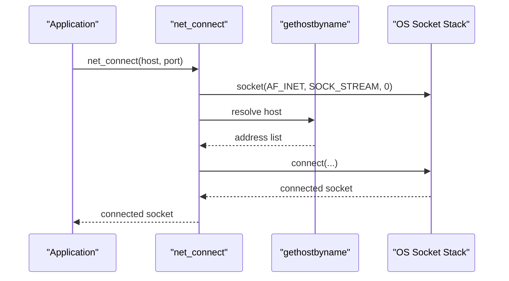

**Diagram sources**
- [net.c:75-98](file://src/net.c#L75-L98)

**Section sources**
- [net.c:75-98](file://src/net.c#L75-L98)

### Non-blocking Mode and Half-Close
- net_set_nonblocking(s):
  - Windows: ioctlsocket(FIONBIO).
  - POSIX: fcntl(O_NONBLOCK).
- net_shutdown_write(s):
  - Calls shutdown(s, SHUT_WR) to signal EOF on write side.

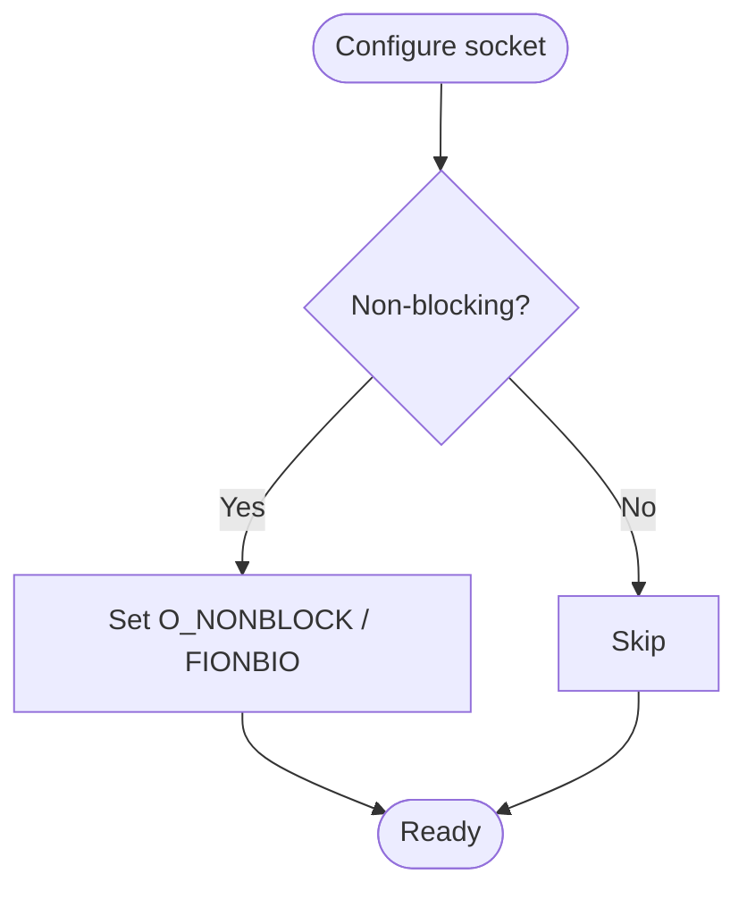

**Diagram sources**
- [net.c:100-114](file://src/net.c#L100-L114)

**Section sources**
- [net.c:100-114](file://src/net.c#L100-L114)

### Closing Sockets Safely
- net_close(s):
  - Checks validity using NET_IS_VALID.
  - Calls closesocket on Windows, close on POSIX.

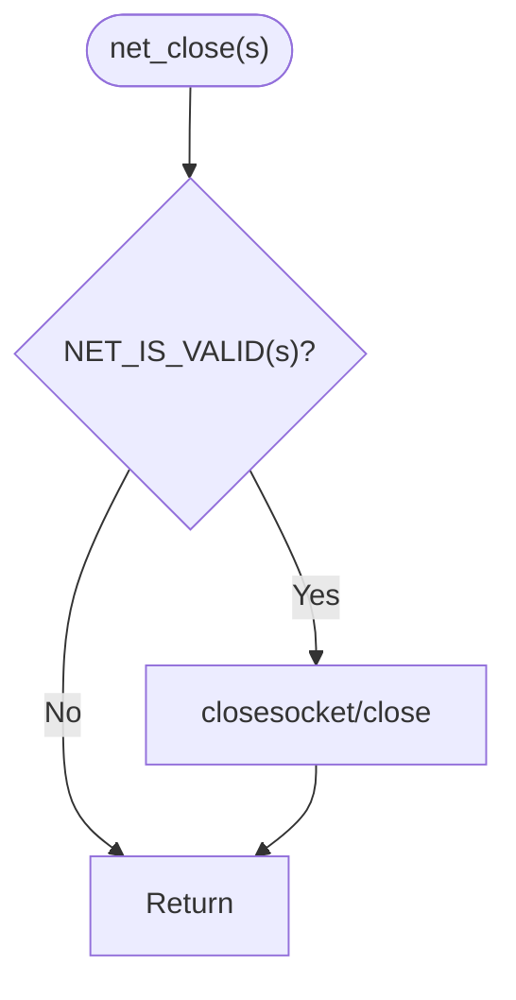

**Diagram sources**
- [net.c:116-125](file://src/net.c#L116-L125)

**Section sources**
- [net.c:116-125](file://src/net.c#L116-L125)

### Blocking I/O Utilities
- net_read_full(s, buf, n):
  - Repeatedly recv until n bytes are read or an error/EOF occurs.
  - Returns number of bytes read or negative on error/EOF.
- net_write_full(s, buf, n):
  - Repeatedly send until n bytes are written or an error occurs.
  - Returns number of bytes written or negative on error.
- net_read_line(s, buf, max):
  - Reads byte-by-byte until newline or buffer limit.
  - Null-terminates output and returns length.

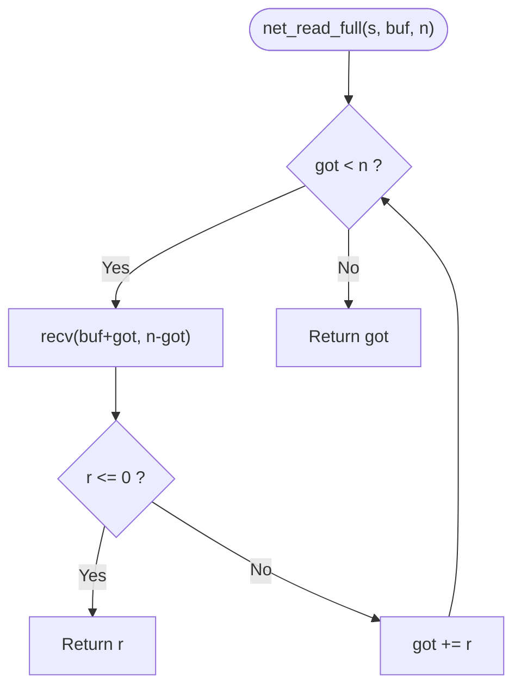

**Diagram sources**
- [net.c:127-136](file://src/net.c#L127-L136)

**Section sources**
- [net.c:127-147](file://src/net.c#L127-L147)
- [net.c:149-160](file://src/net.c#L149-L160)

### Error Reporting
- net_get_error():
  - Windows: uses FormatMessageA to translate WSAGetLastError into a string.
  - POSIX: returns strerror(errno).

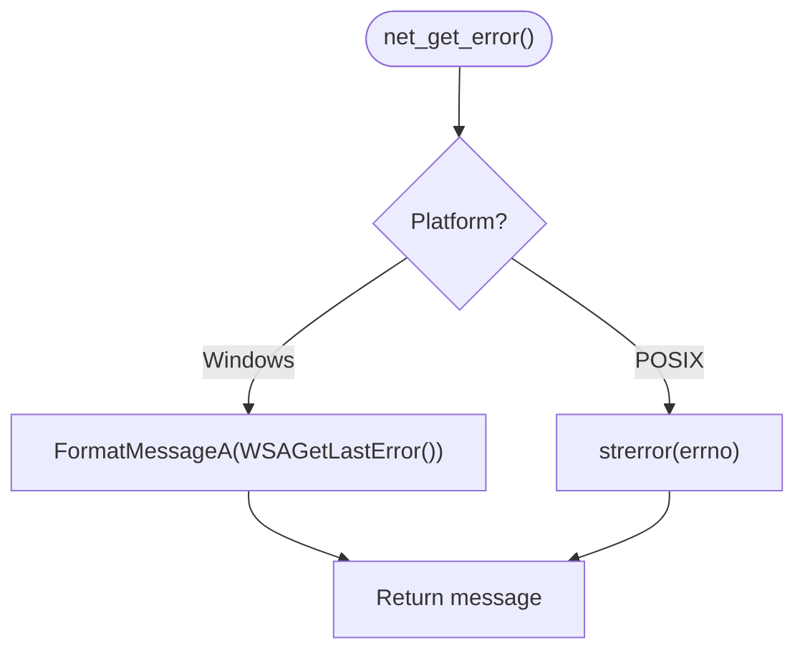

**Diagram sources**
- [net.c:162-177](file://src/net.c#L162-L177)

**Section sources**
- [net.c:162-177](file://src/net.c#L162-L177)

## Dependency Analysis
The network layer depends on OS-specific headers and libraries:
- Windows: winsock2.h, ws2tcpip.h, ws2_32.lib
- POSIX: sys/socket.h, netinet/in.h, arpa/inet.h, unistd.h, fcntl.h, errno.h

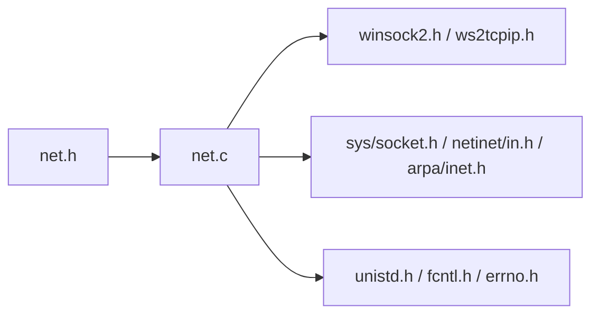

**Diagram sources**
- [net.h:9-24](file://src/net.h#L9-L24)
- [net.c:7-17](file://src/net.c#L7-L17)

**Section sources**
- [net.h:9-24](file://src/net.h#L9-L24)
- [net.c:7-17](file://src/net.c#L7-L17)

## Performance Considerations
- Use net_set_nonblocking() when integrating with event loops or multiplexers (e.g., select/poll/epoll/io_uring) to avoid blocking threads.
- Prefer net_read_full()/net_write_full() for protocols requiring exact byte counts; they handle partial I/O internally.
- For high-throughput servers, consider enabling TCP_NODELAY where appropriate to reduce latency for small packets.
- Tune SO_RCVBUF/SO_SNDBUF based on workload characteristics if needed.
- Batch writes when possible to reduce system call overhead.
- Avoid per-byte reads like net_read_line() in hot paths unless necessary; prefer buffered readers at higher layers.

[No sources needed since this section provides general guidance]

## Troubleshooting Guide
Common issues and strategies:
- Initialization failures:
  - On Windows, ensure net_init() succeeds before creating sockets. If it fails, inspect errors via net_get_error().
- Binding/listening failures:
  - Port already in use: verify SO_REUSEADDR usage and that the process has permissions.
  - Invalid host: validate host strings; passing NULL binds to all interfaces.
- Connection failures:
  - Hostname resolution: gethostbyname may fail for invalid names; fall back to numeric IP validation.
  - Remote unreachable: check firewall rules and routing.
- I/O errors:
  - Partial reads/writes: net_read_full()/net_write_full() return early on errors; always check return values.
  - EOF detection: recv returning 0 indicates graceful close by peer.
- Resource leaks:
  - Always call net_close() on sockets returned by listen/accept/connect, even on error paths.
- Error messages:
  - Use net_get_error() to log detailed diagnostics across platforms.

**Section sources**
- [net.c:23-37](file://src/net.c#L23-L37)
- [net.c:39-98](file://src/net.c#L39-L98)
- [net.c:127-177](file://src/net.c#L127-L177)

## Conclusion
The Coalesce SSH network layer provides a clean, cross-platform abstraction over TCP sockets. It standardizes lifecycle management, server/client operations, and blocking I/O while exposing optional non-blocking configuration. By following the patterns outlined here—proper initialization, robust error handling, safe resource cleanup, and performance-aware I/O—you can build reliable SSH clients and servers on both Windows and Unix-like systems.

[No sources needed since this section summarizes without analyzing specific files]