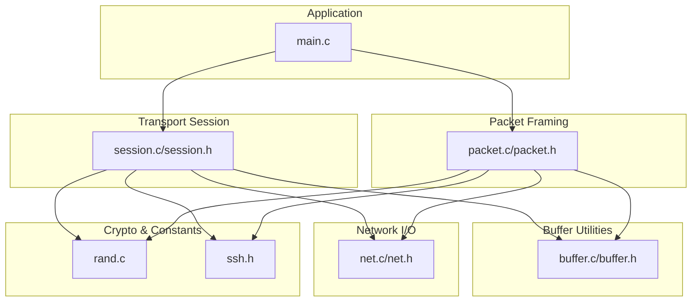
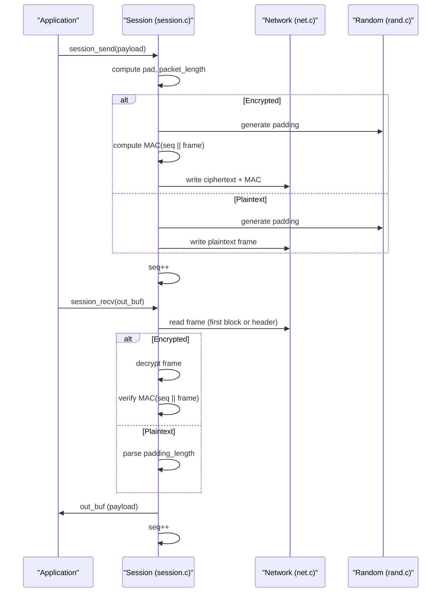
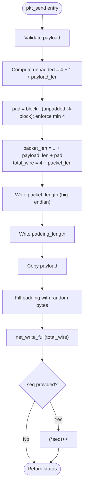
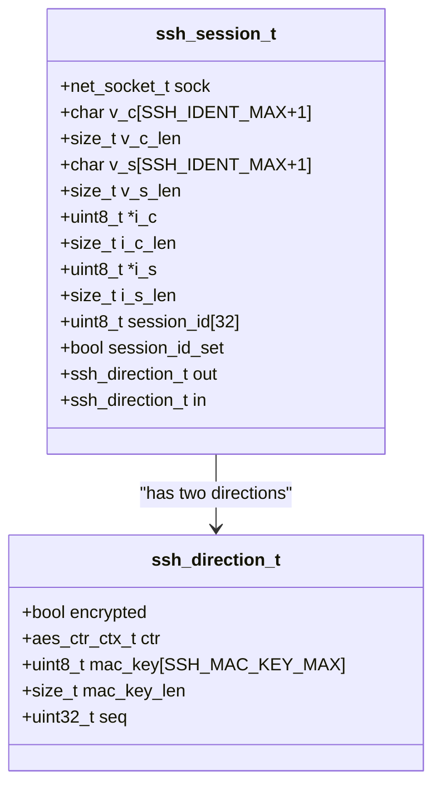
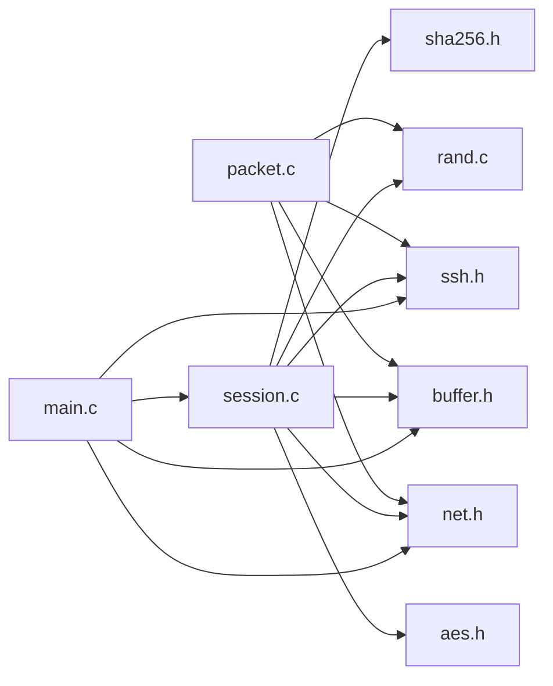

# Packet Processing

<cite>
**Referenced Files in This Document**
- [packet.c](file://src/packet.c)
- [packet.h](file://src/packet.h)
- [session.c](file://src/session.c)
- [session.h](file://src/session.h)
- [buffer.c](file://src/buffer.c)
- [buffer.h](file://src/buffer.h)
- [net.c](file://src/net.c)
- [net.h](file://src/net.h)
- [ssh.h](file://src/ssh.h)
- [rand.c](file://src/rand.c)
- [main.c](file://src/main.c)
</cite>

## Table of Contents
1. [Introduction](#introduction)
2. [Project Structure](#project-structure)
3. [Core Components](#core-components)
4. [Architecture Overview](#architecture-overview)
5. [Detailed Component Analysis](#detailed-component-analysis)
6. [Dependency Analysis](#dependency-analysis)
7. [Performance Considerations](#performance-considerations)
8. [Troubleshooting Guide](#troubleshooting-guide)
9. [Conclusion](#conclusion)
10. [Appendices](#appendices)

## Introduction
This document explains the SSH packet processing system implemented in the repository, focusing on message framing and sequence number management per RFC 4253. It covers:
- The ssh_pkt_t structure for parsed packets, including payload data, length fields, and padding information.
- Packet serialization (length encoding, padding calculation, MAC verification).
- Sequence number handling for sender and receiver sides, including incrementing and wrapping behavior.
- Packet validation, integrity checking, and error handling for malformed packets.
- Examples of constructing and parsing different SSH message types, handling large payloads efficiently, and debugging packet-level issues.
- Performance optimizations and security considerations to prevent packet injection attacks.

## Project Structure
The packet processing spans several modules:
- Low-level I/O: net.c/net.h provide blocking read/write helpers.
- Buffer utilities: buffer.c/buffer.h provide typed append/read operations used to build payloads.
- Transport session: session.c/session.h implement the binary packet protocol with encryption and MAC, including sequence numbers.
- Packet framing helpers: packet.c/packet.h provide a simpler plaintext framing API that computes lengths and padding.
- Protocol constants: ssh.h defines message types and limits.
- Randomness: rand.c provides cryptographically secure random bytes for padding.
- Example usage: main.c demonstrates sending/receiving messages through the session layer.

**Diagram sources**
- [main.c:111-153](file://src/main.c#L111-L153)
- [session.c:196-362](file://src/session.c#L196-L362)
- [packet.c:52-166](file://src/packet.c#L52-L166)
- [buffer.c:18-146](file://src/buffer.c#L18-L146)
- [net.c:127-147](file://src/net.c#L127-L147)
- [rand.c:14-45](file://src/rand.c#L14-L45)
- [ssh.h:12-15](file://src/ssh.h#L12-L15)

**Section sources**
- [main.c:111-153](file://src/main.c#L111-L153)
- [session.c:196-362](file://src/session.c#L196-L362)
- [packet.c:52-166](file://src/packet.c#L52-L166)
- [buffer.c:18-146](file://src/buffer.c#L18-L146)
- [net.c:127-147](file://src/net.c#L127-L147)
- [rand.c:14-45](file://src/rand.c#L14-L45)
- [ssh.h:12-15](file://src/ssh.h#L12-L15)

## Core Components
- ssh_pkt_t: Represents a parsed SSH packet with fields for packet_length, padding_length, payload buffer, optional padding and mac buffers, and mac_len.
- Packet framing functions: pkt_send/pkt_recv compute wire format, validate constraints, and manage sequence numbers when provided.
- Session transport: session_send/session_recv implement RFC 4253 §6 with encryption and HMAC-SHA256 MAC, maintaining per-direction sequence numbers.
- Buffer utilities: Provide safe append/read operations for building payloads and extracting fields.
- Network I/O: Blocking full-read/full-write helpers ensure complete transfers.
- Randomness: Secure random padding generation.

Key responsibilities:
- Length encoding: Big-endian 32-bit packet_length.
- Padding: Minimum 4 bytes; total frame size is a multiple of block size (8 if unencrypted, cipher block size if encrypted).
- Integrity: HMAC computed over sequence number + plaintext/ciphertext as applicable.
- Sequence numbers: Incremented per send/receive per direction; wrap naturally at uint32_t boundary.

**Section sources**
- [packet.h:9-26](file://src/packet.h#L9-L26)
- [packet.c:52-166](file://src/packet.c#L52-L166)
- [session.h:24-33](file://src/session.h#L24-L33)
- [session.c:196-362](file://src/session.c#L196-L362)
- [buffer.h:8-47](file://src/buffer.h#L8-L47)
- [net.h:51-56](file://src/net.h#L51-L56)
- [ssh.h:12-15](file://src/ssh.h#L12-L15)

## Architecture Overview
The transport session encapsulates the SSH binary packet protocol. It handles:
- Plaintext phase: Read/write frames without encryption/MAC.
- Encrypted phase: Encrypt frames with AES-CTR and compute/verify HMAC-SHA256.
- Sequence numbers: Per-direction counters incremented after each successful send/receive.

**Diagram sources**
- [session.c:196-362](file://src/session.c#L196-L362)
- [net.c:127-147](file://src/net.c#L127-L147)
- [rand.c:14-45](file://src/rand.c#L14-L45)

## Detailed Component Analysis

### ssh_pkt_t and Packet Framing (packet.c/packet.h)
- Structure: Holds packet_length, padding_length, payload buffer, optional padding/mac buffers, and mac_len.
- Lifecycle: init/free/reset manage memory and state.
- Sending: Computes unpadded length, ensures minimum padding, aligns to block size, writes big-endian length and padding_length, appends payload and random padding, then sends via network. Optionally increments an external sequence pointer.
- Receiving: Reads packet_length, validates range, reads body, checks padding_length validity, extracts payload into ssh_pkt_t.payload, optionally increments an external sequence pointer.

**Diagram sources**
- [packet.c:52-105](file://src/packet.c#L52-L105)

**Section sources**
- [packet.h:9-26](file://src/packet.h#L9-L26)
- [packet.c:7-50](file://src/packet.c#L7-L50)
- [packet.c:52-166](file://src/packet.c#L52-L166)

### Transport Session (session.c/session.h)
- Direction state: encrypted flag, AES-CTR context, MAC key and length, and per-direction sequence number starting at zero.
- Identification exchange: Validates peer identification lines per RFC 4253 §4.2.
- Key installation: Supports aes128-ctr/aes256-ctr and hmac-sha2-256 or none.
- Sending: Builds frame with correct padding, computes MAC before encryption (over seq_be || plaintext frame), encrypts with AES-CTR, writes ciphertext + MAC, increments seq.
- Receiving: For plaintext, reads header and body; for encrypted, reads first block, decrypts to get packet_length, reads rest, verifies MAC using current seq, extracts payload, increments seq.

**Diagram sources**
- [session.h:24-56](file://src/session.h#L24-L56)

**Section sources**
- [session.h:13-86](file://src/session.h#L13-L86)
- [session.c:14-163](file://src/session.c#L14-L163)
- [session.c:196-362](file://src/session.c#L196-L362)

### Buffer Utilities (buffer.c/buffer.h)
- Provides resizable buffers with read positions and capacity tracking.
- Writers: Append u8/u32/u64, booleans, raw bytes, strings, and MPINTs.
- Readers: Extract values safely with bounds checking.
- Used extensively by session and packet layers to construct and parse payloads.

**Section sources**
- [buffer.h:8-47](file://src/buffer.h#L8-L47)
- [buffer.c:18-146](file://src/buffer.c#L18-L146)
- [buffer.c:184-271](file://src/buffer.c#L184-L271)

### Network I/O (net.c/net.h)
- Blocking full read/write helpers ensure complete transfers.
- Utility functions for socket lifecycle, nonblocking mode, and line reading.

**Section sources**
- [net.h:32-56](file://src/net.h#L32-L56)
- [net.c:127-147](file://src/net.c#L127-L147)

### Randomness (rand.c)
- Uses OS-provided entropy (Windows CryptGenRandom, Linux getrandom or /dev/urandom) to generate padding bytes securely.

**Section sources**
- [rand.c:14-45](file://src/rand.c#L14-L45)

### Protocol Constants (ssh.h)
- Defines maximum packet and payload sizes, minimum padding, and SSH message type constants used throughout the codebase.

**Section sources**
- [ssh.h:12-15](file://src/ssh.h#L12-L15)
- [ssh.h:17-57](file://src/ssh.h#L17-L57)

## Dependency Analysis
- packet.c depends on rand.c, ssh.h, buffer.h, net.h.
- session.c depends on sha256 (via HMAC), rand.c, ssh.h, buffer.h, net.h, aes.h.
- main.c uses session.c, buffer.c, net.c, ssh.h.

**Diagram sources**
- [packet.c:1-5](file://src/packet.c#L1-L5)
- [session.c:1-7](file://src/session.c#L1-L7)
- [main.c:6-9](file://src/main.c#L6-L9)

**Section sources**
- [packet.c:1-5](file://src/packet.c#L1-L5)
- [session.c:1-7](file://src/session.c#L1-L7)
- [main.c:6-9](file://src/main.c#L6-L9)

## Performance Considerations
- Minimize allocations: Reuse buffers where possible; the buffer implementation doubles capacity to reduce realloc frequency.
- Efficient padding: Compute padding once per packet; avoid extra copies by writing directly into allocated wire buffers.
- Block alignment: Ensure total frame size is a multiple of block size to satisfy cipher requirements and avoid unnecessary padding adjustments.
- MAC computation: Compute MAC over minimal necessary data; use streaming HMAC APIs to avoid buffering entire frames unnecessarily.
- Large payloads: Respect MAX_PAYLOAD_SIZE and MAX_PACKET_SIZE to prevent excessive memory usage; consider chunking application logic if needed.
- Non-blocking I/O: Use net_set_nonblocking for event-driven architectures to avoid blocking on network operations.

[No sources needed since this section provides general guidance]

## Troubleshooting Guide
Common issues and how to diagnose them:
- Malformed packet_length:
  - Validate packet_length within allowed range during receive; reject if below minimum or above MAX_PACKET_SIZE.
  - Ensure padding_length is valid (>= MIN_PADDING_SIZE and consistent with packet_length).
- MAC verification failure:
  - On encrypted connections, verify HMAC using current sequence number; disconnect on mismatch to prevent injection.
- Sequence number mismatches:
  - Ensure seq increments only after successful send/receive; do not reset across rekeys per RFC 4253.
- Padding errors:
  - Confirm total frame size is a multiple of block size; enforce minimum padding.
- Network I/O errors:
  - Use net_get_error() to log detailed platform-specific errors; handle partial reads/writes by looping until full transfer.

**Section sources**
- [packet.c:120-148](file://src/packet.c#L120-L148)
- [session.c:273-337](file://src/session.c#L273-L337)
- [net.c:162-177](file://src/net.c#L162-L177)

## Conclusion
The repository implements a robust SSH packet processing system adhering to RFC 4253. It provides both a simple plaintext framing API and a full transport session with encryption and MAC. Sequence numbers are managed per direction, ensuring integrity and ordering. Validation and error handling protect against malformed packets and injection attempts. The design balances correctness, performance, and security while remaining accessible for extension and testing.

[No sources needed since this section summarizes without analyzing specific files]

## Appendices

### Examples: Constructing and Parsing Messages
- Constructing SSH_MSG_IGNORE:
  - Build payload with message-type byte and string content using buffer writers.
  - Send via session_send_buf; observe seq increment.
- Parsing received messages:
  - Receive via session_recv; extract message-type byte and fields using buffer readers.
  - Handle SSH_MSG_DEBUG by parsing boolean and string arguments.

**Section sources**
- [main.c:177-187](file://src/main.c#L177-L187)
- [main.c:190-206](file://src/main.c#L190-L206)

### Handling Large Payloads Efficiently
- Respect MAX_PAYLOAD_SIZE and MAX_PACKET_SIZE to avoid excessive memory allocation.
- Use buffer_reserve to pre-size buffers when payload size is known.
- Avoid repeated small allocations by reusing buffers across messages.

**Section sources**
- [ssh.h:12-15](file://src/ssh.h#L12-L15)
- [buffer.c:49-65](file://src/buffer.c#L49-L65)

### Debugging Packet-Level Issues
- Log packet_length, padding_length, and payload_len during receive to detect anomalies.
- Verify MAC computation inputs: sequence number in big-endian and exact frame bytes.
- Use net_get_error() to capture underlying network errors.

**Section sources**
- [packet.c:120-166](file://src/packet.c#L120-L166)
- [session.c:318-337](file://src/session.c#L318-L337)
- [net.c:162-177](file://src/net.c#L162-L177)