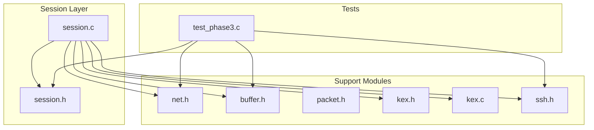
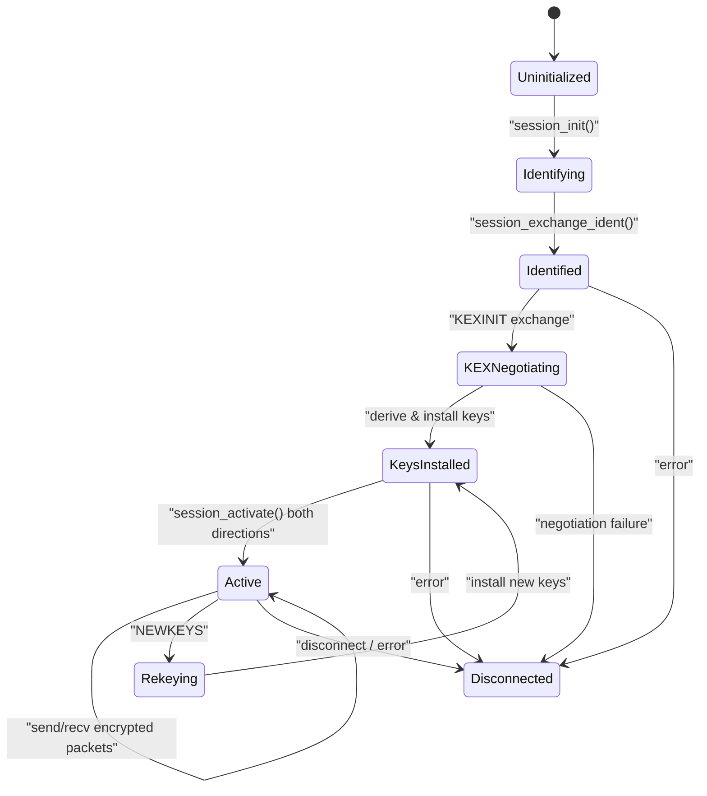
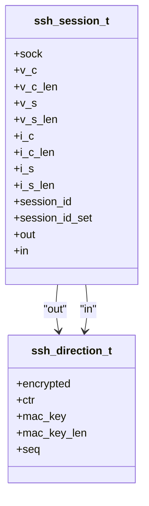
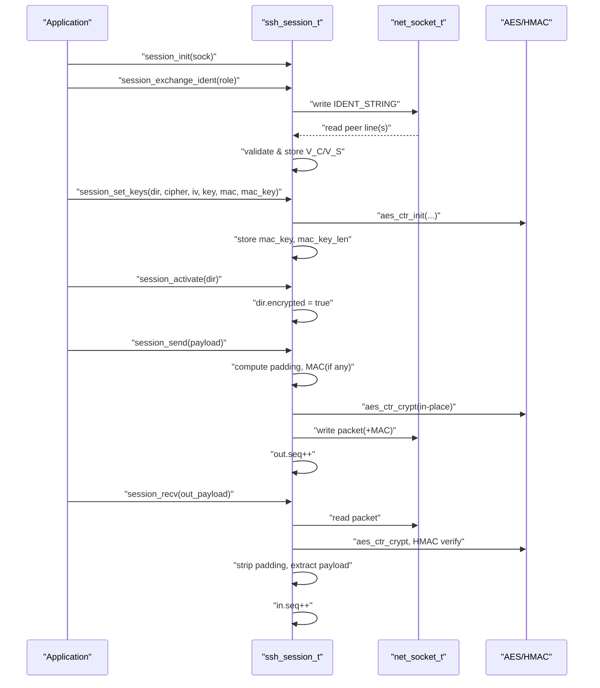
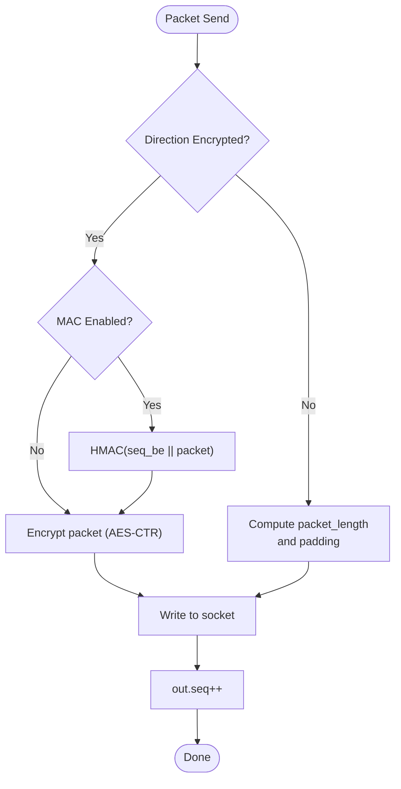
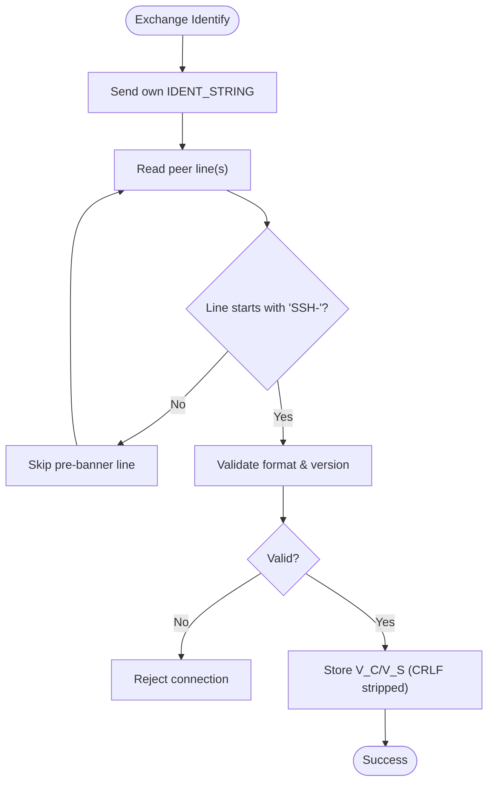
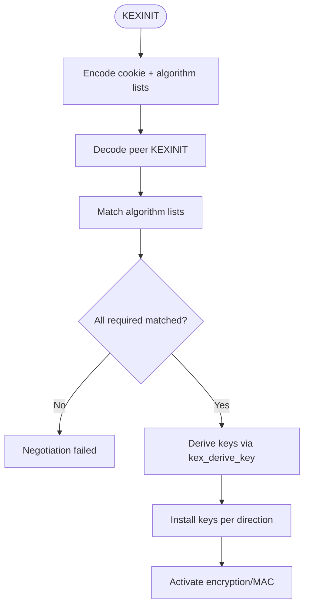
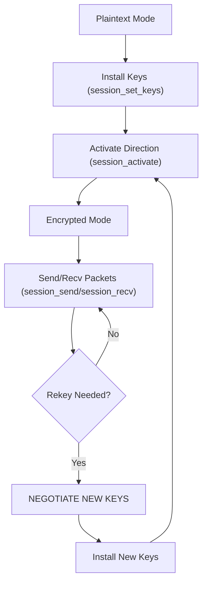
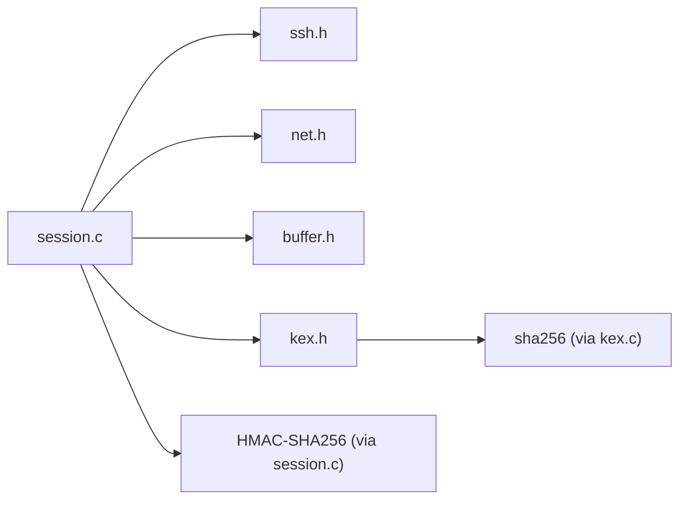

# Session Management

<cite>
**Referenced Files in This Document**
- [session.h](file://src/session.h)
- [session.c](file://src/session.c)
- [ssh.h](file://src/ssh.h)
- [kex.h](file://src/kex.h)
- [kex.c](file://src/kex.c)
- [net.h](file://src/net.h)
- [buffer.h](file://src/buffer.h)
- [packet.h](file://src/packet.h)
- [test_phase3.c](file://tests/test_phase3.c)
</cite>

## Table of Contents
1. [Introduction](#introduction)
2. [Project Structure](#project-structure)
3. [Core Components](#core-components)
4. [Architecture Overview](#architecture-overview)
5. [Detailed Component Analysis](#detailed-component-analysis)
6. [Dependency Analysis](#dependency-analysis)
7. [Performance Considerations](#performance-considerations)
8. [Troubleshooting Guide](#troubleshooting-guide)
9. [Conclusion](#conclusion)
10. [Appendices](#appendices)

## Introduction
This document explains the SSH transport session management implementation, focusing on the state machine that drives the SSH protocol flow from initialization through key exchange to active data transfer. It documents the ssh_session_t structure and its per-direction encryption context, sequence numbers, and protocol version information. It also covers packet encryption and decryption with strict sequence number handling, version banner exchange, protocol flow control, error recovery strategies, resource cleanup, integration with the network layer for I/O, debugging techniques, and security considerations such as proper key management and secure session termination.

## Project Structure
The session management is implemented primarily in the session module, which builds on a small set of supporting modules:
- Network I/O abstraction (net.h)
- Buffer utilities (buffer.h)
- SSH constants and message types (ssh.h)
- Key exchange negotiation and derivation (kex.h, kex.c)
- Packet framing helpers (packet.h)
- Tests demonstrating end-to-end session behavior (test_phase3.c)

**Diagram sources**
- [session.h:1-89](file://src/session.h#L1-L89)
- [session.c:1-363](file://src/session.c#L1-L363)
- [ssh.h:1-147](file://src/ssh.h#L1-L147)
- [kex.h:1-52](file://src/kex.h#L1-L52)
- [kex.c:1-230](file://src/kex.c#L1-L230)
- [net.h:1-58](file://src/net.h#L1-L58)
- [buffer.h:1-50](file://src/buffer.h#L1-L50)
- [packet.h:1-28](file://src/packet.h#L1-L28)
- [test_phase3.c:1-511](file://tests/test_phase3.c#L1-L511)

**Section sources**
- [session.h:1-89](file://src/session.h#L1-L89)
- [session.c:1-363](file://src/session.c#L1-L363)
- [ssh.h:1-147](file://src/ssh.h#L1-L147)
- [kex.h:1-52](file://src/kex.h#L1-L52)
- [kex.c:1-230](file://src/kex.c#L1-L230)
- [net.h:1-58](file://src/net.h#L1-L58)
- [buffer.h:1-50](file://src/buffer.h#L1-L50)
- [packet.h:1-28](file://src/packet.h#L1-L28)
- [test_phase3.c:1-511](file://tests/test_phase3.c#L1-L511)

## Core Components
- ssh_session_t: Represents an SSH transport session, including the underlying socket, identification strings, raw KEXINIT payloads, the first-exchange hash (session_id), and two directions (out/in). Each direction holds encryption state, MAC keys, and a per-direction sequence counter.
- ssh_direction_t: Per-direction state containing whether encryption is active, AES-CTR context, MAC key material, and the continuous sequence number.
- Key exchange proposal structures: ssh_kex_init_t and ssh_kex_proposal_t describe algorithm negotiation inputs and outputs.
- Network and buffer abstractions: net_socket_t and ssh_buf_t provide platform-independent I/O and dynamic buffers used by the session layer.

Key responsibilities:
- Version banner exchange and validation
- Installation and activation of per-direction encryption and MAC
- Binary packet framing, encryption, MAC computation/verification, and sequence number handling
- Resource lifecycle management (init/free)

**Section sources**
- [session.h:19-56](file://src/session.h#L19-L56)
- [session.c:14-30](file://src/session.c#L14-L30)
- [kex.h:9-33](file://src/kex.h#L9-L33)
- [net.h:9-24](file://src/net.h#L9-L24)
- [buffer.h:8-13](file://src/buffer.h#L8-L13)

## Architecture Overview
The session layer implements the SSH transport state machine across three primary phases:
1. Identification phase: Exchange and validate SSH identification strings.
2. Key exchange phase: Negotiate algorithms, perform key exchange, derive keys, install them per direction, and activate encryption/MAC.
3. Data transfer phase: Send and receive encrypted packets with strict sequence numbering and MAC verification.

**Diagram sources**
- [session.c:83-126](file://src/session.c#L83-L126)
- [session.c:130-169](file://src/session.c#L130-L169)
- [session.c:196-362](file://src/session.c#L196-L362)
- [kex.c:25-46](file://src/kex.c#L25-L46)
- [kex.c:153-174](file://src/kex.c#L153-L174)
- [ssh.h:17-25](file://src/ssh.h#L17-L25)

## Detailed Component Analysis

### ssh_session_t and ssh_direction_t
- ssh_session_t fields:
  - sock: underlying network socket
  - v_c/v_s: client/server identification strings (CR/LF excluded)
  - i_c/i_s: raw KEXINIT payloads including message-type byte
  - session_id: first exchange hash (constant across rekeys)
  - out/in: per-direction state
- ssh_direction_t fields:
  - encrypted: flag indicating cipher+MAC active
  - ctr: AES-CTR keystream context
  - mac_key/mac_key_len: HMAC key and length (0 means no MAC)
  - seq: per-direction sequence number (continuous, never reset)

**Diagram sources**
- [session.h:27-56](file://src/session.h#L27-L56)

**Section sources**
- [session.h:27-56](file://src/session.h#L27-L56)

### Session Lifecycle
- Initialization:
  - session_init zeroes the session, stores the socket, and prepares it for identification exchange.
- Identification exchange:
  - session_exchange_ident sends our identification string, reads peer lines, skips pre-banners, validates format, and stores both V_C and V_S.
- Key installation and activation:
  - session_set_keys installs cipher and MAC parameters without enabling encryption until session_activate is called.
  - session_activate flips the encrypted flag for the direction.
- Packet I/O:
  - session_send constructs packets with padding, computes MAC when enabled, encrypts if active, writes to the socket, and increments the outbound sequence number.
  - session_recv reads either plaintext or encrypted packets, decrypts, verifies MAC, strips padding, extracts payload, and increments the inbound sequence number.

**Diagram sources**
- [session.c:14-30](file://src/session.c#L14-L30)
- [session.c:83-126](file://src/session.c#L83-L126)
- [session.c:130-169](file://src/session.c#L130-L169)
- [session.c:196-362](file://src/session.c#L196-L362)

**Section sources**
- [session.c:14-30](file://src/session.c#L14-L30)
- [session.c:83-126](file://src/session.c#L83-L126)
- [session.c:130-169](file://src/session.c#L130-L169)
- [session.c:196-362](file://src/session.c#L196-L362)

### Packet Encryption/Decryption and Sequence Handling
- Outbound:
  - Computes packet_length and padding to satisfy block alignment and minimum padding constraints.
  - If MAC is enabled, computes HMAC over sequence_be || unencrypted_packet before encryption.
  - Encrypts the entire packet (excluding appended MAC) using AES-CTR in place.
  - Writes ciphertext (+MAC) to the socket and increments out.seq.
- Inbound:
  - If not encrypted, reads packet_length and payload directly; validates length and padding constraints.
  - If encrypted, reads one block to decrypt packet_length, then reads and decrypts the rest.
  - Verifies MAC using current in.seq and rejects mismatched packets.
  - Extracts payload after stripping padding and increments in.seq.

**Diagram sources**
- [session.c:196-256](file://src/session.c#L196-L256)

**Section sources**
- [session.c:196-256](file://src/session.c#L196-L256)
- [session.c:264-362](file://src/session.c#L264-L362)

### Version Banner Exchange
- The implementation enforces RFC 4253 §4.2:
  - Validates prefix "SSH-", protocol version "2.0" or compatibility "1.99", softwareversion rules, and optional comments.
  - Skips non-"SSH-" pre-lines up to a bounded number of attempts.
  - Stores CR/LF-excluded identification strings for both sides.

**Diagram sources**
- [session.c:34-81](file://src/session.c#L34-L81)
- [session.c:83-126](file://src/session.c#L83-L126)

**Section sources**
- [session.c:34-81](file://src/session.c#L34-L81)
- [session.c:83-126](file://src/session.c#L83-L126)

### Key Exchange Integration
- Default proposals include curve25519-sha256, ssh-ed25519, aes128-ctr/aes256-ctr, hmac-sha2-256, none compression.
- kex_negotiate matches client and server lists to select mutually acceptable algorithms.
- kex_derive_key implements RFC 4253 §7.2 key derivation using SHA-256.

**Diagram sources**
- [kex.c:25-46](file://src/kex.c#L25-L46)
- [kex.c:48-68](file://src/kex.c#L48-L68)
- [kex.c:70-96](file://src/kex.c#L70-L96)
- [kex.c:153-174](file://src/kex.c#L153-L174)
- [kex.c:192-229](file://src/kex.c#L192-L229)

**Section sources**
- [kex.c:25-46](file://src/kex.c#L25-L46)
- [kex.c:153-174](file://src/kex.c#L153-L174)
- [kex.c:192-229](file://src/kex.c#L192-L229)

### Protocol Flow Control and State Transitions
- Sequence numbers are per-direction and continuous across rekeys, ensuring correct ordering and integrity checks.
- Packet sizes are constrained by MAX_PACKET_SIZE and MIN_PADDING_SIZE to prevent oversized or malformed packets.
- The session transitions from plaintext to encrypted mode only after NEWKEYS and activation.

**Diagram sources**
- [session.c:130-169](file://src/session.c#L130-L169)
- [session.c:196-362](file://src/session.c#L196-L362)
- [ssh.h:12-15](file://src/ssh.h#L12-L15)

**Section sources**
- [session.c:130-169](file://src/session.c#L130-L169)
- [session.c:196-362](file://src/session.c#L196-L362)
- [ssh.h:12-15](file://src/ssh.h#L12-L15)

### Error Recovery Strategies
- Identification errors:
  - Invalid banners or too many pre-lines cause immediate rejection.
- Packet framing errors:
  - Malformed lengths, insufficient padding, or empty payloads are rejected.
- MAC failures:
  - Any mismatch triggers a hard failure; callers should disconnect immediately.
- Resource cleanup:
  - session_free releases stored KEXINIT payloads; application must close sockets and free buffers.

**Section sources**
- [session.c:83-126](file://src/session.c#L83-L126)
- [session.c:264-362](file://src/session.c#L264-L362)
- [session.c:21-30](file://src/session.c#L21-L30)

### Resource Cleanup Procedures
- session_free frees dynamically allocated KEXINIT payloads and resets lengths.
- Application code should close sockets via net_close and free buffers via buf_free.
- Tests demonstrate proper init/free patterns around session objects and buffers.

**Section sources**
- [session.c:21-30](file://src/session.c#L21-L30)
- [test_phase3.c:122-153](file://tests/test_phase3.c#L122-L153)
- [test_phase3.c:207-254](file://tests/test_phase3.c#L207-L254)

### Examples of Session Setup Patterns
- Plaintext framing test demonstrates sending multiple payloads and verifying sequence counters increment correctly in both directions.
- Encrypted framing tests show setting keys for both directions, activating encryption, and performing round-trip send/recv with various payload sizes.
- MAC enforcement test shows that tampering with receiver’s MAC key causes subsequent recv to fail.

**Section sources**
- [test_phase3.c:207-254](file://tests/test_phase3.c#L207-L254)
- [test_phase3.c:258-324](file://tests/test_phase3.c#L258-L324)
- [test_phase3.c:378-420](file://tests/test_phase3.c#L378-L420)

### Integration with Network Layer for I/O Operations
- The session uses net_read_full, net_write_full, and net_read_line for reliable blocking I/O.
- Platform-specific socket types and macros are abstracted via net.h.

**Section sources**
- [session.c:83-126](file://src/session.c#L83-L126)
- [session.c:196-362](file://src/session.c#L196-L362)
- [net.h:46-56](file://src/net.h#L46-L56)

### Debugging Techniques for Session State Issues
- Inspect sequence numbers:
  - Verify out.seq and in.seq increment as expected after each send/recv.
- Validate MAC keys:
  - Ensure mac_key_len is set appropriately and not accidentally modified.
- Check flags:
  - Confirm dir.encrypted is set only after activation.
- Use tests as templates:
  - Reproduce issues using loopback pairs and minimal payloads to isolate problems.

**Section sources**
- [test_phase3.c:207-254](file://tests/test_phase3.c#L207-L254)
- [test_phase3.c:258-324](file://tests/test_phase3.c#L258-L324)

### Security Considerations
- Proper key management:
  - Only accept supported ciphers (aes128-ctr, aes256-ctr) and MACs (hmac-sha2-256 or none).
  - Validate IV and key lengths strictly during session_set_keys.
- Secure session termination:
  - On MAC failure or malformed packets, terminate the connection immediately.
  - Avoid logging sensitive material; rely on structured error codes and disconnect reasons defined in ssh.h.
- Rekeying:
  - Maintain continuous sequence numbers across rekeys to preserve integrity and ordering.

**Section sources**
- [session.c:130-169](file://src/session.c#L130-L169)
- [session.c:318-337](file://src/session.c#L318-L337)
- [ssh.h:59-75](file://src/ssh.h#L59-L75)

## Dependency Analysis
The session module depends on:
- ssh.h for constants and message types
- net.h for platform-independent I/O
- buffer.h for dynamic buffers
- kex.h/kex.c for algorithm negotiation and key derivation
- sha256/hmac implementations indirectly via session.c for MAC operations

**Diagram sources**
- [session.c:1-10](file://src/session.c#L1-L10)
- [kex.c:1-6](file://src/kex.c#L1-L6)
- [ssh.h:1-15](file://src/ssh.h#L1-L15)
- [net.h:1-10](file://src/net.h#L1-L10)
- [buffer.h:1-10](file://src/buffer.h#L1-L10)

**Section sources**
- [session.c:1-10](file://src/session.c#L1-L10)
- [kex.c:1-6](file://src/kex.c#L1-L6)
- [ssh.h:1-15](file://src/ssh.h#L1-L15)
- [net.h:1-10](file://src/net.h#L1-L10)
- [buffer.h:1-10](file://src/buffer.h#L1-L10)

## Performance Considerations
- In-place encryption minimizes memory copies for CTR mode.
- MAC computation occurs before encryption to avoid redundant work.
- Padding calculation ensures minimal overhead while satisfying block alignment requirements.
- Using fixed-size buffers and avoiding excessive allocations improves throughput.

[No sources needed since this section provides general guidance]

## Troubleshooting Guide
Common issues and resolutions:
- Connection fails during identification:
  - Verify peer sends a valid "SSH-2.0-..." or "SSH-1.99-..." banner within allowed limits.
- Packet receive returns error:
  - Check packet_length bounds and padding_length constraints.
  - For encrypted mode, ensure MAC keys match and sequence numbers are synchronized.
- Unexpected sequence mismatches:
  - Confirm both directions’ sequence counters increment exactly once per packet.
- Memory leaks:
  - Ensure session_free is called and all buffers are freed.

**Section sources**
- [session.c:83-126](file://src/session.c#L83-L126)
- [session.c:264-362](file://src/session.c#L264-L362)
- [test_phase3.c:422-469](file://tests/test_phase3.c#L422-L469)

## Conclusion
The SSH transport session management in this repository provides a robust, RFC-aligned implementation of the SSH protocol flow. It cleanly separates concerns between identification, key exchange, and data transfer, while enforcing strict packet framing, encryption, and MAC verification. The per-direction state model with continuous sequence numbers ensures integrity and order across rekeys. Tests demonstrate correct behavior for plaintext and encrypted modes, MAC enforcement, and error handling. Following the documented lifecycle and security practices will help integrate this session layer safely into applications requiring secure SSH transport.

[No sources needed since this section summarizes without analyzing specific files]

## Appendices

### API Reference Summary
- session_init(session, sock): Initialize session state.
- session_free(session): Release resources.
- session_ident_check(line, len): Validate identification line.
- session_exchange_ident(session, role): Perform banner exchange.
- session_set_keys(direction, cipher, iv, key, mac, mac_key): Install keys.
- session_activate(direction): Enable encryption/MAC.
- session_send(session, payload, len): Send packet.
- session_send_buf(session, payload_buf): Send buffered payload.
- session_recv(session, out_payload): Receive and parse packet.

**Section sources**
- [session.h:58-86](file://src/session.h#L58-L86)