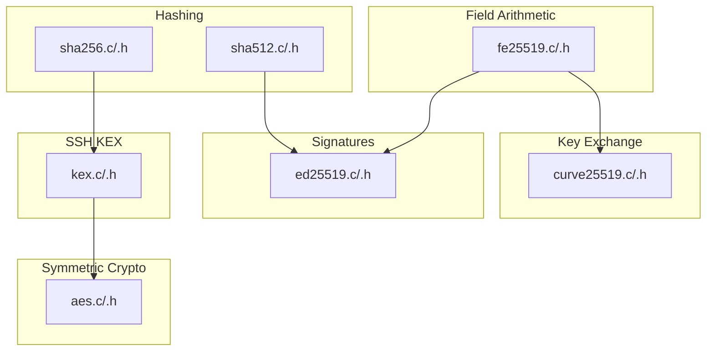
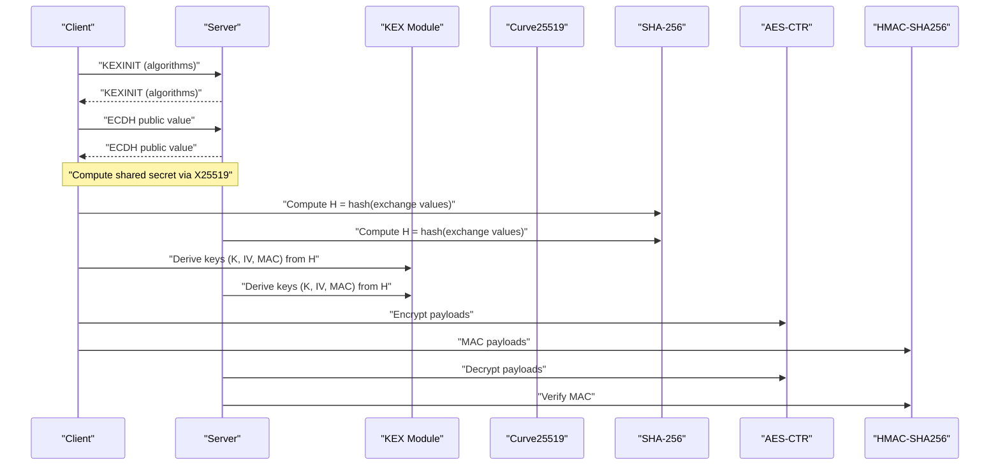
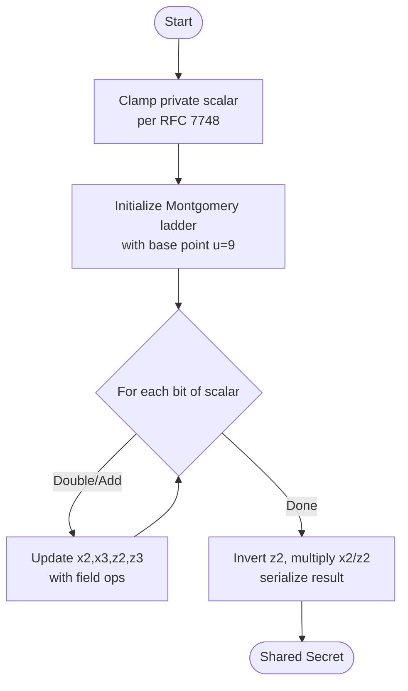
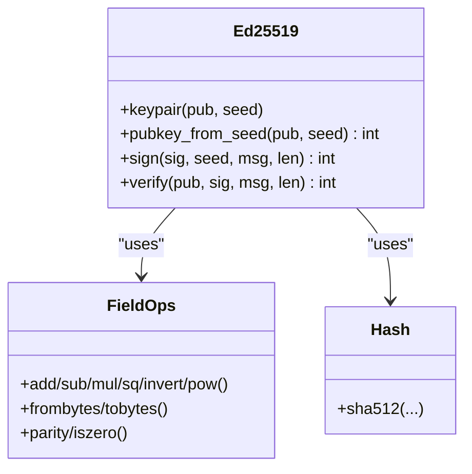
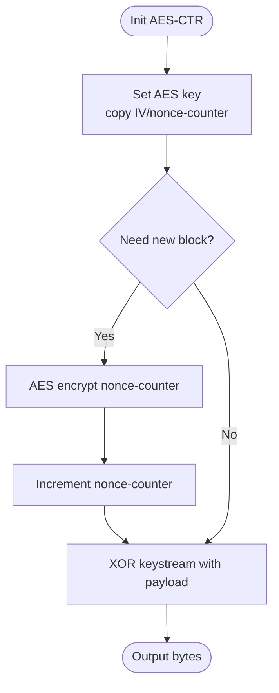
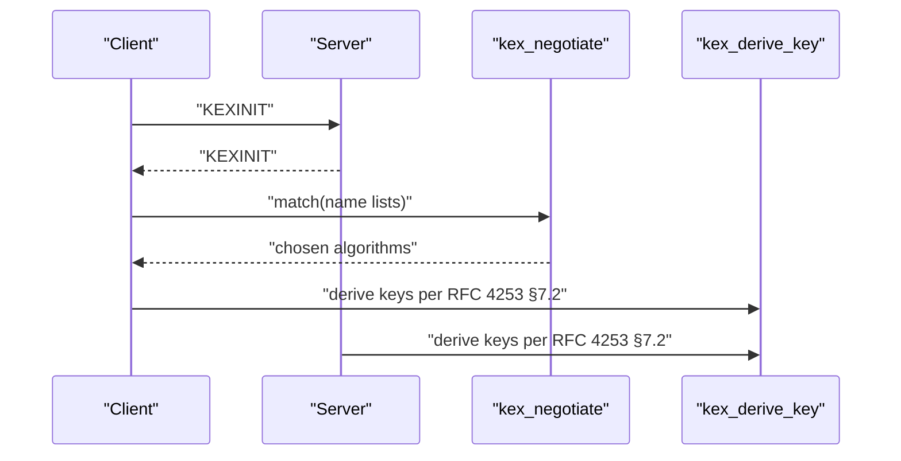
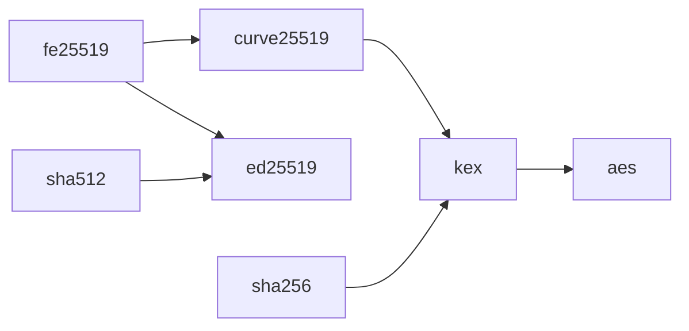

# Cryptographic Implementation

<cite>
**Referenced Files in This Document**
- [kex.h](file://src/kex.h)
- [kex.c](file://src/kex.c)
- [curve25519.h](file://src/curve25519.h)
- [curve25519.c](file://src/curve25519.c)
- [fe25519.h](file://src/fe25519.h)
- [fe25519.c](file://src/fe25519.c)
- [ed25519.h](file://src/ed25519.h)
- [ed25519.c](file://src/ed25519.c)
- [aes.h](file://src/aes.h)
- [aes.c](file://src/aes.c)
- [sha256.h](file://src/sha256.h)
- [sha256.c](file://src/sha256.c)
- [sha512.h](file://src/sha512.h)
- [sha512.c](file://src/sha512.c)
- [test_phase2.c](file://tests/test_phase2.c)
- [test_phase3.c](file://tests/test_phase3.c)
</cite>

## Table of Contents
1. Introduction
2. Project Structure
3. Core Components
4. Architecture Overview
5. Detailed Component Analysis
6. Dependency Analysis
7. Performance Considerations
8. Troubleshooting Guide
9. Conclusion
10. Appendices

## Introduction
This document explains the cryptographic implementation in Coalesce with a focus on:
- Key exchange using Curve25519 ECDH (X25519)
- Symmetric encryption using AES in CTR mode
- Digital signatures using Ed25519
- Hash functions SHA-256 and SHA-512
It covers mathematical foundations, implementation details, security properties, algorithm negotiation per SSH KEXINIT, key derivation following RFC 4253 §7.2, integration points with the SSH session layer, performance characteristics, security considerations, and testing approaches for correctness.

## Project Structure
Coalesce organizes cryptography by primitive and protocol layer:
- Field arithmetic over GF(2^255-19) underpins both X25519 and Ed25519
- Curve25519 implements X25519 ECDH for key exchange
- Ed25519 provides pure digital signatures for host keys
- AES-CTR provides symmetric encryption for data confidentiality
- SHA-256 and SHA-512 provide hashing and HMAC support
- KEX module handles SSH KEXINIT negotiation and key derivation per RFC 4253 §7.2
- Tests validate primitives and session-layer behavior end-to-end

**Diagram sources**
- [fe25519.c:1-231](file://src/fe25519.c#L1-L231)
- [curve25519.c:1-93](file://src/curve25519.c#L1-L93)
- [ed25519.c:1-430](file://src/ed25519.c#L1-L430)
- [aes.c:1-179](file://src/aes.c#L1-L179)
- [sha256.c:1-184](file://src/sha256.c#L1-L184)
- [sha512.c:1-147](file://src/sha512.c#L1-L147)
- [kex.c:1-230](file://src/kex.c#L1-L230)

**Section sources**
- [kex.c:1-230](file://src/kex.c#L1-L230)
- [curve25519.c:1-93](file://src/curve25519.c#L1-L93)
- [ed25519.c:1-430](file://src/ed25519.c#L1-L430)
- [aes.c:1-179](file://src/aes.c#L1-L179)
- [sha256.c:1-184](file://src/sha256.c#L1-L184)
- [sha512.c:1-147](file://src/sha512.c#L1-L147)

## Core Components
- Curve25519 (X25519): Scalar multiplication on Montgomery curve u-coordinate; clamped scalars; base point scalar multiplication; shared secret computation.
- Ed25519: Pure EdDSA over twisted Edwards curve with SHA-512; keypair generation from seed, signing, verification; constant-time ladder and safe decompression.
- AES-CTR: FIPS 197 block cipher with streaming CTR mode; supports 128/192/256-bit keys; nonce counter increment; encrypt/decrypt symmetry.
- SHA-256: FIPS 180-4 compliant hashing; HMAC-SHA256 implementation for MACs.
- SHA-512: FIPS 180-4 compliant hashing used by Ed25519.
- KEX: KEXINIT encode/decode, name-list negotiation, and key derivation per RFC 4253 §7.2 using SHA-256.

**Section sources**
- [curve25519.h:1-22](file://src/curve25519.h#L1-L22)
- [curve25519.c:1-93](file://src/curve25519.c#L1-L93)
- [ed25519.h:1-32](file://src/ed25519.h#L1-L32)
- [ed25519.c:1-430](file://src/ed25519.c#L1-L430)
- [aes.h:1-38](file://src/aes.h#L1-L38)
- [aes.c:1-179](file://src/aes.c#L1-L179)
- [sha256.h:1-39](file://src/sha256.h#L1-L39)
- [sha256.c:1-184](file://src/sha256.c#L1-L184)
- [sha512.h:1-26](file://src/sha512.h#L1-L26)
- [sha512.c:1-147](file://src/sha512.c#L1-L147)
- [kex.h:1-52](file://src/kex.h#L1-L52)
- [kex.c:1-230](file://src/kex.c#L1-L230)

## Architecture Overview
The SSH handshake uses KEXINIT to negotiate algorithms, performs Curve25519 ECDH to establish a shared secret, computes H (hash of exchange values), then derives keys via kex_derive_key per RFC 4253 §7.2. Derived keys feed AES-CTR and HMAC-SHA256 for encrypted, authenticated transport. Host keys are signed with Ed25519.

**Diagram sources**
- [kex.c:1-230](file://src/kex.c#L1-L230)
- [curve25519.c:1-93](file://src/curve25519.c#L1-L93)
- [sha256.c:1-184](file://src/sha256.c#L1-L184)
- [aes.c:1-179](file://src/aes.c#L1-L179)

## Detailed Component Analysis

### Curve25519 (X25519) Key Exchange
- Mathematical foundation: Montgomery curve y^2 = x^3 + 486664x^2 + x over GF(2^255-19); X25519 operates on u-coordinates with constant-time ladder.
- Implementation highlights:
  - Scalar clamping per RFC 7748 to ensure safe subgroup operations.
  - Base point is u=9; public key derived via curve25519_base.
  - Shared secret computed via curve25519_eval using Montgomery ladder with conditional swaps to avoid timing leaks.
- Security properties:
  - Resistance to small-subgroup attacks due to clamping and curve choice.
  - Constant-time operations reduce side-channel risk.
- Integration:
  - Used during SSH key exchange to compute shared secret fed into KEX hash and key derivation.

**Diagram sources**
- [curve25519.c:1-93](file://src/curve25519.c#L1-L93)
- [fe25519.c:1-231](file://src/fe25519.c#L1-L231)

**Section sources**
- [curve25519.h:1-22](file://src/curve25519.h#L1-L22)
- [curve25519.c:1-93](file://src/curve25519.c#L1-L93)
- [fe25519.h:1-35](file://src/fe25519.h#L1-L35)
- [fe25519.c:1-231](file://src/fe25519.c#L1-L231)

### Ed25519 Digital Signatures
- Mathematical foundation: Twisted Edwards curve over GF(2^255-19) with group order L; pure EdDSA scheme using SHA-512.
- Implementation highlights:
  - Seed expansion to derive scalar a and randomizer r via SHA-512.
  - Point compression/decompression with sqrt(-1) and parity checks.
  - Signing: R = rB, k = SHA-512(R||A||M) mod L, S = r + k·a mod L.
  - Verification: Check [S]B - [k]A == R with canonicality checks.
- Security properties:
  - Deterministic nonces via seed-derived r prevent nonce reuse.
  - Constant-time ladder and careful comparisons mitigate side channels.
  - Strict validation rejects invalid points and out-of-range S.

**Diagram sources**
- [ed25519.c:1-430](file://src/ed25519.c#L1-L430)
- [sha512.c:1-147](file://src/sha512.c#L1-L147)
- [fe25519.c:1-231](file://src/fe25519.c#L1-L231)

**Section sources**
- [ed25519.h:1-32](file://src/ed25519.h#L1-L32)
- [ed25519.c:1-430](file://src/ed25519.c#L1-L430)
- [sha512.h:1-26](file://src/sha512.h#L1-L26)
- [sha512.c:1-147](file://src/sha512.c#L1-L147)

### AES-CTR Symmetric Encryption
- Mathematical foundation: AES block cipher (FIPS 197) with CTR mode (NIST SP 800-38A).
- Implementation highlights:
  - Key setup for 128/192/256-bit keys; rounds configured accordingly.
  - CTR mode maintains a 128-bit nonce+counter; increments per block; keystream XORed with plaintext/ciphertext.
  - Encrypt and decrypt are identical operations.
- Security properties:
  - Requires unique nonce+counter per key to avoid keystream reuse.
  - No authentication; must be paired with MAC or AEAD.

**Diagram sources**
- [aes.c:1-179](file://src/aes.c#L1-L179)

**Section sources**
- [aes.h:1-38](file://src/aes.h#L1-L38)
- [aes.c:1-179](file://src/aes.c#L1-L179)

### SHA-256 and SHA-512 Hash Functions
- SHA-256: FIPS 180-4; streaming context; HMAC-SHA256 implemented for MAC usage.
- SHA-512: FIPS 180-4; used by Ed25519 for deterministic nonce and message hashing.
- Properties: Preimage resistance, collision resistance assumptions; suitable for KEX hash and MAC.

**Section sources**
- [sha256.h:1-39](file://src/sha256.h#L1-L39)
- [sha256.c:1-184](file://src/sha256.c#L1-L184)
- [sha512.h:1-26](file://src/sha512.h#L1-L26)
- [sha512.c:1-147](file://src/sha512.c#L1-L147)

### Algorithm Negotiation and Key Derivation (RFC 4253 §7.2)
- Negotiation:
  - KEXINIT encodes cookies and algorithm lists; decode reconstructs proposals.
  - Name-list matching selects mutually acceptable algorithms for KEX, host key, ciphers, MACs, compression.
- Key derivation:
  - Computes K1 = HASH(K || H || X || session_id) where X is a single-byte letter (e.g., 'A', 'D', etc.).
  - Extends output if needed by chaining previous digest into next iteration.
  - Uses SHA-256 for the KEX hash and derivation in this implementation.

**Diagram sources**
- [kex.c:1-230](file://src/kex.c#L1-L230)

**Section sources**
- [kex.h:1-52](file://src/kex.h#L1-L52)
- [kex.c:1-230](file://src/kex.c#L1-L230)

## Dependency Analysis
- fe25519 is foundational for both curve25519 and ed25519.
- sha512 is required by ed25519; sha256 is used by kex_derive_key and HMAC.
- aes depends only on internal block cipher logic; used by session layer for encryption.
- kex ties together negotiation and derivation, consuming outputs from curve25519 and hashes.

**Diagram sources**
- [fe25519.c:1-231](file://src/fe25519.c#L1-L231)
- [curve25519.c:1-93](file://src/curve25519.c#L1-L93)
- [ed25519.c:1-430](file://src/ed25519.c#L1-L430)
- [sha512.c:1-147](file://src/sha512.c#L1-L147)
- [sha256.c:1-184](file://src/sha256.c#L1-L184)
- [kex.c:1-230](file://src/kex.c#L1-L230)
- [aes.c:1-179](file://src/aes.c#L1-L179)

**Section sources**
- [kex.c:1-230](file://src/kex.c#L1-L230)
- [curve25519.c:1-93](file://src/curve25519.c#L1-L93)
- [ed25519.c:1-430](file://src/ed25519.c#L1-L430)
- [sha256.c:1-184](file://src/sha256.c#L1-L184)
- [sha512.c:1-147](file://src/sha512.c#L1-L147)
- [aes.c:1-179](file://src/aes.c#L1-L179)

## Performance Considerations
- Field arithmetic uses 51-bit limbs with u128 products for efficient multiplication and squaring in GF(2^255-19).
- Montgomery ladder and Edwards ladder are constant-time, minimizing branch divergence and improving timing robustness.
- AES-CTR streams efficiently by reusing precomputed keystream blocks and incrementing counters in-place.
- SHA-256/512 implementations process data in fixed-size blocks with minimal copying; streaming APIs reduce memory overhead.
- KEX negotiation is O(n) over algorithm lists with simple string scanning; negligible compared to crypto cost.

[No sources needed since this section provides general guidance]

## Troubleshooting Guide
Common issues and diagnostics:
- KEX negotiation failure: Ensure both sides advertise compatible algorithm lists; check match_list behavior and default strings.
- Incorrect key lengths or IV sizes: Validate inputs to session_set_keys; tests assert supported combinations and reject mismatches.
- MAC verification failures: Confirm MAC keys are correctly derived and not tampered; tests simulate MAC key corruption to verify rejection.
- Invalid Ed25519 inputs: Reject non-canonical S values and invalid public keys; tests cover negative cases.
- AES-CTR misuse: Avoid nonce reuse; tests demonstrate round-trip and multi-block streaming consistency.

**Section sources**
- [test_phase3.c:84-118](file://tests/test_phase3.c#L84-L118)
- [test_phase3.c:378-420](file://tests/test_phase3.c#L378-L420)
- [test_phase2.c:118-186](file://tests/test_phase2.c#L118-L186)
- [test_phase2.c:238-312](file://tests/test_phase2.c#L238-L312)

## Conclusion
Coalesce’s cryptographic stack provides a complete, standards-aligned set of primitives for an SSH-like protocol:
- Curve25519 ECDH for secure key exchange
- Ed25519 for strong host key signatures
- AES-CTR for symmetric encryption
- SHA-256/512 for hashing and HMAC
- KEXINIT negotiation and RFC 4253 §7.2 key derivation
The implementation emphasizes correctness through extensive test vectors and negative-case coverage, while maintaining constant-time operations and clear separation of concerns across modules.

[No sources needed since this section summarizes without analyzing specific files]

## Appendices

### Testing Approaches and Coverage
- SHA-256 and HMAC-SHA256 validated against known vectors.
- SHA-512 validated against FIPS examples and multi-block streaming.
- Ed25519 validated against RFC 8032 test vectors and negative cases.
- Curve25519 validated against RFC 7748 test vectors and shared secret equality.
- AES-CTR validated with FIPS block vectors and streaming consistency.
- Session-layer framing and MAC enforcement tested over loopback sockets.

**Section sources**
- [test_phase2.c:41-116](file://tests/test_phase2.c#L41-L116)
- [test_phase2.c:118-186](file://tests/test_phase2.c#L118-L186)
- [test_phase2.c:188-236](file://tests/test_phase2.c#L188-L236)
- [test_phase2.c:238-312](file://tests/test_phase2.c#L238-L312)
- [test_phase3.c:256-324](file://tests/test_phase3.c#L256-L324)
- [test_phase3.c:378-420](file://tests/test_phase3.c#L378-L420)