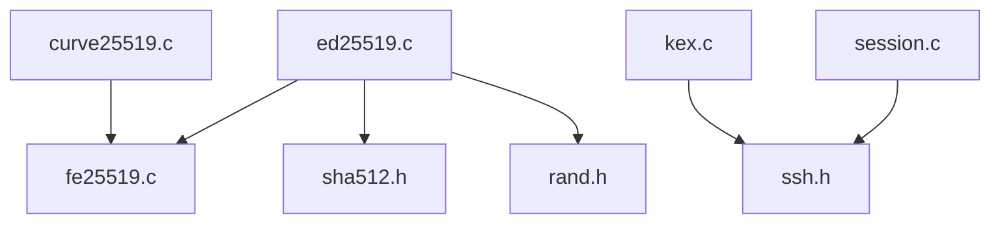
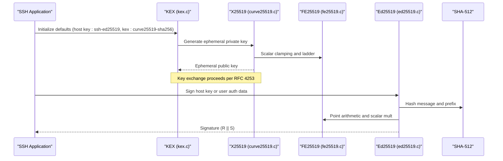
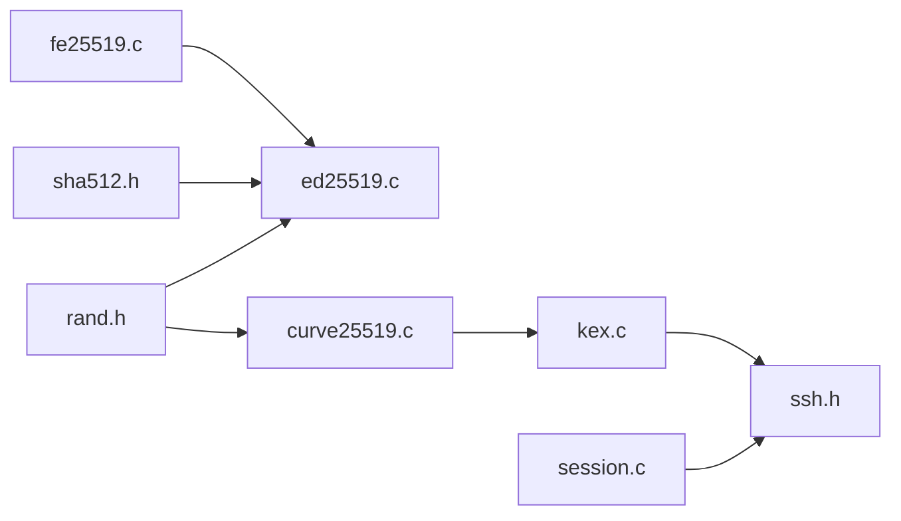

# Digital Signatures

<cite>
**Referenced Files in This Document**
- [ed25519.h](file://src/ed25519.h)
- [ed25519.c](file://src/ed25519.c)
- [fe25519.h](file://src/fe25519.h)
- [fe25519.c](file://src/fe25519.c)
- [curve25519.h](file://src/curve25519.h)
- [curve25519.c](file://src/curve25519.c)
- [kex.c](file://src/kex.c)
- [session.c](file://src/session.c)
- [ssh.h](file://src/ssh.h)
- [test_phase2.c](file://tests/test_phase2.c)
</cite>

## Table of Contents
1. [Introduction](#introduction)
2. [Project Structure](#project-structure)
3. [Core Components](#core-components)
4. [Architecture Overview](#architecture-overview)
5. [Detailed Component Analysis](#detailed-component-analysis)
6. [Dependency Analysis](#dependency-analysis)
7. [Performance Considerations](#performance-considerations)
8. [Troubleshooting Guide](#troubleshooting-guide)
9. [Conclusion](#conclusion)
10. [Appendices](#appendices)

## Introduction
This document explains the Ed25519 digital signature implementation in Coalesce, focusing on key generation, signing, and verification, as well as how it integrates with SSH authentication workflows. It also covers the mathematical foundations (Edwards curves, Schnorr-style signatures), security properties, side-channel resistance, and performance characteristics observed in this codebase.

## Project Structure
The Ed25519 implementation is implemented in pure C and built on a finite field arithmetic layer for GF(2^255 - 19). The relevant modules are:
- Field arithmetic: fe25519.{h,c}
- Curve operations and scalar multiplication: ed25519.c (twisted Edwards group over GF(2^255 - 19))
- X25519 ECDH (for key exchange): curve25519.{h,c}
- SSH negotiation defaults and helpers: kex.c, session.c, ssh.h
- Tests validating Ed25519 behavior against RFC vectors: test_phase2.c

**Diagram sources**
- [ed25519.c:1-15](file://src/ed25519.c#L1-L15)
- [fe25519.c:1-10](file://src/fe25519.c#L1-L10)
- [curve25519.c:1-5](file://src/curve25519.c#L1-L5)
- [kex.c:1-12](file://src/kex.c#L1-L12)
- [session.c:1-10](file://src/session.c#L1-L10)
- [ssh.h:1-15](file://src/ssh.h#L1-L15)

**Section sources**
- [ed25519.h:1-32](file://src/ed25519.h#L1-L32)
- [ed25519.c:1-15](file://src/ed25519.c#L1-L15)
- [fe25519.h:1-35](file://src/fe25519.h#L1-L35)
- [curve25519.h:1-22](file://src/curve25519.h#L1-L22)
- [kex.c:1-12](file://src/kex.c#L1-L12)
- [session.c:1-10](file://src/session.c#L1-L10)
- [ssh.h:1-15](file://src/ssh.h#L1-L15)

## Core Components
- Finite field arithmetic over GF(2^255 - 19) using 51-bit limbs and u128 products for efficient, constant-time operations.
- Twisted Edwards group operations (addition, doubling, point compression/decompression) used by Ed25519.
- Scalar arithmetic modulo L (the prime order of the base point), including reduction and multiply-add.
- Ed25519 API: keypair generation, public key derivation from seed, signing, and verification.
- X25519 ECDH for key exchange during SSH handshake.
- SSH KEX negotiation defaults that include Ed25519 host keys and curve25519 key exchange.

Key responsibilities:
- fe25519.{h,c}: Low-level field ops, serialization, exponentiation, inversion, parity checks.
- ed25519.c: Group math, scalar mult ladder, hashing to scalars, sign/verify per RFC 8032.
- curve25519.{h,c}: X25519 scalar multiplication for ECDH.
- kex.c: Negotiates algorithms including "curve25519-sha256" and "ssh-ed25519".
- session.c: Transport framing, MAC, encryption; not directly implementing Ed25519 but part of the SSH workflow.

**Section sources**
- [fe25519.h:6-35](file://src/fe25519.h#L6-L35)
- [fe25519.c:1-42](file://src/fe25519.c#L1-L42)
- [ed25519.h:7-29](file://src/ed25519.h#L7-L29)
- [ed25519.c:15-123](file://src/ed25519.c#L15-L123)
- [curve25519.h:7-20](file://src/curve25519.h#L7-L20)
- [kex.c:8-12](file://src/kex.c#L8-L12)

## Architecture Overview
The system layers are:
- Cryptographic primitives: fe25519 (field), sha512 (hashing), rand (entropy).
- Elliptic curve groups: twisted Edwards points for Ed25519; Montgomery curve for X25519.
- Protocols: SSH transport/session uses negotiated algorithms; default includes Ed25519 host keys and curve25519 key exchange.

**Diagram sources**
- [kex.c:8-12](file://src/kex.c#L8-L12)
- [curve25519.c:6-68](file://src/curve25519.c#L6-L68)
- [fe25519.c:197-214](file://src/fe25519.c#L197-L214)
- [ed25519.c:314-393](file://src/ed25519.c#L314-L393)

## Detailed Component Analysis

### Finite Field Arithmetic (GF(2^255 - 19))
- Representation: 5 limbs of 51 bits each; carries handled via u128 intermediate products.
- Operations: add, sub (with 2p offset to keep limbs positive), mul, sq, pow, invert, parity, zero-check.
- Serialization: canonical form with conditional subtraction of p using a carry trick.
- Exponents: precomputed constants for inversion ((p-2)), square root ((p+3)/8), and sqrt(-1) ((p-1)/4).

Complexity:
- Multiplication: O(1) with fixed 5x5 limb loops; optimized for constant-time execution.
- Inversion/pow: O(log p) squarings and multiplications.

Side-channel considerations:
- Uses conditional swaps (cswap) and constant-time loops for exponentiation and comparisons.

**Section sources**
- [fe25519.c:10-42](file://src/fe25519.c#L10-L42)
- [fe25519.c:45-105](file://src/fe25519.c#L45-L105)
- [fe25519.c:109-167](file://src/fe25519.c#L109-L167)
- [fe25519.c:197-230](file://src/fe25519.c#L197-L230)

### Edwards Curve Group and Scalar Multiplication
- Extended twisted Edwards coordinates (X:Y:Z:T) provide complete addition formulas without exceptional cases.
- Constant-time Montgomery ladder for scalar multiplication ensures timing uniformity across bit patterns.
- Point compression/decompression uses y-coordinate plus x-parity bit; decompression computes x via sqrt(x^2) with fallback using sqrt(-1).

Security notes:
- Complete addition avoids branch on point at infinity.
- Ladder-based scalar mult avoids secret-dependent branching.

**Section sources**
- [ed25519.c:124-229](file://src/ed25519.c#L124-L229)
- [ed25519.c:231-285](file://src/ed25519.c#L231-L285)

### Scalar Arithmetic Modulo L
- L is the prime order of the base point.
- Reduction is bit-serial and constant-time; compare-and-subtract loop reduces wide integers mod L.
- Multiply-add combines schoolbook multiplication with modular reduction.

Complexity:
- sc_reduce_wide: O(n) bit operations where n is input bit length.
- sc_muladd: O(32^2) byte-level schoolbook product followed by reduction.

**Section sources**
- [ed25519.c:15-123](file://src/ed25519.c#L15-L123)

### Ed25519 Key Generation and Public Key Derivation
- Seed expansion: SHA-512(seed) -> az[64]; lower 32 bytes become scalar a after clamping (bits set/cleared per spec).
- Public key: A = a * B (base point); compress to 32 bytes.

Error handling:
- If random seed generation fails, outputs are zeroed.
- Base point decompression failure returns error.

**Section sources**
- [ed25519.c:314-348](file://src/ed25519.c#L314-L348)

### Signing Algorithm (Schnorr-style over Edwards)
- r = SHA-512(prefix || M) mod L, where prefix is the second half of az.
- R = r * B; encode R into first 32 bytes of signature.
- k = SHA-512(R || A || M) mod L.
- S = r + k*a mod L; append S to signature.

Validation:
- Returns success when all steps complete; errors propagate from point decompression or hash failures.

**Section sources**
- [ed25519.c:350-393](file://src/ed25519.c#L350-L393)

### Verification Algorithm
- Check S < L (reject non-canonical S).
- Decompress base point B and public key A.
- Recompute k = SHA-512(R || A || M) mod L.
- Compute Q = [S]B - [k]A; compare compressed Q with R.

Constant-time comparison:
- Byte-wise XOR accumulation ensures no early exits based on differences.

**Section sources**
- [ed25519.c:396-429](file://src/ed25519.c#L396-L429)

### X25519 ECDH Integration
- Clamps private scalar per RFC 7748.
- Implements Montgomery ladder for u-coordinate-only arithmetic.
- Used for key exchange during SSH handshake; negotiated by default alongside Ed25519 host keys.

**Section sources**
- [curve25519.c:6-93](file://src/curve25519.c#L6-L93)
- [kex.c:8-12](file://src/kex.c#L8-L12)

### SSH Authentication Workflow with Ed25519
- Default host key algorithm is "ssh-ed25519"; key exchange algorithm is "curve25519-sha256".
- During SSH authentication:
  - Host presents its Ed25519 public key; client verifies server’s signature over challenge data using the host key.
  - Client may also sign a challenge with its own Ed25519 key if configured.
- The session layer handles packet framing, encryption, and MAC; Ed25519 signatures are embedded within SSH messages per protocol specifications.

Note: While the repository implements Ed25519 primitives and sets defaults for SSH negotiation, the higher-level message handling for userauth is not shown here; the cryptographic building blocks are present and validated by tests.

**Section sources**
- [kex.c:8-12](file://src/kex.c#L8-L12)
- [ssh.h:17-57](file://src/ssh.h#L17-L57)

## Dependency Analysis

**Diagram sources**
- [ed25519.c:1-15](file://src/ed25519.c#L1-L15)
- [curve25519.c:1-5](file://src/curve25519.c#L1-L5)
- [kex.c:1-12](file://src/kex.c#L1-L12)
- [session.c:1-10](file://src/session.c#L1-L10)

**Section sources**
- [ed25519.c:1-15](file://src/ed25519.c#L1-L15)
- [curve25519.c:1-5](file://src/curve25519.c#L1-L5)
- [kex.c:1-12](file://src/kex.c#L1-L12)
- [session.c:1-10](file://src/session.c#L1-L10)

## Performance Considerations
- Field operations use 51-bit limbs and u128 intermediates to minimize overflow handling overhead while maintaining correctness.
- Scalar multiplication uses a constant-time ladder, avoiding branches dependent on secret scalars.
- Point addition/doubling uses extended coordinates to avoid inversions in inner loops.
- Hashing to scalars uses SHA-512, which is efficient and widely optimized.
- Memory usage is minimal; most state is stack-local.

Practical implications:
- Signing and verification are fast enough for interactive SSH sessions.
- Side-channel resistance is improved by constant-time routines and careful comparisons.

[No sources needed since this section provides general guidance]

## Troubleshooting Guide
Common issues and diagnostics:
- Invalid public key or point: ge_frombytes returns error; ensure inputs are valid compressed Edwards points.
- Non-canonical S: verification rejects S >= L; check signature generation path.
- Wrong message length: verification depends on exact message bytes; ensure consistent hashing inputs.
- Randomness failures: keypair generation zeros outputs if entropy source fails; verify rand_bytes succeeds.

Validation via tests:
- RFC 8032 test vectors confirm correct keygen, signing, and verification behavior.
- Negative tests cover corrupted signatures, wrong messages, and invalid S values.

**Section sources**
- [ed25519.c:396-429](file://src/ed25519.c#L396-L429)
- [test_phase2.c:118-186](file://tests/test_phase2.c#L118-L186)

## Conclusion
Coalesce implements a robust, constant-time Ed25519 signature scheme over twisted Edwards curves using a carefully designed finite field layer. The implementation follows RFC 8032 closely, with thorough validation through test vectors. It integrates with SSH by defaulting to Ed25519 host keys and curve25519 key exchange, enabling secure authentication workflows. The design emphasizes side-channel resistance and performance suitable for real-world network protocols.

[No sources needed since this section summarizes without analyzing specific files]

## Appendices

### Mathematical Foundations Summary
- Edwards curve: Twisted Edwards form with complete addition formulas.
- Schnorr-style signature: Non-interactive proof of knowledge of discrete log using Fiat–Shamir transformation.
- Security: Based on hardness of discrete logarithm problem on Ed25519 curve; resistant to known attacks when implemented correctly.

[No sources needed since this section provides conceptual background]