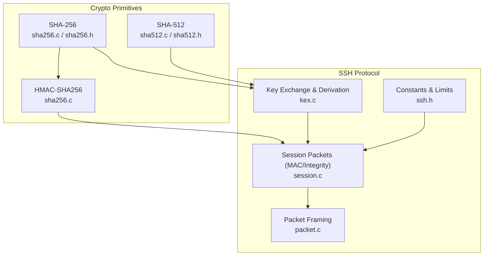
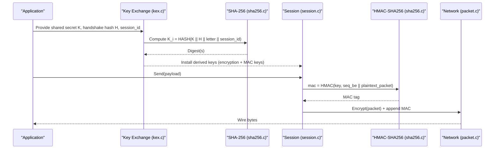
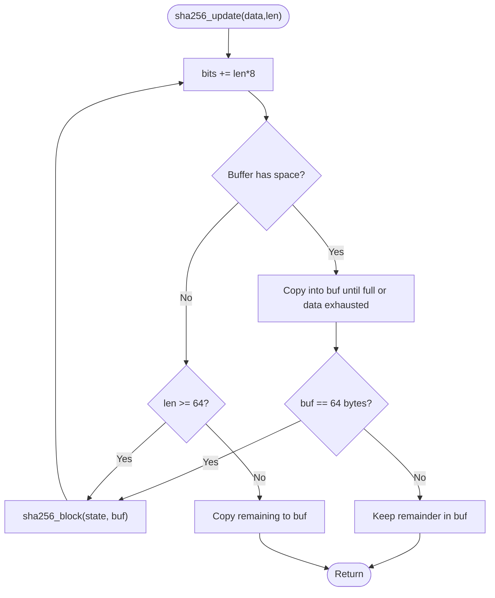
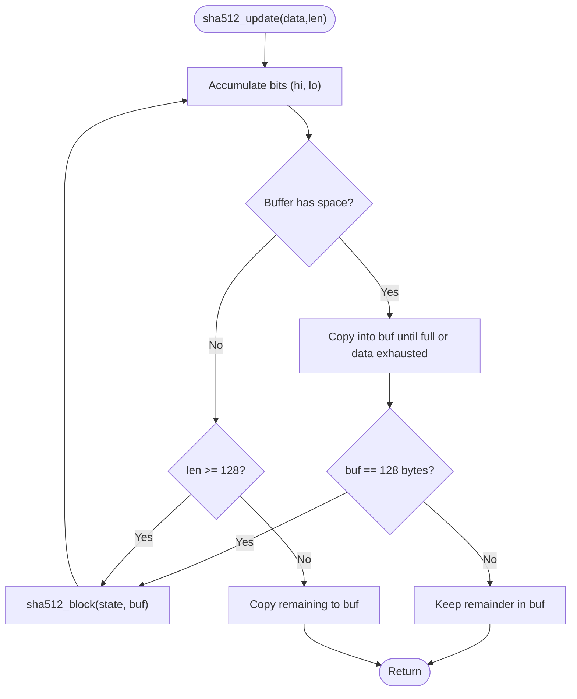
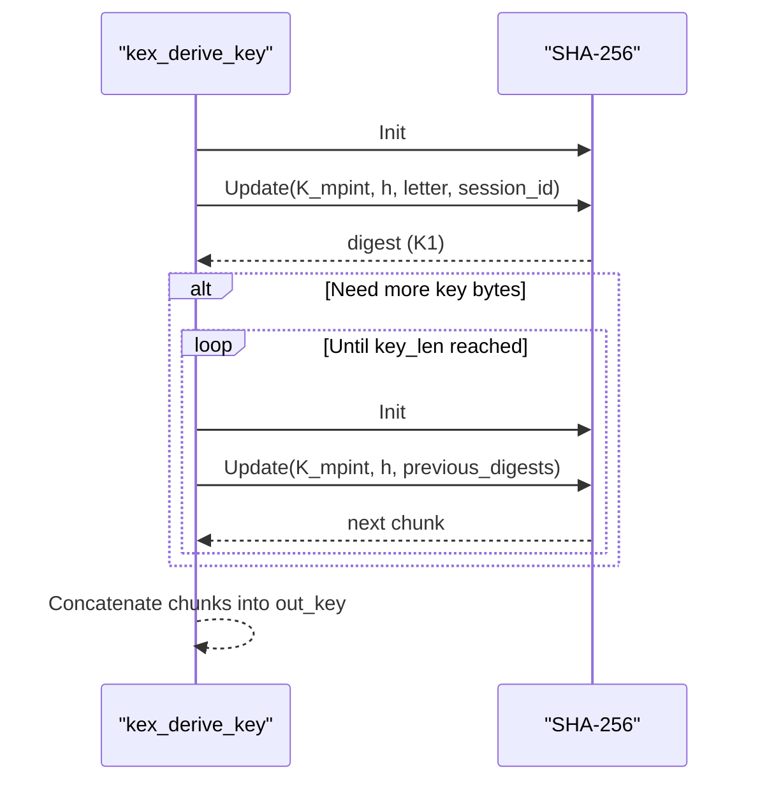
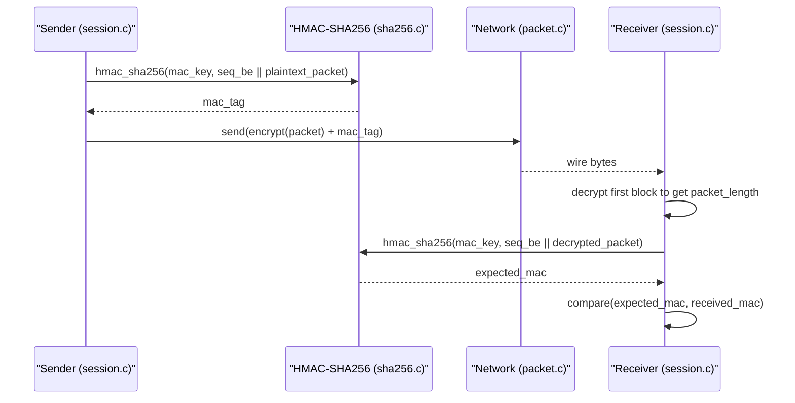
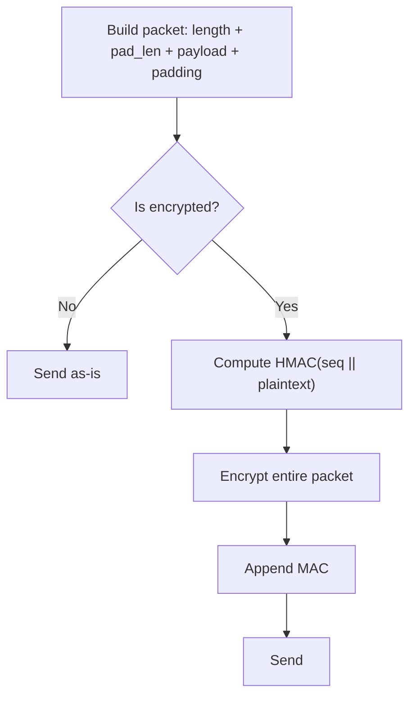
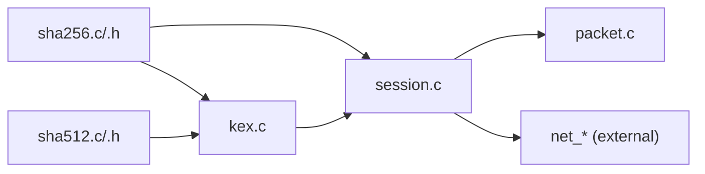

# Hash Functions

<cite>
**Referenced Files in This Document**
- [sha256.c](file://src/sha256.c)
- [sha256.h](file://src/sha256.h)
- [sha512.c](file://src/sha512.c)
- [sha512.h](file://src/sha512.h)
- [kex.c](file://src/kex.c)
- [session.c](file://src/session.c)
- [ssh.h](file://src/ssh.h)
- [packet.c](file://src/packet.c)
- [test_phase2.c](file://tests/test_phase2.c)
- [test_phase3.c](file://tests/test_phase3.c)
</cite>

## Table of Contents
1. [Introduction](#introduction)
2. [Project Structure](#project-structure)
3. [Core Components](#core-components)
4. [Architecture Overview](#architecture-overview)
5. [Detailed Component Analysis](#detailed-component-analysis)
6. [Dependency Analysis](#dependency-analysis)
7. [Performance Considerations](#performance-considerations)
8. [Troubleshooting Guide](#troubleshooting-guide)
9. [Conclusion](#conclusion)
10. [Appendices](#appendices)

## Introduction
This document explains the SHA-2 family hash implementations (SHA-256 and SHA-512) in Coalesce, their mathematical foundations, and how they are used within the SSH protocol for key derivation, MAC computation, and data integrity verification. It also covers performance characteristics, collision resistance properties, and testing approaches to ensure cryptographic correctness.

## Project Structure
Coalesce implements SHA-256 and SHA-512 as standalone modules with streaming APIs and provides HMAC-SHA256 for message authentication. These primitives are integrated into:
- Key exchange key derivation (using SHA-256)
- Packet-level MAC computation and verification (HMAC-SHA256)
- Ed25519 support via SHA-512

**Diagram sources**
- [sha256.c:1-184](file://src/sha256.c#L1-L184)
- [sha512.c:1-147](file://src/sha512.c#L1-L147)
- [kex.c:190-229](file://src/kex.c#L190-L229)
- [session.c:196-362](file://src/session.c#L196-L362)
- [packet.c:52-167](file://src/packet.c#L52-L167)
- [ssh.h:12-16](file://src/ssh.h#L12-L16)

**Section sources**
- [sha256.c:1-184](file://src/sha256.c#L1-L184)
- [sha512.c:1-147](file://src/sha512.c#L1-L147)
- [kex.c:1-230](file://src/kex.c#L1-L230)
- [session.c:1-363](file://src/session.c#L1-L363)
- [packet.c:1-167](file://src/packet.c#L1-L167)
- [ssh.h:1-147](file://src/ssh.h#L1-L147)

## Core Components
- SHA-256: Streaming API with init/update/final, block processing, padding, and big-endian digest output. Includes HMAC-SHA256 per RFC 2104/FIPS 198-1.
- SHA-512: Streaming API with 128-bit length accumulator, block processing, padding, and big-endian digest output. Used by Ed25519 and other components.
- Key derivation: Uses SHA-256 to derive session keys from shared secret, handshake hash, and session ID.
- MAC: Uses HMAC-SHA256 over sequence number and packet payload for integrity protection during encrypted sessions.

**Section sources**
- [sha256.c:28-133](file://src/sha256.c#L28-L133)
- [sha256.c:137-183](file://src/sha256.c#L137-L183)
- [sha512.c:30-146](file://src/sha512.c#L30-L146)
- [kex.c:190-229](file://src/kex.c#L190-L229)
- [session.c:225-237](file://src/session.c#L225-L237)
- [session.c:318-337](file://src/session.c#L318-L337)

## Architecture Overview
The hashing workflow spans three layers:
- Primitive layer: SHA-256/SHA-512 implement FIPS 180-4 algorithms with streaming contexts and deterministic finalization.
- Protocol layer: Key exchange derives keys using SHA-256; MAC uses HMAC-SHA256 for integrity.
- Transport layer: Packet framing ensures correct padding and block alignment; MAC is appended after encryption.

**Diagram sources**
- [kex.c:190-229](file://src/kex.c#L190-L229)
- [sha256.c:62-133](file://src/sha256.c#L62-L133)
- [session.c:225-237](file://src/session.c#L225-L237)
- [packet.c:52-105](file://src/packet.c#L52-L105)

## Detailed Component Analysis

### SHA-256 Implementation
- Block function: Processes 64-byte blocks through 64 rounds using precomputed constants, rotation, and logical functions.
- Streaming: Maintains state, bit count, and buffer; handles partial blocks and finalization with 0x80 padding and big-endian length.
- HMAC-SHA256: Implements RFC 2104 with inner/outer contexts and key normalization.

**Diagram sources**
- [sha256.c:72-98](file://src/sha256.c#L72-L98)
- [sha256.c:28-60](file://src/sha256.c#L28-L60)

**Section sources**
- [sha256.c:28-133](file://src/sha256.c#L28-L133)
- [sha256.h:7-22](file://src/sha256.h#L7-L22)

### SHA-512 Implementation
- Block function: Processes 128-byte blocks through 80 rounds using 64-bit arithmetic and rotations.
- Streaming: Maintains high/low 64-bit bit counters and a 128-byte buffer; finalizes with 0x80 padding and 128-bit big-endian length.
- Output: 64-byte digest in big-endian order.

**Diagram sources**
- [sha512.c:76-106](file://src/sha512.c#L76-L106)
- [sha512.c:30-63](file://src/sha512.c#L30-L63)

**Section sources**
- [sha512.c:30-146](file://src/sha512.c#L30-L146)
- [sha512.h:7-23](file://src/sha512.h#L7-L23)

### Key Derivation Using SHA-256
- Purpose: Derive per-direction keys for encryption and MAC from shared secret K, handshake hash H, session ID, and direction letter.
- Method: Iteratively compute K1 = HASH(K || H || letter || session_id), then K2 = HASH(K || H || K1), etc., until enough key material is produced.

**Diagram sources**
- [kex.c:190-229](file://src/kex.c#L190-L229)
- [sha256.c:62-133](file://src/sha256.c#L62-L133)

**Section sources**
- [kex.c:190-229](file://src/kex.c#L190-L229)

### MAC Computation and Verification (HMAC-SHA256)
- Sending path: Computes HMAC over sequence number (big-endian) and unencrypted packet contents, appends MAC after ciphertext.
- Receiving path: Decrypts packet, recomputes HMAC over sequence number and decrypted packet, compares with received MAC using constant-time comparison.

**Diagram sources**
- [session.c:225-237](file://src/session.c#L225-L237)
- [session.c:318-337](file://src/session.c#L318-L337)
- [sha256.c:137-183](file://src/sha256.c#L137-L183)
- [packet.c:52-105](file://src/packet.c#L52-L105)

**Section sources**
- [session.c:196-362](file://src/session.c#L196-L362)
- [sha256.c:137-183](file://src/sha256.c#L137-L183)

### Data Integrity and Padding Rules
- Packet framing enforces minimum padding (4 bytes) and total length multiples of block size (8 or cipher block).
- Validation checks reject invalid padding lengths and payloads that would result in zero-length content.

**Diagram sources**
- [packet.c:52-105](file://src/packet.c#L52-L105)
- [session.c:196-256](file://src/session.c#L196-L256)

**Section sources**
- [packet.c:52-167](file://src/packet.c#L52-L167)
- [session.c:196-256](file://src/session.c#L196-L256)
- [ssh.h:12-16](file://src/ssh.h#L12-L16)

## Dependency Analysis
- SHA-256 depends on standard library for memory operations and defines its own block constants and helpers.
- SHA-512 similarly depends on standard library and defines 64-bit operations.
- Key exchange module depends on SHA-256 for deriving keys and on random source for cookies.
- Session module depends on SHA-256/HMAC-SHA256 for MAC and on AES-CTR for encryption.
- Packet module depends on network I/O and session constraints.

**Diagram sources**
- [sha256.c:1-184](file://src/sha256.c#L1-L184)
- [sha512.c:1-147](file://src/sha512.c#L1-L147)
- [kex.c:1-230](file://src/kex.c#L1-L230)
- [session.c:1-363](file://src/session.c#L1-L363)
- [packet.c:1-167](file://src/packet.c#L1-L167)

**Section sources**
- [sha256.c:1-184](file://src/sha256.c#L1-L184)
- [sha512.c:1-147](file://src/sha512.c#L1-L147)
- [kex.c:1-230](file://src/kex.c#L1-L230)
- [session.c:1-363](file://src/session.c#L1-L363)
- [packet.c:1-167](file://src/packet.c#L1-L167)

## Performance Considerations
- SHA-256 processes 64-byte blocks with efficient 32-bit rotations and bitwise operations; suitable for typical SSH packet sizes.
- SHA-512 processes 128-byte blocks with 64-bit arithmetic; beneficial when larger blocks improve throughput on 64-bit platforms.
- Streaming APIs minimize copies and allow incremental updates, reducing memory overhead for large messages.
- HMAC-SHA256 reuses SHA-256 contexts for inner and outer passes; key normalization avoids extra hashing unless key exceeds block size.
- Constant-time MAC comparison prevents timing side channels during verification.

[No sources needed since this section provides general guidance]

## Troubleshooting Guide
Common issues and diagnostics:
- Invalid padding: Rejects padding_length below minimum or consuming entire packet; check packet construction and block alignment.
- MAC mismatch: Indicates tampering, wrong key, or sequence number desynchronization; verify installed MAC keys and sequence counters.
- Key derivation failures: Ensure shared secret, handshake hash, and session ID are correctly provided and sized.
- Test coverage: Use test vectors for SHA-256 and SHA-512, and validate HMAC-SHA256 against known outputs.

**Section sources**
- [session.c:318-337](file://src/session.c#L318-L337)
- [test_phase2.c:41-116](file://tests/test_phase2.c#L41-L116)
- [test_phase3.c:376-469](file://tests/test_phase3.c#L376-L469)

## Conclusion
Coalesce’s SHA-256 and SHA-512 implementations provide robust, standards-compliant hashing with streaming APIs and HMAC support. They underpin secure key derivation and packet integrity in the SSH protocol, ensuring confidentiality and authenticity through well-tested cryptographic primitives and careful integration with packet framing and session management.

[No sources needed since this section summarizes without analyzing specific files]

## Appendices

### Algorithmic Foundations
- SHA-256: Merkle-Damgård construction with 32-bit words, 64 rounds, predefined constants, and compression function using rotations and logical functions.
- SHA-512: Similar structure with 64-bit words, 80 rounds, and extended message schedule.
- HMAC: Combines two hash passes with inner and outer keys derived from the original key and block-size-dependent pads.

[No sources needed since this section provides general guidance]

### Testing Approaches
- Unit tests validate SHA-256 and SHA-512 against FIPS/NIST vectors and HMAC-SHA256 against known digests.
- Integration tests exercise session MAC enforcement, padding validation, and round-trip encryption/decryption.
- Negative cases ensure malformed inputs are rejected and MAC failures terminate connections safely.

**Section sources**
- [test_phase2.c:41-116](file://tests/test_phase2.c#L41-L116)
- [test_phase3.c:376-469](file://tests/test_phase3.c#L376-L469)