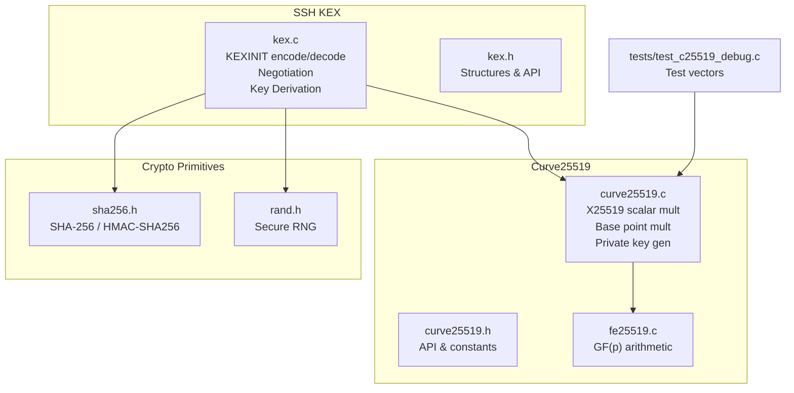
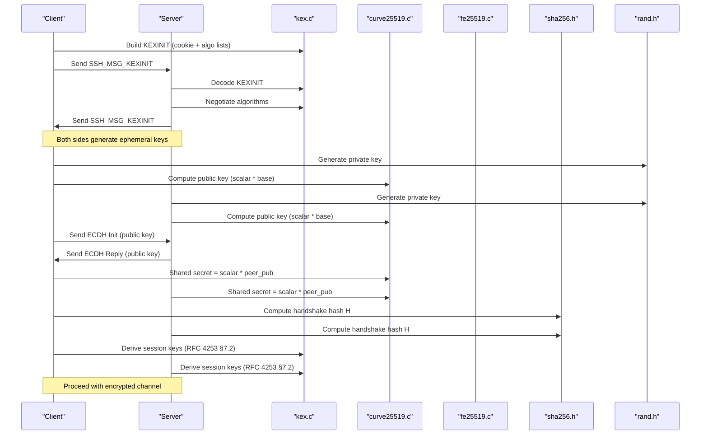
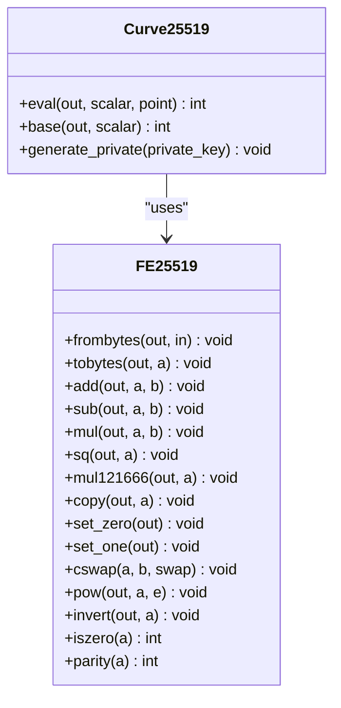
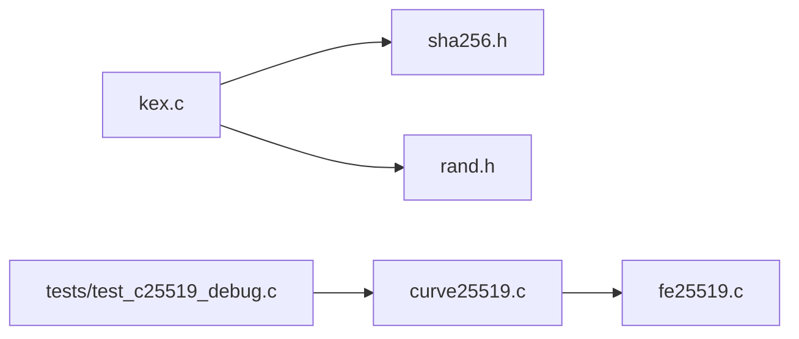

# Key Exchange (KEX)

<cite>
**Referenced Files in This Document**
- [kex.c](file://src/kex.c)
- [kex.h](file://src/kex.h)
- [curve25519.c](file://src/curve25519.c)
- [curve25519.h](file://src/curve25519.h)
- [fe25519.c](file://src/fe25519.c)
- [sha256.h](file://src/sha256.h)
- [rand.h](file://src/rand.h)
- [test_c25519_debug.c](file://tests/test_c25519_debug.c)
</cite>

## Table of Contents
1. [Introduction](#introduction)
2. [Project Structure](#project-structure)
3. [Core Components](#core-components)
4. [Architecture Overview](#architecture-overview)
5. [Detailed Component Analysis](#detailed-component-analysis)
6. [Dependency Analysis](#dependency-analysis)
7. [Performance Considerations](#performance-considerations)
8. [Troubleshooting Guide](#troubleshooting-guide)
9. [Conclusion](#conclusion)

## Introduction
This document explains the key exchange implementation in Coalesce, focusing on:
- Curve25519 ECDH algorithm and X25519 protocol
- KEXINIT message parsing and encoding
- Algorithm negotiation between client and server
- Key derivation following RFC 4253 §7.2
- Mathematical foundations of elliptic curve cryptography and X25519
- Security properties, performance characteristics, attack vectors, and testing approaches

The implementation uses a pure C codebase with modular components for finite-field arithmetic, elliptic-curve operations, hashing, random number generation, and SSH protocol structures.

## Project Structure
The key exchange functionality is implemented across several modules:
- kex.c/h: SSH KEXINIT handling, proposal negotiation, and key derivation
- curve25519.c/h: X25519 scalar multiplication and private key generation
- fe25519.c: Finite field arithmetic over GF(2^255 - 19)
- sha256.h: SHA-256 and HMAC-SHA256 interfaces used by key derivation
- rand.h: Cryptographically secure random byte generation
- tests/test_c25519_debug.c: Test vector validation for curve25519_eval

**Diagram sources**
- [kex.c:1-230](file://src/kex.c#L1-L230)
- [kex.h:1-52](file://src/kex.h#L1-L52)
- [curve25519.c:1-93](file://src/curve25519.c#L1-L93)
- [curve25519.h:1-22](file://src/curve25519.h#L1-L22)
- [fe25519.c:1-231](file://src/fe25519.c#L1-L231)
- [sha256.h:1-39](file://src/sha256.h#L1-L39)
- [rand.h:1-13](file://src/rand.h#L1-L13)
- [test_c25519_debug.c:1-264](file://tests/test_c25519_debug.c#L1-L264)

**Section sources**
- [kex.c:1-230](file://src/kex.c#L1-L230)
- [curve25519.c:1-93](file://src/curve25519.c#L1-L93)
- [fe25519.c:1-231](file://src/fe25519.c#L1-L231)
- [sha256.h:1-39](file://src/sha256.h#L1-L39)
- [rand.h:1-13](file://src/rand.h#L1-L13)
- [test_c25519_debug.c:1-264](file://tests/test_c25519_debug.c#L1-L264)

## Core Components
- SSH KEXINIT structure and lifecycle:
  - Default initialization with cookie and algorithm lists
  - Encoding to wire format per SSH protocol
  - Decoding from wire format into structured fields
  - Freeing allocated strings
- Proposal negotiation:
  - Matching client and server algorithm lists
  - Selecting mutually acceptable algorithms for KEX, host key, ciphers, MACs, compression
- Key derivation:
  - Implements RFC 4253 §7.2 using SHA-256
  - Produces session keys from shared secret, handshake hash, and session ID
- Curve25519/X25519:
  - Scalar multiplication using Montgomery ladder
  - Base point multiplication (u = 9)
  - Private key generation with clamping per RFC 7748
- Finite field arithmetic:
  - Addition, subtraction, multiplication, squaring
  - Inversion via Fermat’s little theorem
  - Serialization/deserialization and conditional swap

**Section sources**
- [kex.c:25-112](file://src/kex.c#L25-L112)
- [kex.c:153-188](file://src/kex.c#L153-L188)
- [kex.c:192-229](file://src/kex.c#L192-L229)
- [curve25519.c:8-92](file://src/curve25519.c#L8-L92)
- [fe25519.c:45-105](file://src/fe25519.c#L45-L105)
- [fe25519.c:109-230](file://src/fe25519.c#L109-L230)

## Architecture Overview
The key exchange flow integrates SSH protocol messages with cryptographic primitives:

**Diagram sources**
- [kex.c:48-96](file://src/kex.c#L48-L96)
- [kex.c:153-188](file://src/kex.c#L153-L188)
- [curve25519.c:71-92](file://src/curve25519.c#L71-L92)
- [sha256.h:12-22](file://src/sha256.h#L12-L22)
- [rand.h:7-10](file://src/rand.h#L7-L10)

## Detailed Component Analysis

### SSH KEXINIT Handling
Responsibilities:
- Initialize default proposals and a 16-byte cookie
- Encode/decode SSH_MSG_KEXINIT according to SSH wire format
- Manage memory for string fields

Key functions:
- Initialization: sets defaults and generates a secure cookie
- Encoding: writes message type, cookie, and comma-separated algorithm lists
- Decoding: reads message type, cookie, and parses algorithm lists
- Freeing: releases all allocated strings

Error handling:
- Returns negative values on invalid inputs or buffer errors
- Ensures zero-initialization before decoding to avoid leaks

Memory management:
- Uses safe duplication helper for algorithm strings
- Provides dedicated free function for KEXINIT structures

**Section sources**
- [kex.c:14-23](file://src/kex.c#L14-L23)
- [kex.c:25-46](file://src/kex.c#L25-L46)
- [kex.c:48-68](file://src/kex.c#L48-L68)
- [kex.c:70-96](file://src/kex.c#L70-L96)
- [kex.c:98-112](file://src/kex.c#L98-L112)

### Algorithm Negotiation
Purpose:
- Match client and server algorithm lists to select mutually acceptable options

Algorithm:
- Iterate through client list items
- Check each item against server list
- Return first match or NULL if none

Validation:
- Ensure all required categories are negotiated (KEX, host key, ciphers, MACs, compression)
- Fail fast if any category cannot be matched

Complexity:
- Linear in the length of the client list; substring comparisons proportional to item lengths

**Section sources**
- [kex.c:116-151](file://src/kex.c#L116-L151)
- [kex.c:153-188](file://src/kex.c#L153-L188)

### Key Derivation (RFC 4253 §7.2)
Purpose:
- Derive session keys from shared secret K, handshake hash H, and session ID

Process:
- Compute K1 = SHA-256(K || H || letter || session_id)
- Copy first min(key_len, 32) bytes to output
- For longer keys, iteratively compute Ki+1 = SHA-256(K || H || Ki) and append

Inputs:
- Letter: direction-specific identifier (e.g., 'A', 'B')
- K: shared secret as MPINT
- H: handshake hash
- session_id: unique session identifier

Outputs:
- Derived key material of requested length

Security considerations:
- Uses SHA-256 consistently
- Avoids reusing intermediate digests beyond specified chaining

**Section sources**
- [kex.c:192-229](file://src/kex.c#L192-L229)
- [sha256.h:12-22](file://src/sha256.h#L12-L22)

### Curve25519/X25519 Implementation
Responsibilities:
- Perform scalar multiplication out = scalar * point
- Provide base point multiplication (u = 9)
- Generate clamped private keys

Implementation details:
- Clamps scalar per RFC 7748
- Uses Montgomery ladder with projective coordinates (x, z)
- Conditional swaps ensure constant-time behavior
- Converts result to u-coordinate bytes

Finite field layer:
- Operates over GF(2^255 - 19) using 51-bit limbs
- Supports add, sub, mul, sq, invert, pow, parity, zero-check
- Efficient serialization/deserialization with carry propagation and reduction

Complexity:
- Scalar multiplication performs ~255 iterations of field ops
- Field operations use 5-limb representation with 128-bit intermediates

**Section sources**
- [curve25519.c:8-68](file://src/curve25519.c#L8-L68)
- [curve25519.c:71-92](file://src/curve25519.c#L71-L92)
- [fe25519.c:45-105](file://src/fe25519.c#L45-L105)
- [fe25519.c:109-230](file://src/fe25519.c#L109-L230)

#### Class Diagram: Curve25519 and Finite Field

**Diagram sources**
- [curve25519.c:8-92](file://src/curve25519.c#L8-L92)
- [fe25519.c:45-230](file://src/fe25519.c#L45-L230)

### Testing Approaches
- Test vectors:
  - Validate curve25519_eval against known expected outputs
  - Compare computed public key with reference value
- Debugging utilities:
  - Reproduce finite field operations independently
  - Verify serialization/deserialization round-trips

Recommendations:
- Add unit tests for KEXINIT encode/decode round-trips
- Validate negotiation outcomes for various algorithm combinations
- Test key derivation with known shared secrets and session IDs

**Section sources**
- [test_c25519_debug.c:233-263](file://tests/test_c25519_debug.c#L233-L263)

## Dependency Analysis
High-level dependencies:
- kex.c depends on sha256.h for hashing and rand.h for entropy
- curve25519.c depends on fe25519.c for finite field arithmetic
- Tests depend on curve25519.h for API access

Coupling:
- Modular design keeps cryptographic primitives separate from protocol logic
- Minimal coupling between KEX and curve25519 layers

Potential circular dependencies:
- None observed; headers define interfaces without including implementation files

External integration points:
- Secure random source via rand_bytes
- SHA-256/HMAC-SHA256 implementations

**Diagram sources**
- [kex.c:1-6](file://src/kex.c#L1-L6)
- [curve25519.c:1-4](file://src/curve25519.c#L1-L4)
- [test_c25519_debug.c:1-5](file://tests/test_c25519_debug.c#L1-L5)

**Section sources**
- [kex.c:1-6](file://src/kex.c#L1-L6)
- [curve25519.c:1-4](file://src/curve25519.c#L1-L4)
- [test_c25519_debug.c:1-5](file://tests/test_c25519_debug.c#L1-L5)

## Performance Considerations
- Finite field arithmetic:
  - 51-bit limbs reduce overflow risk and leverage 128-bit intermediates
  - Two-pass carry propagation ensures canonical representation
- Scalar multiplication:
  - Montgomery ladder provides constant-time execution
  - ~255 iterations of field ops dominate runtime
- Key derivation:
  - Single SHA-256 pass for typical key sizes; additional passes only for longer keys
- Memory usage:
  - Minimal allocations during KEXINIT processing
  - Temporary buffers for field operations are stack-allocated

Optimization opportunities:
- Inline small field operations where beneficial
- Precompute constants for repeated operations
- Use platform-specific intrinsics for 128-bit arithmetic if available

[No sources needed since this section provides general guidance]

## Troubleshooting Guide
Common issues and resolutions:
- KEXINIT decode failures:
  - Verify message type and buffer bounds
  - Ensure algorithm lists are properly null-terminated
- Negotiation failures:
  - Confirm both sides include compatible algorithm names
  - Check ordering preferences
- Key derivation errors:
  - Validate input lengths and non-null pointers
  - Ensure consistent session ID and handshake hash
- Curve25519 mismatches:
  - Verify scalar clamping and base point selection
  - Compare test vector results

Debugging tips:
- Print intermediate field values to detect serialization issues
- Log algorithm negotiation steps to identify mismatches
- Use test vectors to validate correctness incrementally

**Section sources**
- [kex.c:70-96](file://src/kex.c#L70-L96)
- [kex.c:153-188](file://src/kex.c#L153-L188)
- [kex.c:192-229](file://src/kex.c#L192-L229)
- [curve25519.c:8-68](file://src/curve25519.c#L8-L68)

## Conclusion
Coalesce implements a robust key exchange pipeline combining SSH protocol handling with modern elliptic-curve cryptography:
- KEXINIT encoding/decoding and negotiation provide flexible algorithm selection
- Curve25519/X25519 offers efficient and secure shared secret computation
- Key derivation follows RFC 4253 §7.2 to produce session keys
- The modular architecture supports maintainability and testing

For production deployments:
- Ensure secure random number generation is configured
- Validate algorithm compatibility across clients and servers
- Incorporate comprehensive test suites covering protocol and cryptographic paths

[No sources needed since this section summarizes without analyzing specific files]