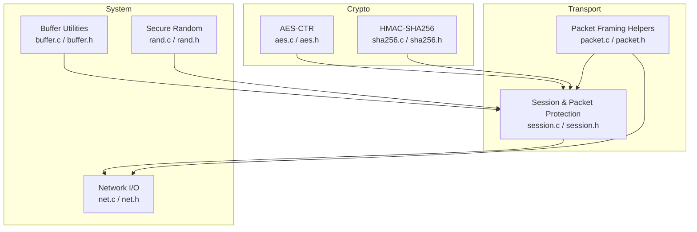
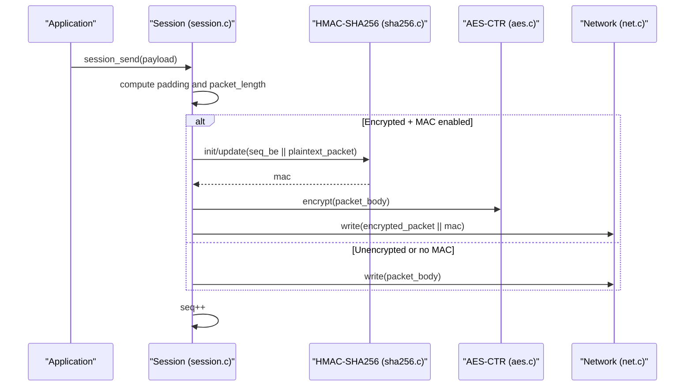
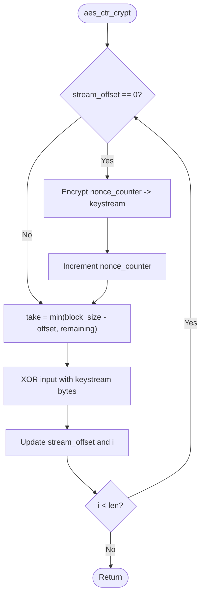
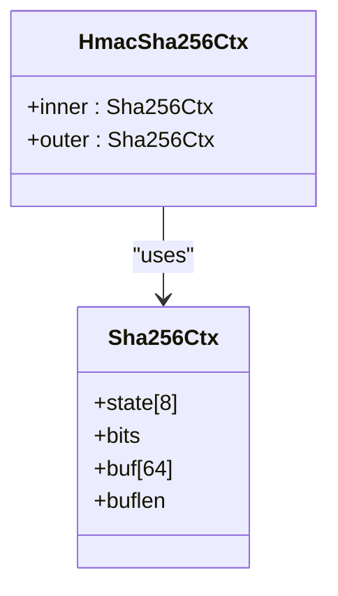
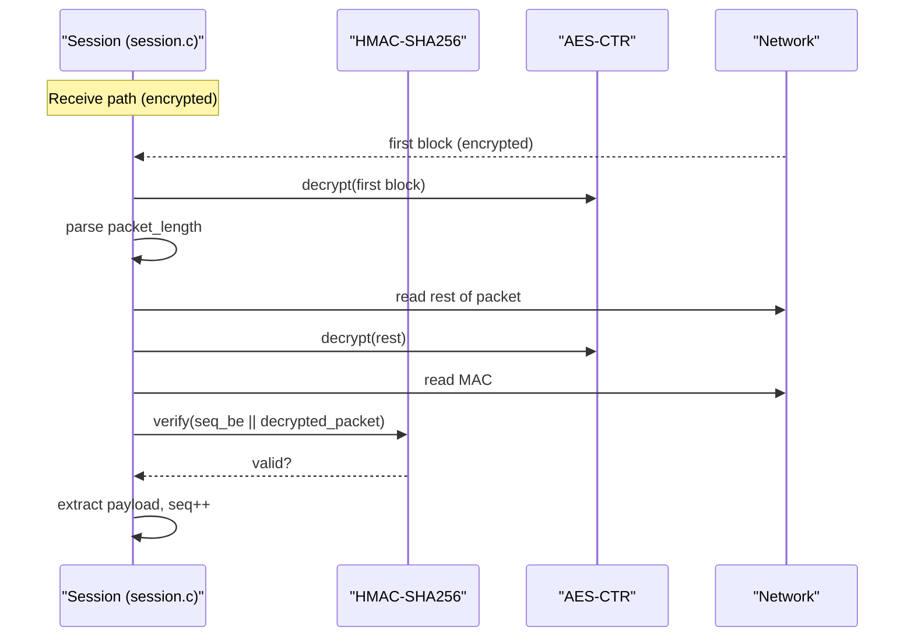
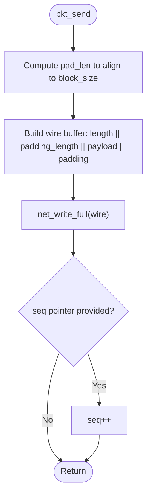
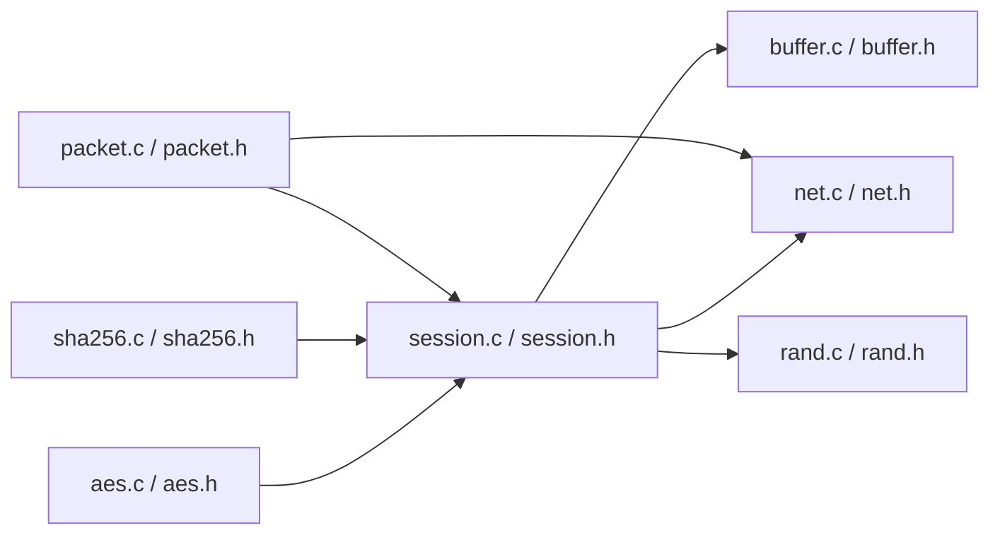

# Symmetric Encryption

<cite>
**Referenced Files in This Document**
- [aes.c](file://src/aes.c)
- [aes.h](file://src/aes.h)
- [sha256.c](file://src/sha256.c)
- [sha256.h](file://src/sha256.h)
- [session.c](file://src/session.c)
- [session.h](file://src/session.h)
- [packet.c](file://src/packet.c)
- [packet.h](file://src/packet.h)
- [ssh.h](file://src/ssh.h)
- [net.c](file://src/net.c)
- [net.h](file://src/net.h)
- [buffer.c](file://src/buffer.c)
- [buffer.h](file://src/buffer.h)
- [rand.c](file://src/rand.c)
- [rand.h](file://src/rand.h)
</cite>

## Table of Contents
1. [Introduction](#introduction)
2. [Project Structure](#project-structure)
3. [Core Components](#core-components)
4. [Architecture Overview](#architecture-overview)
5. [Detailed Component Analysis](#detailed-component-analysis)
6. [Dependency Analysis](#dependency-analysis)
7. [Performance Considerations](#performance-considerations)
8. [Troubleshooting Guide](#troubleshooting-guide)
9. [Conclusion](#conclusion)

## Introduction
This document explains the symmetric encryption implementation in Coalesce, focusing on AES-CTR mode for confidentiality and HMAC-SHA256 for integrity. It covers:
- The AES block cipher implementation and key schedule
- CTR mode operation to provide a stream cipher
- Integration with HMAC-SHA256 for message authentication codes (MACs)
- The SSH transport-layer packet protocol (RFC 4253 §6)
- Key management, sequence number handling, and per-direction state
- Performance characteristics, memory usage patterns, and security properties
- Examples of encryption operations and how they integrate with the SSH transport layer

## Project Structure
The symmetric encryption stack is implemented across several modules:
- Cryptographic primitives: AES and SHA-256/HMAC
- Transport session: key installation, packet protection, and sequence numbers
- Packet framing: low-level wire format helpers
- Networking: raw TCP I/O
- Buffers and randomness: data structures and secure random bytes

**Diagram sources**
- [aes.c:1-179](file://src/aes.c#L1-L179)
- [sha256.c:1-184](file://src/sha256.c#L1-L184)
- [session.c:128-363](file://src/session.c#L128-L363)
- [packet.c:52-167](file://src/packet.c#L52-L167)
- [net.c:127-147](file://src/net.c#L127-L147)
- [buffer.c:1-272](file://src/buffer.c#L1-L272)
- [rand.c:14-45](file://src/rand.c#L14-L45)

**Section sources**
- [session.c:128-363](file://src/session.c#L128-L363)
- [aes.c:1-179](file://src/aes.c#L1-L179)
- [sha256.c:1-184](file://src/sha256.c#L1-L184)
- [packet.c:52-167](file://src/packet.c#L52-L167)
- [net.c:127-147](file://src/net.c#L127-L147)
- [buffer.c:1-272](file://src/buffer.c#L1-L272)
- [rand.c:14-45](file://src/rand.c#L14-L45)

## Core Components
- AES block cipher and CTR mode:
  - Implements FIPS 197 AES with S-box, key expansion, SubBytes, ShiftRows, MixColumns, AddRoundKey
  - Provides AES-CTR streaming via a nonce counter and keystream buffer
- HMAC-SHA256:
  - Implements RFC 2104/FIPS 198-1 using SHA-256
- Session and packet protection:
  - Manages per-direction keys, IVs, MAC keys, and sequence numbers
  - Applies padding, MAC, and AES-CTR encryption per RFC 4253 §6
- Packet framing:
  - Low-level send/recv helpers for unencrypted packets
- Network I/O:
  - Blocking read/write utilities over sockets
- Buffer utilities:
  - Dynamic buffers for payloads and serialization
- Secure random:
  - OS-backed entropy source for padding and nonces

**Section sources**
- [aes.h:7-35](file://src/aes.h#L7-L35)
- [aes.c:36-179](file://src/aes.c#L36-L179)
- [sha256.h:7-36](file://src/sha256.h#L7-L36)
- [sha256.c:62-183](file://src/sha256.c#L62-L183)
- [session.h:24-33](file://src/session.h#L24-L33)
- [session.c:128-363](file://src/session.c#L128-L363)
- [packet.h:9-26](file://src/packet.h#L9-L26)
- [packet.c:52-167](file://src/packet.c#L52-L167)
- [net.h:32-56](file://src/net.h#L32-L56)
- [net.c:127-147](file://src/net.c#L127-L147)
- [buffer.h:8-47](file://src/buffer.h#L8-L47)
- [buffer.c:1-272](file://src/buffer.c#L1-L272)
- [rand.h:7-10](file://src/rand.h#L7-L10)
- [rand.c:14-45](file://src/rand.c#L14-L45)

## Architecture Overview
The SSH transport layer uses AES-CTR for confidentiality and HMAC-SHA256 for integrity. Each direction maintains its own encryption context and monotonic sequence number. Packets are padded to a multiple of the block size, then MACed and encrypted as per RFC 4253 §6.

**Diagram sources**
- [session.c:196-256](file://src/session.c#L196-L256)
- [sha256.c:137-183](file://src/sha256.c#L137-L183)
- [aes.c:151-178](file://src/aes.c#L151-L178)
- [net.c:138-147](file://src/net.c#L138-L147)

## Detailed Component Analysis

### AES Block Cipher and CTR Mode
- AES block cipher:
  - Key schedule supports 128-, 192-, and 256-bit keys
  - Standard AES round functions: SubBytes, ShiftRows, MixColumns, AddRoundKey
- CTR mode:
  - Maintains a 128-bit big-endian nonce counter
  - Generates a keystream block by encrypting the counter and XORs it with plaintext/ciphertext
  - Stream offset allows partial-block processing without re-encrypting the same counter block

**Diagram sources**
- [aes.c:143-178](file://src/aes.c#L143-L178)

**Section sources**
- [aes.h:7-35](file://src/aes.h#L7-L35)
- [aes.c:36-179](file://src/aes.c#L36-L179)

### HMAC-SHA256
- SHA-256 implementation follows FIPS 180-4
- HMAC implementation follows RFC 2104/FIPS 198-1
- Used to authenticate the entire packet body (including length and padding fields) along with the per-direction sequence number

**Diagram sources**
- [sha256.h:12-29](file://src/sha256.h#L12-L29)

**Section sources**
- [sha256.h:7-36](file://src/sha256.h#L7-L36)
- [sha256.c:62-183](file://src/sha256.c#L62-L183)

### Session and Packet Protection (SSH Transport Layer)
- Key installation:
  - Accepts cipher name ("aes128-ctr", "aes256-ctr"), IV, key, MAC algorithm ("hmac-sha2-256", "none"), and MAC key
  - Initializes AES-CTR context and stores MAC key if enabled
- Packet sending:
  - Computes padding to satisfy block alignment
  - If MAC is enabled, computes HMAC over sequence number (big-endian) and the plaintext packet body
  - Encrypts the entire packet body in-place using AES-CTR
  - Writes ciphertext followed by MAC
- Packet receiving:
  - For encrypted traffic, reads one block to decrypt the length field, validates constraints, then decrypts the rest
  - Verifies HMAC before extracting payload
  - Increments sequence number after successful processing

**Diagram sources**
- [session.c:264-363](file://src/session.c#L264-L363)
- [sha256.c:137-183](file://src/sha256.c#L137-L183)
- [aes.c:151-178](file://src/aes.c#L151-L178)
- [net.c:127-147](file://src/net.c#L127-L147)

**Section sources**
- [session.h:24-33](file://src/session.h#L24-L33)
- [session.c:128-363](file://src/session.c#L128-L363)

### Packet Framing Helpers (Unencrypted Path)
- pkt_send/pkt_recv implement basic SSH binary packet framing:
  - packet_length (4 bytes), padding_length (1 byte), payload, random padding
  - Enforces minimum padding and block alignment
- These helpers are used when encryption/MAC is not active

**Diagram sources**
- [packet.c:52-105](file://src/packet.c#L52-L105)

**Section sources**
- [packet.h:9-26](file://src/packet.h#L9-L26)
- [packet.c:52-167](file://src/packet.c#L52-L167)

### Network I/O and Buffers
- Network I/O provides blocking read/write and line reading
- Buffers provide dynamic storage for payloads and serialization routines

**Section sources**
- [net.h:32-56](file://src/net.h#L32-L56)
- [net.c:127-147](file://src/net.c#L127-L147)
- [buffer.h:8-47](file://src/buffer.h#L8-L47)
- [buffer.c:1-272](file://src/buffer.c#L1-L272)

### Secure Randomness
- Uses OS-provided CSPRNG (Windows CryptoAPI, Linux getrandom or /dev/urandom)
- Supplies random padding and other cryptographic material

**Section sources**
- [rand.h:7-10](file://src/rand.h#L7-L10)
- [rand.c:14-45](file://src/rand.c#L14-L45)

## Dependency Analysis
The following diagram shows how components depend on each other within the symmetric encryption subsystem.

**Diagram sources**
- [aes.c:1-179](file://src/aes.c#L1-L179)
- [sha256.c:1-184](file://src/sha256.c#L1-L184)
- [session.c:128-363](file://src/session.c#L128-L363)
- [packet.c:52-167](file://src/packet.c#L52-L167)
- [net.c:127-147](file://src/net.c#L127-L147)
- [buffer.c:1-272](file://src/buffer.c#L1-L272)
- [rand.c:14-45](file://src/rand.c#L14-L45)

**Section sources**
- [session.c:128-363](file://src/session.c#L128-L363)
- [aes.c:1-179](file://src/aes.c#L1-L179)
- [sha256.c:1-184](file://src/sha256.c#L1-L184)
- [packet.c:52-167](file://src/packet.c#L52-L167)
- [net.c:127-147](file://src/net.c#L127-L147)
- [buffer.c:1-272](file://src/buffer.c#L1-L272)
- [rand.c:14-45](file://src/rand.c#L14-L45)

## Performance Considerations
- AES-CTR throughput:
  - Stream cipher behavior avoids block chaining overhead; performance scales linearly with data size
  - Keystream reuse reduces repeated AES encryptions until the counter wraps
- Memory usage:
  - Per-direction state includes AES-CTR context (~keystream buffer and counter), MAC key buffer, and sequence number
  - Packet buffers are allocated per send/recv operation; consider pooling for high-throughput scenarios
- CPU cost:
  - HMAC computation adds constant overhead per packet; batching or avoiding unnecessary MAC computations can help
- Padding:
  - Random padding ensures uniform packet sizes; minimal overhead but necessary for security
- Recommendations:
  - Reuse buffers where possible
  - Avoid excessive small-packet churn; batch application messages when feasible
  - Ensure efficient network I/O paths (non-blocking I/O with buffering at higher layers)

[No sources needed since this section provides general guidance]

## Troubleshooting Guide
Common issues and diagnostics:
- MAC verification failure:
  - Indicates tampering, wrong MAC key, or sequence mismatch; disconnect immediately
  - Verify that both directions use consistent MAC algorithms and keys
- Sequence number errors:
  - Ensure sequence numbers are monotonic per direction and never reset across rekeys
- Invalid packet lengths or padding:
  - Validate packet_length bounds and padding_length constraints
- Initialization failures:
  - Check cipher name and key lengths; ensure IV length matches block size
- Network I/O errors:
  - Use net_get_error() to diagnose socket issues

**Section sources**
- [session.c:318-337](file://src/session.c#L318-L337)
- [session.c:196-256](file://src/session.c#L196-L256)
- [packet.c:113-167](file://src/packet.c#L113-L167)
- [net.c:162-177](file://src/net.c#L162-L177)

## Conclusion
Coalesce implements a robust symmetric encryption scheme using AES-CTR for confidentiality and HMAC-SHA256 for integrity, aligned with the SSH transport protocol (RFC 4253). The design separates concerns between cryptographic primitives, session state management, packet framing, and network I/O. Proper key management, sequence number handling, and strict validation ensure secure and interoperable communication. For production use, consider optimizing buffer allocations and leveraging non-blocking I/O to improve throughput while maintaining strong security guarantees.

[No sources needed since this section summarizes without analyzing specific files]