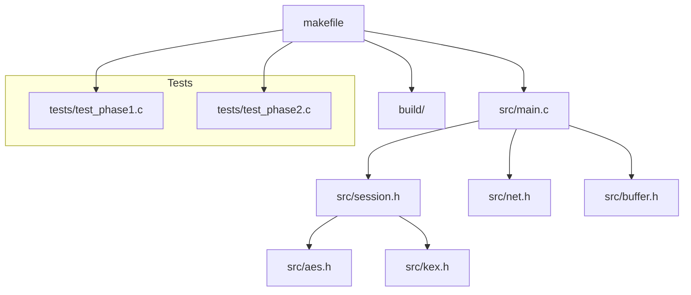
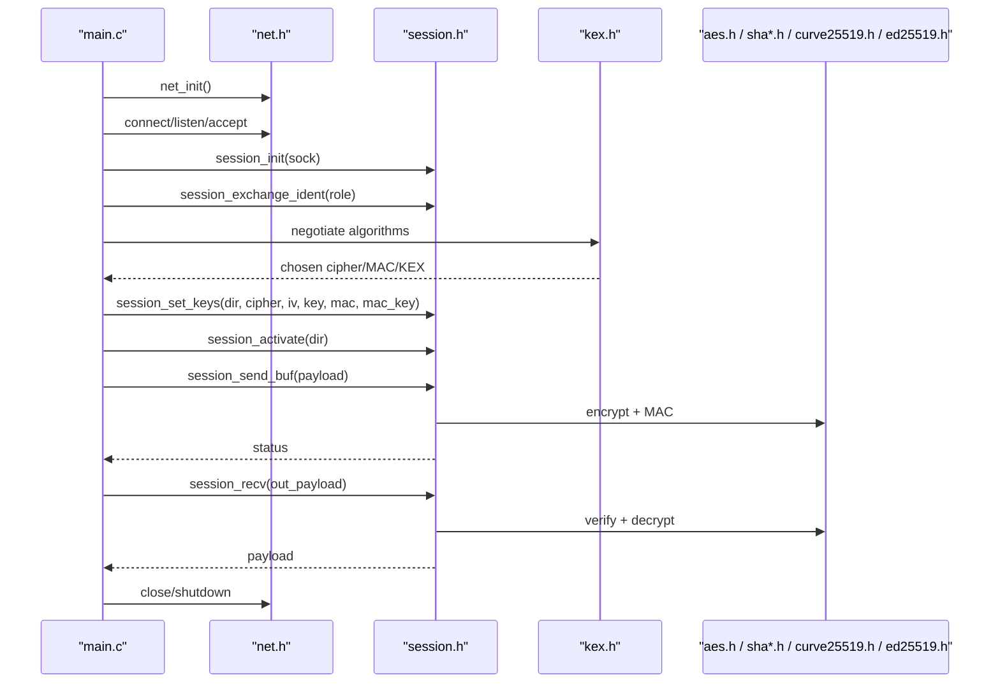
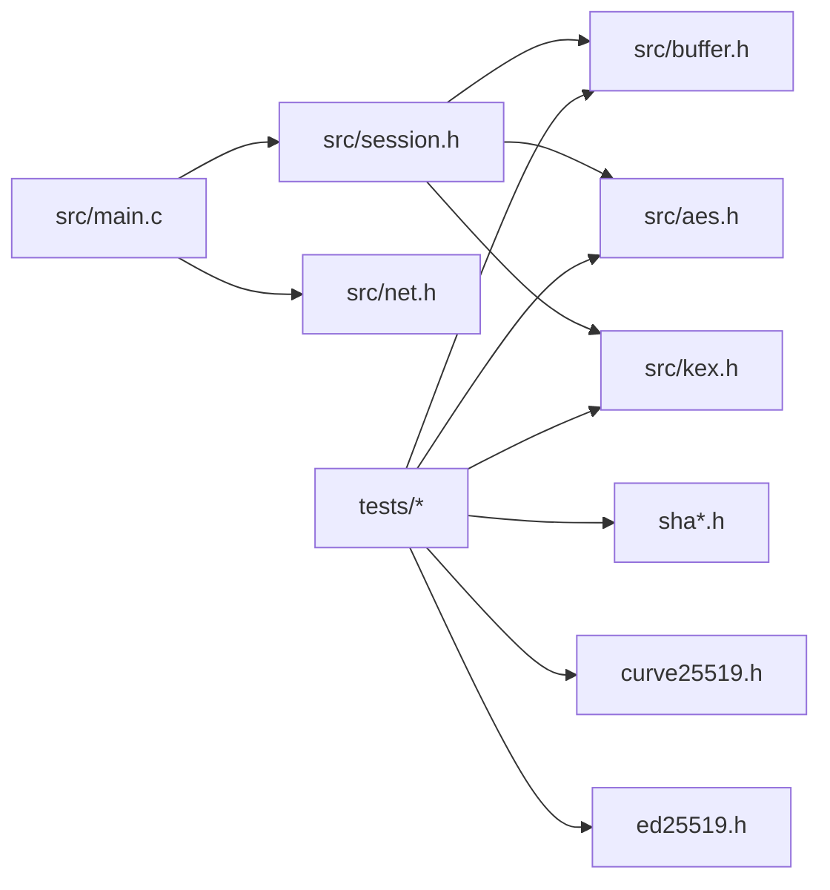

# Development Guide

<cite>
**Referenced Files in This Document**
- [makefile](file://makefile)
- [README.md](file://README.md)
- [src/main.c](file://src/main.c)
- [src/ssh.h](file://src/ssh.h)
- [src/session.h](file://src/session.h)
- [src/net.h](file://src/net.h)
- [src/buffer.h](file://src/buffer.h)
- [src/buffer.c](file://src/buffer.c)
- [src/kex.h](file://src/kex.h)
- [src/aes.h](file://src/aes.h)
- [tests/test_phase1.c](file://tests/test_phase1.c)
- [tests/test_phase2.c](file://tests/test_phase2.c)
</cite>

## Table of Contents
1. Introduction
2. Project Structure
3. Core Components
4. Architecture Overview
5. Detailed Component Analysis
6. Dependency Analysis
7. Performance Considerations
8. Troubleshooting Guide
9. Conclusion
10. Appendices

## Introduction
This development guide explains how to build, extend, and contribute to the Coalesce SSH implementation. It covers the Makefile-based build system, coding conventions, cryptographic integration points, testing strategy, and contribution workflow. The goal is to enable contributors to add features safely while maintaining backward compatibility and security.

## Project Structure
The repository is organized into source modules under src/, tests under tests/, and a top-level Makefile for building both the application and test binaries. The entry point is src/main.c, which provides server and client modes using the session layer (src/session.h), network abstraction (src/net.h), and buffer utilities (src/buffer.h). Cryptographic primitives are encapsulated in dedicated modules (e.g., AES, SHA-256/512, Curve25519, Ed25519) and exposed via headers.

**Diagram sources**
- [makefile:1-85](file://makefile#L1-L85)
- [src/main.c:1-214](file://src/main.c#L1-L214)
- [src/session.h:1-89](file://src/session.h#L1-L89)
- [src/net.h:1-58](file://src/net.h#L1-L58)
- [src/buffer.h:1-50](file://src/buffer.h#L1-L50)
- [src/aes.h:1-38](file://src/aes.h#L1-L38)
- [src/kex.h:1-52](file://src/kex.h#L1-L52)
- [tests/test_phase1.c:1-89](file://tests/test_phase1.c#L1-L89)
- [tests/test_phase2.c:1-412](file://tests/test_phase2.c#L1-L412)

**Section sources**
- [makefile:1-85](file://makefile#L1-L85)
- [src/main.c:1-214](file://src/main.c#L1-L214)
- [README.md:1-2](file://README.md#L1-L2)

## Core Components
- Network abstraction: Provides platform-independent TCP I/O with error handling and helpers for reading lines and full buffers. See net.h.
- Buffer utilities: Dynamic buffer with safe append/read operations, including SSH wire types (u8/u32/u64/bool/string/mpint). See buffer.h and buffer.c.
- Session layer: Implements SSH transport framing, identification exchange, key installation, and encrypted packet send/receive per direction. See session.h.
- Key exchange and proposals: Encapsulates KEXINIT encoding/decoding, proposal negotiation, and key derivation. See kex.h.
- Cryptography: AES block and AES-CTR streaming; SHA-256/512; Curve25519; Ed25519; Base64; secure random bytes. Headers define interfaces used by session and tests.
- Application entrypoint: main.c implements serve/connect commands, orchestrating session lifecycle and basic message exchange.

Coding conventions observed:
- Error signaling: Functions return 0 on success and negative values on failure; callers check return codes and propagate errors.
- Memory management: Buffers use explicit init/free/reset; dynamic allocation uses malloc/realloc with capacity growth; strings returned from readers must be freed by the caller when applicable.
- Naming: Lowercase snake_case for functions and variables; uppercase constants/macros; clear type suffixes (e.g., _ctx_t, _t enums).
- Security posture: No fallback to weak randomness; strict validation of inputs (e.g., identification line length and format); bounded packet sizes defined in ssh.h.

**Section sources**
- [src/net.h:1-58](file://src/net.h#L1-L58)
- [src/buffer.h:1-50](file://src/buffer.h#L1-L50)
- [src/buffer.c:1-200](file://src/buffer.c#L1-L200)
- [src/session.h:1-89](file://src/session.h#L1-L89)
- [src/kex.h:1-52](file://src/kex.h#L1-L52)
- [src/aes.h:1-38](file://src/aes.h#L1-L38)
- [src/ssh.h:1-147](file://src/ssh.h#L1-L147)
- [src/main.c:1-214](file://src/main.c#L1-L214)

## Architecture Overview
The SSH stack is layered:
- Transport: Network abstraction (net.h) provides sockets and I/O.
- Framing and encryption: Session layer (session.h) handles version banners, binary packet framing, MAC, and cipher per direction.
- Key exchange: Negotiates algorithms and derives keys (kex.h).
- Primitives: Crypto modules implement ciphers, hashes, signatures, and base64.

**Diagram sources**
- [src/main.c:45-214](file://src/main.c#L45-L214)
- [src/session.h:58-86](file://src/session.h#L58-L86)
- [src/kex.h:35-49](file://src/kex.h#L35-L49)
- [src/aes.h:26-35](file://src/aes.h#L26-L35)

## Detailed Component Analysis

### Build System (Makefile)
- Cross-platform detection: Windows vs. non-Windows sets executable extension, file removal, directory creation, and link libraries.
- Targets:
  - all: builds the main executable in build/.
  - test: builds and runs four test binaries (test_phase1..test_phase4).
  - clean: removes build artifacts.
- Compilation flags: -Wall -O2; Windows links ws2_32 and advapi32.
- Object generation: All .c files in src/ compile to build/*.o; tests link selected objects plus their own main().

Usage:
- Build everything: make
- Run tests: make test
- Clean: make clean

Notes:
- Ensure gcc is available or adjust CC in the Makefile for your environment.
- On Windows, ensure Winsock is initialized via net_init() before any socket calls.

**Section sources**
- [makefile:1-85](file://makefile#L1-L85)

### Entry Point and Control Flow (main.c)
- Commands:
  - serve [port]: Listens and accepts one connection, performs identification exchange, reads first plaintext packet, sends an SSH_MSG_DEBUG reply, then closes cleanly.
  - connect user@host[:port]: Connects to remote, performs identification exchange, sends SSH_MSG_IGNORE, receives and prints response, then closes.
- Lifecycle:
  - Initialize network subsystem, parse arguments, choose mode, initialize session, perform protocol steps, free resources, shutdown network.

Error handling:
- Checks return values of network and session functions; logs errors via net_get_error(); ensures cleanup on early exits.

**Section sources**
- [src/main.c:1-214](file://src/main.c#L1-L214)

### Buffer Layer (buffer.h, buffer.c)
- Design:
  - Dynamic buffer with read pointer and write length; auto-resize on writes.
  - SSH wire-format helpers for u8/u32/u64/bool/raw/string/mpint.
- Complexity:
  - Amortized O(1) appends due to doubling capacity; O(n) for string copy operations.
- Safety:
  - Bounds-checked reads; returns -1 on underflow; null checks for pointers.

Best practices:
- Always check return values of put/get functions.
- Use buf_reset() to reuse buffers without reallocating memory.
- Free strings returned by buf_get_cstring() when done.

**Section sources**
- [src/buffer.h:1-50](file://src/buffer.h#L1-L50)
- [src/buffer.c:1-200](file://src/buffer.c#L1-L200)

### Session Layer (session.h)
- Responsibilities:
  - Identification exchange with hardening (rejects invalid versions, enforces max line length).
  - Per-direction state for encryption and MAC, including sequence numbers that never reset across rekeys.
  - Binary packet send/receive with automatic cipher/MAC application based on direction state.
- Key installation:
  - set_keys installs IV/key/MAC material; activate flips the direction to encrypted mode after NEWKEYS.
- Constants:
  - Max packet/payload sizes aligned with RFC limits.

Integration:
- Uses net.h for I/O and aes.h for AES-CTR keystream; integrates with kex.h for derived keys.

**Section sources**
- [src/session.h:1-89](file://src/session.h#L1-L89)
- [src/ssh.h:12-14](file://src/ssh.h#L12-L14)

### Key Exchange and Proposals (kex.h)
- Structures:
  - ssh_kex_init_t holds negotiated lists and flags.
  - ssh_kex_proposal_t captures chosen algorithms.
- API:
  - Default initialization, encode/decode KEXINIT messages, negotiation algorithm selection, and key derivation per RFC 4253 §7.2.

Guidelines:
- When adding new algorithms, update defaults and negotiation logic to maintain secure precedence.
- Ensure derived keys match expected lengths and letters (c/s for client/server directions).

**Section sources**
- [src/kex.h:1-52](file://src/kex.h#L1-L52)

### Cryptography Interfaces
- AES (aes.h): Block cipher context and AES-CTR streaming context; symmetric encrypt/decrypt via same function in CTR mode.
- Hashing and signatures: SHA-256/512, Curve25519, Ed25519 used in tests and KEX flows.
- Utilities: Base64 encode/decode and secure random bytes.

Security notes:
- Randomness must come from OS-provided secure sources; no fallback to weak PRNG.
- Validate all inputs to crypto APIs (key sizes, IVs, message lengths).

**Section sources**
- [src/aes.h:1-38](file://src/aes.h#L1-L38)
- [tests/test_phase2.c:41-116](file://tests/test_phase2.c#L41-L116)
- [tests/test_phase2.c:118-186](file://tests/test_phase2.c#L118-L186)
- [tests/test_phase2.c:188-236](file://tests/test_phase2.c#L188-L236)
- [tests/test_phase2.c:238-312](file://tests/test_phase2.c#L238-L312)
- [tests/test_phase2.c:314-359](file://tests/test_phase2.c#L314-L359)
- [tests/test_phase2.c:361-376](file://tests/test_phase2.c#L361-L376)

### Testing Strategy
- Unit tests:
  - Phase 1: Buffer primitives and SSH wire types.
  - Phase 2: Cryptographic vectors (SHA-256/512, HMAC-SHA256, Ed25519, Curve25519, AES block/CTR, Base64, random bytes) and KEX negotiation.
- Execution:
  - Use make test to build and run all test targets.
- Adding tests:
  - Place new tests under tests/ with a descriptive name.
  - Add a corresponding target in the Makefile if needed.
  - Follow assert-based style and include known vectors where possible.

**Section sources**
- [tests/test_phase1.c:1-89](file://tests/test_phase1.c#L1-L89)
- [tests/test_phase2.c:1-412](file://tests/test_phase2.c#L1-L412)
- [makefile:52-74](file://makefile#L52-L74)

## Dependency Analysis
High-level dependencies between modules:

**Diagram sources**
- [src/main.c:1-214](file://src/main.c#L1-L214)
- [src/session.h:1-89](file://src/session.h#L1-L89)
- [src/buffer.h:1-50](file://src/buffer.h#L1-L50)
- [src/aes.h:1-38](file://src/aes.h#L1-L38)
- [src/kex.h:1-52](file://src/kex.h#L1-L52)
- [tests/test_phase1.c:1-89](file://tests/test_phase1.c#L1-L89)
- [tests/test_phase2.c:1-412](file://tests/test_phase2.c#L1-L412)

Coupling and cohesion:
- Low coupling: Each module exposes a focused interface (e.g., buffer, session, kex).
- Cohesion: Related functionality grouped (crypto primitives separate from session framing).
- External dependencies: Platform networking via sys/socket.h or winsock2; optional Windows-specific libraries linked by Makefile.

Potential circular dependencies:
- None observed; headers are minimal and do not include each other cyclically.

**Section sources**
- [makefile:1-85](file://makefile#L1-L85)
- [src/net.h:1-58](file://src/net.h#L1-L58)
- [src/session.h:1-89](file://src/session.h#L1-L89)

## Performance Considerations
- Buffer resizing: Exponential growth reduces reallocations; prefer buf_reserve() when size is known to minimize copies.
- Packet sizing: Respect MAX_PACKET_SIZE and MAX_PAYLOAD_SIZE to avoid excessive memory usage.
- Crypto performance: Prefer streaming AES-CTR over repeated block calls; batch data where possible.
- I/O: Use net_read_full/net_write_full to avoid partial transfers; consider non-blocking I/O for scalable servers.

[No sources needed since this section provides general guidance]

## Troubleshooting Guide
Common issues and remedies:
- Initialization failures:
  - Ensure net_init() succeeds before any socket operations; check net_get_error() for details.
- Invalid target format:
  - For connect, use user@host[:port]; port must be within valid range.
- Protocol errors:
  - Identification exchange rejects non-"SSH-" pre-lines and disallows SSH-1.x except 1.99; verify peer behavior.
- Packet receive/send errors:
  - Check return codes of session_send_buf/session_recv; validate direction encryption activation order (set_keys then activate).
- Resource leaks:
  - Always call session_free and net_close; free strings returned by buffer getters when applicable.

**Section sources**
- [src/main.c:45-214](file://src/main.c#L45-L214)
- [src/net.h:32-57](file://src/net.h#L32-L57)
- [src/session.h:61-86](file://src/session.h#L61-L86)

## Conclusion
Coalesce provides a modular SSH implementation with clear separation between networking, framing, cryptography, and application logic. The Makefile supports cross-platform builds and comprehensive tests. By following the coding standards, testing requirements, and guidelines outlined here, contributors can safely extend algorithms, add features, and maintain backward compatibility.

[No sources needed since this section summarizes without analyzing specific files]

## Appendices

### Build Targets Reference
- all: Build the main executable.
- test: Build and run test_phase1..test_phase4.
- clean: Remove build artifacts.

Platform notes:
- Windows: Links ws2_32 and advapi32; uses del and mkdir equivalents.
- Non-Windows: Uses rm and mkdir -p.

**Section sources**
- [makefile:1-85](file://makefile#L1-L85)

### Coding Standards Summary
- Errors: Return 0 on success, negative on failure; log via net_get_error() where applicable.
- Memory: Explicit init/free; guard against NULL; free caller-owned allocations.
- Types: Use fixed-width integers; typedef contexts for crypto structures.
- Names: snake_case for functions/variables; UPPER_CASE for macros/constants.
- Security: Validate inputs; enforce bounds; no weak randomness fallback.

**Section sources**
- [src/buffer.c:1-200](file://src/buffer.c#L1-L200)
- [src/net.h:1-58](file://src/net.h#L1-L58)
- [src/session.h:1-89](file://src/session.h#L1-L89)
- [src/ssh.h:12-14](file://src/ssh.h#L12-L14)

### Extending Cryptographic Algorithms
- Add new algorithm support in dedicated modules (e.g., new cipher or hash).
- Update KEX negotiation defaults and selection logic to include the new algorithm securely.
- Provide unit tests with known vectors and negative cases.
- Ensure key derivation and key lengths align with RFC specifications.

**Section sources**
- [src/kex.h:35-49](file://src/kex.h#L35-L49)
- [tests/test_phase2.c:378-395](file://tests/test_phase2.c#L378-L395)

### Backward Compatibility Guidelines
- Preserve existing public interfaces (headers) unless breaking changes are necessary.
- Maintain protocol compliance with RFC limits and message numbering.
- Keep maximum packet/payload sizes consistent with RFC constraints.
- Test against existing test suites and add regression tests for changes.

**Section sources**
- [src/ssh.h:12-14](file://src/ssh.h#L12-L14)
- [tests/test_phase1.c:1-89](file://tests/test_phase1.c#L1-L89)
- [tests/test_phase2.c:1-412](file://tests/test_phase2.c#L1-L412)

### Contribution Workflow
- Create a feature branch and implement changes with tests.
- Run make test to ensure all tests pass.
- Commit with clear messages referencing affected components.
- Submit a pull request describing changes, rationale, and testing performed.
- Address review feedback and update tests as needed.

[No sources needed since this section provides general guidance]