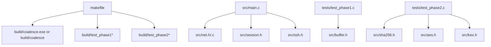
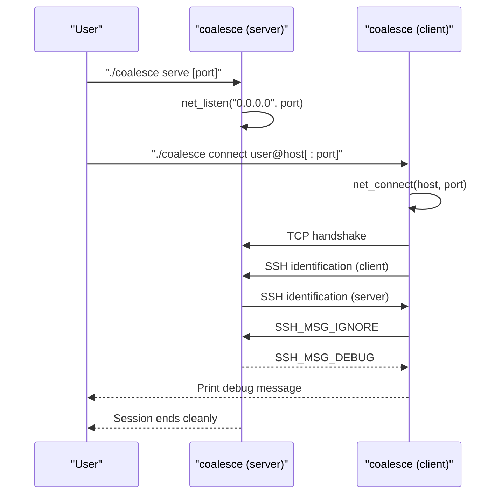
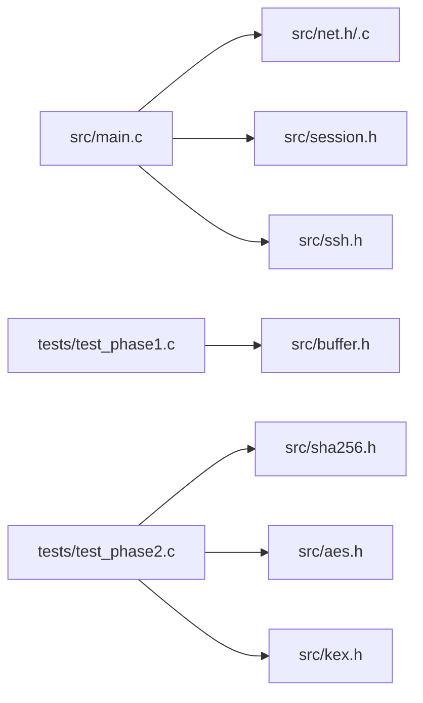

# Getting Started

<cite>
**Referenced Files in This Document**
- [README.md](file://README.md)
- [makefile](file://makefile)
- [src/main.c](file://src/main.c)
- [src/net.h](file://src/net.h)
- [src/net.c](file://src/net.c)
- [src/session.h](file://src/session.h)
- [src/ssh.h](file://src/ssh.h)
- [tests/test_phase1.c](file://tests/test_phase1.c)
- [tests/test_phase2.c](file://tests/test_phase2.c)
</cite>

## Table of Contents
1. [Introduction](#introduction)
2. [Project Structure](#project-structure)
3. [Core Components](#core-components)
4. [Architecture Overview](#architecture-overview)
5. [Detailed Component Analysis](#detailed-component-analysis)
6. [Dependency Analysis](#dependency-analysis)
7. [Performance Considerations](#performance-considerations)
8. [Troubleshooting Guide](#troubleshooting-guide)
9. [Conclusion](#conclusion)
10. [Appendices](#appendices)

## Introduction
This guide helps you build and run Coalesce, a minimal SSH implementation that supports server and client modes with version banner exchange and basic packet I/O. It covers installation via the provided Makefile, platform-specific notes for Windows and Unix-like systems, quick start examples for both server and client usage, common command-line options, initial connection setup, testing with make test, and troubleshooting tips for new users.

## Project Structure
Coalesce is a small C project organized into:
- src/: Core source files (networking, session management, SSH constants, crypto primitives)
- tests/: Unit and integration tests for buffer handling and cryptographic components
- makefile: Cross-platform build rules and test targets
- README.md: Minimal project readme

**Diagram sources**
- [makefile:1-85](file://makefile#L1-L85)
- [src/main.c:1-214](file://src/main.c#L1-L214)
- [src/net.h:1-58](file://src/net.h#L1-L58)
- [src/session.h:1-89](file://src/session.h#L1-L89)
- [src/ssh.h:1-147](file://src/ssh.h#L1-L147)
- [tests/test_phase1.c:1-89](file://tests/test_phase1.c#L1-L89)
- [tests/test_phase2.c:1-412](file://tests/test_phase2.c#L1-L412)

**Section sources**
- [makefile:1-85](file://makefile#L1-L85)
- [src/main.c:1-214](file://src/main.c#L1-L214)

## Core Components
- Command entry point and CLI parsing: main() handles serve and connect commands, parses user@host[:port], initializes networking, and delegates to server/client functions.
- Networking layer: net_* functions provide cross-platform TCP sockets, listen/accept/connect, read/write helpers, and error reporting.
- Session layer: session_* manages SSH identification exchange, binary packet send/receive, and key direction state.
- SSH constants: Message types, disconnect reasons, channel codes, and protocol version strings.

Key behaviors:
- Default port for serve is 22 if not specified.
- Default port for connect is 22 when omitted from target.
- Identification banners are exchanged per RFC 4253 §4.2.
- Client sends an SSH_MSG_IGNORE packet; server echoes back SSH_MSG_DEBUG.

**Section sources**
- [src/main.c:45-91](file://src/main.c#L45-L91)
- [src/main.c:93-154](file://src/main.c#L93-L154)
- [src/main.c:156-213](file://src/main.c#L156-L213)
- [src/net.h:1-58](file://src/net.h#L1-L58)
- [src/session.h:1-89](file://src/session.h#L1-L89)
- [src/ssh.h:1-147](file://src/ssh.h#L1-L147)

## Architecture Overview
The application has two primary modes:

- Server mode: Listens on a TCP port, accepts one connection, performs SSH identification exchange, receives the first plaintext packet, and responds with an SSH_MSG_DEBUG message.
- Client mode: Connects to a remote host, performs SSH identification exchange, sends an SSH_MSG_IGNORE packet, then receives and prints the server’s response.

**Diagram sources**
- [src/main.c:45-91](file://src/main.c#L45-L91)
- [src/main.c:93-154](file://src/main.c#L93-L154)
- [src/main.c:156-213](file://src/main.c#L156-L213)
- [src/net.c:39-98](file://src/net.c#L39-L98)

## Detailed Component Analysis

### Build System and Installation
- Compiler: gcc
- Output: build/coalesce (Unix-like), build/coalesce.exe (Windows)
- Flags: -Wall -O2
- Platform libraries: On Windows, links ws2_32 and advapi32; no extra libs on Unix-like systems
- Targets:
  - all: builds the coalesce executable
  - test: builds and runs test binaries
  - clean: removes build artifacts

Steps:
- Ensure gcc is installed and available in PATH.
- Run make to build.
- Run make test to verify core functionality.

Platform notes:
- Windows: Requires a GCC toolchain (e.g., MinGW-w64) and appropriate environment variables so that make can invoke gcc and link against system libraries. The Makefile auto-detects Windows_NT and sets EXE_EXT and linker flags accordingly.
- Unix-like: No special dependencies beyond a standard C compiler and POSIX socket headers.

Common build issues:
- “gcc not found”: Install a compatible GCC toolchain and ensure it is in PATH.
- Linker errors on Windows: Ensure ws2_32 and advapi32 are available to the linker (provided by the toolchain).
- Permission denied when writing to build directory: Ensure write permissions exist for the repository root.

**Section sources**
- [makefile:1-85](file://makefile#L1-L85)

### Quick Start Examples

Server mode:
- Start the server listening on the default port 22:
  - ./coalesce serve
- Start the server on a custom port (for example, 2222):
  - ./coalesce serve 2222

Client mode:
- Connect to a local server running on port 22:
  - ./coalesce connect user@localhost
- Connect to a specific port:
  - ./coalesce connect user@localhost:2222

Expected behavior:
- The client will perform SSH identification exchange and send an SSH_MSG_IGNORE packet.
- The server will respond with an SSH_MSG_DEBUG message containing a confirmation string.
- Both processes will print status messages and exit after the exchange.

Notes:
- If you run both locally, use localhost and a non-privileged port (e.g., 2222) to avoid permission requirements.
- The server currently accepts only one connection before exiting.

**Section sources**
- [src/main.c:45-91](file://src/main.c#L45-L91)
- [src/main.c:93-154](file://src/main.c#L93-L154)
- [src/main.c:156-213](file://src/main.c#L156-L213)

### Command-Line Options
- Commands:
  - serve [port]: Starts the server; defaults to port 22 if omitted.
  - connect user@host[:port]: Connects to a remote SSH endpoint; defaults to port 22 if omitted.
- Error handling:
  - Invalid arguments or unknown commands print usage information and return a non-zero exit code.
  - Network initialization failures print an error message and exit.

**Section sources**
- [src/main.c:45-91](file://src/main.c#L45-L91)

### Initial Connection Setup
- Ensure the server is running and reachable at the chosen host and port.
- From another terminal, run the client with the correct user@host[:port].
- Observe printed logs indicating successful identification exchange and packet send/receive.

If connections fail:
- Verify firewall rules allow inbound traffic on the chosen port.
- Confirm the server process is still listening.
- Check that the host resolves correctly (hostname or numeric IP).

**Section sources**
- [src/net.c:39-98](file://src/net.c#L39-L98)
- [src/main.c:93-154](file://src/main.c#L93-L154)
- [src/main.c:156-213](file://src/main.c#L156-L213)

### Testing Framework
Run the full test suite:
- make test

What it does:
- Builds multiple test binaries under build/
- Executes them in sequence to validate:
  - Buffer primitives and multi-precision integer handling
  - Cryptographic primitives (SHA-256, SHA-512, Ed25519, Curve25519, AES-CTR, base64)
  - Key exchange negotiation logic

Interpreting results:
- Each test program prints PASS lines upon success.
- Failures cause assert() to abort the test binary with a non-zero exit code.

**Section sources**
- [makefile:52-74](file://makefile#L52-L74)
- [tests/test_phase1.c:1-89](file://tests/test_phase1.c#L1-L89)
- [tests/test_phase2.c:1-412](file://tests/test_phase2.c#L1-L412)

## Dependency Analysis
Coalesce uses only standard library and OS-provided networking/crypto facilities:
- Networking: POSIX sockets on Unix-like systems; Winsock2 on Windows
- Randomness: OS entropy sources (getrandom or /dev/urandom on Unix-like; CryptGenRandom on Windows)
- No third-party libraries required

**Diagram sources**
- [src/main.c:1-214](file://src/main.c#L1-L214)
- [src/net.h:1-58](file://src/net.h#L1-L58)
- [src/session.h:1-89](file://src/session.h#L1-L89)
- [src/ssh.h:1-147](file://src/ssh.h#L1-L147)
- [tests/test_phase1.c:1-89](file://tests/test_phase1.c#L1-L89)
- [tests/test_phase2.c:1-412](file://tests/test_phase2.c#L1-L412)

**Section sources**
- [src/net.h:1-58](file://src/net.h#L1-L58)
- [src/net.c:1-177](file://src/net.c#L1-L177)

## Performance Considerations
- The current server accepts a single connection and exits; it is suitable for demonstrations and unit testing rather than high-throughput scenarios.
- Packet sizes are bounded by constants defined in the SSH header; keep payloads within reasonable limits for this prototype.
- Use non-blocking I/O utilities where needed for advanced extensions, but the current flow is blocking for simplicity.

[No sources needed since this section provides general guidance]

## Troubleshooting Guide
Build issues:
- Missing compiler: Install gcc and ensure it is in PATH.
- Windows linking errors: Confirm your toolchain includes ws2_32 and advapi32 support.
- Permission errors: Ensure write access to the repository directory.

Runtime issues:
- Port already in use: Choose a different port or stop the existing listener.
- Connection refused: Verify the server is running and reachable; check firewalls and network configuration.
- Hostname resolution failure: Use a numeric IP address or ensure DNS resolves correctly.
- Unexpected output: Confirm you are connecting to the intended server instance and using the correct port.

Testing issues:
- Tests fail due to missing headers or libraries: Ensure your toolchain supports POSIX sockets and standard C headers.
- Randomness-related test failures: Confirm OS entropy sources are available (e.g., /dev/urandom or getrandom on Linux).

**Section sources**
- [src/net.c:162-177](file://src/net.c#L162-L177)
- [src/main.c:45-91](file://src/main.c#L45-L91)
- [src/main.c:93-154](file://src/main.c#L93-L154)
- [src/main.c:156-213](file://src/main.c#L156-L213)

## Conclusion
You now have everything needed to build, run, and test Coalesce in both server and client modes. Use the quick start commands to perform a basic SSH identification exchange and packet round-trip. Refer to the troubleshooting section if you encounter build or runtime issues, and rely on make test to validate core functionality across platforms.

[No sources needed since this section summarizes without analyzing specific files]

## Appendices

### Appendix A: Build Targets Summary
- make: Build the coalesce executable
- make test: Build and run all tests
- make clean: Remove build artifacts

**Section sources**
- [makefile:40-85](file://makefile#L40-L85)

### Appendix B: Supported Protocols and Constants
- Protocol version and software identifier are defined in the SSH header.
- Transport-layer message numbers and related constants are centralized for consistency.

**Section sources**
- [src/ssh.h:1-147](file://src/ssh.h#L1-L147)