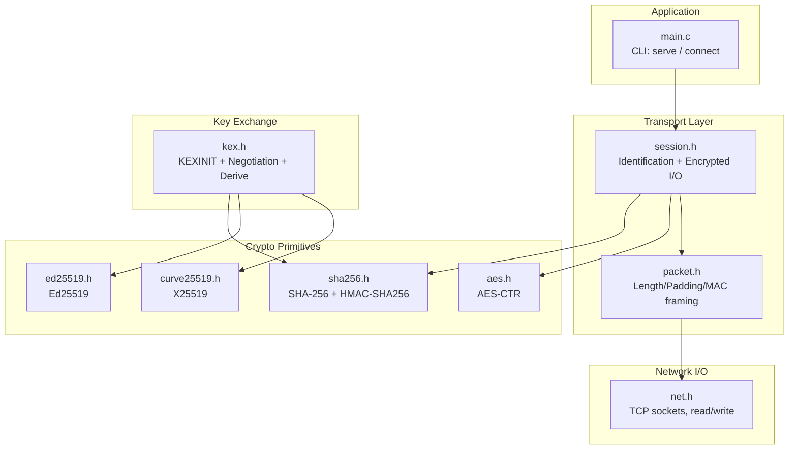
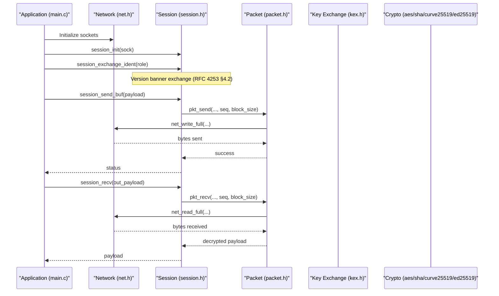
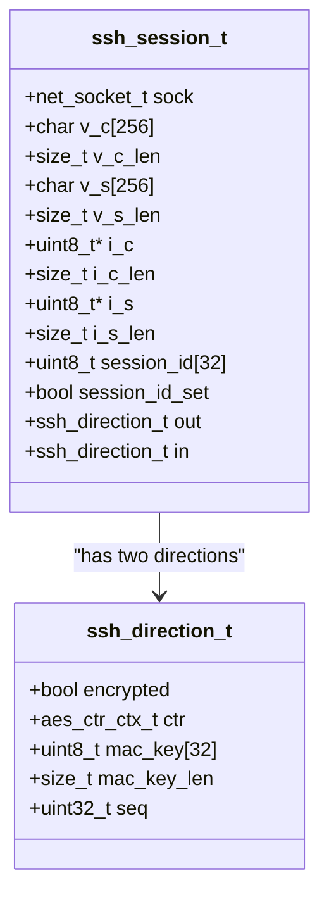
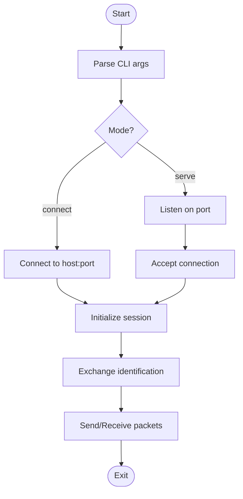
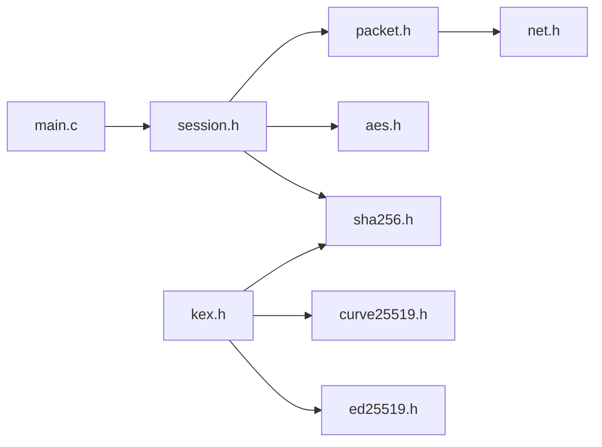

# Project Overview

<cite>
**Referenced Files in This Document**
- [README.md](file://README.md)
- [makefile](file://makefile)
- [src/main.c](file://src/main.c)
- [src/ssh.h](file://src/ssh.h)
- [src/session.h](file://src/session.h)
- [src/net.h](file://src/net.h)
- [src/packet.h](file://src/packet.h)
- [src/kex.h](file://src/kex.h)
- [src/aes.h](file://src/aes.h)
- [src/curve25519.h](file://src/curve25519.h)
- [src/ed25519.h](file://src/ed25519.h)
- [src/sha256.h](file://src/sha256.h)
- [tests/test_phase1.c](file://tests/test_phase1.c)
- [tests/test_phase2.c](file://tests/test_phase2.c)
</cite>

## Table of Contents
1. [Introduction](#introduction)
2. [Project Structure](#project-structure)
3. [Core Components](#core-components)
4. [Architecture Overview](#architecture-overview)
5. [Detailed Component Analysis](#detailed-component-analysis)
6. [Dependency Analysis](#dependency-analysis)
7. [Performance Considerations](#performance-considerations)
8. [Troubleshooting Guide](#troubleshooting-guide)
9. [Conclusion](#conclusion)

## Introduction
Coalesce is a complete SSH transport layer implementation written in C, designed primarily for education and clarity while using modern cryptographic primitives. It focuses on RFC 4253 compliance at the transport layer, cross-platform networking, and zero external dependencies beyond the standard library and OS networking APIs. The project demonstrates how to build an SSH client and server from first principles: raw TCP I/O, binary packet framing, version banner exchange, key negotiation, and encrypted session I/O.

Why this exists:
- Educational reference: step-by-step exposure to SSH internals without opaque libraries.
- Modern cryptography: uses AES-CTR, SHA-256/SHA-512, HMAC-SHA256, Curve25519 (X25519), and Ed25519.
- Zero external dependencies: no OpenSSL or third-party crypto; everything is implemented in-tree.
- Cross-platform: Windows and POSIX support via a thin network abstraction.

Target audience:
- Students learning SSH protocol details and secure transport design.
- Developers building secure applications who need to understand or extend SSH internals.
- Security engineers evaluating minimal, auditable implementations.

[No sources needed since this section provides general guidance]

## Project Structure
The repository is organized by functional layers:
- Network I/O: platform-agnostic TCP socket helpers.
- Packet framing: length-prefixed packets with padding and MAC.
- Session management: identification exchange, direction state, encryption/MAC activation.
- Cryptographic primitives: AES, SHA-256/512, HMAC, base64, random bytes.
- Key exchange: KEXINIT encoding/decoding, proposal negotiation, key derivation.
- Application entry points: CLI demonstrating client/server flows.
- Tests: unit tests validating buffers, crypto, and KEX negotiation.

**Diagram sources**
- [src/main.c:45-90](file://src/main.c#L45-L90)
- [src/session.h:35-56](file://src/session.h#L35-L56)
- [src/packet.h:9-16](file://src/packet.h#L9-L16)
- [src/net.h:32-56](file://src/net.h#L32-L56)
- [src/aes.h:12-35](file://src/aes.h#L12-L35)
- [src/sha256.h:12-36](file://src/sha256.h#L12-L36)
- [src/curve25519.h:9-19](file://src/curve25519.h#L9-L19)
- [src/ed25519.h:9-29](file://src/ed25519.h#L9-L29)
- [src/kex.h:9-49](file://src/kex.h#L9-L49)

**Section sources**
- [makefile:1-85](file://makefile#L1-L85)
- [src/main.c:45-90](file://src/main.c#L45-L90)

## Core Components
- Network abstraction (net.h): Provides initialization, listening, accepting, connecting, nonblocking setup, shutdown, and blocking read/write helpers. Abstracts Winsock vs POSIX sockets.
- Packet framing (packet.h): Defines the SSH wire format structure (length, padding length, payload, padding, MAC) and high-level send/receive functions that manage sequence numbers and block size.
- Session layer (session.h): Manages the SSH session lifecycle: identification strings (V_C/V_S), KEXINIT payloads, session ID, per-direction cipher/MAC state, and encrypted binary packet I/O.
- Key exchange (kex.h): Encodes/decodes KEXINIT messages, negotiates algorithm proposals, and derives keys per RFC 4253 §7.2.
- Crypto primitives:
  - AES (aes.h): AES block cipher and AES-CTR streaming context used for encryption.
  - SHA-256/SHA-512 (sha256.h, sha512.h): Hashing and HMAC-SHA256.
  - Curve25519 (curve25519.h): X25519 ECDH operations.
  - Ed25519 (ed25519.h): Signing and verification per RFC 8032.
- Protocol constants (ssh.h): Message types, disconnect reasons, channel codes, and algorithm lists as comments.

**Section sources**
- [src/net.h:1-58](file://src/net.h#L1-L58)
- [src/packet.h:1-28](file://src/packet.h#L1-L28)
- [src/session.h:1-89](file://src/session.h#L1-L89)
- [src/kex.h:1-52](file://src/kex.h#L1-L52)
- [src/aes.h:1-38](file://src/aes.h#L1-L38)
- [src/sha256.h:1-39](file://src/sha256.h#L1-L39)
- [src/curve25519.h:1-22](file://src/curve25519.h#L1-L22)
- [src/ed25519.h:1-32](file://src/ed25519.h#L1-L32)
- [src/ssh.h:1-147](file://src/ssh.h#L1-L147)

## Architecture Overview
Coalesce implements a layered architecture from raw TCP through cryptographic primitives to protocol handling:

**Diagram sources**
- [src/main.c:156-213](file://src/main.c#L156-L213)
- [src/session.h:82-86](file://src/session.h#L82-L86)
- [src/packet.h:24-26](file://src/packet.h#L24-L26)
- [src/net.h:51-56](file://src/net.h#L51-L56)

[No additional diagram sources needed beyond those mapping to actual files]

## Detailed Component Analysis

### Network Abstraction (net.h)
Responsibilities:
- Platform detection and type definitions for sockets.
- Lifecycle: init/shutdown.
- Server/client operations: listen, accept, connect.
- I/O: nonblocking configuration, write shutdown, close, exact read/write, line reading.

Design notes:
- Minimal API surface reduces coupling.
- Error reporting via a string accessor.

**Section sources**
- [src/net.h:1-58](file://src/net.h#L1-L58)

### Packet Framing (packet.h)
Responsibilities:
- Represent SSH wire packets with fields: packet_length, padding_length, payload buffer, padding, MAC, and MAC length.
- Provide lifecycle helpers and high-level send/receive functions that handle sequence numbers and block sizes.

Design notes:
- Encapsulation of wire format simplifies session-layer logic.
- Sequence numbers are passed explicitly to align with per-direction counters.

**Section sources**
- [src/packet.h:1-28](file://src/packet.h#L1-L28)

### Session Layer (session.h)
Responsibilities:
- Maintain per-direction state: encryption flag, AES-CTR context, MAC key and length, and sequence number.
- Manage identification strings (V_C/V_S), KEXINIT payloads, and session ID.
- Provide hardened identification exchange and binary packet I/O.

Design notes:
- Directional separation ensures correct sequence numbering and key usage.
- Activation is explicit after NEWKEYS to avoid mixing plaintext and ciphertext.

**Diagram sources**
- [src/session.h:19-56](file://src/session.h#L19-L56)

**Section sources**
- [src/session.h:1-89](file://src/session.h#L1-L89)

### Key Exchange (kex.h)
Responsibilities:
- Default KEXINIT construction for client/server roles.
- Encode/decode KEXINIT payloads.
- Negotiate algorithm proposals between peers.
- Derive keys per RFC 4253 §7.2.

Design notes:
- Proposal negotiation selects modern algorithms (e.g., curve25519-sha256, aes128-ctr, hmac-sha2-256).
- Clear separation between proposal structures and derived keys.

**Section sources**
- [src/kex.h:1-52](file://src/kex.h#L1-L52)

### Cryptographic Primitives
- AES (aes.h): Block cipher and AES-CTR streaming context used for symmetric encryption.
- SHA-256/SHA-512 (sha256.h, sha512.h): Hashing and HMAC-SHA256 for integrity and KDF steps.
- Curve25519 (curve25519.h): X25519 ECDH for key agreement.
- Ed25519 (ed25519.h): Digital signatures per RFC 8032.

These primitives are tested extensively against official vectors and negative cases.

**Section sources**
- [src/aes.h:1-38](file://src/aes.h#L1-L38)
- [src/sha256.h:1-39](file://src/sha256.h#L1-L39)
- [src/curve25519.h:1-22](file://src/curve25519.h#L1-L22)
- [src/ed25519.h:1-32](file://src/ed25519.h#L1-L32)

### Application Entry Points (main.c)
Responsibilities:
- Parse CLI arguments for serve/connect modes.
- Initialize network stack.
- Demonstrate identification exchange and basic packet send/recv.

Flow highlights:
- Client mode connects, exchanges identification, sends SSH_MSG_IGNORE, receives SSH_MSG_DEBUG.
- Server mode listens, accepts, exchanges identification, echoes back SSH_MSG_DEBUG.

**Diagram sources**
- [src/main.c:45-90](file://src/main.c#L45-L90)
- [src/main.c:93-153](file://src/main.c#L93-L153)
- [src/main.c:156-213](file://src/main.c#L156-L213)

**Section sources**
- [src/main.c:1-214](file://src/main.c#L1-L214)

### Protocol Constants (ssh.h)
Responsibilities:
- Define message numbers for Transport, Key Exchange, User Authentication, and Connection protocols.
- Define disconnect and channel open failure reason codes.
- Include commented lists of supported algorithms and compression methods.

Usage:
- Guides protocol parsing and message dispatch within higher layers.

**Section sources**
- [src/ssh.h:1-147](file://src/ssh.h#L1-L147)

## Dependency Analysis
High-level dependency relationships:

**Diagram sources**
- [src/main.c:6-9](file://src/main.c#L6-L9)
- [src/session.h:9-11](file://src/session.h#L9-L11)
- [src/packet.h:6-7](file://src/packet.h#L6-L7)
- [src/kex.h:7-7](file://src/kex.h#L7-L7)

Coupling and cohesion:
- Low coupling between network and protocol layers via clear interfaces.
- Cohesion within each module around a single responsibility (I/O, framing, session, crypto, KEX).

Potential circular dependencies:
- None observed; headers are one-directional.

External dependencies:
- Only OS networking APIs (Winsock/POSIX) via net.h; no third-party libraries.

**Section sources**
- [src/main.c:6-9](file://src/main.c#L6-L9)
- [src/session.h:9-11](file://src/session.h#L9-L11)
- [src/packet.h:6-7](file://src/packet.h#L6-L7)
- [src/kex.h:7-7](file://src/kex.h#L7-L7)

## Performance Considerations
- Use AES-CTR for stream encryption to enable efficient sequential processing.
- Minimize allocations by reusing buffers where possible (see buffer utilities in tests).
- Avoid unnecessary copies during packet assembly; prefer direct writes when safe.
- Prefer smaller initial buffers and grow as needed to reduce memory pressure.
- Batch small writes if the underlying network stack supports it.

[No sources needed since this section provides general guidance]

## Troubleshooting Guide
Common issues and diagnostics:
- Identification exchange failures: ensure both sides adhere to RFC 4253 §4.2 rules and reject invalid banners.
- Packet framing errors: verify packet_length, padding_length, and MAC lengths match negotiated block sizes.
- Sequence number mismatches: confirm per-direction counters are maintained and not reset across rekeys.
- Crypto validation failures: check test vectors for AES, SHA, HMAC, Curve25519, and Ed25519.

Where to look:
- Session layer error paths and identification checks.
- Packet send/receive routines for length and MAC validation.
- Test suites for expected behavior and edge cases.

**Section sources**
- [src/session.h:61-86](file://src/session.h#L61-L86)
- [src/packet.h:24-26](file://src/packet.h#L24-L26)
- [tests/test_phase1.c:8-80](file://tests/test_phase1.c#L8-L80)
- [tests/test_phase2.c:41-116](file://tests/test_phase2.c#L41-L116)
- [tests/test_phase2.c:118-236](file://tests/test_phase2.c#L118-L236)
- [tests/test_phase2.c:238-312](file://tests/test_phase2.c#L238-L312)
- [tests/test_phase2.c:314-395](file://tests/test_phase2.c#L314-L395)

## Conclusion
Coalesce provides a clean, educational SSH transport implementation in C with modern cryptography and zero external dependencies. Its layered design separates concerns clearly: network I/O, packet framing, session management, key exchange, and crypto primitives. The codebase emphasizes RFC 4253 compliance, cross-platform support, and rigorous testing against official vectors. It serves as a practical reference for students and developers seeking to understand or extend secure transport protocols without relying on heavyweight libraries.

[No sources needed since this section summarizes without analyzing specific files]