# Protocol Implementation

<cite>
**Referenced Files in This Document**
- [ssh.h](file://src/ssh.h)
- [packet.h](file://src/packet.h)
- [packet.c](file://src/packet.c)
- [kex.h](file://src/kex.h)
- [kex.c](file://src/kex.c)
- [session.h](file://src/session.h)
- [session.c](file://src/session.c)
- [net.h](file://src/net.h)
- [buffer.h](file://src/buffer.h)
- [aes.h](file://src/aes.h)
- [main.c](file://src/main.c)
</cite>

## Table of Contents
1. [Introduction](#introduction)
2. [Project Structure](#project-structure)
3. [Core Components](#core-components)
4. [Architecture Overview](#architecture-overview)
5. [Detailed Component Analysis](#detailed-component-analysis)
6. [Dependency Analysis](#dependency-analysis)
7. [Performance Considerations](#performance-considerations)
8. [Troubleshooting Guide](#troubleshooting-guide)
9. [Conclusion](#conclusion)

## Introduction
This document describes the SSH protocol implementation in Coalesce with a focus on RFC 4253 compliance for the transport layer. It covers:
- Version banner exchange and identification validation
- Binary packet framing, serialization, padding, and sequence numbers
- Transport-layer encryption (AES-CTR) and integrity (HMAC-SHA2-256)
- Key exchange proposal negotiation and key derivation
- Session state machine and error handling strategies

The implementation provides a minimal but functional transport session suitable for demonstration and further extension into full user authentication and channel protocols.

## Project Structure
Coalesce organizes its SSH transport implementation across focused modules:
- Network I/O abstraction
- Buffer utilities for SSH message serialization
- Packet framing helpers
- Session state machine and binary packet protocol
- Key exchange proposals and negotiation
- Cryptographic primitives (AES-CTR, HMAC-SHA2-256 via SHA-256)
- Entry points demonstrating server and client flows

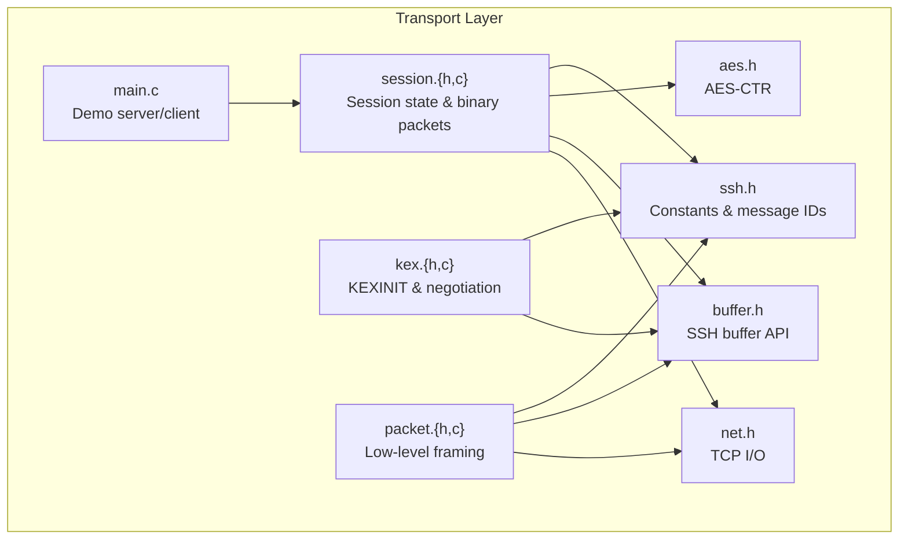

**Diagram sources**
- [main.c:1-214](file://src/main.c#L1-L214)
- [session.h:1-89](file://src/session.h#L1-L89)
- [session.c:1-363](file://src/session.c#L1-L363)
- [packet.h:1-28](file://src/packet.h#L1-L28)
- [packet.c:1-167](file://src/packet.c#L1-L167)
- [kex.h:1-52](file://src/kex.h#L1-L52)
- [kex.c:1-230](file://src/kex.c#L1-L230)
- [ssh.h:1-147](file://src/ssh.h#L1-L147)
- [aes.h:1-38](file://src/aes.h#L1-L38)
- [net.h:1-58](file://src/net.h#L1-L58)
- [buffer.h:1-50](file://src/buffer.h#L1-L50)

**Section sources**
- [main.c:1-214](file://src/main.c#L1-L214)
- [session.h:1-89](file://src/session.h#L1-L89)
- [packet.h:1-28](file://src/packet.h#L1-L28)
- [kex.h:1-52](file://src/kex.h#L1-L52)
- [ssh.h:1-147](file://src/ssh.h#L1-L147)

## Core Components
- ssh.h: Defines protocol constants, message type identifiers, disconnect codes, and maximum packet sizes per RFC 4253.
- session.h/.c: Implements the SSH transport session state machine, version banner exchange, key installation, activation, and binary packet send/receive with optional encryption and MAC.
- kex.h/.c: Encodes/decodes KEXINIT messages, negotiates algorithm proposals, and implements key derivation per RFC 4253 §7.2.
- packet.h/.c: Provides low-level packet framing and serialization for plaintext payloads.
- net.h: Abstracts TCP socket operations and line-based I/O.
- buffer.h: Provides SSH-friendly buffer APIs for serializing/deserializing SSH messages.
- aes.h: Supplies AES-CTR streaming encryption used by the session layer.

Key responsibilities:
- Version banner exchange and strict validation
- Binary packet framing with correct padding and block alignment
- Directional encryption and MAC verification
- Sequence number management per direction
- KEXINIT encoding/decoding and algorithm negotiation
- Key derivation using SHA-256

**Section sources**
- [ssh.h:1-147](file://src/ssh.h#L1-L147)
- [session.h:1-89](file://src/session.h#L1-L89)
- [session.c:1-363](file://src/session.c#L1-L363)
- [kex.h:1-52](file://src/kex.h#L1-L52)
- [kex.c:1-230](file://src/kex.c#L1-L230)
- [packet.h:1-28](file://src/packet.h#L1-L28)
- [packet.c:1-167](file://src/packet.c#L1-L167)
- [buffer.h:1-50](file://src/buffer.h#L1-L50)
- [aes.h:1-38](file://src/aes.h#L1-L38)

## Architecture Overview
The transport layer is implemented as a layered stack:
- Application entry points (server/client) use session APIs to perform version exchange and send/receive framed packets.
- The session layer manages state (plaintext vs encrypted), installs keys, and applies encryption/MAC during send/receive.
- The packet layer offers lower-level framing for raw payloads when needed.
- The KEX module handles KEXINIT and algorithm negotiation, plus key derivation.
- Crypto primitives provide AES-CTR and HMAC-SHA2-256 functionality.

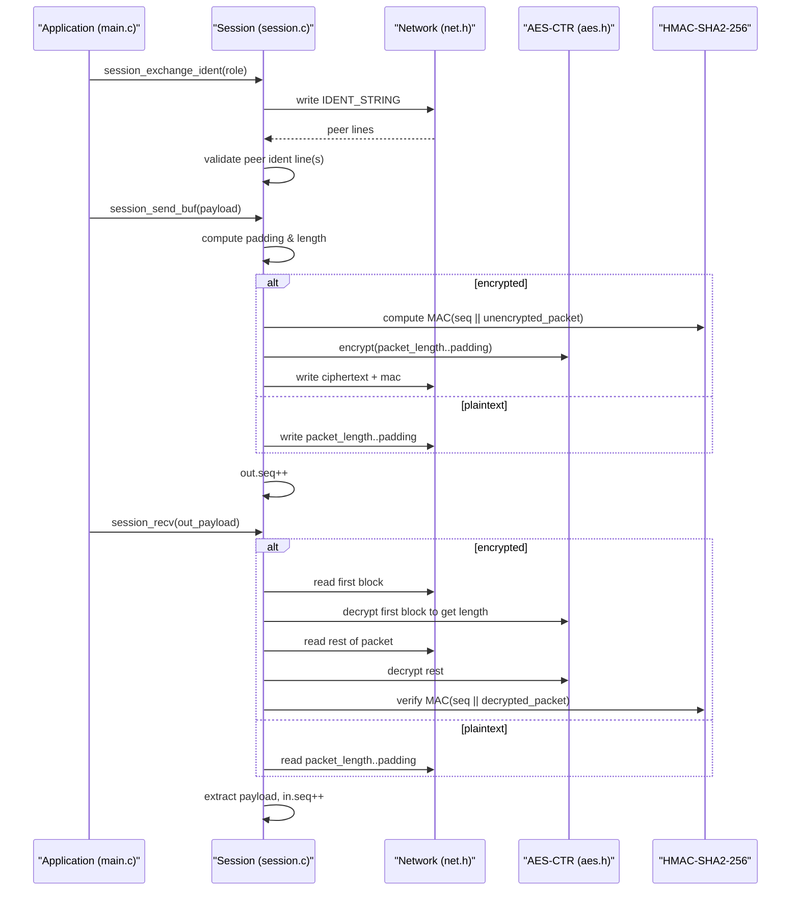

**Diagram sources**
- [main.c:114-153](file://src/main.c#L114-L153)
- [main.c:168-207](file://src/main.c#L168-L207)
- [session.c:83-126](file://src/session.c#L83-L126)
- [session.c:196-256](file://src/session.c#L196-L256)
- [session.c:264-362](file://src/session.c#L264-L362)
- [aes.h:17-35](file://src/aes.h#L17-L35)

## Detailed Component Analysis

### RFC 4253 Compliance: Version Banner Exchange
- Identification strings must start with "SSH-", followed by protocol version "2.0" or compatibility "1.99", then software version and optional comments.
- The implementation validates:
  - Prefix and version token
  - Software version characters (printable ASCII without whitespace or '-')
  - Optional comment section (printable ASCII only)
  - Maximum line length including CR LF
- During exchange:
  - Each side sends its own identification string immediately
  - Pre-banner lines are skipped until a valid "SSH-" line is found
  - Both V_C and V_S are stored without trailing CR/LF

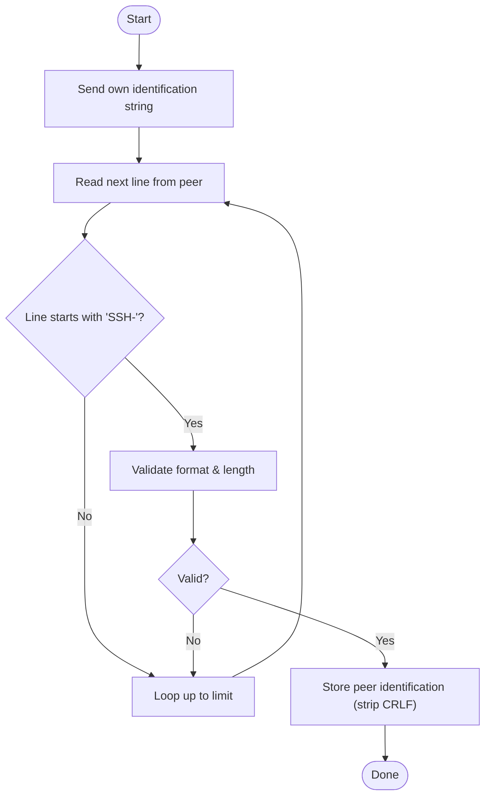

**Diagram sources**
- [session.c:34-81](file://src/session.c#L34-L81)
- [session.c:83-126](file://src/session.c#L83-L126)

**Section sources**
- [session.c:34-81](file://src/session.c#L34-L81)
- [session.c:83-126](file://src/session.c#L83-L126)
- [ssh.h:7-10](file://src/ssh.h#L7-L10)

### RFC 4253 Compliance: Binary Packet Format and Framing
- Packet structure:
  - packet_length (uint32, big-endian)
  - padding_length (uint8)
  - payload (variable)
  - padding (random bytes)
  - MAC (optional, appended after encryption)
- Constraints:
  - Total length (packet_length + 4) must be a multiple of block size (8 if plaintext, 16 if AES-CTR)
  - Padding length between 4 and 255
  - Max packet size enforced per RFC 4253
- Sequence numbers:
  - Separate counters per direction (out/in)
  - Incremented after each successful send/receive
  - Never reset across rekeys

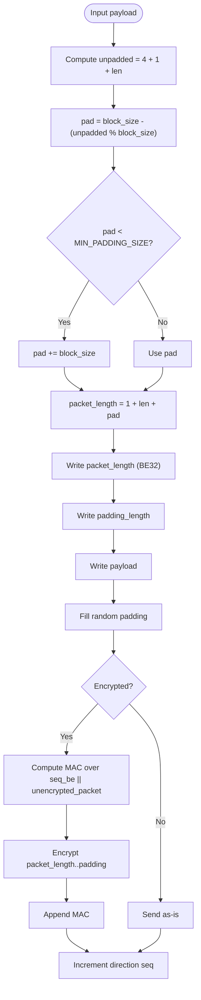

**Diagram sources**
- [session.c:196-256](file://src/session.c#L196-L256)
- [packet.c:52-105](file://src/packet.c#L52-L105)

**Section sources**
- [session.c:196-256](file://src/session.c#L196-L256)
- [packet.c:52-105](file://src/packet.c#L52-L105)
- [ssh.h:12-15](file://src/ssh.h#L12-L15)

### Encryption and Integrity (AES-CTR + HMAC-SHA2-256)
- Supported ciphers:
  - aes128-ctr, aes256-ctr
- Supported MAC:
  - hmac-sha2-256 (32-byte key)
- Key installation:
  - session_set_keys configures AES-CTR context and MAC key
  - session_activate flips the direction to encrypted mode
- Send path:
  - Compute MAC before encryption (RFC 4253 §6.4)
  - Encrypt packet_length through padding; append MAC
- Receive path:
  - Decrypt first block to obtain packet_length
  - Decrypt rest of packet
  - Verify MAC using current direction sequence number

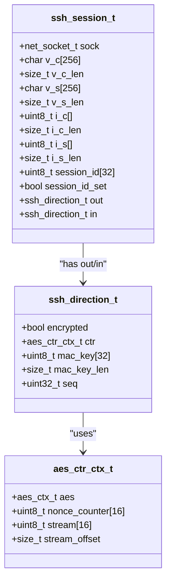

**Diagram sources**
- [session.h:19-56](file://src/session.h#L19-L56)
- [aes.h:17-24](file://src/aes.h#L17-L24)

**Section sources**
- [session.c:130-169](file://src/session.c#L130-L169)
- [session.c:196-256](file://src/session.c#L196-L256)
- [session.c:264-362](file://src/session.c#L264-L362)
- [aes.h:17-35](file://src/aes.h#L17-L35)

### Key Exchange Protocol: KEXINIT Handling and Negotiation
- KEXINIT message:
  - Encoded with cookie, algorithm lists, flags, and reserved field
  - Decoded into structured proposal fields
- Algorithm negotiation:
  - For each category (kex, host key, cipher, MAC, compression), match client’s list against server’s list in order
  - Failure to find mutual algorithms aborts negotiation
- Defaults:
  - KEX: curve25519-sha256
  - Host key: ssh-ed25519
  - Ciphers: aes128-ctr,aes256-ctr
  - MACs: hmac-sha2-256
  - Compression: none

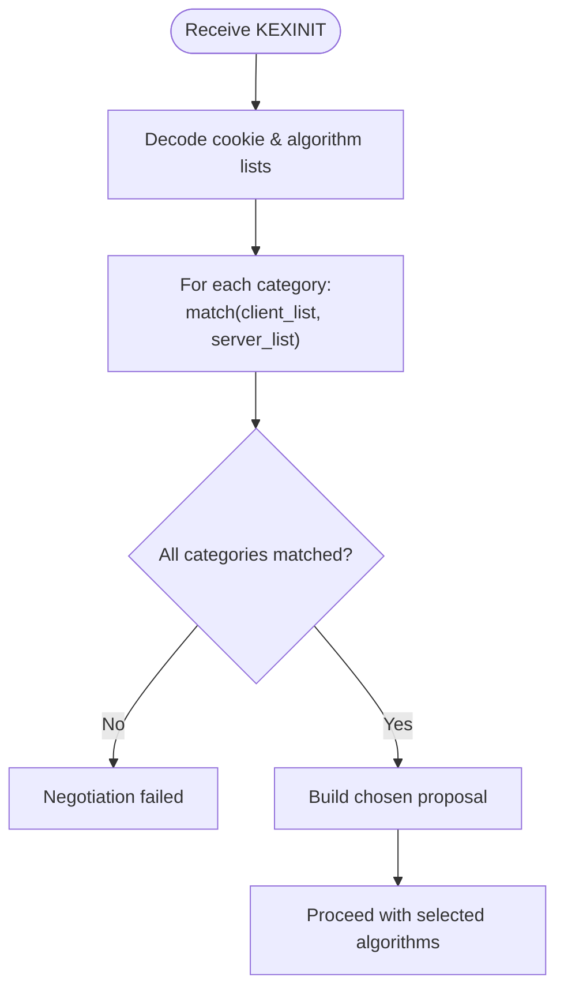

**Diagram sources**
- [kex.c:48-96](file://src/kex.c#L48-L96)
- [kex.c:153-174](file://src/kex.c#L153-L174)

**Section sources**
- [kex.c:25-46](file://src/kex.c#L25-L46)
- [kex.c:48-96](file://src/kex.c#L48-L96)
- [kex.c:114-174](file://src/kex.c#L114-L174)

### Key Derivation (RFC 4253 §7.2)
- Purpose: derive symmetric keys and IVs from shared secret K, hash H, session ID, and a letter identifying the key purpose.
- Process:
  - Compute K1 = HASH(K || H || X || session_id) where X is the letter
  - If more key material is needed, iteratively compute subsequent blocks using previous output
- Implementation uses SHA-256 to produce fixed-size chunks and concatenates them to meet required key lengths.

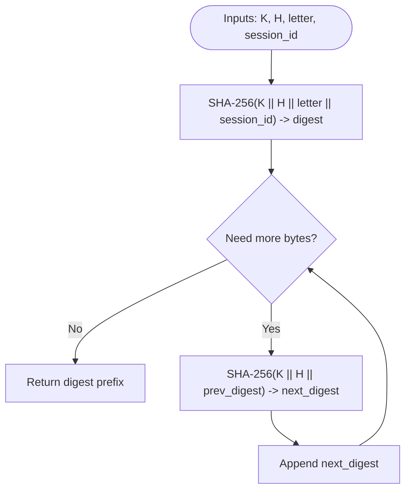

**Diagram sources**
- [kex.c:192-229](file://src/kex.c#L192-L229)

**Section sources**
- [kex.c:192-229](file://src/kex.c#L192-L229)

### Session Management State Machine
States and transitions:
- Plaintext mode:
  - After initialization, both directions are unencrypted
  - Version banner exchange occurs here
  - Packets sent/received are not encrypted or MACed
- Key installation:
  - session_set_keys prepares cipher and MAC state for a direction
  - Keys remain inactive until activation
- Encrypted mode:
  - session_activate enables encryption and MAC verification
  - All subsequent packets are protected and sequence numbers continue incrementally

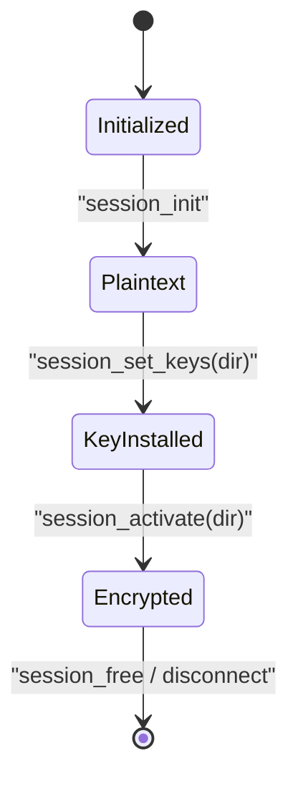

**Diagram sources**
- [session.h:19-56](file://src/session.h#L19-L56)
- [session.c:14-30](file://src/session.c#L14-L30)
- [session.c:130-169](file://src/session.c#L130-L169)

**Section sources**
- [session.h:19-56](file://src/session.h#L19-L56)
- [session.c:14-30](file://src/session.c#L14-L30)
- [session.c:130-169](file://src/session.c#L130-L169)

### Message Formats and Protocol Flow
- Transport-layer message types defined include disconnect, ignore, unimplemented, debug, service request/accept, KEXINIT, NEWKEYS, and others for authentication and channels.
- Example flows:
  - Server receives a packet, extracts message type, and can respond with SSH_MSG_DEBUG
  - Client sends SSH_MSG_IGNORE and expects a response

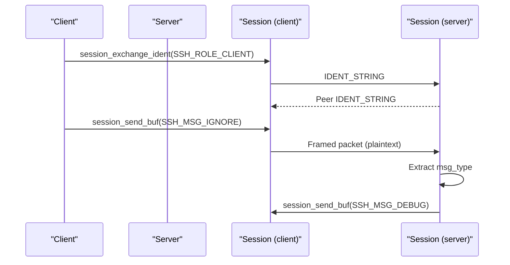

**Diagram sources**
- [main.c:114-153](file://src/main.c#L114-L153)
- [main.c:168-207](file://src/main.c#L168-L207)
- [ssh.h:17-57](file://src/ssh.h#L17-L57)

**Section sources**
- [ssh.h:17-57](file://src/ssh.h#L17-L57)
- [main.c:114-153](file://src/main.c#L114-L153)
- [main.c:168-207](file://src/main.c#L168-L207)

### Error Handling Strategies for Protocol Violations
- Version banner violations:
  - Reject non-"SSH-" prefixes
  - Enforce printable ASCII constraints and max line length
  - Skip pre-banner lines up to a limit; otherwise fail
- Packet framing violations:
  - Reject packet_length outside allowed range
  - Validate padding_length bounds
  - Ensure total wire length aligns to block size
- MAC failures:
  - On receive, compare computed MAC with received MAC using constant-time comparison
  - Treat mismatch as fatal; caller should disconnect
- Negotiation failures:
  - Abort if any algorithm category cannot be mutually agreed upon
- General I/O errors:
  - Return negative status on partial reads/writes or allocation failures

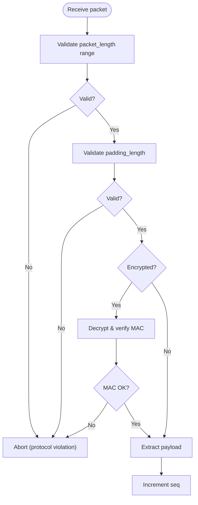

**Diagram sources**
- [session.c:264-362](file://src/session.c#L264-L362)
- [packet.c:113-166](file://src/packet.c#L113-L166)

**Section sources**
- [session.c:264-362](file://src/session.c#L264-L362)
- [packet.c:113-166](file://src/packet.c#L113-L166)

## Dependency Analysis
The following diagram shows how components depend on each other:

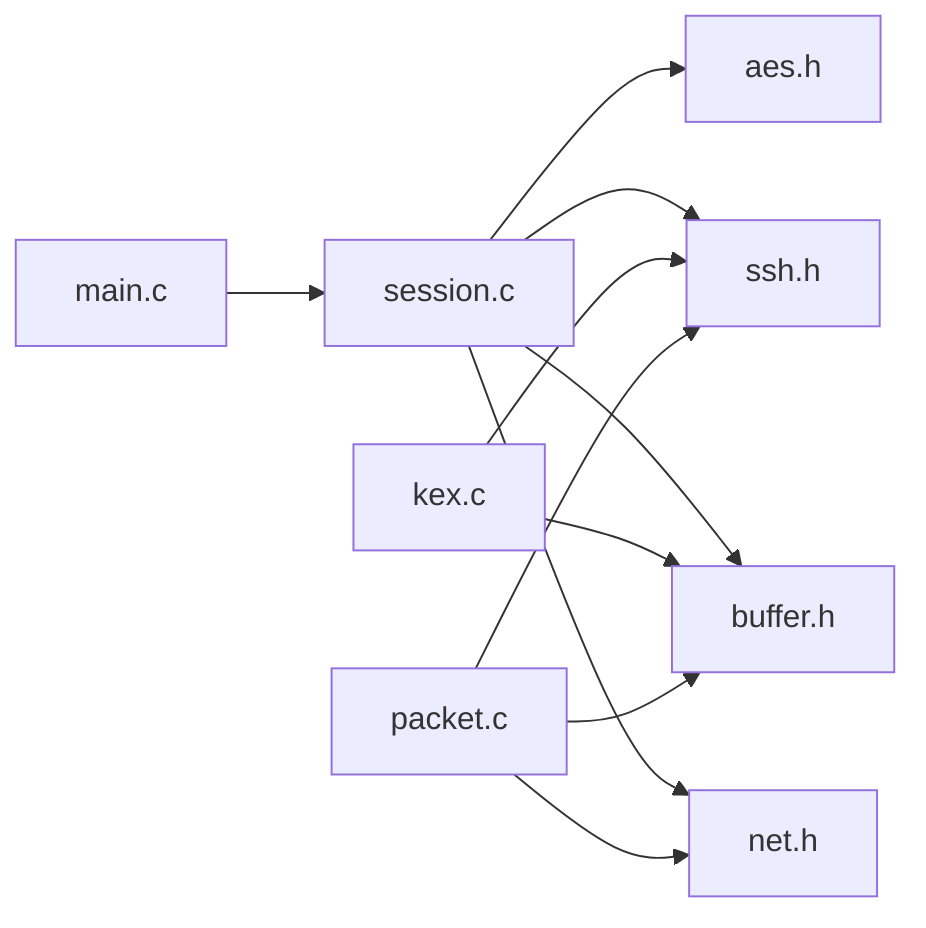

**Diagram sources**
- [main.c:1-214](file://src/main.c#L1-L214)
- [session.c:1-363](file://src/session.c#L1-L363)
- [packet.c:1-167](file://src/packet.c#L1-L167)
- [kex.c:1-230](file://src/kex.c#L1-L230)
- [ssh.h:1-147](file://src/ssh.h#L1-L147)
- [buffer.h:1-50](file://src/buffer.h#L1-L50)
- [aes.h:1-38](file://src/aes.h#L1-L38)
- [net.h:1-58](file://src/net.h#L1-L58)

**Section sources**
- [main.c:1-214](file://src/main.c#L1-L214)
- [session.c:1-363](file://src/session.c#L1-L363)
- [packet.c:1-167](file://src/packet.c#L1-L167)
- [kex.c:1-230](file://src/kex.c#L1-L230)

## Performance Considerations
- Use AES-CTR for high-throughput symmetric encryption due to streaming nature.
- Avoid unnecessary allocations by reusing buffers where possible.
- Minimize copies during MAC computation by computing over contiguous buffers.
- Keep padding minimal while satisfying minimum and block alignment constraints.
- Prefer constant-time comparisons for MAC verification to mitigate timing attacks.

[No sources needed since this section provides general guidance]

## Troubleshooting Guide
Common issues and resolutions:
- Version banner mismatch:
  - Ensure both sides send "SSH-2.0-..." or compatible "SSH-1.99-..."
  - Check that software version contains only allowed characters
- Packet framing errors:
  - Verify packet_length and padding_length constraints
  - Confirm block alignment for encrypted packets
- MAC verification failure:
  - Ensure MAC key length matches algorithm requirements
  - Verify sequence numbers are synchronized per direction
- Negotiation failure:
  - Align default algorithm lists on both ends
  - Inspect algorithm name strings for typos

**Section sources**
- [session.c:42-81](file://src/session.c#L42-L81)
- [session.c:130-169](file://src/session.c#L130-L169)
- [session.c:264-362](file://src/session.c#L264-L362)
- [kex.c:153-174](file://src/kex.c#L153-L174)

## Conclusion
Coalesce implements a focused subset of the SSH transport layer compliant with RFC 4253:
- Strict version banner validation and exchange
- Correct binary packet framing, padding, and sequence numbering
- AES-CTR encryption and HMAC-SHA2-256 integrity protection
- KEXINIT encoding/decoding and algorithm negotiation
- Clear separation of concerns across network, buffer, packet, session, and KEX modules

This foundation supports further development toward full user authentication and channel multiplexing while maintaining clear protocol boundaries and robust error handling.

[No sources needed since this section summarizes without analyzing specific files]