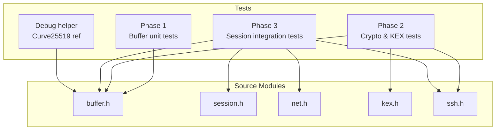
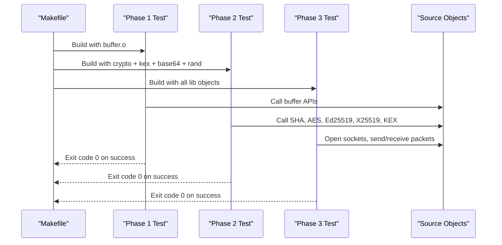
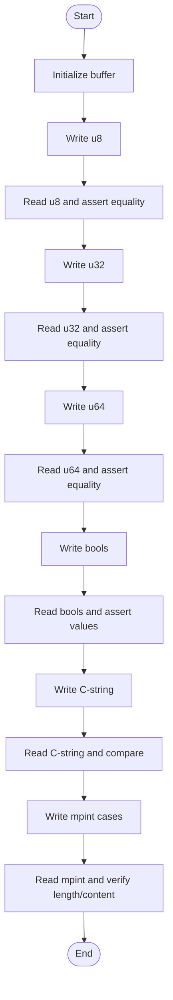
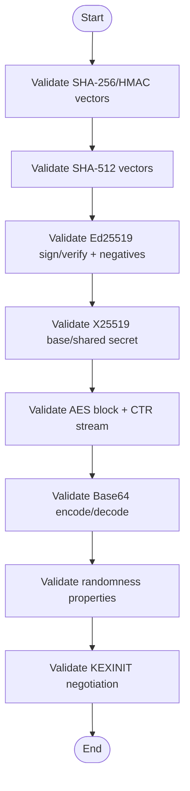
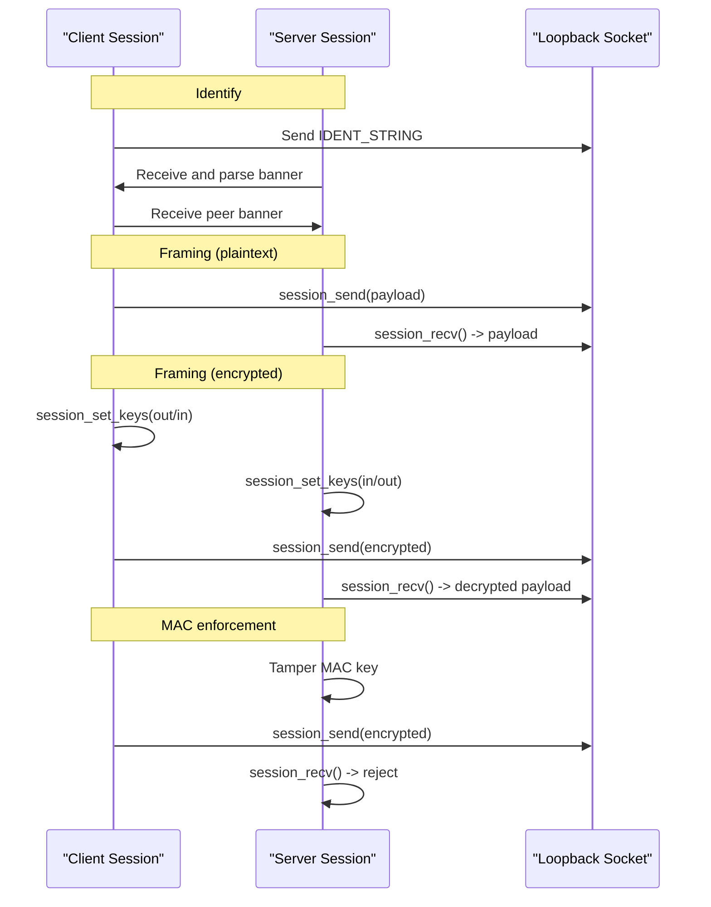
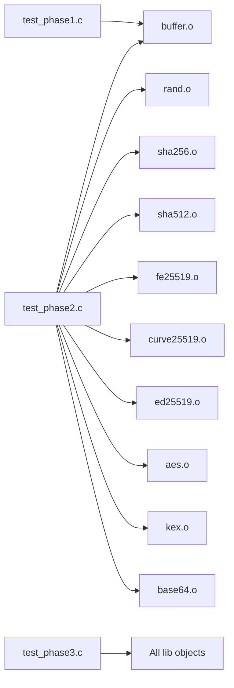

# Testing and Quality Assurance

<cite>
**Referenced Files in This Document**
- [test_phase1.c](file://tests/test_phase1.c)
- [test_phase2.c](file://tests/test_phase2.c)
- [test_phase3.c](file://tests/test_phase3.c)
- [test_c25519_debug.c](file://tests/test_c25519_debug.c)
- [makefile](file://makefile)
- [ssh.h](file://src/ssh.h)
- [buffer.h](file://src/buffer.h)
- [session.h](file://src/session.h)
- [kex.h](file://src/kex.h)
- [net.h](file://src/net.h)
</cite>

## Table of Contents
1. [Introduction](#introduction)
2. [Project Structure](#project-structure)
3. [Core Components](#core-components)
4. [Architecture Overview](#architecture-overview)
5. [Detailed Component Analysis](#detailed-component-analysis)
6. [Dependency Analysis](#dependency-analysis)
7. [Performance Considerations](#performance-considerations)
8. [Troubleshooting Guide](#troubleshooting-guide)
9. [Conclusion](#conclusion)
10. [Appendices](#appendices)

## Introduction
This document explains the testing framework and quality assurance practices used in Coalesce. It focuses on a phase-based strategy that validates:
- Unit-level behavior for low-level primitives (buffers, crypto, base64, random).
- Integration-level protocol flows across the SSH transport session (identification exchange, binary framing, encryption, MAC enforcement).
- Cryptographic correctness via standardized test vectors and negative cases.

It also provides guidance on writing new tests, running the suite, and interpreting results to aid debugging and development.

## Project Structure
The repository organizes tests by functional phases aligned with SSH protocol layers:
- Phase 1: Buffer primitives and serialization helpers.
- Phase 2: Cryptography and key exchange negotiation (SHA-256/512, Ed25519, Curve25519/X25519, AES-CTR, Base64, KEXINIT negotiation).
- Phase 3: Session layer integration over loopback sockets (banner validation, plaintext/encrypted framing, MAC enforcement, malformed packet rejection).
- Debugging helper: A standalone Curve25519 reference implementation used to validate core arithmetic.

**Diagram sources**
- [test_phase1.c:1-89](file://tests/test_phase1.c#L1-L89)
- [test_phase2.c:1-412](file://tests/test_phase2.c#L1-L412)
- [test_phase3.c:1-511](file://tests/test_phase3.c#L1-L511)
- [test_c25519_debug.c:1-264](file://tests/test_c25519_debug.c#L1-L264)
- [buffer.h:1-50](file://src/buffer.h#L1-L50)
- [session.h:1-89](file://src/session.h#L1-L89)
- [net.h:1-58](file://src/net.h#L1-L58)
- [kex.h:1-52](file://src/kex.h#L1-L52)
- [ssh.h:1-147](file://src/ssh.h#L1-L147)

**Section sources**
- [test_phase1.c:1-89](file://tests/test_phase1.c#L1-L89)
- [test_phase2.c:1-412](file://tests/test_phase2.c#L1-L412)
- [test_phase3.c:1-511](file://tests/test_phase3.c#L1-L511)
- [test_c25519_debug.c:1-264](file://tests/test_c25519_debug.c#L1-L264)
- [makefile:1-85](file://makefile#L1-L85)

## Core Components
- Phase 1 tests validate buffer I/O primitives: reading/writing u8/u32/u64, booleans, strings, and multi-precision integers per RFC 4251 rules.
- Phase 2 tests validate cryptographic building blocks and KEX negotiation using well-known test vectors and negative cases.
- Phase 3 tests exercise the full session lifecycle over local TCP sockets: identification string validation, banner exchange, plaintext and encrypted framing, MAC enforcement, and malformed packet handling.
- The debug helper implements a reference Curve25519 scalar multiplication to cross-check the core implementation against expected outputs.

**Section sources**
- [test_phase1.c:8-81](file://tests/test_phase1.c#L8-L81)
- [test_phase2.c:41-395](file://tests/test_phase2.c#L41-L395)
- [test_phase3.c:50-469](file://tests/test_phase3.c#L50-L469)
- [test_c25519_debug.c:181-231](file://tests/test_c25519_debug.c#L181-L231)

## Architecture Overview
The testing architecture is layered:
- Unit tests target isolated modules (buffer, crypto primitives).
- Integration tests connect two endpoints over loopback and drive the SSH session state machine through identification exchange, key installation, and message framing.
- The build system compiles each test with the minimal set of source objects required, enabling focused failure isolation.

**Diagram sources**
- [makefile:52-74](file://makefile#L52-L74)
- [test_phase1.c:83-88](file://tests/test_phase1.c#L83-L88)
- [test_phase2.c:397-411](file://tests/test_phase2.c#L397-L411)
- [test_phase3.c:471-510](file://tests/test_phase3.c#L471-L510)

## Detailed Component Analysis

### Phase 1: Buffer Unit Tests
Purpose:
- Verify correct encoding/decoding of primitive types and SSH mpint semantics.
- Ensure buffer lifecycle functions behave correctly under repeated use.

Key behaviors validated:
- Write/read round-trips for u8, u32, u64, bool, C-string.
- MPINT handling including zero, positive values with MSB < 0x80, and values requiring a leading zero byte when MSB >= 0x80.

**Diagram sources**
- [test_phase1.c:8-81](file://tests/test_phase1.c#L8-L81)
- [buffer.h:8-47](file://src/buffer.h#L8-L47)

**Section sources**
- [test_phase1.c:8-81](file://tests/test_phase1.c#L8-L81)
- [buffer.h:8-47](file://src/buffer.h#L8-L47)

### Phase 2: Cryptography and Key Exchange Tests
Purpose:
- Validate cryptographic algorithms against published standards and test vectors.
- Confirm KEXINIT proposal negotiation selects expected algorithms.

Coverage includes:
- SHA-256 and HMAC-SHA256 vectors.
- SHA-512 streaming and multi-block inputs.
- Ed25519 key generation, signing, verification, and negative cases (corrupted signatures, keys, messages; non-canonical S).
- Curve25519/X25519 base point multiplication and shared secret agreement.
- AES block cipher vectors and AES-CTR stream consistency.
- Base64 encode/decode per RFC 4648, including newline tolerance and error handling.
- Random bytes uniqueness and non-zero checks.
- KEXINIT default proposals and negotiated selection.

**Diagram sources**
- [test_phase2.c:41-395](file://tests/test_phase2.c#L41-L395)
- [kex.h:9-43](file://src/kex.h#L9-L43)

**Section sources**
- [test_phase2.c:41-395](file://tests/test_phase2.c#L41-L395)
- [kex.h:9-43](file://src/kex.h#L9-L43)

### Phase 3: Session Layer Integration Tests
Purpose:
- Exercise end-to-end SSH transport behaviors over loopback sockets.
- Validate identification string parsing, banner exchange, packet framing (plaintext and encrypted), MAC enforcement, and malformed input handling.

Key scenarios:
- Identification string validation and rejection of invalid banners.
- Banner exchange skipping pre-lines and enforcing line length limits.
- Plaintext framing with bidirectional sends and sequence number tracking.
- Encrypted framing with AES-CTR and HMAC-SHA2-256, including no-MAC mode.
- MAC failure detection when receiver’s MAC key is tampered.
- Rejection of malformed plaintext packets (invalid lengths/padding).

**Diagram sources**
- [test_phase3.c:122-176](file://tests/test_phase3.c#L122-L176)
- [test_phase3.c:207-324](file://tests/test_phase3.c#L207-L324)
- [test_phase3.c:378-420](file://tests/test_phase3.c#L378-L420)
- [session.h:58-86](file://src/session.h#L58-L86)
- [net.h:32-56](file://src/net.h#L32-L56)

**Section sources**
- [test_phase3.c:50-469](file://tests/test_phase3.c#L50-L469)
- [session.h:58-86](file://src/session.h#L58-L86)
- [net.h:32-56](file://src/net.h#L32-L56)

### Debug Helper: Curve25519 Reference Implementation
Purpose:
- Provide an independent implementation of curve25519_eval to validate the core algorithm’s output against known public key expectations.

Highlights:
- Implements field operations and Montgomery ladder scalar multiplication.
- Compares computed public key against expected vector.

**Section sources**
- [test_c25519_debug.c:181-231](file://tests/test_c25519_debug.c#L181-L231)
- [test_c25519_debug.c:233-263](file://tests/test_c25519_debug.c#L233-L263)

## Dependency Analysis
Test binaries link only the necessary source objects, minimizing coupling and improving compile times:
- Phase 1 links buffer object.
- Phase 2 links buffer, random, SHA-256/512, fe25519, curve25519, ed25519, aes, kex, base64.
- Phase 3 links all library objects to exercise session, network, and buffer layers together.

**Diagram sources**
- [makefile:64-74](file://makefile#L64-L74)

**Section sources**
- [makefile:64-74](file://makefile#L64-L74)

## Performance Considerations
- Use small, focused tests to isolate failures quickly.
- Prefer deterministic inputs (test vectors) for cryptographic tests to avoid flakiness.
- For integration tests, keep payloads varied but bounded to cover edge cases without excessive runtime.
- Avoid heavy allocations inside tight loops; reuse buffers where possible.

[No sources needed since this section provides general guidance]

## Troubleshooting Guide
Common issues and how to interpret results:
- Assertion failures indicate mismatches between expected and actual values. Check the failing function and its inputs.
- Phase 2 failures often relate to incorrect digest/signature/cipher outputs; verify test vectors and input sizes.
- Phase 3 failures may stem from socket setup or protocol state; ensure both ends initialize sessions and install keys symmetrically.
- MAC-related failures suggest mismatched keys or tampered data; confirm key installation and activation order.

Useful references:
- Identification string constraints and limits are enforced by session logic.
- Packet framing enforces minimum lengths and padding rules; malformed packets return errors.

**Section sources**
- [test_phase3.c:50-80](file://tests/test_phase3.c#L50-L80)
- [test_phase3.c:422-469](file://tests/test_phase3.c#L422-L469)
- [session.h:61-86](file://src/session.h#L61-L86)

## Conclusion
Coalesce’s testing strategy combines rigorous unit coverage for primitives with integration tests that validate full protocol flows. Cryptographic correctness is ensured through standardized test vectors and negative-case validation. The modular build and clear separation of concerns make it straightforward to add new tests, run the suite, and diagnose issues efficiently.

[No sources needed since this section summarizes without analyzing specific files]

## Appendices

### How to Run the Test Suite
- Build and run all tests via the provided Makefile targets.
- Each test executable prints progress and returns a non-zero exit code on failure.

**Section sources**
- [makefile:52-74](file://makefile#L52-L74)

### Writing New Tests
Guidelines:
- Place unit tests for a module near related functionality and include only the necessary headers.
- For cryptographic tests, prefer official test vectors and include negative cases.
- For integration tests, create minimal loopback connections and drive state transitions explicitly.
- Keep assertions precise and print descriptive messages before asserting.

**Section sources**
- [test_phase1.c:8-81](file://tests/test_phase1.c#L8-L81)
- [test_phase2.c:41-395](file://tests/test_phase2.c#L41-L395)
- [test_phase3.c:122-176](file://tests/test_phase3.c#L122-L176)

### Interpreting Test Results
- Phase 1: Focus on buffer read/write correctness and mpint handling.
- Phase 2: Cross-check digests, signatures, ciphers, and negotiated algorithms against expected values.
- Phase 3: Validate session state transitions, packet framing, and error handling for malformed inputs.

**Section sources**
- [test_phase1.c:83-88](file://tests/test_phase1.c#L83-L88)
- [test_phase2.c:397-411](file://tests/test_phase2.c#L397-L411)
- [test_phase3.c:471-510](file://tests/test_phase3.c#L471-L510)